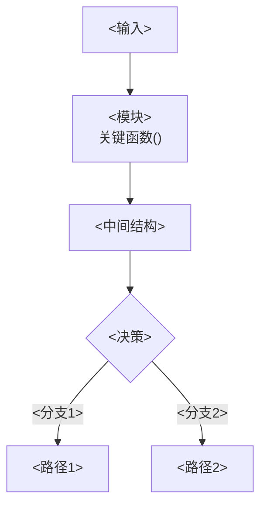
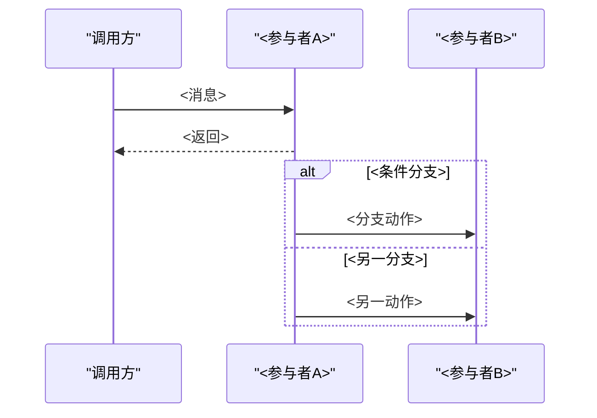
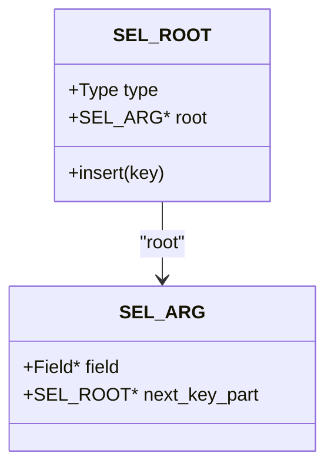
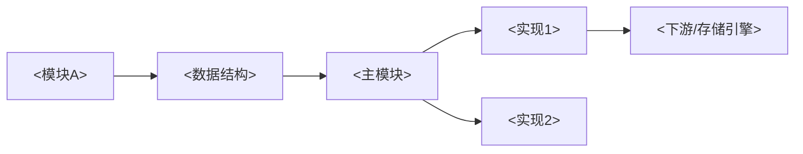

# 模板 A：`content/**` 仓库 wiki 页

> **适用**：任意大型代码仓库的"宏观地图页"。本模板与语言/项目无关。
> **示例来源**：某真实仓库的 213 篇样例中 209 篇严格遵循本骨架（下文的 MySQL 类型名、目录名仅作示意，写到别的仓库时全部换成该仓库的对象）。
> **硬约束**：不要自创新章节；中文标题，正文简体中文；代码/标识符/路径保留英文。

## 一、引用与坐标语法（先立规矩）

**页头引用清单**（无行号，仅声明本页读了哪些文件）：

```markdown
<cite>
**本文引用的文件**
- [sql_parse.cc](file://sql/sql_parse.cc)
- [handler.h](file://sql/handler.h)
</cite>
```

**溯源坐标**（有行号区间，紧跟图表或小节）：

```markdown
- [sql/mysqld.cc:248-335](file://sql/mysqld.cc#L248-L335)
```

规则：
- 路径一律**相对仓库根**，包在 `file://` 里，绝不写绝对路径。
- 行区间是"该主题相关代码段"的粗定位（`#L24-123` 很常见），不追求精确符号位置；**但必须落在文件实际行数内**——对 60 行的文件写 `#L1-200` 是死锚点。粗定位 ≠ 越界：引用整个文件就写 `#L1-L<文件行数>`，并保证 `path:start-end` 标签与 `#Lstart-Lend` 片段**数值一致**。
- 标注块标题用**无粗体无冒号**形式：`图表来源` / `章节来源`（仓储里 150/151 篇如此；`**图表来源**` 是少数变体，同一篇内保持一致即可）。
- 图表来源写在 `mermaid` 代码块**之后**、下一正文之前；章节来源写在小节**末尾**。两者都是 bullet 列表。

## 二、固定 10 节骨架

```markdown
# <标题>

<cite>
**本文引用的文件**
- [<文件名>](file://<相对路径>)
</cite>

## 目录
1. [简介](#简介)
2. [项目结构](#项目结构)
3. [核心组件](#核心组件)
4. [架构总览](#架构总览)
5. [详细组件分析](#详细组件分析)
6. [依赖关系分析](#依赖关系分析)
7. [性能考量](#性能考量)
8. [故障排查指南](#故障排查指南)
9. [结论](#结论)
10. [附录](#附录)

## 简介
本技术文档聚焦 <本页主题>，系统性阐述 <3~5 个覆盖点>。重点覆盖：
- <覆盖点 1>
- <覆盖点 2>
- <覆盖点 3>

## 项目结构
<本主题在代码里落在哪个（几）目录，围绕什么主线组织代码。分点列"文件/子目录 → 职责"：>
- 入口与参数：xxx.{h,cc}
- <中间层>：yyy.{h,cc}
- <数据结构>：zzz.h
- <具体实现>：aaa.h、bbb.h


图表来源
- [<路径>:<起>-<止>](file://<路径>#L<起>-L<止>)

章节来源
- [<路径>:<起>-<止>](file://<路径>#L<起>-L<止>)

## 核心组件
<3~6 个 bullet，每个「组件名：一句话职责 + 关键类型/函数」>
- <组件A>：...（`Type`、`func()`）
- <组件B>：...

章节来源
- [...]

## 架构总览
<用 1./2./3./4. 编号串起端到端流程：输入 → 变换 → 决策 → 输出>


图表来源
- [...]

## 详细组件分析

### <子主题 1>
- 目标/职责：<它解决什么问题>
- 关键能力：<分点，列关键类型与函数>
- 复杂度与限制：<最坏情况、上限、已知不完备处>


图表来源
- [...]
章节来源
- [...]

### <子主题 2>
（同上；子主题数一般 3~6 个，每个"文字职责 → mermaid → 图表来源 → 章节来源"四段式）

## 依赖关系分析
- <文字说明依赖方向：谁依赖谁、依赖什么抽象>
- <外部依赖：优化器 trace、统计信息、系统变量…>


图表来源
- [...]

章节来源
- [...]

## 性能考量
- <主题相关的性能点，分点，每条给结论>
- <成本模型 / 缓冲 / 选择性估计 / 并发开销…>

[本节为通用指导，不直接分析具体文件]

## 故障排查指南
- <现象 → 原因 → 排查手段（EXPLAIN、trace、日志、开关）>
- <常见误配置与告警>

章节来源
- [...]

## 结论
<3~5 句：本主题的核心设计取舍 + 一句话记忆点。>

[本节为总结性内容，不直接分析具体文件]

## 附录

### <主题>的端到端时序图
```mermaid
sequenceDiagram
...
```
图表来源
- [...]

### 术语速查
- <术语>：<一句话>
- <术语>：<一句话>

[本节为补充说明，不直接分析具体文件]
```

## 三、mermaid 图型选择表（一图一问）

| 要回答的问题 | 图型 | 说明 |
|---|---|---|
| 分层/位置/归属 | `graph TB` | 结构图，节点 5~7 个，视觉中心唯一 |
| 一次操作随时间流转 | `sequenceDiagram` | 参与者 ≤5，消息短；有分支用 `alt/else` |
| 决策/状态迁移/生命周期 | `flowchart TD` | 判定节点用 `{}`，标签写 `\|是\|`/`\|否\|` |
| 类型继承/组合关系 | `classDiagram` | 只画关键方法与关键成员，不堆字段 |
| 模块间依赖方向 | `graph LR` | 只画方向，不画细节 |

写作硬约束：
- 节点标签用 `["中文<br/>补充()"]`，`br/` 折行；边语义要区分（数据流/调用/条件）。
- 节点里**只放概念名与关键函数**，字段说明放正文。
- 一张图装不下就拆两张；需要大段注释才能看懂 = 图画错了。

## 四、强制收尾占位句

非"实质分析"的小节（性能/结论/附录里无源码可引的部分）**必须**以方括号占位句结尾，声明该节不绑定具体文件：

- `[本节为通用指导，不直接分析具体文件]` —— 性能考量（最常见）
- `[本节为总结性内容，不直接分析具体文件]` —— 结论
- `[本节为补充说明，不直接分析具体文件]` / `[本节为补充信息，不直接分析具体文件]` —— 附录
- `[本节为概念性说明，不直接分析具体文件]` —— 附录中的对比/概念说明

允许的等价变体：把"不直接分析具体文件"换成"无需特定文件引用"。**同一篇内保持一致**。

## 五、常见缺陷（自检时重点看）

1. 有图无 `图表来源`，或有小节无 `章节来源`。
2. 行区间写成精确符号行号——没必要，反而容易过时。
3. 把 `content` 页写成机制深挖（长篇讲"为什么这样设计"）——那是源码笔记的活；本页只需职责 + 数据流 + 坐标。
4. 遗漏某个子模块，导致"地图"有洞。
5. `mermaid` 节点里塞字段清单，图退化成 ASCII 结构体转写。
