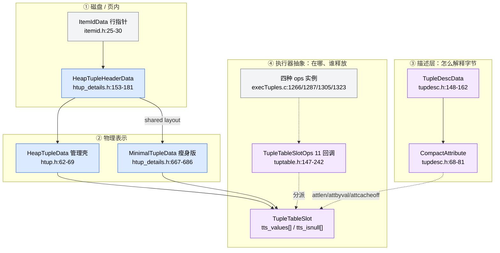
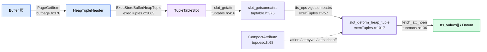
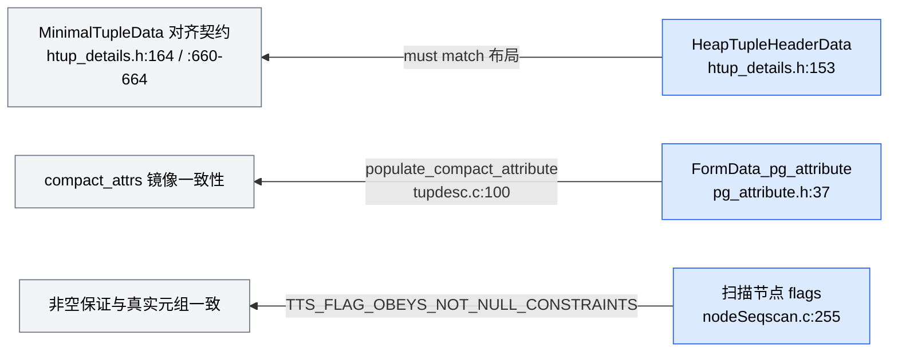

# Codebase Analysis Report

**Analysis Context**: 弄清 PostgreSQL 中「tuple（元组）」这一抽象是怎么设计的——它由哪些表示构成、在哪一层被抽象掉、阅读边界在哪
**Codebase Path**: `/home/zhq/mydisk/github/postgres`（PostgreSQL 19beta2，`configure.ac:20`）
**Date**: 2026-09-19

---

## Table of Contents

- [Executive Summary](#executive-summary)
- [Architecture Overview](#architecture-overview)
- [Tech Stack](#tech-stack)
- [Critical Files](#critical-files)
- [Patterns & Conventions](#patterns--conventions)
- [Relationship Map](#relationship-map)
- [Challenges & Risks](#challenges--risks)
- [Recommendations](#recommendations)
- [Analysis Methodology](#analysis-methodology)

---

## Executive Summary

PostgreSQL 里 **`tuple` 不是一个类型，而是一族「按离磁盘多远」排列的表示**（页内字节 → `HeapTupleData` → `MinimalTupleData` → slot 里的 `Datum[]`），它们靠一套 11 个回调的函数指针表 `TupleTableSlotOps` 统一在使用者面前。最关键的一句话：**「元组是什么」由 `TupleDesc` 回答，「元组在哪、谁释放」由 `TupleTableSlotOps` 回答，两件事被刻意拆开**。代价是 slot 的资源所有权（`SHOULDFREE` 标志、buffer pin）全靠手工维护，编译器不提供任何保证——这是本子系统最值得警惕的一处抽象泄漏。

---

## Architecture Overview

抽象分四段、共七个表示，自下而上堆叠，每一层只向前一层借必要的信息。

**① 磁盘 / 页内层（零拷贝起点）。** 页里没有"元组对象"，只有「行指针 + 一段字节」。`ItemIdData`（`itemid.h:25-30`）是一个位域：`lp_off:15 / lp_flags:2 / lp_len:15`，经 `PageGetItem`（`bufpage.h:378-385`）换算成 `page + lp_off`。这段字节以 `HeapTupleHeaderData`（`htup_details.h:153-181`）开头——23 字节固定段 + 可选 NULL 位图 + 从 `t_hoff` 开始的用户数据。固定段的长度由 `SizeofHeapTupleHeader`（`htup_details.h:185`）给出。

**② 物理表示层。** `HeapTupleData`（`htup.h:62-69`）是一个几十字节的**管理壳**，本身不含数据，`t_data` 指向 ① 的字节，另外补上 `t_len` / `t_self` / `t_tableOid` 三个"页不知道、执行器需要"的信息。`MinimalTupleData`（`htup_details.h:667-686`）是它的瘦身版：**砍掉 `t_choice`（xmin/xmax/cid）与 `t_ctid`**，因为执行器内部传递时不需要 MVCC 信息。为了复用取值代码，它通过 padding 让 `t_infomask2` 之后的布局与 `HeapTupleHeaderData` 逐字节对齐——`htup_details.h:164` 那句 `Fields below here must match MinimalTupleData!` 就是这条契约的声明，配套的常数由 `MINIMAL_TUPLE_OFFSET` / `MINIMAL_TUPLE_PADDING`（`:660-664`）手工维持。

**③ 描述层：怎么解释字节。** `TupleDescData`（`tupdesc.h:148-162`）回答"怎么解释这些字节"。它同时持有两份属性数组：尾部的 `FormData_pg_attribute`（catalog 原样，`catalog/pg_attribute.h:37-188`）和紧跟结构体的 `compact_attrs[]`（柔性数组，`:161`）。后者是 19beta2 新增的 `CompactAttribute`（`tupdesc.h:68-81`，固定 8 字节），热路径只读它——原因写在 `tupdesc.h:61-66` 的注释里：更紧凑，且不必为取 `Form_pg_attribute` 的基址额外算一次。

**④ 执行器抽象层（真正的抽象核心）。** `TupleTableSlot`（`tuptable.h:120-144`）把三种物理表示统一成 `tts_values[] / tts_isnull[]` 两个数组，`TupleTableSlotOps`（`:147-242`）把"差异化"全部推给函数指针。四种内置实现的定位由 `tuptable.h:22-57` 的文件头注释直接给出：页内元组 / 堆内存元组 / minimal 元组 / 纯 Datum 数组（virtual）。

**设计哲学：这是 PostgreSQL 内存上下文那套惯例的第二次出现。** 内存上下文（`utils/mmgr/mcxt.c` + `utils/memnodes.h`）用「每个 chunk 头里 4 bit 方法 ID → 查 `mcxt_methods[]`」实现多态；元组这层改用「slot 里存一个 `const TupleTableSlotOps *` 指针 → 直接解引用」。手段不同（位域-packed vs 显式指针），**目的完全一样：让通用代码不认识具体表示**。差异的理由也是性能取向：slot 的数量远少于 chunk 的数量，多花 8 字节指针换掉一次查表是划算的。

---

## Tech Stack

| Category | Technology | Version (if detected) | Role |
| --- | --- | --- | --- |
| Language | C | `configure.ac:20` → 19beta2 | 全部实现 |
| Build | autoconf / meson | — | 双构建系统并存 |
| Codegen | bison / flex | — | 解析器与词法 |
| Testing | pg_regress（`src/test/regress`） | — | 回归基线 |

---

## Critical Files

| File | Purpose | Relevance |
| --- | --- | --- |
| `src/include/access/htup_details.h` | 元组头结构、infomask 位定义、全部访问宏 | High |
| `src/include/access/htup.h` | `HeapTupleData` / `HeapTuple` / `MinimalTuple` 指针层 | High |
| `src/backend/access/common/heaptuple.c` | `heap_form_tuple` / `heap_deform_tuple` / `heap_getattr` / `heap_freetuple` 实现 | High |
| `src/include/executor/tuptable.h` | `TupleTableSlot` + `TupleTableSlotOps` + 四种 slot 结构体 | High |
| `src/backend/executor/execTuples.c` | 四种 ops 实例、`slot_deform_heap_tuple`、全部 slot API | High |
| `src/include/access/tupdesc.h` | `CompactAttribute` / `TupleDescData`（19 新增紧凑缓存） | High |
| `src/include/access/tupmacs.h` | 对齐与取值宏（19beta2 重构主战场） | High |
| `src/include/catalog/pg_attribute.h` | 属性的 catalog 定义（`FormData_pg_attribute`） | Medium |
| `src/backend/access/heap/heapam_handler.c` | heap AM 声明自己的 slot 类型 | Medium |
| `src/backend/access/table/tableam.c` | `table_slot_callbacks` / `table_slot_create` | Medium |

### File Details

#### `src/include/access/htup_details.h`

- **Key exports**：`HeapTupleHeaderData`、`MinimalTupleData`、全部 `HEAP_*` infomask 位、`HeapTupleHeaderGetXmin` / `GetRawXmax` / `GetRawCommandId` 等访问宏、`fastgetattr`（`:851`）/ `heap_getattr`（`:894`）
- **Core logic**：只定义布局与位语义，不含算法——它是**磁盘格式与内存结构共用的一份声明**。注意 `t_infomask2` 的 `0x1800` 两位仍被注释标记为 "available"（`:292`），19beta2 未占用新位
- **Connections**：被 `heaptuple.c`（实现）与 `execTuples.c`（deform）依赖；其布局被 `htup.h` 的 `HeapTupleData.t_data` 引用

#### `src/include/executor/tuptable.h`

- **Key exports**：`TupleTableSlot`（`:120-144`）、`TupleTableSlotOps`（`:147-242`）、四个 `TTSOps*` extern 声明（`:248-251`）、`TTS_IS_*` 判定宏（`:253-256`）、四种 slot 结构体（`:263-320`）
- **Core logic**：`TupleTableSlot` 是"基类"（含 `tts_flags` / `tts_nvalid` / `tts_ops` / `tts_tupleDescriptor` / `tts_values` / `tts_isnull` / `tts_mcxt` / `tts_tid` / `tts_tableOid`），`TupleTableSlotOps` 是"虚表"（`init` / `release` / `clear` / `getsomeattrs` / `getsysattr` / `is_current_xact_tuple` / `materialize` / `copyslot` / `get_heap_tuple` / `get_minimal_tuple` / `copy_heap_tuple` / `copy_minimal_tuple`）
- **Connections**：被 `execTuples.c` 实现、被所有执行器节点消费；表 AM 的选择入口在 `tableam.h:335` 的 `slot_callbacks`

#### `src/backend/executor/execTuples.c`

- **Key exports**：`TTSOpsVirtual :1266`、`TTSOpsHeapTuple :1287`、`TTSOpsMinimalTuple :1305`、`TTSOpsBufferHeapTuple :1323`；`slot_deform_heap_tuple :1017`（`static pg_always_inline`，三处调用：`:352` heap / `:550` minimal / `:757` buffer）
- **Core logic**：把「从物理元组里拆出 Datum」这件事写成一份**带缓存的增量循环**，四种 slot 共用同一个 deform 实现，只靠传入的 `offp` 游标与 `is_minimal` 参数区分
- **Connections**：依赖 `tupmacs.h` 的宏与 `tupdesc.h` 的 `CompactAttribute`；向上暴露 `MakeTupleTableSlot`（`:1357`）/ `ExecAllocTableSlot`（`:1436`）等创建入口

---

## Patterns & Conventions

### Code Patterns

- **抽象基类 + 静态 ops 表**：`TupleTableSlot` 是"基类"，`tts_ops` 是"虚表"。与 MemoryContext 的 methods 机制同构（见 [Architecture Overview](#architecture-overview)），但用显式指针而非位域 ID——slot 数量远少于 chunk 数量，多 8 字节换一次间接跳转是划算的。
- **以"表示转换"代替"统一表示"**：不把页内元组强行拷成 heap 元组，而是提供按需转换入口——`heap_tuple_from_minimal_tuple`（`heaptuple.c:1501`）、`minimal_tuple_from_heap_tuple`（`:1523`）、`ExecMaterializeSlot`（`tuptable.h:494`）、`ExecFetchSlotHeapTuple`（`execTuples.c:1915`）。**零拷贝是默认，拷贝是例外**。
- **懒加载 + 缓存**：`tts_values[]` 对物理元组 slot 而言是**缓存**，不是数据本体——`tuptable.h:59-64` 明确区分："对 virtual slot 是权威数据，对其他三种是从元组里抽出来的"。`attcacheoff` 同理（`tupdesc.c:555`），初值 `-1` 表示未知（`tupdesc.c:70`）。
- **显式资源所有权标志**：`TTS_FLAG_SHOULDFREE`（`tuptable.h:95`）表示"物理元组归我，清空时 pfree"；`BufferHeapTupleTableSlot.buffer`（`:298`）表示"我还持着页 pin"。两者互斥，`:292-297` 专门写了这条约束。
- **用"段化"换性能（19beta2 新套路）**：`TupleDescData.firstNonCachedOffsetAttr`（`tupdesc.h:154`）与 `firstNonGuaranteedAttr`（`:156`）把属性切成"已知偏移段 / 可保证存在段 / 其余段"，`slot_deform_heap_tuple` 据此走三条不同路径（`execTuples.c:1165-1188` / `:1195-1217` / `:1224-1247`），**已知段里省掉 NULL 位图检查与对齐计算**。
- **用 flags 参数把"保证"从运行期挪到调用期**：`TTS_FLAG_OBEYS_NOT_NULL_CONSTRAINTS`（`tuptable.h:102`）由扫描节点在建槽时声明（如 `nodeSeqscan.c:255-257`），`MakeTupleTableSlot` 据此把 `tts_first_nonguaranteed` 填成 `tupleDesc->firstNonGuaranteedAttr`（`execTuples.c:1416-1419`）。

### Naming Conventions

- 物理层用 `heap_*`（`heap_form_tuple`）、瘦身层用 `minimal_tuple` 修饰、执行器层用 `slot_*` 或 `Exec*Slot*`
- 类型别名统一去 `Data` 后缀：`HeapTupleHeaderData` → `HeapTupleHeader`、`MinimalTupleData` → `MinimalTuple`、`TupleDescData` → `TupleDesc`
- 宏与函数成对出现：`SizeofHeapTupleHeader`（`htup_details.h:185`）/ `SizeofMinimalTupleHeader`（`:690`）
- 字段级访问统一走 `HeapTupleHeaderGet*` / `Set*` 族，**不允许直接读字段**（`t_field3` 是 union，直读会丢 combo CID 语义）

### Project Structure

- **声明在 `src/include/access/`，算法在 `src/backend/access/common/`**——元组的通用部分放 `common`，具体表的存取放 `access/heap/`
- 执行器侧的抽象放 `src/include/executor/tuptable.h` + `src/backend/executor/execTuples.c`
- **注意：不存在 `src/include/executor/slot.h`**（全库仅 `src/include/replication/slot.h`）。表 AM 与 slot 的对接点在 `src/include/access/tableam.h:335`（`slot_callbacks`）、`:894`（`table_slot_callbacks`）、`:900`（`table_slot_create`）

---

## Relationship Map

**Data Flow（一条元组从页到 Datum 的最短链）：**

备用最短链（不经过 slot，直接读元组）：`heap_getattr`（`htup_details.h:894`）→ `fastgetattr`（`:851`）→ `fetchatt`（`tupmacs.h:102`）→ `fetch_att`（`:107`）；偏移未知时回退到 `nocachegetattr`（`heaptuple.c:509`）。

**Component Dependencies（谁决定用哪种 slot）：**

**Cross-Cutting Concerns（三处跨文件不变量）：**

---

## Challenges & Risks

| Challenge | Severity | Impact |
| --- | --- | --- |
| `HeapTupleHeaderData` 与 `MinimalTupleData` 的布局契约靠注释与 `MINIMAL_TUPLE_OFFSET` / `MINIMAL_TUPLE_PADDING` 手工宏维持（`htup_details.h:164`、`:660-664`），**没有 `StaticAssert` 校验** | High | 任一侧加字段而另一侧不同步，取值代码会静默读到错误偏移——内存损坏级的静默错误 |
| slot 的资源所有权（`TTS_FLAG_SHOULDFREE` 与 buffer pin 互斥）是**手工维护的不变量**（`tuptable.h:292-297`） | High | 写错方向 → 要么 pfree 掉页内数据（崩溃），要么漏放 pin（缓冲区泄漏、检查点卡住） |
| 懒加载与 `attcacheoff` 缓存交叉：元组一旦含 NULL，首个 NULL 之后的缓存偏移即失效（`execTuples.c:1157-1158`） | Medium | 缓存复用条件判断错误 → 取到错属性；且只在"含 NULL 的元组"上暴露，回归测试容易漏 |
| 19beta2 的段化优化把 deform 拆成三条路径（`execTuples.c:1165-1247`） | Medium | 三条路径必须语义等价；`firstNonGuaranteedAttr` 计算错（`tupdesc.c:527-532`）会让"保证段"里出现真 NULL |
| 抽象边界分散：四种 ops 实例在 `execTuples.c`，AM 声明在 `tableam.h:335`，具体 heap 绑定在 `heapam_handler.c:76` | Medium | 新增一种 slot 类型要同时改三处，且无编译期聚合检查 |
| `TupleDesc` 的双份属性数组（`compact_attrs[]` 与 `Form_pg_attribute[]`）要求任何手工改动后必须调 `populate_compact_attribute()`（`tupdesc.h:131-133` 的注释警告） | Medium | 漏调 → 热路径读到陈旧的 `attlen`/`attbyval`，行为与 catalog 描述不符 |

---

## Recommendations

1. **按"表示转换"而非"文件顺序"组织阅读** _(addresses: 抽象边界分散)_：先读三个头文件（`htup.h` → `htup_details.h` → `tuptable.h`）建立"有几种表示"的地图，再读 `heaptuple.c` 的 form/deform，最后读 `execTuples.c` 的 ops 与 deform 循环。
2. **下一个逐行精读选点：`heap_form_tuple`（`heaptuple.c:1024`）** _(addresses: 布局契约靠注释维持)_：它是"从 Datum[] 到物理字节"的唯一出口，`t_hoff` 计算（`:1059-1064`）、NULL 位图写入、`heap_fill_tuple`（`:401`）的对齐填充都在这里现身——正好能反向验证 `tupmacs.h` 那套宏。
3. **再选 `slot_deform_heap_tuple`（`execTuples.c:1017`）作为执行器侧的对照点** _(addresses: 段化优化三条路径等价性)_：它与 `heap_form_tuple` 是同一套布局规则的正反两面，对读才能看出 19beta2 的优化到底省掉了什么。
4. **把 `MINIMAL_TUPLE_OFFSET` / `MINIMAL_TUPLE_PADDING` 的取值亲自算一遍** _(addresses: 布局契约靠注释维持)_：这是全篇唯一"没有机制、只有纪律"的点，手算一次比读十遍注释有效。
5. **为新读的每个强转（cast）标注所有权方向** _(addresses: slot 资源所有权手工维护)_：`tts_values` 里 pass-by-reference 的 Datum 究竟指向页内、指向下层 slot、还是指向自己的 `tts_mcxt`，是判断"这个 slot 能不能被清空/复用"的唯一依据。

---

## Analysis Methodology

- **Exploration agents**: 3 个只读 `code-explorer` 代理，分工为
  - ① 物理存储层：头结构 / infomask 位 / form-deform-getattr API / 页装配路径
  - ② 执行器抽象层：`TupleTableSlot` + `TupleTableSlotOps` + 四种内置 ops + 懒加载状态机 + AM 对接
  - ③ 描述层与 Datum 布局：`TupleDesc` / `CompactAttribute` / 对齐与取值宏 / 最短求值链
- **Synthesis**: 三份地图交叉比对后合并。采纳了代理的一处更正——`src/include/executor/slot.h` **不存在**（已亲自复核，全库仅 `replication/slot.h`），AM 对接点实际在 `access/tableam.h`
- **Gap-filling**: 直接复核了以下坐标，全部与代理汇报一致——`CompactAttribute` / `TupleDescData`（`tupdesc.h:68-81`、`:148-162`）、`HeapTupleHeaderData`（`htup_details.h:153-181`）、四种 slot 结构体（`tuptable.h:263-320`）、四个 `TTSOps` 常量（`execTuples.c:1266/1287/1305/1323`），以及 `release-19.sgml:775-785` 的 "Optimize tuple deformation"（commit `c456e3911`，2026-03-16）
- **Scope**: 只覆盖"元组表示与取值"这条线。**有意排除**：索引元组（`IndexTuple` / `itup.h`）、TOAST 压缩与解压（`detoast.c`）、`pg_attribute` / `pg_class` 的 catalog 读取路径、以及各 slot 转换函数（`t_*_to_*`）的内部实现细节
- **Cache status**: Fresh analysis（未使用缓存）
- **Config files detected**: `configure.ac`、`meson.build`（版本判定依据 `configure.ac:20`）
