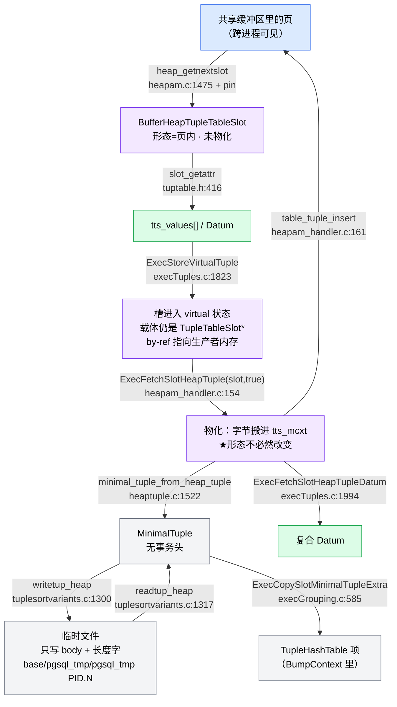

# Deep Read Report: 元组的生命周期与边界

- **源码**：`/home/zhq/mydisk/github/postgres`（PostgreSQL 19beta2）
- **建立时间**：2026-09-19
- **阅读方式**：deep-read 六阶段协议（SCOPE → MAP → TRACE → DEEP READ → CONNECT → REPORT）

> **修订记录（2026-09-19 第二轮）**
> 1. 上一版把「槽类型 `TTSOpsVirtual`」与「槽处于 virtual **状态**」混为一谈，已更正（见 §Critical Logic 3 与 §Data Flow）
> 2. 上一版写 `MINIMAL_TUPLE_OFFSET` 为「9 字节」，权威定义为 **8**（64 位），已更正（见 §Critical Logic 2）
> 3. 新增 §「物化（materialize）：改变的是内存归属，不是形态」
> 4. 新增 §「落盘：格式与文件」
> 5. 新增 Risks R7（TOAST，`[待验证]`）与 R8（`SHOULDFREE` 双语义）

---

## Scope

- **Target**：一个 tuple 从"诞生"到"消失"的完整路径——有几种生产点、生命周期由谁终结、如何跨模块传递
- **Files analyzed**：14 个文件被触及；其中 3 个核心文件按区段逐行读完（`execTuples.c` 的关键区段、`heaptuple.c` 的生产/释放区段、`tuptable.h` 的全部内联 API），其余按调用点定向抽查。第二轮追加 `fd.c`、`logtape.c`、`tuplesortvariants.c`、`tuplestore.c`、`heapam_handler.c`
- **Coverage limit**：Phase 1 的生产点普查扫出 **114+ 处匹配、分布在 60+ 文件**，按"是否触碰元组表示边界"确定性收窄到 14 个核心文件；被排除的是 catalog 元组构造（`commands/*`、`catalog/*` 共 100+ 处 `heap_form_tuple` 调用，它们只是 P2 的重复实例）
- **未读完**：`slot_deform_heap_tuple` 函数体（`execTuples.c:1017-1260`）、`tts_virtual_clear`、`tuplesort` 的并行 worker 合并路径
- **Entry points**：`heap_getnextslot`（`heapam.c:1475`）、`heap_form_tuple`（`heaptuple.c:1024`）、`ExecStoreVirtualTuple`（`execTuples.c:1823`）、`ExecClearTuple`（`tuptable.h:475`）

> 标注约定：无标注 = 已读到源码行；`[待验证]` = 尚未亲自追进去的调用边或未经源码背书的推理。

---

## Architecture Overview

元组没有构造函数，也没有析构函数。整条生命周期由**四个互相独立的终止器**和**三种显式的所有权转移协议**共同约束。理解这一点是理解全局的钥匙：

- **终止器**：① `ExecClearTuple`（元组级）② slot 释放（槽位级）③ 内存上下文回收（兜底）④ 查询结束 `FreeExecutorState`（进程内全局）
- **所有权转移**：① `shouldFree` 入参 ② `transfer_pin` 入参 ③ `shouldFree` 出参

关键设计立场（`execMain.c:1566-1570` 的注释原话）：

> we are no longer very worried about freeing storage per se ... What we are worried about doing is **closing relations and dropping buffer pins**.

也就是说：**元组内存的正确性靠内存上下文保证，而元组之外的东西（pin、tupdesc 引用计数）必须手工精确释放**。这就是为什么释放代码里到处是 `ReleaseBuffer`，而 `heap_freetuple` 只是 `pfree`（`heaptuple.c:1371-1375`）。

---

## 两条正交的轴：形态 与 内存归属

读这一层最容易犯的错，是把两件独立的事当成一件。**一个 slot 同时由两根轴描述**：

| 轴 | 取值 | 怎么判断 |
| --- | --- | --- |
| **轴 A：形态** | virtual（无物理元组） / HeapTuple / MinimalTuple / 页内 HeapTuple | `tts_ops` 指明槽类型；再看 `hslot->tuple` / `mslot->mintuple` 是否为 NULL |
| **轴 B：内存归属（是否物化）** | 自持 / 依赖外部（页、别的内存上下文） | `TTS_SHOULDFREE`（近似判据，见 R8）+ `BufferHeapTupleTableSlot.buffer` 是否有效 |

**两轴不联动**。最反直觉的组合是「virtual 形态 × 自持」——一个 `TTSOpsVirtual` 槽被物化之后，**依然没有物理元组**，只是它引用的字节搬进了自己的上下文。详见下文 §物化。

---

## Execution Flow

**路径 A：读（页内元组被借用，全程零拷贝）**

```
heap_getnextslot                     heapam.c:1475-1502
  ├─ heapgettup_pagemode / heapgettup        :1482 / :1484   定位到 rs_ctup（页内）
  ├─ 无更多元组 → ExecClearTuple(slot)       :1488   ★清空旧内容
  └─ ExecStoreBufferHeapTuple(&scan->rs_ctup, slot, scan->rs_cbuf)   :1499
       └─ tts_buffer_heap_store_tuple(slot, tuple, buffer, transfer_pin=false)   execTuples.c:943
            ├─ TTS_SHOULDFREE → heap_freetuple (清掉上一个物化元组)      :949-956
            ├─ slot->tts_tid = tuple->t_self                        :962
            └─ buffer 不同页 → ReleaseBuffer(旧) + IncrBufferRefCount(新)   :975-984
```

**路径 B：写（虚拟元组被物化后落盘）**

```
表达式求值 → 填 slot->tts_values[] → ExecStoreVirtualTuple(slot)     execTuples.c:1823-1837
                                                                     ★只翻标志位，不分配内存
  → nodeModifyTable 决定写入 → table_tuple_insert(slot ...)          heapam_handler.c:2687
       └─ heapam_tuple_insert                                        heapam_handler.c:150-166
            ├─ ExecFetchSlotHeapTuple(slot, /*materialize=*/true, &shouldFree)   :154
            │    → tts_*_materialize（见 §物化）                     execTuples.c:398/803
            ├─ heap_insert(relation, tuple, cid, options, bistate)  :161
            └─ if (shouldFree) pfree(tuple)                         :164-165 ★写完就扔
```

**路径 C：脱离页（进入排序/哈希/物化，改用 MinimalTuple）**

```
tuplestore_putvalues → heap_form_minimal_tuple(tdesc, values, isnull, 0)    tuplestore.c:791
tuplesort 取回   → ExecStoreMinimalTuple(stup.tuple, slot, copy)            tuplesortvariants.c:1025
TupleHashTable   → ExecCopySlotMinimalTupleExtra(slot, hashtable->additionalsize)  execGrouping.c:585
溢出到磁盘       → writetup_heap / writetup_heap(tuplestore)                tuplesortvariants.c:1294 / tuplestore.c:1649
```

---

## Critical Logic

### 1. `heap_form_tuple` — 唯一的"从 Datum[] 造物理元组"出口（`heaptuple.c:1024-1104`）

- **What it does**：把 `values[]`/`isnull[]` 序列化成一段连续的、带 23 字节头的字节串
- **How it works**：
  - 扫一遍 null（`:1047-1054`）→ 决定是否要位图
  - `len = offsetof(HeapTupleHeaderData, t_bits)`；有 null 则 `+= BITMAPLEN(natts)`；再 `MAXALIGN` 得 `hoff`（`:1059-1064`）
  - **`palloc0(HEAPTUPLESIZE + len)`，然后 `t_data = (char*)tuple + HEAPTUPLESIZE`**（`:1074-1075`）——管理壳与元组体在**同一块内存**
  - 顺手把 `DatumTupleFields` 三个字段也填上（`:1086-1088`），注释解释：`This lets HeapTupleHeaderGetDatum identify the tuple type if needed`（`:1078-1081`）——**同一个 23 字节前缀，靠 `t_choice` union 同时服务两种用途**
- **State changes**：`t_self`、`t_tableOid`、`t_ctid` 全部置为 invalid（`:1083-1090`），等真正落盘时才由存储层填
- **Edge cases handled**：`natts > MaxTupleAttributeNumber` → ERROR（`:1038-1042`）

### 2. `heap_form_minimal_tuple` — 伪装成"有事务头"（`heaptuple.c:1389-1460`）

- **What it does**：造一个没有事务信息的瘦元组
- **How it works**：
  - `mem = palloc0(len + extra)`；**`tuple = mem + extra`**（`:1441-1442`）——`extra` 是**前置**空间，实现在 tuple 之前
  - **`tuple->t_hoff = hoff + MINIMAL_TUPLE_OFFSET`**（`:1449`）

**三个偏移宏的权威定义**（`htup_details.h:660-665`）：

```c
#define MINIMAL_TUPLE_OFFSET \
	((offsetof(HeapTupleHeaderData, t_infomask2) - sizeof(uint32)) / MAXIMUM_ALIGNOF * MAXIMUM_ALIGNOF)
#define MINIMAL_TUPLE_PADDING \
	((offsetof(HeapTupleHeaderData, t_infomask2) - sizeof(uint32)) % MAXIMUM_ALIGNOF)
#define MINIMAL_TUPLE_DATA_OFFSET \
	offsetof(MinimalTupleData, t_infomask2)
```

64 位下 `MAXIMUM_ALIGNOF = 8`，故：

| 宏 | 值 | 含义 |
| --- | --- | --- |
| `MINIMAL_TUPLE_OFFSET` | **8** | minimal 头起点与"假想 heap 头起点"的距离（向下取整到 8） |
| `MINIMAL_TUPLE_PADDING` | **6** | minimal 头内部为对齐补的字节数 |
| `MINIMAL_TUPLE_DATA_OFFSET` | **10** | 从 minimal 头起点到 `t_infomask2` 的偏移（= 4 字节 `t_len` + 6 字节 padding） |

- **关键机制**：`t_hoff += MINIMAL_TUPLE_OFFSET` 是整套复用技巧的支点。minimal tuple 本身没有事务头，但通过把 `t_hoff` 凭空加大 8 字节，它**假装自己前面有一个事务头**；于是同一份 deform 代码（`execTuples.c:1017`）能原样处理两种元组，`slot_deform_heap_tuple` 只需要一个 `support_cstring` 布尔参数（`:1012-1014`）区分差异。这个技巧的设计意图写在 `htup_details.h:648-654`：
  > When a minimal tuple is accessed via a HeapTupleData pointer, t_data is set to point `MINIMAL_TUPLE_OFFSET` bytes before the actual start of the minimal tuple --- that is, where a full tuple matching the minimal tuple's data would start. **This trick is what makes the structs seem equivalent.**
- **Edge cases not handled**：`extra` 必须是 MAXALIGN 倍数，只有 `Assert`（`:1404`）
- **重要后果**：`heap_free_minimal_tuple` 就是 `pfree(mtup)`（`:1466-1469`），但带 `extra` 时 `mtup != mem`——**这种元组不可单独释放**（见 Risks R1）

### 3. `ExecStoreVirtualTuple` 与「virtual」的正确定义（`execTuples.c:1823-1837`）

**先纠正一个上一版的错误**：`TTSOpsVirtual`（一种槽**类型**）≠「槽里装着 virtual tuple」（一种槽**状态**）。两者正交。

**源码里的定义**（`tuptable.h:49-57`）：

> A "virtual" tuple is an optimization used to minimize physical data copying in a nest of plan nodes. **Until materialized** pass-by-reference Datums in the slot point to storage that is **not directly associated with the TupleTableSlot**; generally they will point to part of a tuple stored in a **lower plan node's output TupleTableSlot**, or to a function result constructed in a plan node's **per-tuple econtext**. It is the responsibility of the generating plan node to be sure these resources are not released...

**正交性的证据**——`ExecStoreVirtualTuple` 整个函数体只有两行，**断言里没有任何槽类型检查**：

```c
1829:	Assert(slot != NULL);
1830:	Assert(slot->tts_tupleDescriptor != NULL);
1831:	Assert(TTS_EMPTY(slot));                 /* ← 没有 TTS_IS_VIRTUAL 之类的检查 */
1833:	slot->tts_flags &= ~TTS_FLAG_EMPTY;
1834:	slot->tts_nvalid = slot->tts_tupleDescriptor->natts;
```

而 `ExecForceStoreHeapTuple` 的 else 分支（`:1764-1776`）就在一个**非 virtual 槽**上照调不误：

```c
1764:	else
1765:	{
1766:		ExecClearTuple(slot);
1767:		heap_deform_tuple(tuple, slot->tts_tupleDescriptor, slot->tts_values, slot->tts_isnull);
1768:		ExecStoreVirtualTuple(slot);     /* ← minimal 类型的槽进入了 virtual 状态 */
```

**怎么判断当前是不是 virtual 状态？没有专用标志位，只能看"物理元组指针是否为 NULL"：**

| 观察点 | 代码 | 位置 |
| --- | --- | --- |
| 取系统列前的守卫 | `if (!hslot->tuple) ereport(ERROR, ... "cannot retrieve a system column in this context")` | `execTuples.c:366-369` |
| 判断是否当前事务元组 | `if (!hslot->tuple) ereport(ERROR, ... "don't have a storage tuple in this context")` | `execTuples.c:388-391` |
| 物化时现造物理元组 | `if (!hslot->tuple) hslot->tuple = heap_form_tuple(slot->tts_tupleDescriptor, slot->tts_values, slot->tts_isnull);` | `execTuples.c:419-422` |
| minimal 版的对应守卫 | `if (!mslot->mintuple) tts_minimal_materialize(slot);` | `execTuples.c:653-654` |
| buffer 版的对应守卫 | `if (!bslot->base.tuple) tts_buffer_heap_materialize(slot);` | `execTuples.c:911-912` |

**修正后的说法**：

> 节点间传递的载体**永远**是 `TupleTableSlot *`。「virtual」描述的是这个槽**此刻的状态**——背后没有物理元组，`tts_values[]`/`tts_isnull[]` 本身就是权威数据（`tuptable.h:59-64`），且里面的 by-ref Datum 是**指向生产者内存的裸指针**。`TTSOpsVirtual` 只是"永远处于该状态"的那一种槽类型。

这也解释了它为什么只能向下游传（`tuptable.h:54-56`）：生产者必须比消费者活得久，而**这件事没有任何运行时检查**。

### 4. 物化（materialize）：改变的是内存归属，不是形态

**用户提问**：物化是不是"把指针指向的 tuple 整理成私有内存的 tuple"？

**方向对，但两处要收紧。** 权威定义在 `tuptable.h:483-493`：

> ExecMaterializeSlot - force a slot into the "materialized" state.
> This causes the slot's tuple to be a **local copy not dependent on any external storage** (i.e. **pointing into a Buffer**, or having **allocations in another memory context**).
> A typical use for this operation is to prepare a computed tuple for being stored on disk. The original data may or may not be virtual, but in any case **we need a private copy for `heap_insert` to scribble on**.

**收紧点 ①：它切断的是"外部依赖"，不只是"指针指向的 tuple"。** 外部依赖有两类：指向 Buffer、在别的内存上下文里分配。

**收紧点 ②：物化在两类槽上做的是两件不同的事，而且其中一种不产生物理元组。**

| 槽的情况 | 物化做什么 | 物化后还是 virtual 吗 | 位置 |
| --- | --- | --- | --- |
| 页内元组（buffer 槽） | `heap_copytuple` 拷到 `tts_mcxt` → `ReleaseBuffer` → 置 `TTS_FLAG_SHOULDFREE`；并**强制 `off = 0; tts_nvalid = 0`** | 否（已变物理元组） | `execTuples.c:803-860` |
| 有物理元组但在别的上下文 | `heap_copytuple` / `heap_copy_minimal_tuple` 拷进 `tts_mcxt` | 否 | `:430`、`:622` |
| 处于 virtual 状态的槽 | **`heap_form_tuple` / `heap_form_minimal_tuple` 现造一个物理元组** | 否 | `:419-422`、`:833-835`、`:607-612` |
| `TTSOpsVirtual` 槽 | **不产生物理元组**：算总大小 → `MemoryContextAlloc` 一块 `vslot->data` → 把所有 by-ref 值拷进去 → 把 `tts_values[natt]` 重指向这块内存 | **是** | `execTuples.c:168-266` |

**`tts_virtual_materialize` 的三个细节**（`execTuples.c:175-266`）：

- 设计意图写在函数头（`:168-174`）：
  > To materialize a virtual slot all the datums that aren't passed by value have to be copied into the slot's memory context. To do so, compute the required size, and allocate enough memory to store all attributes. That's good for cache hit ratio, but more importantly requires only memory allocation/deallocation.
- **幂等**：`if (TTS_SHOULDFREE(slot)) return;`（`:184`）——三个物理版物化函数用的是同一个判据（`:407-408`、`:595-596`、`:812-813`）
- **短路**：**如果所有属性都是 byval，`sz == 0`，直接返回什么都不做**（`:215-217`）
- **Expanded object 会被扁平化**（`:243-251`，`EOH_flatten_into`）——因为展开态对象自带内存上下文，属于"外部依赖"

**所以"物化"这个状态的准确含义是**：

> slot 从「内容的字节可能活在别处」变成「内容的字节只活在 slot 自己的上下文里」。**它是关于内存归属的，不是关于形态的。**形态（virtual / HeapTuple / MinimalTuple）是另一根轴。

**为什么写入前必须物化？** 答案就是 `tuptable.h:490-492` 那句 `scribble on`，落地在 `heapam_handler.c:150-166`：

```c
150:	heapam_tuple_insert(Relation relation, TupleTableSlot *slot, CommandId cid,
151:						uint32 options, BulkInsertState bistate)
152:	{
153:		bool		shouldFree = true;
154:		HeapTuple	tuple = ExecFetchSlotHeapTuple(slot, /* materialize = */ true, &shouldFree);
...
161:		heap_insert(relation, tuple, cid, options, bistate);
162:		ItemPointerCopy(&tuple->t_self, &slot->tts_tid);
...
164:		if (shouldFree)
165:			pfree(tuple);      /* ★写完就扔——元组已经进了页 */
166:	}
```

理由：`heap_insert` 要**往元组里涂改** `t_self`/`t_ctid`/`xmin`/`xmax`。页内元组是共享页的一部分，绝不能涂；virtual 状态根本没有物理元组可涂。

### 5. `tts_buffer_heap_store_tuple` — 同页优化与 pin 补偿（`execTuples.c:943-993`）

- **What it does**：把页内元组装进 slot，并处理 pin
- **How it works**（`:964-992`）：如果 `bslot->buffer == buffer`（同一页），**既不释放也不重新加 pin**；注释给的理由是 seqscan 的常见情形（`:970-973`）
- **反直觉的一支**（`:985-992`）：
  ```c
  else if (transfer_pin && BufferIsValid(buffer))
      ReleaseBuffer(buffer);   /* 调用者不知道同页优化，多给的 pin 得还回去 */
  ```
  **调用者按"我要转移 pin"来调用，实现却可能答"这个 pin 你其实不用给，还你"**——同页优化与所有权转移语义的一次妥协

### 6. 释放三岔口（`execTuples.c:327-343 / 526-541 / 720-748`）

| slot | 条件 | 动作 | 位置 |
| --- | --- | --- | --- |
| heap | `TTS_SHOULDFREE` | `heap_freetuple` | `:332-336` |
| minimal | `TTS_SHOULDFREE` | `heap_free_minimal_tuple` | `:530-534` |
| buffer | `TTS_SHOULDFREE` | `heap_freetuple` + **`Assert(!BufferIsValid(bslot->buffer))`** | `:730-737` |
| buffer | `BufferIsValid` | `ReleaseBuffer` | `:739-740` |
| virtual | `TTS_SHOULDFREE` | 释放 `vslot->data` | `tts_virtual_clear`（未逐行核对） |

buffer 那一格的断言是 `tts_buffer_heap_materialize` `:857` 那个顺序的**守卫**——进出两端各查一遍。

---

## 落盘：格式与文件

### 落盘的字节：连 minimal 头都不写

`tuplesortvariants.c:1294-1310`（`writetup_heap`）与 `tuplestore.c:1649-1660`，两处格式完全相同：

```c
/* the part of the MinimalTuple we'll write: */
char	   *tupbody = (char *) tuple + MINIMAL_TUPLE_DATA_OFFSET;
unsigned int tupbodylen = tuple->t_len - MINIMAL_TUPLE_DATA_OFFSET;

/* total on-disk footprint: */
unsigned int tuplen = tupbodylen + sizeof(int);

BufFileWrite(state->myfile, &tuplen, sizeof(tuplen));      /* 前向长度字 */
BufFileWrite(state->myfile, tupbody, tupbodylen);
if (state->backward)			/* need trailing length word? */
	BufFileWrite(state->myfile, &tuplen, sizeof(tuplen));  /* 反向扫描才补尾部长度字 */
```

**从 `MINIMAL_TUPLE_DATA_OFFSET`（= 10）开始写**，即跳过 4 字节 `t_len` + 6 字节 padding。设计理由写在 `htup_details.h:656-658`：

> `MINIMAL_TUPLE_DATA_OFFSET` is the offset to the first useful (non-pad) data other than the length word. **tuplesort.c and tuplestore.c use this to avoid writing the padding to disk.**

读回时对称重建（`tuplesortvariants.c:1313-1336`）：`tuplen = tupbodylen + MINIMAL_TUPLE_DATA_OFFSET` → `tuple->t_len = tuplen` → 读回 body → 再把 `htup.t_data` 掰回 `(char *) tuple - MINIMAL_TUPLE_OFFSET` 好让 `heap_getattr` 能直接用（`:1330-1335`）。

**结论**：写下去的既不是 HeapTuple 也不是 MinimalTuple，而是「**MinimalTuple 去掉头之后的裸数据体**」。这是元组在本子系统里经历的**第二次形态剥离**（第一次是 heap → minimal）。

### 文件是什么：表空间目录下的自定义临时文件

| 问题 | 答案 | 证据 |
| --- | --- | --- |
| 是关系吗？ | **不是**。没有 `pg_class` 条目、不进 WAL、不受 MVCC 管 | 文件名与目录直接构造：`fd.c:1804-1805` |
| 文件名？ | `pgsql_tmp<MyProcPid>.<tempFileCounter++>` | `fd.c:1804-1805`（前缀 `PG_TEMP_FILE_PREFIX`） |
| 目录？ | `base/pgsql_tmp/`（默认/全局表空间）；否则 `pg_tblspc/<oid>/<TABLESPACE_VERSION_DIRECTORY>/pgsql_tmp/` | `fd.c:1774-1784` |
| 由谁定？ | `temp_tablespaces` GUC 决定用哪个**表空间目录**；未设置则用当前数据库的默认表空间 | `fd.c:287-294`、`:3096-3116` |

所以准确说法是：**它是运行时自建的临时文件，但落点由表空间体系管**——既不是"和表空间无关的自定义文件"，也不是"表空间里的关系"。

**一个重要例外**（`fd.c:1729-1734`）：

```c
	 * BUT: if the temp file is slated to outlive the current transaction,
	 * force it into the database's default tablespace, so that it will not
	 * pose a threat to possible tablespace drop attempts.
	 */
	if (numTempTableSpaces > 0 && !interXact)
```

**跨事务的临时文件（`interXact=true`，例如 `WITH HOLD` 游标）被强制放到数据库默认表空间**，绕开 `temp_tablespaces`。

`interXact` 传播链：`tuplestore_begin_heap(randomAccess, interXact, maxKBytes)`（`tuplestore.c:330-347`）→ `state->interXact`（`:265`）→ `BufFileCreateTemp(state->interXact)`（`:864`）。
`tuplesort` 走 `LogicalTape`：串行 `BufFileCreateTemp(false)`（`logtape.c:595`），并行排序走 `BufFileCreateFileSet`（`:592`）。

**生命周期**：事务结束 `AtEOXact_Files` 清（`fd.c:3213-3219`）；崩溃残留由启动时 `RemovePgTempFiles` 扫掉（`fd.c:3323-3365`）——**因为临时文件不进 WAL，PG 不保证它们崩溃后的内容**。

---

## Patterns & Conventions

1. **"同一块内存"贯穿到底** — `HeapTupleData` 与元组体同块（`heaptuple.c:1074-1075`）；哈希项与 minimal tuple 同块（`execGrouping.c:585`）；`TTS_FLAG_FIXED` 时 `tts_values`/`tts_isnull` 与 slot 同块（`execTuples.c:1478-1485` 因此跳过单独 pfree）。**唯一目的：让释放退化成一次 `pfree` 或干脆不用释放**

2. **所有权转移一律显式化，绝不靠约定** — `shouldFree` 入参（`execTuples.c:1624`/`:1718`）、`transfer_pin` 入参（`:943`/`:1690`）、`shouldFree` 出参（`:1916`/`:1963`）。`ExecFetchSlotMinimalTuple` 的注释把契约写成了两段（`:1946-1960`）：有 `get_minimal_tuple` → 返回只读、`shouldFree=false`；否则 → 返回副本、`shouldFree=true`

3. **"我是否持有这份数据"必须有字段能回答** — `TTS_FLAG_SHOULDFREE`（内存）、`BufferHeapTupleTableSlot.buffer`（页 pin）、`tts_tupleDescriptor` 的 `tdrefcount`（描述符）。三者互相独立，**没有任何一个能推出另一个**

4. **性能优化与不变量冲突时，用注释 + Assert 把顺序钉死** — `execTuples.c:850-856`、`:964-992`、`:732`、`:1522`（`This should match ExecResetTupleTable's processing of one slot`）

5. **换表示只在三种理由下发生** — ① 要脱离页（buffer → heap，`:803`）② 要脱离内存上下文（→ `tts_mcxt`，`:398`/`:803`）③ 要剥离事务信息（heap → minimal，`heaptuple.c:1522`）。**没有"为了统一"的转换**

6. **同一诉求可以用两种手段实现** — 「脱离内存上下文」在有物理元组时靠**拷贝出一个物理元组**（`:430`），在 virtual 槽上靠**拷贝出一块 Datum 后备存储**（`:220`）。手段不同，目标相同

7. **表示层与内存上下文层在同一处交汇** — `execGrouping.c:163-168` 明确要求 `tuplescxt` 是 **BumpContext**（只分配不单独释放），正是这条要求让带 `extra` 的 minimal tuple 不必被单独释放

---

## Data Flow



**注意图里那条回到 PAGE 的箭头**：写完的元组通过 `heap_insert` 写进共享缓冲区，从此**对其它进程可见**。在此之前，这个元组在世界上只存在于本后端的私有内存里。

---

## Risks & Assumptions

| # | 风险 | 证据 | 严重度 |
| --- | --- | --- | --- |
| R1 | `heap_free_minimal_tuple` = `pfree(mtup)`，但 `extra>0` 时 `mtup` 不是分配起点。目前**唯一**带 extra 的调用者把元组存进 `tuplescxt`，而该 context 被要求是 **BumpContext**（只分配不单独释放）——契约靠这一条兜住 | `heaptuple.c:1466-1469`、`:1441-1442`；`execGrouping.c:585`、`:163-168` | High |
| R2 | `ExecStoreHeapTuple(shouldFree=false)` 要求"上层节点先失去兴趣"，否则悬空指针。注释用整段警告 + `If you're not certain, copy` 收尾 | `execTuples.c:1608-1615` | High |
| R3 | virtual 状态的槽里是裸指针，生产者负责其存活期。违反后症状是"读到已被复用的内存"，无任何运行时检查 | `tuptable.h:49-57` | High |
| R4 | buffer slot 的"SHOULDFREE ∧ 有效 buffer"非法瞬态只靠语句顺序避免，**没有 Assert 覆盖构造路径**（只有 clear 路径有 `:733`） | `execTuples.c:850-857`、`:732-733` | Medium |
| R5 | minimal tuple 无事务信息，`getsysattr` / `is_current_xact_tuple` 直接 `ereport(ERROR)`——这两个失败是**预期的**，调用方必须先判断槽类型或状态 | `execTuples.c:557-584`、`:140-166` | Medium |
| R6 | `ExecResetTupleTable` 与 `ExecDropSingleTupleTableSlot` 的释放步骤必须一致，靠注释而非共享函数保证——**同一模式在 `ExecEndPlan` 里再出现一次**（`shouldFree=false` 意味着真正的终结者是内存上下文） | `execTuples.c:1522`、`:1456-1492`、`:1519-1536`；`execMain.c:1593-1599` | Medium |
| R7 | **排序/物化路径完全没有 TOAST 外部指针处理逻辑**：`src/backend/utils/sort/` 全目录搜 `toast`/`external`/`untoast`/`detoast`/`HEAP_HASEXTERNAL` **0 命中**（唯一命中的 "external" 都是"external sort"算法名）。因此 minimal tuple 可携带外部指针并被**原样写进临时文件**。为什么安全？推断是"原始堆元组在查询快照下仍可见 → 其 TOAST 行不会被 VACUUM 回收"，但**此推理链未在源码或注释中找到直接背书** | `nodeSort.c:153`；`tuplesortvariants.c:763`；`heaptuple.c:1535` | **`[待验证]`** / High |
| R8 | `TTS_SHOULDFREE` 同时承担两个语义：**"归我释放"** 与（三个 materialize 函数里用作）**"已物化"**。两者不等价——若调用者用 `ExecStoreHeapTuple(tuple_in_other_ctx, slot, true)` 存入一个属于别的上下文的元组，`materialize` 会因 SHOULDFREE 已置位而**直接返回，槽并未真正自持**。未找到实际违反的调用者（`tts_heap_copyslot:444`、`ExecForceStoreHeapTuple:1756` 都先切到 `tts_mcxt`），但这是语义缺口 | `execTuples.c:499-500`、`:407-408`、`:184`；`tuptable.h:80-82` | Medium |

---

## Key Findings

- **生产点共 5 类**：页内借用（P1，零分配）、堆内存 HeapTuple（P2）、堆内存 MinimalTuple（P3）、复合 Datum（P4）、虚拟元组（P5，不产生物理元组）—— `execTuples.c:1663` / `heaptuple.c:1024` / `heaptuple.c:1389` / `heaptuple.c:988` / `execTuples.c:1823`
- **`heap_form_tuple` 是全库最普遍的生产点**（114+ 处匹配、60+ 文件），绝大多数是 catalog 元组构造 —— 全库普查结果
- **描述一个 slot 需要两根正交的轴**：形态（virtual / HeapTuple / MinimalTuple / 页内）与内存归属（自持 / 依赖外部）。`TTSOpsVirtual` 只是"永远处于 virtual 形态"的槽**类型**，而任何槽**类型**都可以进入 virtual **状态** —— `execTuples.c:1823-1837`、`:1764-1776`
- **"物化"改变的是内存归属，不是形态** —— `TTSOpsVirtual` 槽物化后**依然没有物理元组**，只是 by-ref 值搬进了 `vslot->data`（`execTuples.c:220`）；其定义是"切断对 Buffer 与其它内存上下文的依赖"（`tuptable.h:483-493`）
- **物化有一个免费短路**：若所有属性都是 byval，`sz == 0`，物化什么都不做（`execTuples.c:215-217`）
- **生命周期有 4 个终止器，且它们是分层的**：`ExecClearTuple` 释放元组、slot 释放归还 pin 与 tupdesc、`ExecResetTupleTable(shouldFree=false)` 明确放弃 pfree（`execMain.c:1595-1599`）、内存上下文做最终回收
- **`t_hoff + MINIMAL_TUPLE_OFFSET`（8 字节）是整套表示的支点**：让 minimal tuple 伪装成有事务头的 heap tuple，从而复用同一份 deform 代码 —— `heaptuple.c:1449`；设计意图在 `htup_details.h:648-654`；消费侧的反向指针在 `execTuples.c:698`、`:629-630`
- **`extra` 前置空间是"反向嵌入"**：把调用者的附加数据放在 minimal tuple 之前，省掉一次分配和一个指针 —— 规范在 `tuptable.h:237-241`，**全库唯一使用者**是 `execGrouping.c:585`（TupleHashTable 的 `additionalsize`）
- **元组会经历两次形态剥离**：heap → minimal（丢事务信息，`heaptuple.c:1522`）→ 写盘时只留数据体（连 minimal 头都不写，`tuplesortvariants.c:1300`）
- **模块间传递只有一条通用货币：`TupleTableSlot *`**；一旦要脱离页或脱离内存上下文，就换成 `MinimalTuple`；一旦要出执行器，就换成复合 `Datum` —— `execMain.c:1553`、`tuplestore.c:1146`、`execTuples.c:1994`
- **元组不跨进程**：跨进程共享的只有 Buffer 页；元组头里的 `t_xmin`/`t_xmax` 是唯一让"共享的字节"变成"我的事务的元组"的东西 —— 这也解释了 `MinimalTuple` 为什么必须在离开执行器前被换回来
- **换出去的文件不是关系**：`base/pgsql_tmp/pgsql_tmp<pid>.<n>`，不进 WAL，落点由 `temp_tablespaces` 决定；跨事务的文件强制走默认表空间（`fd.c:1729-1734`、`:1804-1805`、`:3323-3365`）
- **一个反直觉的所有权细节**：同页优化会让"我转移 pin"变成"我把 pin 还给你" —— `execTuples.c:985-992`
- **复合 Datum 有额外约束**：若元组含 TOAST 外部指针，必须先内联（`toast_flatten_tuple_to_datum`）才能当复合 Datum 用 —— `heaptuple.c:993-1000`

---

## Answer

### 问题一：有几种生产的地方？

**5 类，按"是否分配内存"划分**：

| 类 | 是否分配 | 代表函数 | 位置 |
| --- | --- | --- | --- |
| P1 页内借用 | 不分配 | `ExecStoreBufferHeapTuple` | `execTuples.c:1663` |
| P2 堆内存 HeapTuple | 单块 palloc0 | `heap_form_tuple` / `heap_modify_tuple` | `heaptuple.c:1024` / `:1117` |
| P3 堆内存 MinimalTuple | 单块 palloc0（可带前置 extra） | `heap_form_minimal_tuple` | `heaptuple.c:1389` |
| P4 复合 Datum | palloc + 改写 datum 头 | `heap_copy_tuple_as_datum` | `heaptuple.c:988` |
| P5 虚拟元组 | **不分配** | `ExecStoreVirtualTuple` | `execTuples.c:1823` |

另有"转换"横切在前三类之上：`heap_tuple_from_minimal_tuple`（`heaptuple.c:1500`）、`minimal_tuple_from_heap_tuple`（`:1522`）、`heap_expand_tuple` / `minimal_expand_tuple`（`:961-980`，把元组补齐到新 `TupleDesc`）、`ExecForceStoreHeapTuple`（`execTuples.c:1740`）、`ExecForceStoreMinimalTuple`（`:1783`）。

### 问题二：什么时候结束生命周期？

**四层，从最细到最粗，任何一层都可能先到**：

1. **元组级** — `ExecClearTuple(slot)`（`tuptable.h:475-481`）→ `ops->clear`。只有当 `TTS_SHOULDFREE` 置位时才真的 `pfree`；buffer slot 还会 `ReleaseBuffer`（`execTuples.c:720-748`）
2. **槽位级** — `ExecResetTupleTable` / `ExecDropSingleTupleTableSlot`（`execTuples.c:1456` / `:1519`）：clear + release + `ReleaseTupleDesc` + pfree slot
3. **内存上下文级** — 这是**真正的主力**。`ExecEndPlan` 用 `shouldFree=false`，注释直说"不必 pfree slot，因为容器内存上下文即将消失"（`execMain.c:1593-1599`）
4. **查询级** — `ExecEndPlan` → `FreeExecutorState`（`execMain.c:1573-1607`）

**一句话**：PG 不靠"析构"来管理元组内存，靠"**整块扔掉**"；显式释放只为了两件事——**还 buffer pin** 和**减 tupdesc 引用计数**。

### 问题三：如何在模块之间传递？

**只用三种载体，且都与"跨越了什么边界"一一对应**：

| 跨越的边界 | 载体 | 为什么必须换 |
| --- | --- | --- |
| 存储 AM → 执行器 | `TupleTableSlot *`（持 pin，未物化） | 页可能被换出，必须显式 pin |
| 执行器节点 → 执行器节点 | `TupleTableSlot *`（**可能处于 virtual 状态**） | 零拷贝，靠生产者内存存活；**并非"传的是 virtual"，而是"槽此刻是 virtual"** |
| 执行器 → 排序/哈希/物化 | `MinimalTuple` | 要脱离页、要脱离内存上下文、要能写临时文件；**不需要事务信息** |
| 执行器 → 存储（写） | slot **物化**后经 `table_tuple_insert` | `heap_insert` 要涂改 `t_self`/`t_ctid`，必须要一份私有副本（`tuptable.h:490-492`、`heapam_handler.c:154`） |
| 执行器 → 函数/触发器/SPI | 复合 `Datum`（`DatumTupleFields`） | 要变成普通值参与类型系统（且 TOAST 指针必须内联，`heaptuple.c:993-1000`） |
| 排序/物化 → 磁盘 | 临时文件（只写数据体 + 长度字） | work_mem 不够时溢出（`tuplesortvariants.c:1300`、`tuplestore.c:1651`） |
| 进程 → 进程 | **没有通道** | 只有 Buffer 页共享，元组本身不迁移 |

补充载体：`Tuplestore` 同时是"跨语句"的通道（游标、`nodeMaterial`、SPI），它对上暴露 slot、对内保存 minimal tuple（`tuplestore.c:791` / `:1146`）——**是唯一一个"存起来给别的查询用"的元组容器**。

### 附带回答：物化是不是"把指针指向的 tuple 整理成私有内存的 tuple"？

**方向对，但表述要收紧两点**（详见 §Critical Logic 4）：

1. 它切断的是**两类外部依赖**——指向 Buffer、以及在别的内存上下文里分配（`tuptable.h:486-488`），不只是"指针指向的 tuple"。
2. **它不必然产生物理元组**。对 `TTSOpsVirtual` 槽，物化只是把 by-ref 值拷进自己的 `vslot->data`（`execTuples.c:220-264`）——**物化之后它仍然是 virtual 形态**。所以准确说法是：

> **物化改变的是「内存归属」，不是「形态」。**

---

## 遗留问题（下一轮可追）

| 问题 | 建议入口 | 状态 |
| --- | --- | --- |
| **排序/物化携带 TOAST 外部指针为何安全**（R7）——`src/backend/utils/sort/` 全目录 0 命中，没有任何处理逻辑，需要找出真正兜住它的机制 | 两条候选机制各查一侧：<br>**(a) 比较时懒解压**：`access/common/detoast.c`（`PG_DETOAST_DATUM` 实现）→ 各类型的 `SortSupport` 比较函数如何触发它<br>**(b) TOAST 行不被 VACUUM 回收**：`access/heap/heaptoast.c`（`toast_insert_or_update` / `heap_tuple_untoast_attr`）、以及 `access/heap/pruneheap.c` / `vacuumlazy.c` 里判断 TOAST 行可删的依据 | **优先** |
| `slot_deform_heap_tuple` 的三条分段路径如何保证等价 | `execTuples.c:1017-1260` | 未读 |
| `tts_virtual_clear` 释放 `vslot->data` 的确切条件 | `execTuples.c:193` 之前 | 未读 |
| `SHOULDFREE` 双语义（R8）是否有实际违反者 | 全库搜 `ExecStoreHeapTuple(.*, .*, true)` | 未查 |
| `tuplesort` 并行 worker 的 tape 合并（`BufFileCreateFileSet`） | `logtape.c:588-597`、`tuplesort.c:3306-3420` | 未读 |
| catalog 元组构造（100+ 处 `heap_form_tuple`）是否有共性模式 | `src/backend/catalog/*` | 未查 |
