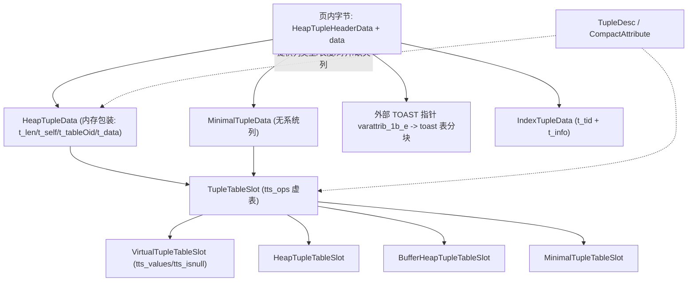

# PostgreSQL 19beta2 Tuple 抽象对象深度解析

| 项目 | 内容 |
|---|---|
| 代码库 | `/home/zhq/mydisk/github/postgres` |
| 版本 | PostgreSQL 19beta2（`configure.ac:20` `AC_INIT([PostgreSQL], [19beta2], ...)`） |
| 提交 | `d2768065a979ffad11e2ee650b9fa9fd95168a8b`（2026-07-27，`REL_19_BETA2-79-gd2768065a97`） |
| 平台常量 | `MAXIMUM_ALIGNOF = 8`、`BLCKSZ = 8192`（`build/src/include/pg_config.h:567`、`:29`） |
| 分析范围 | tuple 这个抽象对象：磁盘物理表示 → 元数据描述 → 构造/解析 API → 运行时 slot → 表访问层契约 → TOAST 外置 → 索引 tuple 对照 → MVCC/WAL 视角 |
| 引用约定 | 所有 `file:line` 相对于仓库根；行号已在本次分析中逐条 `grep -n` 核验 |

---

## 0. 结论速览

1. PostgreSQL 的 "tuple" 不是一个类型，而是**一组按层次分工的表示**：磁盘上是**字节数组 + 自描述头部**（`HeapTupleHeaderData`，固定 23 字节前缀），内存里可能被包成 `HeapTupleData`，压缩传输用 `MinimalTupleData`，执行器里统一抽象成 `TupleTableSlot`。
2. 元组字节**自身不足以解释**：列的类型、长度、对齐、是否被 DROP 都需要 `TupleDesc` 提供；「`HeapTuple` + `TupleDesc` 才是完整的一条行」是贯穿全代码的契约（`src/include/access/tupdesc.h:89-147`、`src/backend/executor/execExprInterp.c:5610-5632`）。
3. 头部布局的核心算术：`t_ctid` 被 `pg_attribute_packed()` 压成 6 字节（`src/include/access/itup.h` 之外由 `itemptr.h` 保证），因此 `t_infomask2` 落在 offset 18，`t_bits` 落在 offset 23，`t_hoff = MAXALIGN(23 [+ BITMAPLEN])`，无 NULL 时即 24。PG19 **没有**改动这个布局。
4. `t_infomask2` 低 11 位与 HOT/HEAP_ONLY/KEYS_UPDATED 标志共享（`src/include/access/htup_details.h:291-306`）；`t_infomask` 承载「有 NULL / 有变长 / 有外置 / 可见性」等状态（`:190-219`）。**NULL 位图位于头部与数据之间**。
5. 构造链是 `heap_form_tuple` → `heap_compute_data_size` → `heap_fill_tuple` → `fill_val`；解析链是 `heap_deform_tuple`（三段式批量）或 `fastgetattr`/`nocachegetattr`/`heap_getsysattr`（单列）。
6. `MinimalTupleData` = `t_len` + 6 字节 padding + 从 `t_infomask2` 起与 `HeapTupleHeaderData` **完全对齐**的字段；靠 `MINIMAL_TUPLE_OFFSET = 8` 与偏移补偿，使 `heap_deform_tuple`/`fastgetattr` 一套例程通吃两种形态。
7. 尺寸语义要区分**硬上限**与**软目标**：`MaxHeapTupleSize = BLCKSZ - MAXALIGN(SizeOfPageHeaderData + sizeof(ItemIdData)) = 8160`（`htup_details.h:601`，在 `hio.c` 报 "row is too big"），而 `TOAST_TUPLE_THRESHOLD = MaximumBytesPerTuple(4) = 2032`（`heaptoast.h:23-48`）只是 TOAST 的努力目标。
8. TOAST 的现代形态：`tuptoaster.c` 已不存在，逻辑拆为 `toast_helper.c`（决策）+ `heaptoast.c`（tuple 级多趟重写）+ `toast_internals.c`（toast 表的读写）+ `detoast.c`（读回）；外置后的列变成一个 `varattrib_1b_e` 指针（`VARTAG_ONDISK`）。
9. 执行器的运行时抽象是 `TupleTableSlot` + `tts_ops` 虚表：**属性访问只有一条惰性入口 `getsomeattrs`**，四类 slot（virtual/heap/minimal/buffer）差异集中在「元组归谁所有、buffer pin 归谁、能否取系统列」。
10. `virtual slot` 是**计算结果的规范态**：`ExecProject` 明确保证结果是 virtual tuple（`src/include/executor/executor.h:480-514`），从而避免为表达式结果构造物理元组。
11. 表访问层（tableam）刻意以 **slot 而非 HeapTuple** 为边界（`src/include/access/tableam.h:335, 546, 579`），使任意 AM 都能用自定义 slot 承载自己的存储格式；`heapam` 内部再 `ExecFetchSlotHeapTuple` 把 slot 物化成 `HeapTuple`（`src/backend/access/heap/heapam_handler.c:149-162`）。
12. `IndexTuple` 是平行分支：只有 `t_tid` + `t_info`，**没有 `t_hoff`**（数据偏移可由 `t_info` 精确推出），NULL 位图定长，通用上限是 `INDEX_SIZE_MASK = 0x1FFF`。
13. MVCC 完全靠 tuple 头部的 xmin/xmax/cmin/cmax + infomask 位工作；HOT 链用 `t_ctid` 重定向；WAL 只记录「头部需重建的子集（`xl_heap_header`）+ 原始数据字节」，redo 时结合 XID 与目标 TID 重新拼出完整头部（`src/backend/access/heap/heapam_xlog.c:405`）。

---

## 1. 层次总览

```
磁盘页 (page item / line pointer)
  └─ HeapTupleHeaderData + 数据字节        ← 物理真身，自描述头部 + NULL 位图 + 对齐填充
        ├─ (内存包装) HeapTupleData        ← t_len / t_self / t_tableOid / t_data
        ├─ (压缩形态) MinimalTupleData     ← 无系统列、无 t_ctid
        ├─ (外置) varattrib_1b_e  → toast 表分块  ← 单列的 out-of-line 扩展
        └─ (索引)  IndexTupleData          ← t_tid + t_info，另一套布局规则
执行器
  └─ TupleTableSlot (+ tts_ops)            ← 运行时统一抽象
        ├─ VirtualTupleTableSlot           ← Datum/isnull 数组即权威数据（计算结果规范态）
        ├─ HeapTupleTableSlot              ← 持有 palloc 的 HeapTuple
        ├─ BufferHeapTupleTableSlot        ← 持有 buffer pin
        └─ MinimalTupleTableSlot           ← 持有 MinimalTuple
```



层次边界的判定标准很统一：**谁拥有内存、谁的描述符、能否取系统列**。越往上层，越倾向用 `Datum[] + bool[]` 表示一行。

---

## 2. 物理表示：`HeapTupleHeaderData`

### 2.1 结构体与 union

`src/include/access/htup_details.h:122-186`：

```c
typedef struct HeapTupleFields
{
    TransactionId t_xmin;
    TransactionId t_xmax;
    union { CommandId t_cid; TransactionId t_xvac; } t_field3;
} HeapTupleFields;

typedef struct DatumTupleFields
{
    int32 datum_len_;      /* varlena header */
    int32 datum_typmod;
    Oid   datum_typeid;
} DatumTupleFields;

struct HeapTupleHeaderData                       /* :153 */
{
    union { HeapTupleFields t_heap; DatumTupleFields t_datum; } t_choice;
    ItemPointerData t_ctid;                      /* 6 bytes, packed */
    uint16  t_infomask2;                         /* natts + flags */
    uint16  t_infomask;                          /* flags */
    uint8   t_hoff;                              /* sizeof header incl. bitmap, padding */
    /* ^ - 23 bytes - ^ */
    uint8   t_bits[FLEXIBLE_ARRAY_MEMBER];       /* :178 */
    /* MORE DATA FOLLOWS AT END OF STRUCT */
};

#define SizeofHeapTupleHeader offsetof(HeapTupleHeaderData, t_bits)   /* :185 → 23 */
```

`t_choice` 的两个成员都是 12 字节并互相 overlay：内存中构造的元组先填 `DatumTupleFields`（这样它同时也是一个合法的 composite datum），真正落盘前被事务字段覆盖（`htup_details.h:54-63`）。

### 2.2 字段偏移（64 位，`MAXIMUM_ALIGNOF = 8`）

| 字段 | offset | size | 说明 |
|---|---|---|---|
| `t_choice` | 0 | 12 | `HeapTupleFields` / `DatumTupleFields` 叠加 |
| `t_ctid` | 12 | 6 | `ItemPointerData`，靠 packed + aligned(2) 保持 6 字节，避免被补齐到 8 |
| `t_infomask2` | 18 | 2 | 若 `t_ctid` 是 8 字节，这里会变成 20，`MinimalTupleData` 的对齐约定将整体失效 |
| `t_infomask` | 20 | 2 | |
| `t_hoff` | 22 | 1 | 必须为 `MAXALIGN` 的倍数 |
| `t_bits[]` | 23 | 变长 | 位图起点 |

`FIELDNO_HEAPTUPLEHEADERDATA_*` 宏（`:170-176`）把偏移暴露给 JIT，使 LLVM 生成代码可以跳过 C 结构体访问。

### 2.3 头部之后：位图 → padding → 数据

`src/include/access/htup_details.h:65-72` 的权威注释给出顺序：

```
fixed fields (HeapTupleHeaderData struct)
nulls bitmap (if HEAP_HASNULL is set in t_infomask)
alignment padding (as needed to make user data MAXALIGN'd)
object ID (if HEAP_HASOID_OLD is set ... not created anymore)
user data fields
```

- 位图**只在 `HEAP_HASNULL` 时存在**（`:114-119`），长度为 `BITMAPLEN(NATTS) = (NATTS+7)/8`（`:584-588`）。
- 用户数据起点 = `t_data + t_hoff`（`GETSTRUCT`，`:718-722`）。
- `t_hoff` 是 `uint8` → 头部+位图+padding 必须 < 256，这正是 `MaxTupleAttributeNumber = 1664`（`:34`，注释 `8 * 208`）的由来。

### 2.4 `t_infomask` 全部位（`htup_details.h:190-219`）

| 位 | 值 | 含义 |
|---|---|---|
| `HEAP_HASNULL` | 0x0001 | 存在 NULL 列（位图存在） |
| `HEAP_HASVARWIDTH` | 0x0002 | 存在变长列 |
| `HEAP_HASEXTERNAL` | 0x0004 | 存在外置（TOAST 指针）列 |
| `HEAP_HASOID_OLD` | 0x0008 | 存在 oid 字段（历史遗留，不再生成） |
| `HEAP_XMAX_KEYSHR_LOCK` / `HEAP_XMAX_EXCL_LOCK` / `HEAP_XMAX_LOCK_ONLY` | 0x0010 / 0x0040 / 0x0080 | 行锁形态；`HEAP_LOCK_MASK` 为三者并集 |
| `HEAP_COMBOCID` | 0x0020 | cmin/cmax 是 combo CID |
| `HEAP_XMIN_COMMITTED` / `HEAP_XMIN_INVALID` | 0x0100 / 0x0200 | xmin 的 hint；两者同时置位 = `HEAP_XMIN_FROZEN` |
| `HEAP_XMAX_COMMITTED` / `HEAP_XMAX_INVALID` | 0x0400 / 0x0800 | xmax 的 hint |
| `HEAP_XMAX_IS_MULTI` | 0x1000 | xmax 是 MultiXact |
| `HEAP_UPDATED` | 0x2000 | 由 UPDATE 产生 |
| `HEAP_MOVED_OFF` / `HEAP_MOVED_IN` | 0x4000 / 0x8000 | pre-9.0 VACUUM FULL 遗留 |
| `HEAP_XACT_MASK` | 0xFFF0 | 可见性相关位的掩码 |

判定辅助：`HEAP_XMAX_IS_LOCKED_ONLY`（`:226-234`）、`HEAP_XMAX_IS_SHR_LOCKED/EXCL_LOCKED/KEYSHR_LOCKED`（`:266-282`）。

### 2.5 `t_infomask2`：attnum 与标志共享

`htup_details.h:291-306`：

| 位 | 值 | 含义 |
|---|---|---|
| `HEAP_NATTS_MASK` | 0x07FF | 低 11 位 = 属性个数 |
| （保留） | 0x1800 | 两位未使用 |
| `HEAP_KEYS_UPDATED` | 0x2000 | 被 UPDATE 改动的键列 |
| `HEAP_HOT_UPDATED` | 0x4000 | 本条被 HOT 更新过，`t_ctid` 指向新版本 |
| `HEAP_ONLY_TUPLE` | 0x8000 | heap-only（HOT 链上的新版本）；hash join 临时复用为 `HEAP_TUPLE_HAS_MATCH` |
| `HEAP2_XACT_MASK` | 0xE000 | 可见性相关掩码 |

```c
#define HeapTupleHeaderGetNatts(tup)   ((tup)->t_infomask2 & HEAP_NATTS_MASK)      /* :569 */
#define HeapTupleHeaderSetNatts(tup, n) \
    ((tup)->t_infomask2 = ((tup)->t_infomask2 & ~HEAP_NATTS_MASK) | (n))           /* :573 */
```

这两个宏对 `HeapTupleHeader` 与 `MinimalTuple` 都成立——这正是第 3 节对齐约定的价值。

### 2.6 PG19 是否改过头部布局：没有

对 `HeapTupleHeaderData` 区域做 `git log -L` 追踪，最近一次改动只是 `bits8` → `uint8` 的 typedef 重命名，不涉及布局；`/* ^ - 23 bytes - ^ */` 自 PG 9.3 起一直是 23。**这一点对阅读旧资料很关键**——头部布局是 PostgreSQL 中最稳定的结构之一。

---

## 3. 三种 C 结构体的分工

### 3.1 `HeapTupleData`（内存包装，`src/include/access/htup.h:62-73`）

```c
typedef struct HeapTupleData
{
    uint32          t_len;        /* length of *t_data */
    ItemPointerData t_self;       /* SelfItemPointer，磁盘上的物理 TID */
    Oid             t_tableOid;   /* table the tuple came from */
    HeapTupleHeader t_data;       /* -> tuple header and data */
} HeapTupleData;
#define HEAPTUPLESIZE MAXALIGN(sizeof(HeapTupleData))
```

`htup.h:30-61` 列出 5 种用法，其中最重要的是：**`t_data` 指向一个 `palloc(HEAPTUPLESIZE + t_len)` 块内部偏移 `HEAPTUPLESIZE` 处**——`heap_form_tuple` 生成的就是这种「包装头与元组同块」的形态，所以 `heap_freetuple` 只需一次 `pfree`。

### 3.2 `MinimalTupleData`（`htup_details.h:667-686`）

```c
struct MinimalTupleData
{
    uint32 t_len;
    char   mt_padding[MINIMAL_TUPLE_PADDING];
    /* Fields below here must match HeapTupleHeaderData! */
    uint16 t_infomask2;
    uint16 t_infomask;
    uint8  t_hoff;
    /* ^ - 23 bytes - ^ */
    uint8  t_bits[FLEXIBLE_ARRAY_MEMBER];
};
```

对照表：

| | `HeapTupleHeaderData` | `MinimalTupleData` |
|---|---|---|
| 长度字 | 无（在 `HeapTupleData.t_len`） | **有** `t_len` 在结构体内 |
| 事务字段（xmin/xmax/cid） | `t_choice` | **无** |
| `t_ctid` | 有 | **无** |
| `t_infomask2` 及其后 | — | 与 `HeapTupleHeaderData` **逐字节对齐** |
| 系统列 | 可访问 | 不可访问（只能经 slot 间接使用） |

`MINIMAL_TUPLE_OFFSET` 的取值（`:660-665`）：

```c
#define MINIMAL_TUPLE_OFFSET \
    ((offsetof(HeapTupleHeaderData, t_infomask2) - sizeof(uint32)) / MAXIMUM_ALIGNOF * MAXIMUM_ALIGNOF)
#define MINIMAL_TUPLE_PADDING \
    ((offsetof(HeapTupleHeaderData, t_infomask2) - sizeof(uint32)) % MAXIMUM_ALIGNOF)
```

代入 `offsetof(t_infomask2) = 18`、`MAXIMUM_ALIGNOF = 8`：`MINIMAL_TUPLE_OFFSET = 8`、`MINIMAL_TUPLE_PADDING = 6`、`SizeofMinimalTupleHeader = offsetof(MinimalTupleData, t_bits) = 10`（`:690`）。

**为什么能共用访问例程**（`:643-654` 注释 + `heaptuple.c:1447`）：把 minimal tuple 起点往前推 8 字节当作「假 `t_data`」，则 `HeapTupleHeaderData.t_infomask2` 的 offset 18 正好落在 `minimal + 10`（即 MinimalTupleData 的 `t_infomask2`）。同时 `heap_form_minimal_tuple` 写入 `t_hoff = hoff + MINIMAL_TUPLE_OFFSET`，使最小元组的 `t_hoff` 与完整元组的 24 一致。于是 `heap_deform_tuple`/`fastgetattr` 只依赖 `t_hoff`、infomask 和位图，无需区分两种形态。

### 3.3 形态互转 API（均在 `src/backend/access/common/heaptuple.c`）

| 函数 | 行 | 说明 |
|---|---|---|
| `heap_form_minimal_tuple` | `:1390` | 构造 MinimalTuple |
| `heap_copy_minimal_tuple` / `heap_free_minimal_tuple` | `:1478` / `:1466` | 拷贝/释放（minimal tuple 是独立分配） |
| `heap_tuple_from_minimal_tuple` | `:1501` | 补出系统字段（置 0），`t_len = mtup->t_len + MINIMAL_TUPLE_OFFSET` |
| `minimal_tuple_from_heap_tuple` | `:1523` | 反向转换 |
| `minimal_expand_tuple` | `:962` | 就地扩展（用于补列） |

补列路径 `expand_tuple`（`:738-957`）同时支持两种目标形态；minimal 分支里 `t_hoff = hoff + MINIMAL_TUPLE_OFFSET`（`:882`）。

---

## 4. 变长属性与对齐：布局的算术基础

### 4.1 对齐与取值原语（`src/include/access/tupmacs.h`）

- `att_isnull(ATT, BITS)`：**0 表示 NULL，1 表示非 NULL**（`:28-32`，注意与直觉相反）。
- `populate_isnull_array`（`:42-87`）：一次把 8 位展开成 bool 数组，配合 slot 中「isnull 数组长度按 8 取整」的分配策略。
- `fetch_att` / `fetch_att_noerr`（`:107-156`）：按 byval 长度 1/2/4/8 解引用；by-ref 直接返回指针。
- `align_fetch_then_add`（`:171-223`）：deform 循环的合并原语（对齐 → 取值 → 推进 off）。
- `att_align_nominal`（`:404-405`）→ `att_nominal_alignby(cur_offset, typalign_to_alignby(attalign))`；`typalign_to_alignby`（`:302-331`）把 `'c'/'s'/'i'/'d'` 映射为 1/2/4/8。
- `att_datum_alignby`（`:352-356`）：**short 格式的 varlena 不参与对齐**。
- `att_addlength_datum/pointer`（`:419-446`）：`attlen > 0` 加定长；`-1` 加 `VARSIZE_ANY`；`-2`（cstring）加 `strlen + 1`。
- `store_att_byval`（`:456-476`）：`fetchatt` 的逆。

`TYPALIGN_*` / `TYPSTORAGE_*` 的定义在 `src/include/catalog/pg_type.h:306-314`（**不在 `c.h`**）：

```c
#define TYPALIGN_CHAR   'c'   #define TYPSTORAGE_PLAIN     'p'
#define TYPALIGN_SHORT  's'   #define TYPSTORAGE_EXTERNAL  'e'
#define TYPALIGN_INT    'i'   #define TYPSTORAGE_EXTENDED  'x'
#define TYPALIGN_DOUBLE 'd'   #define TYPSTORAGE_MAIN      'm'
```

存字符码而非数值，是为了让初始 catalog 内容与机器无关（`tupmacs.h:297-300`）。

### 4.2 varlena 的三种物理形态（`src/include/varatt.h`）

| 形态 | 头长 | 用途 |
|---|---|---|
| `varattrib_4b` | 4 字节 | 普通 varlena / 内联压缩（`va_compressed`，含 `va_tcinfo`） |
| `varattrib_1b` | 1 字节 | short 格式（≤ `VARATT_SHORT_MAX = 0x7F`） |
| `varattrib_1b_e` | 1 字节 + `va_tag` | 外部指针（TOAST/indirect/expanded） |

关键常量与宏：`VARHDRSZ = 4`、`VARHDRSZ_EXTERNAL = 1`、`VARHDRSZ_COMPRESSED = 8`、`VARHDRSZ_SHORT = 1`（`:276-279`）；`VARSIZE_ANY`（`:459-468`）是「无视形态取总长」的统一入口，`VARSIZE_ANY_EXHDR`（`:471-480`）取净荷长。

外部指针的载荷结构（`:32-39`，注释强调**必须无 padding**，因为代码会用 `memcmp` 比较）：

```c
typedef struct varatt_external {
    int32  va_rawsize;    /* 原始（未压缩/未外置）长度 */
    uint32 va_extinfo;    /* 外置净荷长度 + 压缩方法 */
    Oid    va_valueid;    /* toast 表中的逻辑标识 */
    Oid    va_toastrelid; /* toast 表 OID */
} varatt_external;
```

tag 枚举 `vartag_external`：`VARTAG_INDIRECT = 1`、`VARTAG_EXPANDED_RO = 2`、`VARTAG_EXPANDED_RW = 3`、`VARTAG_ONDISK = 18`（`:84-90`；18 是为了兼容「tag 曾用作长度」的历史）。

### 4.3 对齐如何决定 tuple 布局

`CompactAttribute.attalignby` 是所有布局算术的输入，`t_hoff` 必须 `MAXALIGN`（`htup_details.h:114-119`）。三个层次的对齐语义：

1. **定长列**：`att_nominal_alignby(off, attalignby)` 后放值。
2. **short varlena**：不对齐（省空间），因此**不能**用「按 attalign 对齐」的通式去推进 —— 这是 `att_datum_alignby` 与 `att_nominal_alignby` 必须并存的原因。
3. **普通 varlena**：按类型对齐，长度用 `VARSIZE_ANY` 推进。

---

## 5. 构造与解析主流程

### 5.1 `heap_form_tuple`（`src/backend/access/common/heaptuple.c:1025-1104`）

```c
if (numberOfAttributes > MaxTupleAttributeNumber) ereport(ERROR, ...);   /* :1038 */
for (i = 0; i < numberOfAttributes; i++)
    if (isnull[i]) { hasnull = true; break; }                            /* :1045-1048 */
len = offsetof(HeapTupleHeaderData, t_bits);        /* 23 */
if (hasnull) len += BITMAPLEN(numberOfAttributes);
hoff = len = MAXALIGN(len);                         /* :1061-1064 */
data_len = heap_compute_data_size(tupleDescriptor, values, isnull);
len += data_len;
tuple = (HeapTuple) palloc0(HEAPTUPLESIZE + len);   /* 单块，已清零 */
tuple->t_data = td = (HeapTupleHeader) ((char *) tuple + HEAPTUPLESIZE);
tuple->t_len = len;
HeapTupleHeaderSetDatumLength(td, len);             /* 写入 t_datum.datum_len_ */
HeapTupleHeaderSetTypeId(td, tupleDescriptor->tdtypeid);
HeapTupleHeaderSetTypMod(td, tupleDescriptor->tdtypmod);
HeapTupleHeaderSetNatts(td, numberOfAttributes);
td->t_hoff = hoff;
heap_fill_tuple(tupleDescriptor, values, isnull, (char *) td + hoff, data_len,
                &td->t_infomask, (hasnull ? td->t_bits : NULL));         /* :1094-1096 */
```

即便这条元组可能永远不会被当作 composite datum，也先把 `DatumTupleFields` 写好（`:1077-1081` 注释）。

### 5.2 数据区大小：`heap_compute_data_size`（`:219-267`）

- 可打包（packable）且可转 short 的 varlena：用 `VARATT_CONVERTED_SHORT_SIZE` 且**不计对齐**（`:238-246`）。
- expanded 形态：`att_nominal_alignby` + `EOH_get_flat_size`（`:247-256`）。
- 其余：`att_datum_alignby` + `att_addlength_datum`（`:257-263`）。

### 5.3 写入：`heap_fill_tuple`（`:401-443`）+ `fill_val`（`:274-389`）

位图协议：`bitmask` 从 `HIGHBIT (0x80)` 起逐位右移，跨字节时 `bit++`、`bitmask = 1`；NULL 置 `HEAP_HASNULL` 后**直接 return**（既不写数据也不推进 data 指针）。`fill_val` 的 varlena 分支（`:321-368`）依次处理：expanded → 展平；external 非 expanded → 置 `HEAP_HASEXTERNAL`、`data_length = VARSIZE_EXTERNAL(val)`、**不对齐**；short → 直接 `memcpy`；packable → `SET_VARSIZE_SHORT`；否则 4 字节头 + 对齐。末尾 `Assert((data - start) == data_size)` 是双向算术一致性的保险。

### 5.4 批量解析：`heap_deform_tuple`（`:1254-1366`）的三段式

```c
natts = Min(HeapTupleHeaderGetNatts(tup), tdesc_natts);        /* 继承场景截断 */
firstNonCacheOffsetAttr = Min(tupleDesc->firstNonCachedOffsetAttr, natts);
if (hasnull) firstNonCacheOffsetAttr = Min(firstNonCacheOffsetAttr,
                                           first_null_attr(bp, natts));  /* :1282-1293 */
tp = (char *) tup + tup->t_hoff;
/* 段 1: attcacheoff 快路径（免对齐直取） */
/* 段 2: 首个 NULL 之前的连续区（对齐推进） */
/* 段 3: 含 NULL 区（逐位查 att_isnull） */
/* 段 4: tuple 短于描述符的尾部 → getmissingattr() */                 /* :1360-1365 */
```

三段式是纯粹的性能结构：能用 `attcacheoff` 就免掉对齐计算；`first_null_attr`（`tupmacs.h:243-293`，内部用 `pg_rightmost_one_pos32(~byte)`）把「查位图」缩到最小范围。

### 5.5 单列访问

```c
static inline Datum
fastgetattr(HeapTuple tup, int attnum, TupleDesc tupleDesc, bool *isnull);   /* htup_details.h:851-878 */

static inline Datum
heap_getattr(HeapTuple tup, int attnum, TupleDesc tupleDesc, bool *isnull)   /* :894-906 */
{
    if (attnum > 0) {
        if (attnum > (int) HeapTupleHeaderGetNatts(tup->t_data))
            return getmissingattr(tupleDesc, attnum, isnull);
        return fastgetattr(tup, attnum, tupleDesc, isnull);
    }
    return heap_getsysattr(tup, attnum, tupleDesc, isnull);
}
```

> 注意：`fastgetattr`/`heap_getattr` 在本版本是**内联函数**，不是宏（旧资料常写成宏）。

`nocachegetattr`（`:509-621`）是「`attcacheoff` 不可用」时的回退，按 `HeapTupleHasVarWidth` 分两条循环，并显式注释「改这里也要同步 `heap_deform_tuple`」（`:503-505`）。

### 5.6 内存管理与其他构造 API

| 函数 | 行 | 关键点 |
|---|---|---|
| `heap_copytuple` | `:686-701` | `palloc(HEAPTUPLESIZE + t_len)` **单块**，`heap_freetuple` 一次 `pfree` |
| `heap_copytuple_with_tuple` | `:712-726` | `dest->t_data = palloc(src->t_len)` **单独分配**（注释明确警告与上式不同） |
| `heap_copy_tuple_as_datum` | `:989-1016` | 含 external 列时先 `toast_flatten_tuple_to_datum` |
| `heap_modify_tuple` | `:1118-1172` | deform → 覆盖 → form → **回填 `t_ctid`/`t_self`/`t_tableOid`**（`:1166-1168`） |
| `heap_modify_tuple_by_cols` | `:1186-1235` | 同上，用 1-based 列号数组 |
| `getmissingattr` | `:151-212` | 带全局 `missing_cache`（`TopMemoryContext`），by-ref 值需拷贝以免指向已释放内存 |

### 5.7 系统列编码

`src/include/access/sysattr.h:21-27`：`SelfItemPointerAttributeNumber = -1`、`MinTransactionIdAttributeNumber = -2`、`MinCommandIdAttributeNumber = -3`、`MaxTransactionIdAttributeNumber = -4`、`MaxCommandIdAttributeNumber = -5`、`TableOidAttributeNumber = -6`。

`heap_getsysattr`（`:633-674`）的要点：

- `ctid` 取 **wrapper 的 `t_self`**，不是头部的 `t_ctid`（`:644-646`）——这是一个常见混淆点。
- `xmin`/`xmax` 走 `HeapTupleHeaderGetRawXmin/RawXmax(tup->t_data)`。
- `cmin`/`cmax` 现在是**同一个字段** `t_field3`（可能是 combo CID），两者返回相同值（`:654-664`）。
- `tableoid` 取 `HeapTupleData.t_tableOid` —— 因此 **minimal tuple 没有 tableoid**（它连 `HeapTupleData` 都没有）。
- 系统列恒 `isnull = false`。

### 5.8 尺寸上限与 TOAST 阈值

| 常量 | 位置 | 值（本机） | 语义 |
|---|---|---|---|
| `MaxHeapTupleSize` | `htup_details.h:601` | 8160 | **硬上限**，超出则 `hio.c` 报 `row is too big` |
| `MinHeapTupleSize` | `:602` | 24 | `MAXALIGN(SizeofHeapTupleHeader)` |
| `MaxTupleAttributeNumber` | `:34` | 1664 | 头部+位图必须 < 256 字节 |
| `MaxAttrSize` | `:626` | 10MB | 单值上限 |
| `TOAST_TUPLE_THRESHOLD` | `heaptoast.h:23-48` | 2032 | **软目标**：`MaximumBytesPerTuple(4)` |
| `TOAST_TUPLE_TARGET_MAIN` | `:59-61` | 8160 | MAIN 列外置前放宽到的目标（`MaximumBytesPerTuple(1)`） |
| `TOAST_MAX_CHUNK_SIZE` | `:84-89` | 1996 | toast 分块大小，改变需 initdb |

「硬上限 vs 软目标」的区别值得强调：`heap_toast_insert_or_update` 压不到阈值以下并不报错，只要不超过 8160 就能存。

---

## 6. 元数据层：`TupleDesc` 与 tuple 的绑定契约

### 6.1 两种结构体分工

**catalog 侧**（`src/include/catalog/pg_attribute.h:39-188`）：`FormData_pg_attribute` 是 `pg_attribute` 的行类型，字段最全（含 `attstattarget`、`attacl`、`attoptions`、`attmissingval` 等变长字段）。但 `ATTRIBUTE_FIXED_PART_SIZE`（`:198-199`）只到 `attcollation`：

```c
#define ATTRIBUTE_FIXED_PART_SIZE \
    (offsetof(FormData_pg_attribute, attcollation) + sizeof(Oid))
```

注释（`:193-199`）明确：这是**会被拷进 tuple descriptor 的部分**，变长部分只能从真实 tuple 里读。

**内存侧**（`src/include/access/tupdesc.h:148-163`）：

```c
typedef struct TupleDescData
{
    int  natts;
    Oid  tdtypeid;              int32 tdtypmod;
    int  tdrefcount;            /* -1 = 不计数 */
    int  firstNonCachedOffsetAttr;
    int  firstNonGuaranteedAttr;
    TupleConstr *constr;
    CompactAttribute compact_attrs[FLEXIBLE_ARRAY_MEMBER];
} TupleDescData;
```

分配时是**三段连续内存**：结构头 + `natts` 个 `CompactAttribute` + `natts` 个 `FormData_pg_attribute`（`src/backend/access/common/tupdesc.c:187-189`），`TupleDescSize()`（`tupdesc.h:218-221`）给出总字节数，供 `memcpy` 式拷贝使用。

### 6.2 类型 OID → 属性字段

标准路径 `TupleDescInitEntry`（`tupdesc.c:909-977`）查 `TYPEOID` 系统缓存后直接搬运：

```c
att->atttypid = oidtypeid;
att->attlen   = typeForm->typlen;        /* :967 */
att->attbyval = typeForm->typbyval;      /* :968 */
att->attalign = typeForm->typalign;      /* :969 */
att->attstorage = typeForm->typstorage;  /* :970 */
att->attcollation = typeForm->typcollation;
populate_compact_attribute(desc, attributeNumber - 1);
```

`TupleDescInitEntryCollation`（`:1093-1105`）只覆盖 `attcollation`（该字段不在 `CompactAttribute` 中，因此无需重新 populate）。

真实表的描述符来自 relcache：`RelationBuildTupleDesc`（`src/backend/utils/cache/relcache.c:529`）逐行扫 `pg_attribute`，`memcpy` 定长部分（`:591-593`）后立刻 `populate_compact_attribute`（`:595`），并顺带收集 NOT NULL / GENERATED / 默认值与 `attmissingval`（`:598-657, :692`）。

命名行类型与匿名 record 走 `lookup_rowtype_tupdesc*`（`src/backend/utils/cache/typcache.c:1941-2035`），其中 `RECORDOID + typmod ≥ 0` 会走 session 级的共享 typmod registry。

### 6.3 `CompactAttribute`：热路径专用的 8 字节摘要

`src/include/access/tupdesc.h:68-87`（注释 `:50-67` 强调「当前是 8 字节，任何扩容都要极其小心」）：

```c
typedef struct CompactAttribute {
    int16 attcacheoff;      /* 已知的固定偏移，否则 -1 */
    int16 attlen;           /* -1 = 变长，-2 = cstring */
    bool  attbyval;
    uint8 attalignby;       /* 数值化后的对齐字节数 */
    bool  attispackable:1;  /* attstorage != TYPSTORAGE_PLAIN */
    bool  atthasmissing:1;
    bool  attisdropped:1;
    bool  attgenerated:1;
    char  attnullability;
} CompactAttribute;
```

- 唯一的「编译」点是 `populate_compact_attribute_internal`（`tupdesc.c:65-91`），它把字符型 `attalign` 折算成 `attalignby`、把 `attstorage` 折算成 `attispackable`。
- 手工改了 `FormData_pg_attribute` 后**必须**调 `populate_compact_attribute`（`tupdesc.h:131-133`）；`verify_compact_attribute`（`tupdesc.c:124-155`）只在 `USE_ASSERT_CHECKING` 下做 `memcmp` 校验，专门抓这类漏调。
- `attnullability` 的四态（`tupdesc.h:83-87`）区分「无 NOT NULL」「未知」「已验证有效」「无效」。

### 6.4 紧凑优化：`attcacheoff` / `firstNonCachedOffsetAttr` / `firstNonGuaranteedAttr`

`TupleDescFinalize`（`tupdesc.c:511-563`）只对**定长前缀**缓存偏移：

```c
for (i = 0; i < tupdesc->natts; i++) {
    if (cattr->attlen <= 0 || attr->attgenerated == ATTRIBUTE_GENERATED_VIRTUAL) break;  /* :538-541 */
    off = att_nominal_alignby(off, cattr->attalignby);
    if (off > PG_INT16_MAX) break;                        /* attcacheoff 是 int16 */
    cattr->attcacheoff = (int16) off;
    off += cattr->attlen;
    firstNonCachedOffsetAttr = i + 1;
}
```

`firstNonGuaranteedAttr` 取「第一个可能为 NULL / 非 byval / hasmissing / dropped / 变长 / virtual generated」的列（`:522-532`），供 JIT deform 与 `tts_first_nonguaranteed` 使用。

消费者：`fastgetattr`（`htup_details.h:851-878`）、`heap_deform_tuple`（`heaptuple.c:1280, :1306-1322`）、`nocachegetattr`、`index_getattr`、`slot_deform_heap_tuple`（`execTuples.c:1134`）、以及 JIT 变形 `slot_compile_deform`（`src/backend/jit/llvm/llvmjit_deform.c:399-403`）。

### 6.5 「字节只有配上 TupleDesc 才可解释」的三条支撑

1. **DROP COLUMN**：`RemoveAttributeById`（`src/backend/catalog/heap.c:1702-1761`）置 `attisdropped = true`、`atttypid = InvalidOid`（`:1743`），但**保留 `attlen`/`attalign`**——因为老元组里该列的物理字节仍需被跳过。于是新元组中该列一律写 NULL（投影器 `execExpr.c:713-734` 显式生成 `EEOP_CONST` + isnull；全表重写 `tablecmds.c:6433-6442`）。whole-row 一致性检查把它写成了错误信息：`"Physical storage mismatch on dropped attribute at ordinal position %d."`（`execExprInterp.c:5630`）。
2. **ADD COLUMN 的 `attmissingval`**：非 volatile 默认值会被求值一次并存入 `pg_attribute.attmissingval`（`tablecmds.c:7632-7657` → `StoreAttrMissingVal`，`heap.c:2050+`），随后进入 `TupleDesc.constr->missing`（`relcache.c:607-657, :692`）。
3. **deform 补齐**：`getmissingattr`（`heaptuple.c:151-212`）、`heap_deform_tuple` 尾部循环（`:1360-1365`）、`slot_getmissingattrs`（`execTuples.c:2141-2170`）三条路径都基于 `constr->missing`。

### 6.6 TupleDesc 的所有权与引用计数

```c
#define PinTupleDesc(tupdesc) \
    do { if ((tupdesc)->tdrefcount >= 0) IncrTupleDescRefCount(tupdesc); } while (0)   /* tupdesc.h:234-244 */
#define ReleaseTupleDesc(tupdesc) \
    do { if ((tupdesc)->tdrefcount >= 0) DecrTupleDescRefCount(tupdesc); } while (0)
```

- `tdrefcount == -1`：executor 临时构造，随内存上下文消亡，Pin 是 no-op。
- `tdrefcount >= 0`：relcache/typcache 缓存中的描述符，`IncrTupleDescRefCount` 会 `ResourceOwnerRememberTupleDesc`（`tupdesc.c:625-633`）；引用归零即 `FreeTupleDesc`（`:643-651`）。另有 resource-owner 回调在事务/查询结束时兜底回收泄漏引用（`:38-45, :1184-1193`）。
- slot 只**引用**描述符不拷贝（`tuptable.h:72-78`），因此调用者必须保证描述符活得比 slot 长。

拷贝家族的语义差异（都易踩坑）：

| 函数 | 行 | 是否带约束/缺失值 |
|---|---|---|
| `CreateTupleDescCopy` | `tupdesc.c:241-279` | **不拷**（显式清 `attnotnull/atthasdef/atthasmissing/attgenerated`） |
| `CreateTupleDescCopyConstr` | `:336-416` | **拷**（`pstrdup` 表达式、`datumCopy` 缺失值） |
| `TupleDescCopy` | `:427-459` | 拷进调用者缓冲，`constr = NULL`、`tdrefcount = -1` |

---

## 7. 转换与映射：`attmap` 与 `tupconvert`

### 7.1 `AttrMap`（`src/include/access/attmap.h:20-52`）

```c
typedef struct AttrMap { AttrNumber *attnums; int maplen; } AttrMap;
```

`make_attrmap` 用 `palloc0`（`attmap.c:40-48`），因此 **0 天然表示「输出列在输入中不存在」**（dropped 列）。

- `build_attrmap_by_position`（`:75-160`）：按物理位置对齐，类型/typmod 不匹配报 `DATATYPE_MISMATCH`；若 `check_attrmap_match` 判定一一对应则**释放 map 并返回 NULL**（`:151-157`）。
- `build_attrmap_by_name`（`:175-250`）：按名字匹配，`missing_ok = true` 时找不到的列记为 0；为分区场景优化了「顺序一致」的搜索（`:203-213`）。
- `check_attrmap_match`（`:288-329`）：`natts` 不等 → 需要转换；任一输入列 `atthasmissing` → 需要转换（`:303-307`）；否则逐列比对，允许「双方都是 dropped 且 `attlen`/`attalignby` 相同」（`:314-323`）。

### 7.2 `TupleConversionMap` 与 no-op 优化（`src/include/access/tupconvert.h:24-33`）

```c
typedef struct TupleConversionMap {
    TupleDesc indesc, outdesc;
    AttrMap   *attrMap;
    Datum *invalues; bool *inisnull;      /* 反构源行的工作区 */
    Datum *outvalues; bool *outisnull;    /* 构造结果的工作区 */
} TupleConversionMap;
```

`tupconvert.c:26-52` 的文件头注释是权威说明：**物理兼容时返回 NULL**（「no conversion is needed」），否则返回一个带 `attrMap` 的 map。`convert_tuples_by_position`（`:60-93`）与 `convert_tuples_by_name`（`:103-118`）都遵循此约定。

重建路径：

```c
/* :155-187 HeapTuple 版：attnums 是 1-based，数组做了 +1 偏移 */
heap_deform_tuple(tuple, map->indesc, invalues + 1, inisnull + 1);
for (i = 0; i < attrMap->maplen; i++) {
    outvalues[i] = invalues[attrMap->attnums[i]];   /* 0 → 预置的 NULL → dropped 列变 NULL */
    outisnull[i] = inisnull[attrMap->attnums[i]];
}
return heap_form_tuple(map->outdesc, outvalues, outisnull);

/* :193-243 slot 版：attnums 按 (attnums[i] - 1) 使用，0-based */
slot_getallattrs(in_slot);
ExecClearTuple(out_slot);
... 逐列搬运 ...;
ExecStoreVirtualTuple(out_slot);      /* 输出直接是 virtual slot */
```

> **同一份 `AttrMap` 在两条路径上的编号约定不同**（1-based vs `attnums[i] - 1`），而逻辑复制路径又另有一套（0-based，`-1` 表示 dropped：`src/backend/replication/logical/relation.c:448-478`，且 `:726-754` 有专门注释提醒两套约定）。这是阅读该模块最容易出错的地方。

### 7.3 使用场景（已核实的调用点）

- **分区/继承 root↔child**：`execUtils.c:1327-1336`（child→root）、`:1365-1380`（root→child）；`execMain.c:1973/2087/2223/2331` 构建后立即 `execute_attr_map_slot`；`execPartition.c:438-442, 472-476` 用于 tuple routing。
- **触发器**：`trigger.c:4468-4472` 等把分区行的 OLD/NEW 转成 root 行类型。
- **DDL**：`tablecmds.c` 的 attno 换算（MERGE/SPLIT PARTITION、`ALTER TABLE`）、`parse_utilcmd.c`（`CREATE TABLE ... LIKE`）。
- **`ROW(...)::rtype`**：`execExprInterp.c:3987-3999`（map 为 NULL 时走 fast path）。
- **逻辑复制**：pgoutput `build_attrmap_by_name_if_req`（`pgoutput.c:1239-1245`）+ `execute_attr_map_slot`。
- **ANALYZE / tuplestore / plpgsql**：`analyze.c:1645-1663`、`tstoreReceiver.c:82-84`、`pl_exec.c:845, 909, 1105 ...`。
- `execute_attr_map_cols`（`tupconvert.c:252-294`）只用于列位图（inserted/updated cols）重映射，调用点仅 `execUtils.c:1400, :1421`。

---

## 8. TOAST：列级 out-of-line 扩展

### 8.1 阈值与触发点

```c
#define MaximumBytesPerTuple(n) \
    MAXALIGN_DOWN((BLCKSZ - MAXALIGN(SizeOfPageHeaderData + (n) * sizeof(ItemIdData))) / (n))  /* heaptoast.h:23-26 */
#define TOAST_TUPLES_PER_PAGE      4                                    /* :46 */
#define TOAST_TUPLE_THRESHOLD      MaximumBytesPerTuple(TOAST_TUPLES_PER_PAGE)   /* :48 → 2032 */
#define TOAST_TUPLE_TARGET         TOAST_TUPLE_THRESHOLD                /* :50 */
#define TOAST_TUPLE_TARGET_MAIN    MaximumBytesPerTuple(1)              /* :61 → 8160 */
#define TOAST_MAX_CHUNK_SIZE  (EXTERN_TUPLE_MAX_SIZE - MAXALIGN(SizeofHeapTupleHeader) \
                               - sizeof(Oid) - sizeof(int32) - VARHDRSZ)                /* :84-89 → 1996 */
```

触发点（`src/backend/access/heap/heapam.c:2264-2265`）：

```c
else if (HeapTupleHasExternal(tup) || tup->t_len > TOAST_TUPLE_THRESHOLD)
    return heap_toast_insert_or_update(relation, tup, NULL, options);
```

UPDATE 侧同样在 `heapam.c:3962-3966`；目标值可被 reloption 覆盖（`RelationGetToastTupleTarget`，`src/include/utils/rel.h:365-370`）。

### 8.2 决策层：`toast_helper.c`

`ToastAttrInfo`（`toast_helper.h:30-36`）为每列维护 `tai_oldexternal` / `tai_size` / `tai_colflags` / `tai_compression`。三个关键函数：

- `toast_tuple_init`（`:41-162`）：初始化；`attcompression` 在此读入 `tai_compression`（`:55-57`）；UPDATE 时若旧值是 ONDISK 指针且新值不同 → 标 `TOASTCOL_NEEDS_DELETE_OLD`，**若新旧指针完全相同则标 `TOASTCOL_IGNORE` 直接复用**（`:73-97`，避免无谓的 toast 往返）；发现「别人给的外置值」时按其存储策略 `detoast_attr` 或 `detoast_external_attr` 取回（`:121-152`）。
- `toast_tuple_find_biggest_attribute`（`:181-219`）：`biggest_size` 初值为 `MAXALIGN(TOAST_POINTER_SIZE)`——**小于该值压缩也没有收益**（`:174-175`）；`check_main` 决定只找 MAIN 还是 EXTENDED/EXTERNAL。
- `toast_tuple_try_compression`（`:227-250`）：成功替换值并标 `NEEDS_FREE`；失败标 `TOASTCOL_INCOMPRESSIBLE`，避免反复尝试。

### 8.3 tuple 级多趟重写：`heap_toast_insert_or_update`（`heaptoast.c:96-336`）

先按与 `heap_form_tuple` 一致的规则算头部开销与数据预算（`:171-177`）：

```c
hoff = SizeofHeapTupleHeader;
if (ttc_flags & TOAST_HAS_NULLS) hoff += BITMAPLEN(numAttrs);
hoff = MAXALIGN(hoff);
maxDataLen = RelationGetToastTupleTarget(rel, TOAST_TUPLE_TARGET) - hoff;
```

四趟循环（注释原文 `:159-168`）：

| 趟 | 行 | 目标列 | 动作 |
|---|---|---|---|
| 1 | `:184-218` | `EXTENDED`（for_compression） | 在线压缩；若单列压完仍超预算且有 toast 表 → **当场外置**（`:207-214` 注释：避免为「一个超长列 + 多个短列」白压缩其它列） |
| 2 | `:225-235` | `EXTENDED`/`EXTERNAL` 未外置者 | 外置（条件含 `reltoastrelid != InvalidOid`） |
| 3 | `:241-251` | `MAIN` | 压缩 |
| 4 | `:258-271` | `MAIN` | **先把 `maxDataLen` 放宽到 `TOAST_TUPLE_TARGET_MAIN - hoff`**，再外置 |

每趟都是 `while (heap_compute_data_size(...) > maxDataLen)`。

若有变更则重建元组（`:273-329`）：`memcpy(new_data, olddata, SizeofHeapTupleHeader)` 保留事务字段 → `HeapTupleHeaderSetNatts` → `new_data->t_hoff = new_header_len` → `heap_fill_tuple` 重填数据区与位图。历史注释（`:286-294`）提醒：老元组的 `t_hoff` 可能因 `ADD COLUMN` 而小于当前值，不能假设相等。

### 8.4 外置的写出：`toast_save_datum`（`toast_internals.c:119-367`）

1. 打开 toast 表与其索引（`:142-149`）。
2. 按输入形态算出 `va_rawsize` / `va_extinfo`（`:161-187`）：短头按「非短头」折算；已压缩则把压缩方法塞进 `va_extinfo` 高位并断言 `VARATT_EXTERNAL_IS_COMPRESSED`。
3. `va_toastrelid` 取 `rd_toastoid`（若有效）否则 toast 表 OID（`:197-200`）。
4. `va_valueid`：常规走 `GetNewOidWithIndex`（`:217-220`）；表重写场景复用旧 OID，并用 `toastrel_valueid_exists` 短路，保证「同一 toast 值只存一份」（`:222-278`）。
5. 按 `TOAST_MAX_CHUNK_SIZE` 分块，`heap_form_tuple` + `heap_insert` 写入 toast 表，并对每个 ready 索引 `index_insert`（`:283-349`）。
6. **构造返回值**（`:359-366`）：

```c
result = (varlena *) palloc(TOAST_POINTER_SIZE);
SET_VARTAG_EXTERNAL(result, VARTAG_ONDISK);
memcpy(VARDATA_EXTERNAL(result), &toast_pointer, sizeof(toast_pointer));
return PointerGetDatum(result);
```

即列在元组中的形态从「值本身」变成「1 字节 tag + `varatt_external`」的指针；`TOAST_POINTER_SIZE = VARHDRSZ_EXTERNAL + sizeof(varatt_external)`（`src/include/access/detoast.h:31`）。

### 8.5 读回：`detoast.c`

| 函数 | 行 | 行为 |
|---|---|---|
| `detoast_external_attr` | `:45-102` | ONDISK → `toast_fetch_datum`；INDIRECT → 解引用；EXPANDED → `EOH_flatten_into` |
| `detoast_attr` | `:116-191` | 在前者基础上再处理 compressed（`toast_decompress_datum`）与 short（转 4 字节头） |
| `detoast_attr_slice` | `:205-333` | 切片读取；压缩前缀只有 **PGLZ** 能用 `pglz_maximum_compressed_size` 估算（`:244-256`），LZ4 只能整取 |
| `toast_fetch_datum` | `:343-382` | 断言必须是 ondisk；按是否压缩决定 `SET_VARSIZE(_COMPRESSED)`；最终走 `table_relation_fetch_toast_slice` |
| `toast_fetch_datum_slice` | `:396-463` | 切片版；压缩数据需为 `va_tcinfo` 多取 4 字节 |
| `toast_raw_datum_size` / `toast_datum_size` | `:545-592` / `:601-646` | 逻辑原始长度 / 物理存储长度（后者不计指针本身大小，注释 `:608-612` 自问「should we?」） |

真实的「强制内联」调用点：tuplestore 存值前（`tstoreReceiver.c:140-171`）、索引扫描运行期键（`nodeIndexscan.c:648-649`）、构建索引元组（`indextuple.c:108-111`）、SortSupport（`numeric.c:2157-2160`）、large object（`inv_api.c:140-146`）、whole-row → composite datum（`execExprInterp.c:5635-5642`，配套规则见 `heaptoast.c:424-445`：「容器类型的 Datum 内不得含 external TOAST 指针」）。

---

## 9. 运行时抽象层：`TupleTableSlot`

### 9.1 基类与状态机（`src/include/executor/tuptable.h:120-144`）

```c
typedef struct TupleTableSlot
{
    NodeTag  type;
    uint16   tts_flags;                 /* :124 */
    AttrNumber tts_nvalid;              /* 已有效的列数 */
    const TupleTableSlotOps *const tts_ops;
    TupleDesc tts_tupleDescriptor;
    Datum   *tts_values;                /* :131 */
    bool    *tts_isnull;                /* 长度按 8 取整 */
    int      tts_first_nonguaranteed;   /* :136 */
    MemoryContext tts_mcxt;
    ItemPointerData tts_tid;
    Oid      tts_tableOid;
} TupleTableSlot;
```

`tuptable.h:22-87` 的设计说明要点：

- 四类 slot：buffer-heap / heap / minimal / virtual（`:32-36`）。
- **virtual slot 的 Datum 常常指向下层节点的 slot 或 per-tuple econtext**，生成者必须保证资源存活（`:49-57`）。
- `tts_values`/`tts_isnull` 双重身份：对 virtual 是**权威数据**，对其他 slot 是**惰性抽取的缓存**（`:59-64`）。

标志位：

| 标志 | 值 | 含义 |
|---|---|---|
| `TTS_FLAG_EMPTY` | 1<<1 | 空槽（`TTS_EMPTY`） |
| `TTS_FLAG_SHOULDFREE` | 1<<2 | 物理元组归 slot 所有，需要释放 |
| `TTS_FLAG_OBEYS_NOT_NULL_CONSTRAINTS` | 1<<3 | **本版本新增**的性能开关，允许 JIT/deform 跳过 NOT NULL 检查（`:102-104`） |
| `TTS_FLAG_FIXED` | 1<<4 | 描述符终生固定 |
| `TTS_FLAGS_TRANSIENT` | EMPTY\|SHOULDFREE | 创建时禁止永久设置，`MakeTupleTableSlot` 会清掉（`execTuples.c:1367-1368`） |

具体 slot 都是基类的**前缀扩展**：`VirtualTupleTableSlot`（`tuptable.h:263-270`，多一个 `data`）、`HeapTupleTableSlot`（`:272-283`，多 `HeapTuple tuple`、`off`（deform 进度）、`tupdata` 工作区）、`BufferHeapTupleTableSlot`（`:286-299`，多 `buffer`，持有 pin 时 `tuple` 指向 buffer 内、**不应**置 SHOULDFREE）、`MinimalTupleTableSlot`（`:301-320`，`minhdr.t_data` 指向 mintuple 前 `MINIMAL_TUPLE_OFFSET`）。

### 9.2 `tts_ops` 虚表

成员（`tuptable.h:147-242`）：`base_slot_size`、`init`、`release`、`clear`、`getsomeattrs`、`getsysattr`、`is_current_xact_tuple`、`materialize`、`copyslot`、`get_heap_tuple`、`get_minimal_tuple`、`copy_heap_tuple`、`copy_minimal_tuple`。

> **重要更正**：本版本的虚表**没有** `getattr` 与 `is_null` 成员。属性访问统一经 `getsomeattrs` + 内联的 `slot_getattr`（`tuptable.h:417-428`），NULL 判断走 `slot_attisnull`（`:403-411`）。旧资料中的这两个成员已不存在。

四类实现差异对照：

| 成员 | Virtual | HeapTuple | MinimalTuple | BufferHeapTuple |
|---|---|---|---|---|
| `init` | 空 | 空 | 令 `tuple = &minhdr` | 空 |
| `clear` | `pfree(data)`、清 EMPTY/tid | 视 SHOULDFREE `pfree(tuple)` | `pfree(mintuple)` | `pfree(tuple)` + `ReleaseBuffer` |
| `getsomeattrs` | **ERROR**（数组本就是权威数据）| `slot_deform_heap_tuple(..., false)` | 同左，但 `support_cstring = true` | 同 heap |
| `getsysattr` | ERROR | `heap_getsysattr` | ERROR | `heap_getsysattr` |
| `is_current_xact_tuple` | ERROR | 读 `RawXmin` 判当前事务 | ERROR | 同 heap |
| `materialize` | 把 by-ref datum 拷进 `tts_mcxt` 连续块（并 flatten expanded）| `heap_copytuple` | `heap_copy_minimal_tuple` | `heap_copytuple` + 释放 buffer |
| `copyslot` | 逐列拷 + materialize | `ExecCopySlotHeapTuple` + `ExecStoreHeapTuple` | `ExecCopySlotMinimalTuple` | 同类型可共享 buffer，否则拷贝 |
| `get_heap_tuple` | NULL | 返回自有 tuple | NULL | 返回 tuple |
| `get_minimal_tuple` | NULL | NULL | 返回自有 mintuple | NULL |
| `copy_heap_tuple` | `heap_form_tuple` | `heap_copytuple` | `heap_tuple_from_minimal_tuple` | `heap_copytuple` |
| `copy_minimal_tuple` | `heap_form_minimal_tuple` | `minimal_tuple_from_heap_tuple` | `heap_copy_minimal_tuple` | `minimal_tuple_from_heap_tuple` |

虚表实例：`TTSOpsVirtual`（`execTuples.c:1271`）、`TTSOpsHeapTuple`（`:1292`）、`TTSOpsMinimalTuple`（`:1310`）、`TTSOpsBufferHeapTuple`（`:1328`）。类型判定宏 `TTS_IS_*`（`tuptable.h:253-256`）。

### 9.3 惰性 deform 与缓存语义

```c
static inline void
slot_getsomeattrs(TupleTableSlot *slot, int attnum)      /* tuptable.h:376-381 */
{
    if (slot->tts_nvalid < attnum)
        slot->tts_ops->getsomeattrs(slot, attnum);
}
```

`slot_deform_heap_tuple`（`execTuples.c:75` 前置声明；`:1017-1264` 实现，标 `pg_always_inline` 以便按 slot 类型内联）是 `heap_deform_tuple` 的**增量版**：用 `slot->tts_nvalid` 记录已抽列数、`*offp` 记录偏移，把抽取切成「byval 直取 / `attcacheoff` 缓存偏移 / 无 NULL 扫描 / 含 NULL 扫描」四段（`:1049-1058, :1120-1247`）。tuple 列数不足时调 `slot_getmissingattrs`（`execTuples.c:2141-2170`）。

缓存语义的意义：**一旦 deform，后续 `slot_getattr` 直接命中 `tts_values` 数组，不再触碰物理元组**。这正是「物理元组 → Datum 数组」转换只做一次的原因，也是 virtual slot 能成为通用交换格式的基础。

### 9.4 公共 API 与所有权

| API | 行 | 要点 |
|---|---|---|
| `MakeTupleTableSlot(desc, ops, flags)` | `execTuples.c:1358` | 整块分配 slot + 数组；`PinTupleDesc`；`isnull` 长度取 8 的倍数 |
| `MakeSingleTupleTableSlot` / `ExecDropSingleTupleTableSlot` | `:1504` / `:1520` | 独立 slot 的创建/销毁 |
| `ExecSetSlotDescriptor` | `:1555` | 仅非 FIXED；在 **slot 自己的 mcxt** 重新分配数组 |
| `ExecStoreHeapTuple` | `:1624` | 要求 `TTSOpsHeapTuple`；写 `tts_tableOid` |
| `ExecStoreBufferHeapTuple` / `ExecStorePinnedBufferHeapTuple` | `:1664` / `:1690` | slot 对 buffer 持 pin（后者转移调用者已有 pin） |
| `ExecStoreMinimalTuple` | `:1718` | 要求 `TTSOpsMinimalTuple` |
| `ExecForceStoreHeapTuple` / `ExecForceStoreMinimalTuple` | `:1741` / `:1784` | 类型不符时拷贝或退化为 virtual（更贵） |
| `ExecStoreVirtualTuple` | `:1813` | 协议：Clear → 填数组 → Store（`tts_nvalid = natts`） |
| `ExecStoreAllNullTuple` | `:1848` | 全 NULL 的快速路径 |
| `ExecFetchSlotHeapTuple(slot, materialize, *shouldFree)` | `:1916` | 有 `get_heap_tuple` 则零拷贝返回（`*shouldFree = false`），否则 `copy_heap_tuple` |
| `ExecCopySlot` / `ExecCopySlotHeapTuple` | `tuptable.h:543` / `:503` | 要求同列数；走 `copyslot` 虚函数 |

系统列由 `slot_getsysattr`（`tuptable.h:438-455`）统一处理：`tableoid` 与 `ctid` 直接取 `tts_tableOid` / `&tts_tid`（不查元组），其余负 attnum 才委派给 `tts_ops->getsysattr`。因此 **virtual 与 minimal slot 取系统列会报错**（`execTuples.c:140-150, :557-567`）。

### 9.5 virtual slot 为何是计算结果的规范态

- `ExecProject` 的注释与实现都写明结果**总是 virtual tuple**，并内联了 `ExecStoreVirtualTuple`（`src/include/executor/executor.h:480-514`）。
- 计划节点普遍使用 `ExecInitResultTupleSlotTL(&state->ps, &TTSOpsVirtual)`：`nodeResult.c:219-220`、`nodeNestloop.c:307-308`、`nodeAgg.c:3457-3458`、`nodeWindowAgg.c:2686-2687` 等。
- 表达式求值把结果写进 `resultslot->tts_values`；`execExpr.c:3147-3149` 还会利用「已知是 virtual slot 则永不需要 deform」做优化。
- 代价是**生命周期约束**：数组中的 by-ref datum 可能指向下层节点的内存，越界使用前必须 `ExecMaterializeSlot`（`tuptable.h:484-498`）。

---

## 10. 表访问层契约：为什么边界是 slot

### 10.1 tuple/slot 相关回调（`src/include/access/tableam.h`）

| 回调 | 行 | 作用 |
|---|---|---|
| `slot_callbacks(rel)` | `:335` | 返回该 AM 使用的 slot 实现 |
| `scan_begin/end/rescan` | `:360-376` | 扫描生命周期 |
| `scan_getnextslot(scan, dir, slot)` | `:383` | **把下一行写进调用者的 slot** |
| `scan_getnextslot_tidrange` | `:412` | TID 区间扫描 |
| `index_fetch_begin/reset/end` | `:459-470` | 索引取行 |
| `index_fetch_tuple(..., slot, &call_again, &all_dead)` | `:492` | 在 HOT 链上找到当前可见版本放入 slot |
| `tuple_fetch_row_version(rel, tid, snapshot, slot)` | `:509` | 精确版本取行 |
| `tuple_satisfies_snapshot(rel, slot, snapshot)` | `:531` | 判定 slot 中元组对快照可见性 |
| `tuple_insert(rel, slot, cid, options, bistate)` | `:546` | **插入来自 slot 的元组** |
| `tuple_insert_speculative` / `tuple_complete_speculative(rel, slot, token, ok)` | `:551` / `:559` | 推测插入协议 |
| `multi_insert(rel, slots[], nslots, ...)` | `:565` | 批量插入 |
| `tuple_delete` / `tuple_update(rel, otid, slot, ...)` | `:569` / `:579` | 删除/更新 |
| `tuple_lock(rel, tid, snapshot, slot, ...)` | `:592` | 加锁 |

便捷层是薄封装：`table_scan_getnextslot`（`:1095`）、`table_tuple_insert`（`:1457`）、`table_tuple_update`（`:1597`）等。

### 10.2 设计理由

- `tableam.sgml`（`doc/src/sgml/tableam.sgml:104-111`）明确：AM 通常需要实现自己的 slot 类型，使 AM 之外的代码能够持有元组引用并访问其列。
- slot 携带了裸 `HeapTuple` 无法表达的信息：`TupleDesc`、buffer pin 归属、`shouldFree` 归属、`tts_tid`/`tts_tableOid`，以及「不构造物理元组即可投影」的能力（`execTuples.c:41-46` 顶部注释）。
- 于是任何存储格式只要实现 `slot_callbacks`，上层就能用统一的 `slot_getattr` / `ExecFetchSlotHeapTuple` 访问。heap AM 返回 `TTSOpsBufferHeapTuple`（`src/backend/access/heap/heapam_handler.c:76-80`）。

### 10.3 边界上的物化

```c
/* heapam_handler.c:149-162 */
HeapTuple tuple = ExecFetchSlotHeapTuple(slot, true, &shouldFree);   /* :154 materialize=true */
... heap_insert(relation, tuple, cid, options, bistate); ...
/* 回写 slot->tts_tid = tuple->t_self; 若 shouldFree 则释放 */
```

`execTuples.c` 顶部注释（`:41-46`）与 `tableam.h:1453-1455` 共同说明这一契约：**AM 边界处由具体 AM 把 slot「物化」成自己的物理元组**，插入完成后把新 TID 写回 slot。`heap_multi_insert` 批量路径同理（`heapam.c:2341`）。

---

## 11. 对照：`IndexTuple`

### 11.1 结构与掩码（`src/include/access/itup.h`）

```c
typedef struct IndexTupleData {
    ItemPointerData  t_tid;      /* 指向 heap tuple */
    unsigned short   t_info;     /* 15 bits: has-nulls / has-varwidth / am-reserved / size */
} IndexTupleData;                /* MORE DATA FOLLOWS AT END OF STRUCT */
```

| 宏 | 值 | 含义 |
|---|---|---|
| `INDEX_SIZE_MASK` | 0x1FFF | 低 13 位 = 元组字节数（上限 8191） |
| `INDEX_AM_RESERVED_BIT` | 0x2000 | 留给 AM 自定义 |
| `INDEX_VAR_MASK` | 0x4000 | 含变长列 |
| `INDEX_NULL_MASK` | 0x8000 | 含 NULL（位图存在） |

### 11.2 与 heap tuple 的关键差异

1. **没有 `t_hoff`**：数据偏移可由 `t_info` 精确推出 —— `IndexInfoFindDataOffset(t_info)`（`itup.h:113-119`）：无 NULL 时 `MAXALIGN(sizeof(IndexTupleData))`，有 NULL 时再加上定长位图。HeapTupleHeader 之所以需要 `t_hoff`，是因为它的前缀可变（位图/padding/oid）。
2. **NULL 位图定长**（`IndexAttributeBitMapData.bits[(INDEX_MAX_KEYS+7)/8]`，`itup.h:55-58`），因为头部放不下「列数」这个信息（`:29-32` 注释）。
3. `index_getattr`（`:132-160`）与 heap 侧同构：有 `attcacheoff` 且无 NULL → 直接 `fetchatt`，否则 `nocache_index_getattr`。
4. 构造 `index_form_tuple_context`（`src/backend/access/common/indextuple.c:92-217`）先做 **TOAST_INDEX_HACK**（解 external、尝试压缩，`:92-140`），再扫一遍确定 NULL 并复用 `heap_fill_tuple` 填数据（`:168-195`），最后由 `HEAP_HASVARWIDTH` 反推 `INDEX_VAR_MASK`；尺寸必须装进 `INDEX_SIZE_MASK`，否则 ERROR（`:206-210`）。
5. 大小限制分层：通用 8191（`INDEX_SIZE_MASK`）；btree 另有 `BTMaxItemSize`（约 1/3 页，`src/include/access/nbtree.h:165-173`）；GiST 有 `GISTMaxIndexTupleSize`（`src/include/access/gist.h:101-106`）。**源码中不存在名为 `MaxIndexTupleSize` 的宏**（旧资料常误用此名）。
6. `index_truncate_tuple`（`indextuple.c:507-538`）支持 btree dedup：deform 后重 form 并保留 `t_tid`。

---

## 12. MVCC 与 WAL 视角

### 12.1 MVCC 依赖的头部信息

- 字段：`t_xmin` / `t_xmax` / `t_field3`(cmin·cmax·xvac) / `t_ctid` / `t_infomask` / `t_infomask2`。
- 关键位：`HEAP_XMAX_IS_MULTI`（xmax 为 MultiXact）、`HEAP_XMAX_LOCK_ONLY`、`HEAP_XMAX_COMMITTED/INVALID`、`HEAP_XMIN_COMMITTED/INVALID/FROZEN`、`HEAP_KEYS_UPDATED`、`HEAP_HOT_UPDATED`、`HEAP_ONLY_TUPLE`（`htup_details.h:190-219, :291-306`）。
- 可见性判定在 `src/backend/access/heap/heapam_visibility.c`：`HeapTupleSatisfiesMVCC`、`HeapTupleSatisfiesUpdate`、`HeapTupleSatisfiesVacuum`；文件头（`:1-57`）解释 hint bit 更新、为何必须先 `TransactionIdIsInProgress` 再 `TransactionIdDidCommit`、以及 MVCC 快照下用 `XidInMVCCSnapshot`。
- 组合 CID（同一事务内 cmin/cmax 冲突）由 `HEAP_COMBOCID` 标记，映射表在 `src/backend/utils/time/combocid.c`。

### 12.2 HOT 链与 `t_ctid`

`htup_details.h:86-103` 是权威注释：新元组落盘时 `t_ctid` 指向自己；更新时改为指向替代版本；分区键移动则写特殊值。**跟随 `t_ctid` 时必须校验「被指元组的 XMIN == 引用者的 XMAX」**，因为 VACUUM 可能已擦掉旧版本，`t_ctid` 会退化为「普通 CTID」。相关判定：`HeapTupleHeaderIsHotUpdated`（`:526-533`，需同时满足 HOT_UPDATED、XMAX 有效、XMIN 非 invalid）、`HeapTupleHeaderIsHeapOnly`（`:546-549`）。`t_ctid` 还被复用为推测插入的 token（`:105-112`）。

### 12.3 冻结

`HEAP_XMIN_FROZEN = HEAP_XMIN_COMMITTED | HEAP_XMIN_INVALID`（`:206`）。9.4 之后不再把 xmin 改写成 `FrozenTransactionId`，但磁盘上可能仍存在旧值（`:317-320`）；`HeapTupleHeaderGetXmin` 对 frozen 位直接返回 `FrozenTransactionId`（`:330-333`），该常量值为 2（`src/include/access/transam.h:31-35`，与 Bootstrap=1、FirstNormal=3 并列）。

### 12.4 WAL 中的 tuple

`heap_insert`（`src/backend/access/heap/heapam.c:2028-2178`）：

```c
xl_heap_insert xlrec;                    /* offnum + flags，:2103-2133 */
xl_heap_header xlhdr;                    /* 只含 t_infomask2 / t_infomask / t_hoff，:2154-2156 */
XLogRegisterBuffer(HEAP_INSERT_BLKREF_HEAP, buffer, REGBUF_STANDARD | bufflags);
XLogRegisterBufData(..., (char *) &xlhdr, SizeOfHeapHeader);
XLogRegisterBufData(..., (char *) t_data + SizeofHeapTupleHeader,
                    t_len - SizeofHeapTupleHeader);   /* 原始数据字节，:2165-2170 */
XLogInsert(RM_HEAP_ID, info);
```

结构与操作码：`xl_heap_header`（`src/include/access/heapam_xlog.h:155-162`）、`xl_heap_insert`（`:168-176`）、`XLH_INSERT_*` 标志（`:72-79`）。

redo 侧 `heap_xlog_insert`（`src/backend/access/heap/heapam_xlog.c:405`）：读 `xlrec`（`:408`）→ 必要时 `PageInit`（`:446-452`）→ 从 block data 拆出 `xlhdr` 与元组体（`:466-471`）→ **memset 头部后回填 `t_infomask2/t_infomask/t_hoff`**（`:473-482`）→ **xmin 取自 WAL 记录的 XID、cmin = FirstCommandId、`t_ctid` = 目标 TID**（`:483-485`）→ `PageAddItem` 重建 item（`:487`）。

结论：**WAL 不必记录完整元组头**，因为事务字段可从 `XLogRecGetXid` 与目标 TID 重建，只需保存不能推导的部分 + 原始数据。

---

## 13. 设计权衡与易错点汇总

1. **自描述但不自足**：头部有 infomask 与 `t_hoff`（可定位数据），但列语义完全依赖 `TupleDesc`。「拿到 `HeapTuple` 却不知道描述符」是该模块一切 bug 的根源。
2. **`t_ctid` 必须是 6 字节**：否则 `t_infomask2` 偏移从 18 变成 20，`MINIMAL_TUPLE_OFFSET/PADDING`（8/6）、`SizeofMinimalTupleHeader`（10）、最小元组 `t_hoff`（16+8=24）会连带失效。
3. **NULL 位图语义反直觉**：位为 0 表示 NULL（`tupmacs.h:28-32`），且位图仅在 `HEAP_HASNULL` 时存在。
4. **`t_hoff` 只有 1 字节**：这直接导致 `MaxTupleAttributeNumber = 1664`，而不是 `t_infomask2` 的 11 位上限 2047。
5. **`ctid` 系统列 ≠ `t_ctid` 字段**：前者来自 `HeapTupleData.t_self`（物理位置），后者是「当前或更新后版本」的指针。
6. **`cmin` 与 `cmax` 现在共用 `t_field3`**，普通情况下返回值相同；combo CID 由 `HEAP_COMBOCID` 区分。
7. **short varlena 破坏「按类型对齐」的通式**：因此必须区分 `att_nominal_alignby` 与 `att_datum_alignby`/`att_pointer_alignby`。
8. **`attcacheoff` 是 int16**：超过 `PG_INT16_MAX` 或遇到变长列即停止缓存，所以快路径只覆盖定长前缀。
9. **`AttrMap` 有三套编号约定**（1-based / 0-based / 0-based 且 `-1` 表示 dropped），跨模块使用时极易错位。
10. **`CreateTupleDescCopy` 会丢约束与缺失值**，需要它们时必须用 `CreateTupleDescCopyConstr`。
11. **virtual slot 只是「视图」**：by-ref datum 的生命周期取决于产出者，越界使用必须先 materialize。
12. **`Materialize`/`ExecFetchSlotHeapTuple` 的参数决定所有权**：`shouldFree` 为真时调用者必须释放，为假时拿到的是 slot 拥有的内存。
13. **AM 边界是 slot**：不要假设任何 AM 都能给出 `HeapTuple`（`get_heap_tuple` 可以返回 NULL）。
14. **软目标不是硬限制**：压不到 `TOAST_TUPLE_THRESHOLD` 不报错，超过 `MaxHeapTupleSize` 才报 `row is too big`。
15. **`TOAST_MAX_CHUNK_SIZE` 改变需要 initdb**（`heaptoast.h:78`）。
16. **索引 tuple 无系统列、无 `t_hoff`**，且大小上限由 `INDEX_SIZE_MASK`（8191）与 AM 自定义上限双重约束。

---

## 14. 与旧资料/常见假设的差异（本树实测）

| 常见写法 | 本树实际 | 证据 |
|---|---|---|
| `src/backend/access/heap/tuptoaster.c` | **已不存在**；拆为 `toast_helper.c` / `heaptoast.c` / `toast_internals.c` / `detoast.c` | 全库 `grep -r tuptoaster` 无命中 |
| `tts_ops` 有 `getattr` / `is_null` 成员 | **没有**；走 `getsomeattrs` + `slot_getattr` / `slot_attisnull` | `tuptable.h:147-242, 403, 417` |
| `slot_deform_tuple()` | 现名 `slot_deform_heap_tuple()` | `execTuples.c:75, 1017` |
| `MaxIndexTupleSize` | **不存在**；通用上限是 `INDEX_SIZE_MASK`（另有 `BTMaxItemSize`、`GISTMaxIndexTupleSize`） | `itup.h:65`、`nbtree.h:165`、`gist.h:101` |
| `TYPALIGN_*` 定义在 `c.h` | 定义在 `catalog/pg_type.h:306-309` | 实测 grep |
| `fastgetattr` / `heap_getattr` 是宏 | 是 **static inline 函数** | `htup_details.h:851, :894` |
| `att_isnull` 是宏 | 是 **static inline 函数** | `tupmacs.h:28-32` |
| `printtup_prepare_for_output` / `printtup_20` | 现名 `printtup_prepare_info`；`printtup_20` 已移除 | `printtup.c:251` |
| `heap_form_tuple` 在 heaptuple.c:1024 | 实测 `:1025`（同类行号普遍 ±1） | 实测 grep |

本版本相对旧版新增的字段：`TTS_FLAG_OBEYS_NOT_NULL_CONSTRAINTS`（`tuptable.h:102`）、`tts_first_nonguaranteed`（`:136`）、虚表成员 `is_current_xact_tuple`（`:188`）、`CompactAttribute.attnullability`（`tupdesc.h:82`）、`TupleDescData.firstNonGuaranteedAttr`（`:156`）。

---

## 15. 不确定项 / 未验证项

1. **TOAST 数值为推导值**：2032 / 8160 / 510 / 1996 由 `heaptoast.h` 的宏加本机常量（`BLCKSZ = 8192`、`MAXIMUM_ALIGNOF = 8`、`SizeOfPageHeaderData = 24`、`sizeof(ItemIdData) = 4`、`SizeofHeapTupleHeader = 23`）算术推出，未找到硬编码断言这些数字的测试。
2. **`build/` 是否为 `--enable-cassert` 构建未核实**，因此 `verify_compact_attribute` 是否实际生效不确定。
3. **32 位平台的行为未验证**：`MINIMAL_TUPLE_OFFSET` 会变成 4，本报告中所有偏移均基于 64 位。
4. **FDW 路径未穷尽**：`tupconvert`/`attmap` 的调用点清单中未发现 `src/backend/foreign/`，FDW 侧的行类型处理未在本次范围内核实。
5. **`AttrMap` 编号约定的全量清点未完成**：只核实了 `tupconvert.c`、`relation.c`、`pgoutput.c` 三处，`catalog/partition.c`、`catalog/index.c` 等调用点未逐一打开。
6. **`firstNonGuaranteedAttr` 的注释与实现不完全一致**（注释只说 nullable/missing/!byval，实现还含 dropped、变长、virtual generated），已按实现描述，未查证是否有后续澄清文档。
7. **WAL 只详读了 insert 路径**：`heap_xlog_multi_insert` / `heap_xlog_update` 的 redo 细节未展开。
8. **`ExecStoreVirtualTuple` 的全部隐式调用点未穷举**（除 `ExecProject` 内联外，只核实了 `execExprInterp.c` 中聚合 ordered-trans 的两处）。
9. **`INDEX_AM_RESERVED_BIT`（0x2000）的具体 AM 使用者未核实**（btree 是否使用未确认）。
10. **`printtup` 中「tuple 中途改变类型」的缓存失效分支**，源码注释自称「probably can't happen in the current executor」，未验证现状。
