# 源码知识建模
 — 会话全文存档

**阶段二-v0.2-图表表达｜补上图画法谱系与 Mermaid 取舍规则**

> 来源：ChatGPT 分享会话（私有会话的公开只读快照）  
> 分享链接：https://chatgpt.com/share/6aabfe86-d7d0-83ea-91a1-155b7e863b83  
> 原始私有会话：https://chatgpt.com/c/6aabef9e-86a0-83ea-a9db-75ee175e065e  
> 模型：auto ｜ 快照生成：2026-09-17 22:51:51  
> 导出：2026-09-18 07:31:59  
> 规模：109 节点 ｜ 12 轮提问 ｜ 61 条助手回复 ｜ 17 条工具消息 ｜ 11 段工具调用

---


## 👤 用户 · 第 1 轮

*2026-09-17 21:51:51*

接下来，我们的聊天是为了设计出一套能应对**面向大型 C/C++ 项目的源码阅读知识建模规范**，并最终演进为“源码理解 → 模式识别 → 知识建模 → 文档生成”的 Skill 。首先我们要做什么？


### 🤖 ChatGPT

我认为**第一步不是写 Skill，也不是先设计 Markdown 模板**，而是先把“源码阅读到底要建模什么”定义清楚。

因为最终这个 Skill 的核心不是“让 Agent 写得更漂亮”，而是：

> **从大型 C/C++ 源码中识别出不同类型的知识对象及其关系，并用适合这种知识的表达方式生成稳定、可追踪、可持续更新的知识。**

所以第一阶段应该先建立一套**源码知识模型（Source Code Knowledge Model）**。

### 我建议整个设计分成 5 层

```text
┌──────────────────────────────────────────────┐
│ ⑤ 文档生成                                   │
│    Markdown / Mermaid / 表格 / 源码片段       │
├──────────────────────────────────────────────┤
│ ④ 表达模式                                   │
│    实体图 / 流程图 / 生命周期 / 时序 / 对比   │
├──────────────────────────────────────────────┤
│ ③ 知识建模                                   │
│    Entity / Relation / Flow / State / Rule   │
├──────────────────────────────────────────────┤
│ ② 模式识别                                   │
│    管理关系？流程？状态机？并发？缓存？       │
├──────────────────────────────────────────────┤
│ ① 源码理解                                   │
│    文件 → 类型 → 函数 → 调用 → 数据结构      │
└──────────────────────────────────────────────┘
```

我们现在应该先做 **③：知识建模**，然后反过来约束②和①。

---

# 第一件真正要做的事：定义“源码知识的基本元素”

先不要考虑 PG、MySQL、Informix，也不要考虑 Markdown。

我们先回答：

> **一个大型 C/C++ 项目里，一个人真正需要记住的知识，到底有哪些类型？**

我初步认为至少有下面这些基本对象。

### 1. Entity：实体

源码里的“东西”。

```text
struct
class
enum
global variable
object
subsystem
module
thread
memory region
file
resource
```

例如 PG：

```text
Relation
RelationData
TupleTableSlot
HeapTuple
BufferDesc
LOCALLOCK
PROCLOCK
```

---

### 2. Relation：关系

描述两个实体之间的结构关系。

例如：

```text
TupleTableSlot
    └── tts_tuple
            ↓
        HeapTuple
```

或者：

```text
Relation
    └── rd_smgr
            ↓
        SMgrRelation
```

它回答的是：

> **A 和 B 到底是什么关系？**

这里应该进一步区分：

```text
owns
contains
points-to
references
inherits
embeds
managed-by
associated-with
```

---

### 3. Flow：流程

描述“事情怎么发生”。

例如：

```text
LockAcquire
   ↓
LockAcquireExtended
   ↓
SetupLockInTable
   ↓
GrantLockLocal
```

流程回答：

> **这件事情经过哪些步骤？**

---

### 4. State：状态

很多大型 C/C++ 系统真正难的地方其实不是流程，而是：

> **同一个对象在不同状态下意味着什么。**

例如：

```text
BufferDesc

FREE
 ↓
VALID
 ↓
PINNED
 ↓
DIRTY
 ↓
FLUSHING
```

或者锁：

```text
not held
    ↓
fast-path
    ↓
main lock table
    ↓
waiting
    ↓
granted
```

---

### 5. Ownership / Lifetime：生命周期

C/C++ 项目中特别重要，而且经常被普通源码笔记遗漏。

例如：

```text
谁创建？
谁持有？
谁释放？
什么时候失效？
是否跨函数？
是否跨线程？
```

比如：

```text
TupleTableSlot
     │
     ├── 创建
     ├── 填充 tuple
     ├── executor 使用
     ├── 清空
     └── Release
```

这其实是一种独立知识。

---

### 6. Concurrency：并发关系

大型数据库 / OS / storage 项目尤其重要。

例如：

```text
CPU 0
  │
backend
  │
  └── BufferDesc.state

CPU 1
  │
backend
  │
  └── BufferDesc.content_lock
```

需要表达：

```text
spinlock
mutex
rwlock
atomic
CAS
memory barrier
condition variable
LWLock
RCU
thread ownership
CPU ownership
```

以及：

> **为什么这个锁存在？保护的到底是哪块状态？**

---

### 7. Invariant：不变量

这是我认为将来 Skill 最有价值的一类知识。

例如：

```text
BufTable 中存在 BufferTag
        ⇔
一定能找到对应 BufferDesc
```

或者：

```text
BufferDesc.state 中的 refcount
必须与 pin/unpin 操作保持一致
```

或者：

```text
fast-path lock 存在时，
一定不能同时错误地在主 LockMethodLocalHash 中形成冲突状态
```

也就是说：

> **源码不是一堆代码，而是一组必须始终成立的约束。**

---

# 然后再往上形成“知识模型”

于是一个源码知识章节实际上可以被抽象成：

```text
                    ┌─────────────┐
                    │   Entity    │
                    └──────┬──────┘
                           │
        ┌──────────────────┼──────────────────┐
        ↓                  ↓                  ↓
    Relation             State             Lifetime
        │                  │                  │
        └──────────┬───────┴──────────┬───────┘
                   ↓                  ↓
                 Flow            Concurrency
                   │                  │
                   └────────┬─────────┘
                            ↓
                        Invariant
```

这一步非常关键。

因为以后 Agent 面对源码时，不应该直接问：

> “这个文件怎么写成 Markdown？”

而应该先问：

```text
这段源码涉及哪些 Entity？
它们有什么 Relation？
这里发生了什么 Flow？
对象有哪些 State？
生命周期是什么？
有哪些 Concurrency 约束？
核心 Invariant 是什么？
```

**这才是未来 Skill 的认知骨架。**

---

# 第二步：拿一个真实章节验证这套模型

我建议我们不要继续抽象太久。

直接拿你前面已经讨论过的：

> **PostgreSQL Lock Manager / 加锁流程与 fast-path**

作为第一个 Pilot。

因为它同时包含：

```text
Entity
Relation
Flow
State
Lifetime
Concurrency
Invariant
```

非常适合验证模型是否足够。

例如同一章可以拆成：

```text
Lock Manager
│
├── Entity
│   ├── LOCKTAG
│   ├── LOCK
│   ├── PROCLOCK
│   ├── LOCALLOCK
│   └── PGPROC
│
├── Relation
│   ├── LOCK → PROCLOCK
│   ├── LOCALLOCK → LOCK
│   └── PGPROC → fast-path locks
│
├── Flow
│   └── LockAcquire()
│
├── State
│   └── fast-path → main table → waiting → granted
│
├── Concurrency
│   ├── LWLock
│   ├── spinlock
│   └── atomic state
│
└── Invariant
    └── lock state / local state / proc state consistency
```

然后我们再看：

> **这些知识分别应该用什么图、什么文字、什么源码元素表达？**

这才进入你前面想解决的：

```text
模式识别
   ↓
选择图形/模板
   ↓
生成源码阅读笔记
```

---

# 所以我们现在的工作顺序

我建议不要直接开始写 Skill，而是按这个顺序推进：

```text
Step 1
定义 Source Code Knowledge Model
        ↓
Step 2
定义常见 Knowledge Pattern
        ↓
Step 3
建立 Pattern → 表达方式 映射
        ↓
Step 4
定义源码追踪规范
        ↓
Step 5
定义文档生成规范
        ↓
Step 6
拿 PG Lock Manager / TupleTableSlot / Buffer Manager
做多轮验证
        ↓
Step 7
把上述规范固化成 Agent Skill
```

其中 **Step 1 最值得我们现在认真做**。

我建议下一轮我们就专门做一件事：

> **把“大型 C/C++ 源码知识模型”完整定义出来：有哪些一级知识对象、二级属性、对象之间有哪些关系，以及哪些知识必须被 Agent 提取出来。**

这个东西一旦稳定下来，后面的 Pattern、Mermaid、Markdown 和 Skill 基本都会顺很多。


## 👤 用户 · 第 2 轮

*2026-09-17 21:55:22*

进行step 1


### 🤖 ChatGPT

我们先把 Step 1 做成一份“可执行的知识模型规范”，而不是泛泛列概念。重点是定义 **Agent 必须识别什么、每类知识包含什么、对象之间怎么关联、哪些信息不能丢**。


### 🤖 ChatGPT

下面把 **Step 1：大型 C/C++ 项目源码知识模型（Source Code Knowledge Model）** 定义成一个可以直接拿去约束 Agent 的 **v0.1 规范**。

核心思想先定下来：

> **Agent 的任务不是“总结代码”，而是把源码中的事实、结构、行为、约束和运行时语义，抽取成一个可关联、可追踪的知识模型。**

:::writing{variant="document" id="58321" title="大型 C/C++ 项目源码知识模型规范 v0.1"}
# 大型 C/C++ 项目源码知识模型规范 v0.1

## 1. 目标

本规范定义 Agent 在阅读大型 C/C++ 项目源码时需要提取的最小知识单元，以及这些知识单元之间的关系。

目标不是生成漂亮的 Markdown，而是建立一个中间层：

```text
源码
  ↓
源码事实
  ↓
知识模型
  ↓
模式识别
  ↓
表达方式
  ↓
源码阅读文档
```

因此，**知识模型独立于最终文档形式**。

同一份知识模型可以生成：

- 结构体关系图
- 调用流程图
- 生命周期图
- 状态机
- 时序图
- 并发/锁关系图
- 普通文字说明
- 源码导读
- 对比表格

---

# 2. 知识模型的总体结构

源码知识划分为六大类：

```text
                    Source Code Knowledge
                            │
       ┌────────────────────┼────────────────────┐
       │                    │                    │
     Entity               Relation            Behavior
       │                    │                    │
       │                    │              ┌─────┴─────┐
       │                    │              │           │
       │                 State          Flow       Lifecycle
       │
       └────────────────────┬────────────────────┘
                            │
                     Constraint
                            │
                 ┌──────────┴──────────┐
                 │                     │
             Invariant             Concurrency
```

同时所有知识都必须带有：

```text
Evidence / Source Anchor
```

即：

> **这个知识是从源码哪里来的？**

---

# 3. 第一层：Entity（实体）

Entity 是源码或运行时世界中可以被单独讨论的“对象”。

## 3.1 Source Entity

直接对应源码中的实体：

```text
File
Directory
Module
Namespace
Function
Macro
Struct
Class
Enum
Union
Typedef
Global Variable
Static Variable
Field
Constant
```

例如 PostgreSQL：

```text
src/backend/storage/buffer/bufmgr.c
ReadBuffer()
BufferDesc
RelationData
BufferTag
```

---

## 3.2 Runtime Entity

源码实体对应的运行时对象。

```text
Process
Thread
Coroutine
Task
Connection
Transaction
Buffer
Page
Cache Entry
Lock
Request
IO Operation
Memory Context
Session
```

例如：

```text
BufferDesc          ← 源码定义
    ↓
Buffer              ← 运行时概念
    ↓
某个具体 shared buffer slot
```

两者不要混为一谈。

---

## 3.3 Resource Entity

需要管理、申请、释放或竞争的资源。

```text
Memory
CPU
File Descriptor
Disk Page
Buffer
Lock
Semaphore
Socket
Connection
IO Queue
Shared Memory
NUMA Node
```

---

## 3.4 Subsystem Entity

大型项目中必须允许 Agent 把多个源码实体提升成“子系统”。

例如：

```text
Lock Manager
Buffer Manager
WAL
Memory Context
Executor
Storage Manager
IPC Layer
Scheduler
```

Subsystem 不是源码中的某个 struct，而是**架构层实体**。

---

# 4. Entity 的标准属性

每一个重要 Entity 至少应该记录：

```text
name
kind
role
definition
location
owner/subsystem
lifetime
visibility
important_fields
important_methods/functions
```

例如：

```text
Entity:
    name: BufferDesc
    kind: struct
    subsystem: Buffer Manager

    role:
        描述一个 shared buffer 对应的元数据

    location:
        src/include/storage/buf_internals.h

    important_fields:
        - state
        - tag
        - content_lock
```

---

# 5. 第二层：Relation（关系）

Relation 用来描述：

> **两个 Entity 为什么有关，以及具体是什么关系。**

不能只使用一个模糊的“关联”。

---

## 5.1 Structural Relation

描述静态结构。

```text
contains
embeds
owns
references
points_to
inherits
implements
aliases
```

例如：

```text
TupleTableSlot
    └── tts_tuple
            └── points_to
                    ↓
                HeapTuple
```

---

## 5.2 Management Relation

描述管理关系。

```text
manages
allocates
owns
indexes
registers
tracks
caches
queues
dispatches
```

例如：

```text
BufferDesc
    ← managed by ←
Buffer Manager
```

---

## 5.3 Dependency Relation

描述依赖。

```text
calls
uses
depends_on
requires
invokes
accesses
modifies
```

例如：

```text
ReadBuffer()
    → calls → ReadBuffer_common()
```

---

## 5.4 Runtime Relation

描述运行时关系。

```text
producer → consumer
request → handler
buffer → page
transaction → lock
thread → task
process → shared memory
```

---

## 5.5 Concurrency Relation

专门描述并发。

```text
protects
synchronized_by
waits_for
competes_for
owns_lock
releases_lock
atomic_update_of
```

例如：

```text
LWLock
   └── protects
           ↓
       shared hash table
```

---

# 6. Relation 必须描述“关系的语义”

不要只生成：

```text
A → B
```

至少要能够回答：

```text
A 与 B 什么关系？
谁持有谁？
谁修改谁？
谁保护谁？
关系发生在什么时候？
是否有条件？
```

因此 Relation 推荐抽象成：

```text
Relation {
    subject
    predicate
    object

    condition
    direction
    scope

    evidence
}
```

例如：

```text
BufferDesc
    --content_lock protects-->
buffer page contents

condition:
    访问 page 内容时

evidence:
    LockBuffer()
```

---

# 7. 第三层：Behavior（行为）

Entity + Relation 仍然不足以理解大型 C/C++ 系统。

因为很多知识描述的是：

> **系统在运行时做了什么。**

Behavior 分成三类：

```text
Flow
State
Lifecycle
```

---

# 8. Flow（流程）

Flow 描述：

> **一个事件是如何一步一步发生的。**

典型形式：

```text
Entry
  ↓
Check
  ↓
Lookup
  ↓
Fast Path
  ↓
Fallback
  ↓
Modify
  ↓
Return
```

Flow 的基本模型：

```text
Flow {
    trigger
    entry
    steps[]
    branch_conditions
    exit
    side_effects
    error_paths
}
```

---

## 8.1 Flow 必须保留分支

不要把真实源码：

```c
if (fast_path)
    ...
else
    ...
```

压缩成：

```text
函数执行 → 完成
```

而应该保留：

```text
                ┌─ fast path ───────→ success
                │
entry → check ──┤
                │
                └─ fallback ────────→ main path
```

因为**分支往往就是系统设计本身**。

---

# 9. State（状态）

State 描述：

> **同一个 Entity 在不同阶段有什么不同语义。**

例如：

```text
UNINITIALIZED
      ↓
INITIALIZED
      ↓
ACTIVE
      ↓
WAITING
      ↓
COMPLETED
      ↓
RELEASED
```

状态模型：

```text
StateMachine {
    entity
    states[]
    transitions[]
    transition_conditions
    state_invariants
}
```

---

## 9.1 State 不只是 enum

大型 C/C++ 项目中很多状态并不存在显式 enum。

可能通过：

```text
bit flags
reference count
pointer == NULL
lock ownership
list membership
atomic value
multiple fields combination
```

共同表示。

Agent 必须识别这种**隐式状态机**。

例如：

```text
refcount == 0
+ valid == false
+ free-list membership
```

组合起来才意味着：

```text
FREE
```

---

# 10. Lifecycle（生命周期）

Lifecycle 描述：

> **一个对象从创建到销毁经历了什么。**

标准模型：

```text
create
  ↓
initialize
  ↓
publish
  ↓
use
  ↓
modify
  ↓
detach
  ↓
destroy
```

生命周期特别适用于：

```text
memory object
connection
transaction
buffer
lock
request
thread
coroutine
cache entry
```

---

## 10.1 C/C++ 项目必须特别关注

生命周期不能只看：

```text
malloc → free
```

还必须关注：

```text
谁分配
谁初始化
谁获得 ownership
是否转移 ownership
是否共享
谁最后释放
是否引用计数
是否 RCU
是否 deferred free
是否跨线程
是否跨进程
```

---

# 11. 第四层：Concurrency（并发语义）

大型 C/C++ 项目必须把并发独立成一个一级知识类别。

至少识别：

```text
Thread
Process
Coroutine
CPU
NUMA Node
Shared Memory
```

以及：

```text
Mutex
RWLock
Spinlock
Semaphore
Condition Variable
Atomic
CAS
Memory Barrier
Lock-free structure
RCU
```

---

## 11.1 并发知识必须回答四个问题

```text
谁访问？
访问什么？
谁保护？
不保护会怎样？
```

例如：

```text
Backend A
      │
      │ modify
      ↓
shared state
      ↑
      │ protected by
      │
    LWLock
      ↑
      │
Backend B
```

---

## 11.2 锁不只是“存在一个锁”

必须尽可能建立：

```text
Lock
    ├── protects → Object / Field
    ├── acquired by → Function
    ├── released by → Function
    ├── mode → shared/exclusive
    ├── scope → local/global
    └── contention / wait relation
```

否则很容易形成“看过代码但没理解并发模型”的假知识。

---

# 12. 第五层：Constraint（约束）

这是知识模型中最重要、也最容易遗漏的一层。

源码真正表达的是：

> **系统必须满足哪些规则。**

Constraint 分为：

```text
Precondition
Postcondition
Invariant
Ownership Rule
Ordering Rule
Concurrency Rule
Error Rule
```

---

# 13. Invariant（不变量）

Invariant：

> 在某个有效范围内，始终必须成立的事实。

例如：

```text
Hash table 中存在 entry
    ⇔
存在对应的管理对象
```

或者：

```text
refcount > 0
    ⇒
object 不能被释放
```

或者：

```text
持有某锁
    ⇒
允许访问某共享字段
```

---

## 13.1 Invariant 是知识模型中的“解释核心”

一个好的源码笔记不能只是：

```text
函数 A 调用了函数 B
```

还应该能提炼：

```text
为什么 A 必须调用 B？
为什么这个字段一定在这个时间点修改？
为什么这里必须先加锁？
为什么这个对象不能提前释放？
```

这些答案往往就是 Invariant。

---

# 14. Error Semantics（错误语义）

这一类建议从 Constraint 中单独标出来。

大型 C/C++ 项目里：

```text
NULL
false
-1
errno
ErrorCode
goto cleanup
exception
assert
abort
PANIC
retry
rollback
```

都具有架构意义。

需要识别：

```text
Error Condition
    ↓
Detection
    ↓
Propagation
    ↓
Cleanup
    ↓
Recovery / Abort
```

尤其要关注：

> **失败之后哪些状态已经改变，哪些状态必须回滚。**

---

# 15. 第六层：Evidence / Traceability（源码证据）

这是整个模型必须强制加入的一层。

任何重要知识都应该能够追溯：

```text
Knowledge
    ↓
Source Evidence
    ↓
file
function
line/range
struct field
macro
call site
```

例如：

```text
Knowledge:
    BufferDesc.state 表示 buffer 的原子状态

Evidence:
    src/include/storage/buf_internals.h
    BufferDesc
    state

Supporting code:
    LockBufHdr()
    UnlockBufHdr()
    BUF_STATE_GET_REFCOUNT()
```

---

## 15.1 知识必须区分三种层次

### FACT

源码可以直接证明。

```text
ReadBuffer() calls ReadBuffer_common()
```

### INFERENCE

根据多个源码事实推导出来。

```text
该路径是为了避免进入主锁表
```

### INTERPRETATION

对设计目的的解释。

```text
设计意图可能是降低高频共享锁竞争
```

三者不能混写。

应该显式标记：

```text
FACT
INFERENCE
INTERPRETATION
```

这会成为未来 Agent 防止“源码幻觉”的重要机制。

---

# 16. Knowledge Atom：最小知识单元

最终，以上所有东西都可以落到一个统一的知识单元：

```text
KnowledgeAtom {

    subject
    predicate
    object

    type
    scope
    condition

    source_evidence

    certainty
}
```

例如：

```text
subject:
    BufferDesc.state

predicate:
    protects_represents

object:
    buffer lifecycle / pin state

type:
    FACT

source_evidence:
    buf_internals.h
    bufmgr.c

certainty:
    high
```

再例如：

```text
subject:
    content_lock

predicate:
    protects

object:
    page content

type:
    FACT

condition:
    buffer content access

evidence:
    LockBuffer()
    ReadBuffer()
```

---

# 17. 最终的知识图谱

这样，一个大型 C/C++ 项目的知识就可以抽象成：

```text
                         ┌──────────────┐
                         │   Subsystem  │
                         └──────┬───────┘
                                │
                 manages / owns / contains
                                │
                     ┌──────────▼─────────┐
                     │      Entity        │
                     └──────────┬─────────┘
                                │
               ┌────────────────┼────────────────┐
               │                │                │
               ▼                ▼                ▼
           Relation          State          Lifecycle
               │                │                │
               └────────────────┼────────────────┘
                                │
                              Flow
                                │
                                ▼
                          Concurrency
                                │
                                ▼
                           Constraint
                                │
                                ▼
                            Evidence
```

这就是以后 Agent 应该构建的**中间知识表示**。

---

# 18. 对 Agent 的强制要求

Agent 阅读源码时，不应直接开始写文档。

必须先尝试识别：

```text
[1] Entity
[2] Relation
[3] Flow
[4] State
[5] Lifecycle
[6] Concurrency
[7] Constraint
[8] Evidence
```

并根据源码实际情况决定哪些类别存在。

不能为了“格式完整”而虚构不存在的知识。

例如一个简单工具函数可能只有：

```text
Entity
Relation
Flow
Evidence
```

而一个数据库 Buffer Manager 章节可能同时具有：

```text
Entity
Relation
Flow
State
Lifecycle
Concurrency
Constraint
Evidence
```

---

# 19. 一个非常重要的原则：不要让“函数”成为唯一组织单位

传统源码阅读容易变成：

```text
函数 A
函数 B
函数 C
函数 D
```

这更接近代码索引，而不是知识模型。

应该允许从不同维度观察同一份源码：

```text
                    同一组源码
                        │
       ┌────────────────┼────────────────┐
       ↓                ↓                ↓
    Entity View      Flow View       Concurrency View
       │                │                │
       ↓                ↓                ↓
   对象如何组织      事情如何发生      谁和谁竞争
```

因此：

> **函数只是 Evidence 和 Flow 的载体，不应该成为知识模型的最高层。**

---

# 20. Step 1 的最终产物

Step 1 完成以后，我们应该得到一个稳定的中间模型：

```text
SourceCodeKnowledge
│
├── Entity
│   ├── SourceEntity
│   ├── RuntimeEntity
│   ├── Resource
│   └── Subsystem
│
├── Relation
│   ├── Structural
│   ├── Management
│   ├── Dependency
│   ├── Runtime
│   └── Concurrency
│
├── Behavior
│   ├── Flow
│   ├── State
│   └── Lifecycle
│
├── Constraint
│   ├── Precondition
│   ├── Postcondition
│   ├── Invariant
│   ├── OwnershipRule
│   ├── OrderingRule
│   ├── ConcurrencyRule
│   └── ErrorRule
│
└── Evidence
    ├── File
    ├── Symbol
    ├── Field
    ├── CallSite
    └── CodeRange
```

同时每条知识都要能够标注：

```text
FACT
INFERENCE
INTERPRETATION
```

以及对应源码证据。

---

# 21. 目前先不要做的事情

在这个阶段暂时不要定义：

```text
Markdown 模板
Mermaid 模板
章节标题
图的样式
文档目录
Skill Prompt
```

因为这些属于后面的：

```text
Knowledge Model
      ↓
Pattern
      ↓
Representation
      ↓
Document
```

如果现在先定义 Markdown，很容易反过来让“文档形式”绑架“知识模型”。

---

# 22. Step 1 的验收标准

一个知识模型是否合格，可以拿一个真实复杂模块测试：

> Agent 是否能够仅通过这个模型回答：

```text
有哪些核心对象？
对象之间如何管理？
谁指向谁？
谁拥有谁？
对象如何创建和释放？
一次操作经过哪些步骤？
有哪些分支？
对象有哪些状态？
什么状态由哪些字段表示？
谁和谁并发访问？
什么锁保护什么？
什么时候可以修改？
什么条件必须始终成立？
出错之后发生什么？
每个结论能否追溯到源码？
哪些是源码事实，哪些是推导？
```

如果这些问题都能落到模型里，那么 Step 1 基本成立。
:::

我认为这里已经暴露出一个对后续 Skill **非常关键的设计点**：

**知识模型本身应该是“图结构 + 行为语义 + 证据链”，而不是一堆固定栏目。**

这样下一步 Step 2 就不应该简单地列“十几个 Markdown 模板”，而应该做成：

```text
源码知识
   ↓
识别主导模式
   ↓
Entity-centric？
Flow-centric？
State-centric？
Concurrency-centric？
Lifecycle-centric？
Constraint-centric？
   ↓
选择表达策略
```

比如 `TupleTableSlot` 偏 **Entity + Relation + Lifecycle**，`Lock Manager` 偏 **Entity + Flow + State + Concurrency**，`Buffer Manager` 则可能是 **Entity + Relation + State + Concurrency + Invariant**。

**下一步最值得做的就是 Step 2：建立“源码知识模式（Knowledge Pattern）分类体系”，并确定 Agent 如何从源码中自动识别这些模式。**


## 👤 用户 · 第 3 轮

*2026-09-17 21:56:43*

进行 step 2


### 🤖 ChatGPT

Step 2 的关键不是“发明更多模板”，而是建立一套 **模式分类 + 识别规则 + 组合规则**。同一段源码可以同时属于多个模式，但必须有一个“主导理解问题”。


### 🛠 工具调用 · `container.exec`

```bash
bash -lc echo ok
```

> ⚠️ 工具返回被 ChatGPT 标记为 redacted：`The output of this plugin was redacted.`


### 🤖 ChatGPT

下面进入 Step 2。这里我会刻意把“模式”和“表现形式”分开：**模式描述源码本身是什么类型的知识；图、表、流程图只是后续的表达手段。**

:::writing{variant="document" id="74126" title="大型 C/C++ 项目源码知识模式分类与识别规范 v0.1"}
# 大型 C/C++ 项目源码知识模式分类与识别规范 v0.1

## 1. Step 2 的目标

Step 1 已经定义了源码知识模型：

```text
Entity
Relation
Flow
State
Lifecycle
Concurrency
Constraint
Evidence
```

Step 2 在此基础上解决三个问题：

```text
1. 一段源码主要在描述什么？
2. Agent 如何识别这种“知识模式”？
3. 识别后，应该采用哪种知识组织策略？
```

这里的核心原则是：

> **Pattern 是理解源码的视角，不是 Markdown 模板。**

例如同样是几个 struct：

```text
A → B → C
```

可能是：

```text
结构关系
对象所有权
运行时数据流
缓存组织
生命周期
```

仅凭“有几个 struct”无法确定应该画什么图。

---

# 2. Pattern 不应该是互斥分类

源码知识具有天然的多维性。

例如 PostgreSQL Buffer Manager 同时具有：

```text
Structural
Lifecycle
State
Concurrency
DataPath
Invariant
```

因此不要使用：

```text
if pattern == X:
    use X
else:
    use Y
```

这种单标签分类。

正确模型应当是：

```text
                    Source Fragment
                          │
            ┌─────────────┼─────────────┐
            ↓             ↓             ↓
        Structural      Flow        Concurrency
            │             │             │
            └─────────────┼─────────────┘
                          ↓
                    Dominant Pattern
```

即：

> **允许多个 Pattern 同时存在，但必须识别一个 Dominant Pattern。**

---

# 3. Pattern 分类体系

第一版建议收敛到 8 个核心 Pattern。

```text
Source Knowledge Patterns

├── P1 Structural / Topology
├── P2 Lifecycle / Ownership
├── P3 Flow / Pipeline
├── P4 State Machine
├── P5 Concurrency / Synchronization
├── P6 Data Path / Transformation
├── P7 Resource / Cache / Index
└── P8 Recovery / Error / Consistency
```

另外增加一个跨层 Pattern：

```text
P9 Architecture / Subsystem Boundary
```

但 P9 不与前 8 个竞争，而是负责跨模块、跨层次的架构关系。

---

# 4. P1 — Structural / Topology Pattern

## 4.1 核心问题

这个 Pattern 回答：

> **“系统里有哪些核心对象，它们是怎么组织起来的？”**

典型对象：

```text
struct
class
object
manager
container
table
list
hash table
tree
queue
index
subsystem
```

---

## 4.2 典型知识

```text
A contains B
A owns B
A points to B
A references B
A indexes B
A manages B
```

例如：

```text
TupleTableSlot
      │
      ├── tts_tuple
      │       ↓
      │    HeapTuple
      │
      ├── tts_values
      │
      └── tts_isnull
```

---

## 4.3 自动识别信号

Agent 应重点观察：

```text
struct/class definition
pointer fields
embedded fields
container members
list/hash/tree members
manager → object relationships
global registry
lookup table
```

特别是：

```c
struct A {
    B *b;
    C c;
    List *items;
};
```

以及：

```c
a->b
a->items
hash_search(...)
list_add(...)
```

---

## 4.4 Dominant Question

当源码主要在回答：

> **“A、B、C 是什么，以及彼此怎么组织？”**

则 Structural 应作为主模式。

---

# 5. P2 — Lifecycle / Ownership Pattern

## 5.1 核心问题

> **“一个对象从哪里来、由谁持有、如何流转、什么时候消失？”**

这个 Pattern 对 C/C++ 极其重要。

---

## 5.2 生命周期

典型结构：

```text
create
  ↓
initialize
  ↓
publish
  ↓
acquire
  ↓
use
  ↓
release
  ↓
destroy
```

---

## 5.3 Ownership

需要识别：

```text
creator
owner
borrower
shared owner
reference count holder
deferred releaser
final releaser
```

例如：

```text
MemoryContext
      │
      ├── allocates → object
      │
      └── destroys → object
```

---

## 5.4 自动识别信号

重点扫描：

```text
malloc/free
new/delete
palloc/pfree
constructor/destructor
refcount
pin/unpin
acquire/release
register/unregister
attach/detach
retain/release
ownership transfer
RCU
deferred free
```

特别关注：

```c
obj = create();
...
obj->refcount++;
...
release(obj);
```

---

## 5.5 Dominant Question

当源码最难的地方是：

> **“这个对象什么时候有效？谁保证它还活着？”**

Lifecycle 应作为主模式。

---

# 6. P3 — Flow / Pipeline Pattern

## 6.1 核心问题

> **“一次操作是怎么走完的？”**

这是最传统、也是最常用的源码阅读模式。

---

## 6.2 Flow 包括

```text
entry
decision
lookup
operation
branch
retry
fallback
cleanup
return
```

例如：

```text
Request
   ↓
Validate
   ↓
Lookup
   ↓
Hit? ────── Yes ──→ Use
  │
  No
  ↓
Load
  ↓
Install
  ↓
Use
```

---

## 6.3 自动识别信号

重点识别：

```text
function call chain
if/else
switch
goto cleanup
retry loop
callback
dispatch
return path
error path
```

以及：

```text
A()
 └── B()
      └── C()
           └── D()
```

---

## 6.4 Dominant Question

当主要问题是：

> **“调用一次 X，到底发生了什么？”**

Flow 为主模式。

---

# 7. P4 — State Machine Pattern

## 7.1 核心问题

> **“同一个对象在不同状态下有什么不同语义？”**

这是很多大型系统里最容易被普通源码笔记忽略的模式。

---

## 7.2 显式状态机

例如：

```text
INIT
 ↓
READY
 ↓
RUNNING
 ↓
WAITING
 ↓
DONE
```

来源可能是：

```text
enum
switch
state field
status field
```

---

## 7.3 隐式状态机

更重要的是识别这种形式：

```text
if (ptr == NULL)
    ...
if (refcount == 0)
    ...
if (flags & X)
    ...
if (owner == current)
    ...
```

多个变量组合起来可能构成状态：

```text
state = f(flags, ptr, refcount, owner)
```

Agent 必须尝试发现：

```text
explicit state
implicit state
composite state
```

---

## 7.4 状态转换

不仅要识别状态，还要识别：

```text
State A
   ↓ condition
State B
```

例如：

```text
FREE
 ↓ pin
VALID
 ↓ modify
DIRTY
 ↓ flush
CLEAN
```

---

## 7.5 Dominant Question

当理解源码的关键是：

> **“为什么同一个函数在不同情况下行为完全不同？”**

State Machine 应作为主模式。

---

# 8. P5 — Concurrency / Synchronization Pattern

## 8.1 核心问题

> **“多个执行实体同时访问这个系统时，谁和谁竞争、谁保护谁、谁等待谁？”**

---

## 8.2 需要识别的对象

```text
thread
process
coroutine
CPU
NUMA node
shared memory
```

以及：

```text
mutex
rwlock
spinlock
semaphore
atomic
CAS
barrier
condition variable
RCU
lock-free structure
```

---

## 8.3 需要建立的关系

```text
Lock
 ├── protects → object
 ├── protects → field
 ├── acquired by → function
 ├── released by → function
 ├── mode → shared/exclusive
 └── scope → local/global
```

还需要：

```text
Thread A
   ↓
waits for
   ↓
Lock
   ↑
holds
   │
Thread B
```

---

## 8.4 自动识别信号

重点扫描：

```text
pthread_mutex
pthread_rwlock
spin_lock
LWLock
atomic_*
CAS
compare_exchange
futex
condition variable
seqlock
RCU
memory barrier
```

同时关注：

```text
shared/global data
volatile
atomic fields
lock ordering
wait queues
```

---

## 8.5 Dominant Question

当真正困难的问题是：

> **“为什么这里需要这个同步原语，以及它到底保护什么？”**

Concurrency 为主模式。

---

# 9. P6 — Data Path / Transformation Pattern

## 9.1 核心问题

> **“数据从哪里来，经过什么处理，最终到哪里？”**

这类模式非常适合数据库、存储系统、网络系统。

---

## 9.2 基本模型

```text
Input
  ↓
Decode
  ↓
Lookup
  ↓
Transform
  ↓
Cache
  ↓
Write
  ↓
Output
```

例如数据库：

```text
SQL
 ↓
Parse
 ↓
Plan
 ↓
Executor
 ↓
Tuple
 ↓
Buffer
 ↓
Page
 ↓
Disk
```

---

## 9.3 数据路径不仅是函数调用

需要识别：

```text
data ownership
format conversion
copy
zero-copy
serialization
deserialization
buffer handoff
cache hit/miss
materialization
projection
compression
```

---

## 9.4 自动识别信号

例如：

```c
src → memcpy → dst
```

或者：

```text
NetworkBuffer
      ↓
Message
      ↓
Tuple
      ↓
Page
```

以及：

```text
read
decode
convert
copy
store
send
```

---

## 9.5 Dominant Question

当重点是：

> **“数据本身如何在系统中移动和变形？”**

Data Path 为主模式。

---

# 10. P7 — Resource / Cache / Index Pattern

这个 Pattern 单独拿出来，是因为很多底层系统的核心不是普通数据结构，而是：

> **如何高效地管理大量资源。**

---

## 10.1 典型对象

```text
Buffer Pool
Memory Pool
Object Pool
Connection Pool
Cache
Free List
Hash Table
B+Tree
LRU
Clock
Extent Map
Index
Registry
Queue
```

---

## 10.2 核心问题

```text
资源在哪里？
如何找到？
如何分配？
如何回收？
如何淘汰？
如何避免重复？
如何降低查找成本？
```

---

## 10.3 自动识别信号

重点识别：

```text
lookup
hash
bucket
index
free list
victim
eviction
reclaim
reuse
pool
cache
LRU
clock hand
reference bit
```

---

## 10.4 一个非常重要的子问题

Agent 应判断：

> **这里的数据结构只是“存数据”，还是承担了“资源管理策略”？**

例如：

```text
hash table
```

可能只是：

```text
key → value
```

也可能实际上承担：

```text
object registry
deduplication
cache lookup
resource ownership
```

后者应识别为 Resource / Cache Pattern。

---

# 11. P8 — Recovery / Error / Consistency Pattern

## 11.1 核心问题

> **“正常路径失败以后，系统如何保持正确？”**

这是数据库、存储、内核、网络协议中非常重要的模式。

---

## 11.2 典型结构

```text
Normal
  ↓
Failure
  ↓
Detect
  ↓
Rollback / Cleanup
  ↓
Retry / Recover / Abort
```

---

## 11.3 需要识别

```text
error detection
error propagation
rollback
cleanup
retry
recovery
replay
checkpoint
redo
undo
transaction abort
assert
panic
fatal
```

尤其注意：

```c
goto cleanup;
```

不能简单视为 C 语言风格问题。

它可能描述非常重要的：

```text
partial initialization
resource unwind
transaction rollback
```

---

## 11.4 Consistency

这一模式还包括：

```text
state consistency
metadata/data consistency
index/data consistency
cache/source consistency
replica consistency
transaction consistency
```

---

## 11.5 Dominant Question

当核心问题变成：

> **“出错了之后为什么系统还能保持正确？”**

Recovery / Consistency 为主模式。

---

# 12. P9 — Architecture / Subsystem Boundary Pattern

这是跨越前面所有 Pattern 的宏观视角。

## 核心问题

> **“这个模块在整个系统中处于什么位置，与其他模块如何分工？”**

例如：

```text
Parser
   ↓
Planner
   ↓
Executor
   ↓
Storage
   ↓
Buffer
   ↓
OS / Disk
```

它主要描述：

```text
module boundary
ownership boundary
dependency direction
interface
callback
plugin
layering
control plane / data plane
```

---

## 12.1 自动识别信号

重点观察：

```text
public header
opaque struct
API
callback
function pointer
vtable
registration
module init
module shutdown
subsystem manager
```

以及：

```text
A includes B
A calls B
A exposes interface to B
A receives callback from B
```

---

# 13. Pattern 的真正区别：它们回答不同的问题

可以把 9 个 Pattern 压缩成下面这张“问题分类表”。

| Pattern | 它主要回答的问题 |
|---|---|
| Structural | 有哪些对象？它们怎么组织？ |
| Lifecycle | 对象从哪里来、由谁管理、何时消失？ |
| Flow | 一次操作怎么走？ |
| State | 对象处于什么状态？怎么转换？ |
| Concurrency | 谁与谁并发？谁保护谁？ |
| Data Path | 数据怎么移动、转换？ |
| Resource | 资源如何查找、分配、缓存、回收？ |
| Recovery | 失败以后怎么恢复并保持正确？ |
| Architecture | 模块之间如何分层和协作？ |

因此 Agent 的模式识别，本质上不是关键词分类，而是：

> **判断“理解这段源码时，哪一个问题最重要”。**

---

# 14. Dominant Pattern 识别规则

建议 Agent 对每个候选 Pattern 计算一个概念性的相关度：

```text
PatternScore =
    StructuralEvidence
  + BehavioralEvidence
  + RuntimeEvidence
  + ComplexityWeight
  + UserIntentWeight
```

不需要真的计算数值。

只需要遵循以下优先判断。

---

## 14.1 先问“核心难点是什么”

### 如果主要是对象关系：

```text
Structural
```

### 如果主要是创建/释放/持有：

```text
Lifecycle
```

### 如果主要是函数执行路径：

```text
Flow
```

### 如果主要是状态变化：

```text
State
```

### 如果主要是并发和锁：

```text
Concurrency
```

### 如果主要是数据移动：

```text
Data Path
```

### 如果主要是资源管理：

```text
Resource
```

### 如果主要是错误与恢复：

```text
Recovery
```

### 如果主要是模块边界：

```text
Architecture
```

---

# 15. Pattern 可以组合，但不要无脑叠加

例如：

```text
Buffer Manager
```

可能识别为：

```text
Primary:
    Resource

Secondary:
    Structural
    Lifecycle
    State
    Concurrency
    Recovery
```

但不应该生成：

```text
9 个平行章节
```

而应该寻找一个**主线**。

例如：

```text
Buffer Manager

主线：
    Resource

辅助视角：
    ├── BufferDesc 结构
    ├── buffer 生命周期
    ├── pin/dirty state
    ├── buffer mapping 并发
    └── eviction/recovery
```

---

# 16. “主导 Pattern + 辅助 Pattern”模型

推荐最终采用：

```text
PatternProfile {
    dominant
    secondary[]
    evidence[]
}
```

例如：

```text
PatternProfile:

dominant:
    Lifecycle

secondary:
    Structural
    Concurrency

reason:
    核心问题是对象所有权与有效期，
    struct 关系和锁只是支撑生命周期正确性的机制。
```

---

# 17. Pattern 不能只依赖当前函数

这是一个重要约束。

Agent 不应该看到：

```c
void foo(...)
{
    pthread_mutex_lock(...);
    ...
}
```

就判断：

```text
Concurrency Pattern
```

因为这个锁可能只是整个操作中的一个细节。

正确做法是向上下文扩展：

```text
当前函数
    ↓
调用者
    ↓
被调用函数
    ↓
共享对象
    ↓
关联状态
    ↓
生命周期
```

然后重新判断主导 Pattern。

---

# 18. Pattern 识别至少需要三层源码上下文

```text
L1 Local
    当前文件 / 当前函数

L2 Structural
    相关 struct / caller / callee / manager

L3 System
    subsystem / runtime / cross-module
```

例如：

```text
LockAcquire()
```

单看函数：

```text
Flow
```

扩展到：

```text
LOCALLOCK
LOCK
PROCLOCK
PGPROC
fast-path
lock table
LWLock
wait queue
```

之后：

```text
Concurrency
+
State
+
Structural
```

才是完整理解。

---

# 19. Pattern 识别的上下文窗口

Agent 不应该无限制扩展源码。

推荐采用：

```text
Context Expansion

1. Symbol
2. Direct callers/callees
3. Referenced structs/fields
4. Relevant global structures
5. Related synchronization
6. Relevant lifecycle functions
7. Cross-module API when necessary
```

形成：

```text
Local Symbol
    ↓
Immediate Graph
    ↓
Knowledge Graph
```

只有当当前层无法解释核心语义时，才继续向外扩展。

---

# 20. Pattern 识别中的“反模式”

Agent 必须避免以下错误。

## 20.1 调用图 ≠ Flow

```text
A calls B
B calls C
```

不一定意味着：

```text
A → B → C
```

可能存在：

```text
callback
parallel execution
optional branch
deferred execution
```

---

## 20.2 指针关系 ≠ Ownership

```c
a->b = b;
```

只能说明：

```text
points_to / references
```

不能直接推断：

```text
owns
```

---

## 20.3 锁存在 ≠ Concurrency 主模式

锁可能只是实现细节。

必须证明：

```text
shared state
+
concurrent access
+
synchronization semantics
```

---

## 20.4 enum ≠ 完整 State Machine

必须继续寻找：

```text
state transition
transition condition
state invariant
```

---

## 20.5 数据结构 ≠ Resource Pattern

只有当该结构承担：

```text
allocation
lookup
reuse
eviction
reclaim
deduplication
```

等资源管理语义时，才应提升为 Resource Pattern。

---

# 21. Pattern 与知识模型的映射

Pattern 不产生新的知识类型，而是决定：

> **哪些 Knowledge Entity 应该成为主角。**

例如：

### Structural

```text
Entity
   +
Relation
```

### Lifecycle

```text
Entity
   +
Relation
   +
Lifecycle
   +
Ownership
```

### Flow

```text
Entity
   +
Flow
   +
Condition
   +
Evidence
```

### State

```text
Entity
   +
State
   +
Transition
   +
Invariant
```

### Concurrency

```text
Entity
   +
Concurrency
   +
Relation
   +
Invariant
```

### Data Path

```text
Entity
   +
Data Relation
   +
Flow
   +
Transformation
```

### Resource

```text
Entity
   +
Management Relation
   +
State
   +
Policy
```

### Recovery

```text
Flow
   +
Error
   +
State
   +
Invariant
```

### Architecture

```text
Subsystem
   +
Dependency
   +
Interface
   +
Ownership Boundary
```

---

# 22. Pattern 是后续表达选择的输入

Step 2 只负责：

```text
源码
 ↓
Pattern Profile
```

下一步 Step 3 才负责：

```text
Pattern Profile
 ↓
Representation Strategy
```

例如：

```text
Structural
    → 关系图 / 实体表

Lifecycle
    → 生命周期图

Flow
    → 流程图 / 时序

State
    → 状态机

Concurrency
    → 并发关系图 / 锁关系图

Data Path
    → 数据路径图

Resource
    → 管理结构图 + 策略说明

Recovery
    → 正常/异常双路径

Architecture
    → 模块关系图
```

因此：

```text
Pattern ≠ Diagram
```

这是本规范的重要边界。

---

# 23. 最终的 Pattern Recognition Pipeline

Agent 后续可以采用：

```text
                    Source Code
                         │
                         ▼
                ┌─────────────────┐
                │ Extract Evidence│
                └────────┬────────┘
                         │
                         ▼
                ┌─────────────────┐
                │ Build Knowledge  │
                │     Graph        │
                └────────┬────────┘
                         │
                         ▼
                ┌─────────────────┐
                │ Detect Patterns  │
                └────────┬────────┘
                         │
             ┌───────────┼────────────┐
             ↓           ↓            ↓
         Structural    Flow       Concurrency
             │           │            │
             └───────────┼────────────┘
                         ↓
                 Pattern Profile
                         │
                   dominant +
                    secondary
                         │
                         ▼
                  Representation
```

---

# 24. 一个完整例子：TupleTableSlot

假设 Agent 阅读：

```text
TupleTableSlot
tts_tuple
tts_values
tts_isnull
ExecStoreHeapTuple()
ExecClearTuple()
ExecMaterializeSlot()
```

识别结果不应该只是：

```text
“这是 TupleTableSlot 结构体介绍”
```

而应得到：

```text
PatternProfile

dominant:
    Lifecycle

secondary:
    Structural
    Data Path
```

原因：

```text
Structural:
    Slot → Tuple

Lifecycle:
    Empty
      ↓
    Store
      ↓
    Use
      ↓
    Materialize
      ↓
    Clear

Data Path:
    HeapTuple
        ↓
    TupleTableSlot
        ↓
    executor
```

于是后面文档就会自然形成：

```text
Slot 是什么
    ↓
Slot 管理哪些对象
    ↓
Tuple 如何进入 Slot
    ↓
Slot 如何处于不同状态
    ↓
Slot 如何被清空/重用
```

而不是简单逐个解释字段。

---

# 25. 一个完整例子：Lock Manager

例如：

```text
LockAcquire()
LockAcquireExtended()
SetupLockInTable()
GrantLock()
WaitOnLock()
```

识别结果可能是：

```text
PatternProfile

dominant:
    Concurrency

secondary:
    Flow
    Structural
    State
    Resource
```

原因：

```text
Structural:
    LOCALLOCK
        ↓
      LOCK
        ↓
    PROCLOCK

Flow:
    request
      ↓
    fast-path?
      ↓
    main lock table
      ↓
    conflict?
      ↓
    grant / wait

State:
    requested
      ↓
    waiting
      ↓
    granted

Concurrency:
    lock conflict
    LWLock
    wait queue
    ownership

Resource:
    lock table
    hash lookup
```

这里就说明了一个重要问题：

> **一个真正好的源码章节，通常不是一个 Pattern，而是一个主导 Pattern 带几个辅助 Pattern。**

---

# 26. Step 2 的验收标准

Step 2 不需要证明 Agent 已经能够生成漂亮文档。

只需要证明 Agent 面对源码时能够做到：

```text
1. 识别核心理解问题

2. 判断 Dominant Pattern

3. 找出 Secondary Patterns

4. 给出判断依据

5. 指出支撑这些判断的源码 Evidence

6. 不因单个关键词误判 Pattern

7. 能跨函数 / struct / module 扩展上下文

8. 能区分 FACT / INFERENCE / INTERPRETATION
```

最终输出类似：

```text
Subject:
    Buffer Manager

Dominant Pattern:
    Resource

Secondary:
    Structural
    Lifecycle
    State
    Concurrency
    Recovery

Core Question:
    shared buffer 如何被查找、分配、固定、修改、
    淘汰以及在并发环境下安全管理？

Evidence:
    BufferDesc
    BufTable
    ReadBuffer()
    BufferAlloc()
    PinBuffer()
    UnpinBuffer()
```

这就是 Step 2 的核心产物。

---

# 27. Step 2 完成后的整体架构

目前整个体系应该已经变成：

```text
                ┌────────────────────┐
                │    C/C++ Source    │
                └─────────┬──────────┘
                          ↓
                ┌────────────────────┐
                │   Knowledge Model  │
                │                    │
                │ Entity             │
                │ Relation           │
                │ Flow               │
                │ State              │
                │ Lifecycle          │
                │ Concurrency        │
                │ Constraint         │
                │ Evidence           │
                └─────────┬──────────┘
                          ↓
                ┌────────────────────┐
                │  Pattern Detection │
                │                    │
                │ Dominant           │
                │ Secondary          │
                └─────────┬──────────┘
                          ↓
                ┌────────────────────┐
                │ Representation     │
                │      Strategy      │
                └─────────┬──────────┘
                          ↓
                ┌────────────────────┐
                │   Document / View  │
                └────────────────────┘
```
:::

这里我认为 **Step 2 有一个很重要的设计结论已经可以固定下来**：

> **Pattern 不能设计成“章节模板”，而应该设计成“理解问题模板”。**

这样你的 Skill 才不会变成：

```text
看到 struct → 生成结构体模板
看到函数 → 生成流程图
看到 lock → 生成锁图
```

这种比较机械的系统。

更合理的是让 Agent 先判断：

```text
          “这段源码真正难在哪里？”
                    │
      ┌─────────────┼─────────────┐
      ↓             ↓             ↓
   对象关系       行为流程       并发语义
      ↓             ↓             ↓
 Structural       Flow       Concurrency
```

然后允许组合：

```text
Dominant Pattern
      +
Secondary Patterns
      +
Evidence
```

这样 **Step 3** 就非常自然了：我们下一步不是设计“Markdown 模板”，而是建立 **`Pattern → Representation Strategy` 映射**——明确什么情况下应该用实体关系图、生命周期图、状态机、时序图、数据路径图、表格，以及**什么时候反而不应该画图**。


## 👤 用户 · 第 4 轮

*2026-09-17 21:57:48*

进行step 3


### 🤖 ChatGPT

Step 3 我们要把“理解模式”真正落到“怎么表达”。这里最重要的是建立 **选择规则**，避免 Agent 看到任何源码都机械地画结构图或流程图。


### 🤖 ChatGPT

Step 3 的目标，是把前面两层正式连接起来：

```text
源码
  ↓
Knowledge Model
  ↓
Pattern Profile
  ↓
Representation Strategy
  ↓
最终源码阅读文档
```

这里真正要设计的不是“有哪些图”，而是：

> **什么知识，应该以什么形式表达；什么时候需要图；一章里应该有几种视图；如何避免图文重复。**

我建议这一层最终形成一套 **Representation Grammar（知识表达语法）**。

:::writing{variant="document" id="31684" title="大型 C/C++ 项目源码知识表达规范 v0.1"}

# 大型 C/C++ 项目源码知识表达规范 v0.1

## 1. 目标

本规范定义：

> 如何根据源码知识模式，自动选择最适合的文档表达形式。

输入：

```text
Knowledge Model
+
Pattern Profile
+
User Intent
```

输出：

```text
Representation Plan
```

再由 Representation Plan 生成：

```text
Markdown
Mermaid
表格
源码片段
文字说明
```

---

# 2. 核心原则

## 2.1 表达形式服务于理解问题

不能采用：

```text
有 struct → 画结构图
有函数 → 画流程图
有 lock → 画锁图
```

而应该：

```text
理解问题
   ↓
知识模式
   ↓
选择表现形式
```

例如：

```text
“有哪些对象，它们怎么管理？”
    → Entity Relationship View

“一个对象怎么从创建走到释放？”
    → Lifecycle View

“一次请求到底经过哪些路径？”
    → Flow View

“为什么同一个对象在这里表现不同？”
    → State View

“谁和谁会并发访问？”
    → Concurrency View
```

---

# 3. Representation 的基本分类

第一版建议定义 10 种核心表达视图。

```text
R1  Entity Relationship View
R2  Management / Ownership View
R3  Flow View
R4  State Transition View
R5  Lifecycle View
R6  Sequence / Interaction View
R7  Data Path View
R8  Concurrency / Synchronization View
R9  Architecture / Layer View
R10 Recovery / Failure View
```

另有两个通用辅助表达：

```text
R11 Source Anchor View
R12 Comparison / Matrix View
```

其中 R11 实际上贯穿所有视图，不单独作为章节出现。

---

# 4. R1 — Entity Relationship View

## 4.1 解决的问题

回答：

> **“有哪些核心对象，它们之间是什么关系？”**

最适合：

```text
Structural Pattern
```

也适合：

```text
Resource Pattern
Architecture Pattern
Lifecycle Pattern
```

---

## 4.2 推荐表达

```text
┌──────────────┐
│ A            │
│--------------│
│ field1       │
│ field2 ──────┼──────→ B
└──────────────┘
```

重点展示：

```text
Entity
+
Relationship
```

不要把所有字段都画进去。

---

## 4.3 关系类型

图中的箭头最好能够体现语义：

```text
contains
owns
points to
references
manages
indexes
uses
protects
```

而不是统一：

```text
A → B
```

---

## 4.4 适合什么情况

例如 TupleTableSlot：

```text
TupleTableSlot
 ├── owns/references → Tuple
 ├── contains → values[]
 └── contains → isnull[]
```

这是典型 R1。

---

# 5. R2 — Management / Ownership View

这个视图与 R1 非常接近，但重点不同。

R1：

> 谁和谁有关系？

R2：

> **谁负责管理谁？**

---

## 5.1 适合

```text
Resource Pattern
Lifecycle Pattern
Management Pattern
```

例如：

```text
Buffer Manager
      │
      ├── allocates → BufferDesc
      ├── tracks → BufferDesc
      ├── evicts → BufferDesc
      └── releases → BufferDesc
```

或者：

```text
MemoryContext
      │
      └── owns
            ↓
         Objects
```

---

## 5.2 什么时候不要用 R2

如果只是：

```text
A *b;
```

只能说明：

```text
A points to B
```

不能因为存在指针就画：

```text
A owns B
```

Ownership 必须有源码证据。

---

# 6. R3 — Flow View

## 6.1 核心问题

> **“一个操作是如何完成的？”**

主要服务：

```text
Flow Pattern
```

---

## 6.2 标准结构

```text
Entry
  ↓
Check
  ↓
Lookup
  ↓
Decision
 ┌──────┴──────┐
 ↓             ↓
Path A       Path B
 ↓             ↓
   └────┬──────┘
        ↓
      Result
```

---

## 6.3 Flow 图应该强调

```text
step
branch
condition
fallback
retry
error path
return
```

而不是把每一个函数调用都画出来。

---

## 6.4 一个很重要的规则

**Call Graph 不等于 Flow Graph。**

例如：

```text
A()
 ├── B()
 ├── C()
 └── D()
```

更像：

```text
Call Graph
```

而：

```text
A
 ↓
B
 ↓
decision
 ├── C
 └── D
```

才是：

```text
Flow
```

因此 Agent 应该先判断：

> 这些调用关系是在描述“代码依赖”，还是在描述“一次操作的执行路径”。

---

# 7. R4 — State Transition View

## 7.1 核心问题

> **“对象有哪些状态？什么条件让它进入下一个状态？”**

服务：

```text
State Pattern
```

---

## 7.2 标准表达

```text
         condition
A ─────────────────→ B
                      │
                      │ event
                      ↓
                      C
```

完整状态机：

```text
FREE
 │
 │ allocate
 ↓
ACTIVE
 │
 │ modify
 ↓
DIRTY
 │
 │ flush
 ↓
CLEAN
 │
 │ release
 ↓
FREE
```

---

## 7.3 状态图必须展示三件事

```text
State
Transition
Trigger / Condition
```

否则只是状态枚举，不是真正的状态机。

---

# 8. R5 — Lifecycle View

## 8.1 核心问题

> **“对象的一生是怎样的？”**

服务：

```text
Lifecycle Pattern
```

---

## 8.2 生命周期与 State 的区别

这是 Skill 中需要明确区分的地方。

### Lifecycle

强调：

```text
出生 → 使用 → 消亡
```

### State

强调：

```text
现在处于什么状态
为什么能从 A 进入 B
```

例如：

```text
Object Lifecycle

create
 ↓
initialize
 ↓
publish
 ↓
acquire
 ↓
use
 ↓
release
 ↓
destroy
```

而：

```text
Object State

UNINITIALIZED
READY
ACTIVE
BUSY
```

两者可以同时存在。

---

# 9. R6 — Sequence / Interaction View

这是 Flow 的补充。

## 9.1 核心问题

> **“多个对象/线程/模块之间是如何交互的？”**

适合：

```text
Concurrency
Architecture
Flow
IPC
Network
Callback
```

---

## 9.2 典型形式

```text
Backend        LockMgr        WaitQueue

  │               │               │
  │ acquire()     │               │
  ├──────────────→│               │
  │               │ conflict      │
  │               ├──────────────→│
  │               │               │ enqueue
  │               │←──────────────┤
  │               │               │
  │←──────────────┤               │
  │    wait       │               │
```

---

## 9.3 什么时候用 Sequence，而不是 Flow

如果核心问题是：

```text
A → B → C → D
```

使用 Flow。

如果核心问题是：

```text
A 与 B 如何交互
B 与 C 如何交互
多个角色在不同时间点如何协作
```

使用 Sequence。

---

# 10. R7 — Data Path View

## 10.1 核心问题

> **“数据从哪里来，经过什么处理，最终到哪里？”**

服务：

```text
Data Path Pattern
```

---

## 10.2 典型结构

```text
Input
  ↓
Decode
  ↓
Transform
  ↓
Cache
  ↓
Storage
  ↓
Output
```

---

## 10.3 特别关注数据语义

图中应该能够表达：

```text
copy
move
reference
materialize
serialize
deserialize
decode
encode
cache
persist
```

例如：

```text
HeapTuple
    │
    │ store
    ↓
TupleTableSlot
    │
    │ consume
    ↓
Executor
```

如果实际是指针引用，而不是数据复制，应该明确标记。

否则图会产生错误理解。

---

# 11. R8 — Concurrency / Synchronization View

## 11.1 核心问题

> **“多个执行实体如何共享状态，以及如何同步？”**

服务：

```text
Concurrency Pattern
```

---

## 11.2 推荐表达

不要单纯画：

```text
Thread A
   ↓
Lock
   ↓
Thread B
```

而应表达：

```text
           protects
              │
              ↓
        ┌────────────┐
        │ SharedData │
        └────────────┘
          ↑        ↑
          │        │
       access    access
          │        │
       Thread A  Thread B
          │        │
          └───┬────┘
              ↓
             Lock
```

更进一步：

```text
Thread A
   │
   ├── acquire Lock
   │
   ├── modify SharedState
   │
   └── release Lock
```

---

## 11.3 必须强调“保护对象”

不要仅写：

```text
BufferDesc → LWLock
```

而应该：

```text
LWLock
   └── protects
         ↓
     page contents
```

或者：

```text
spinlock
   └── protects
         ↓
     buffer header state
```

否则读者不知道锁为什么存在。

---

# 12. R9 — Architecture / Layer View

## 12.1 核心问题

> **“这个模块在整个系统中处于哪里？”**

服务：

```text
Architecture Pattern
```

---

## 12.2 推荐形式

```text
┌──────────────────┐
│ SQL / Frontend   │
└────────┬─────────┘
         ↓
┌──────────────────┐
│ Executor         │
└────────┬─────────┘
         ↓
┌──────────────────┐
│ Storage Manager  │
└────────┬─────────┘
         ↓
┌──────────────────┐
│ Buffer Manager   │
└────────┬─────────┘
         ↓
┌──────────────────┐
│ OS / Filesystem  │
└──────────────────┘
```

---

## 12.3 Architecture 图必须克制

不要把整个项目所有模块都放进去。

只展示：

```text
当前模块
+
直接相关上下游
+
理解当前问题必须的边界
```

否则会退化成“项目架构总图”，信息密度太低。

---

# 13. R10 — Recovery / Failure View

## 13.1 核心问题

> **“正常路径出错后怎么办？”**

服务：

```text
Recovery Pattern
```

---

## 13.2 推荐表达

```text
Normal Path
     │
     ↓
 operation
     │
   success ─────────→ continue
     │
   failure
     ↓
 cleanup
     ↓
 rollback
     ↓
 retry / abort / recover
```

---

## 13.3 必须展示状态影响

例如：

```text
allocate A
   ↓
allocate B
   ↓
B failed
   ↓
free A
   ↓
return error
```

这比单纯写：

```text
发生错误 → 返回
```

有价值很多。

---

# 14. R11 — Source Anchor View

它不是一个单独的视觉图，而是所有 Representation 的**证据层**。

每个重要知识都应该能够回到源码：

```text
Concept
  ↓
Symbol
  ↓
File
  ↓
Code Range
```

例如：

```text
BufferDesc
    └── state
         ↳ buf_internals.h
```

或者：

```text
BufferAlloc()
    ↳ bufmgr.c
```

---

## 14.1 Source Anchor 的作用

它解决：

> **“这个图是你总结出来的，还是源码真的如此？”**

因此最终文档中应该适量保留：

```c
BufferAlloc(...)
{
    ...
}
```

或者：

```c
if (strategy != NULL)
    ...
```

但源码片段必须承担解释作用，而不是大段复制源码。

---

# 15. R12 — Comparison / Matrix View

这个视图主要用于：

```text
多个实体
多个路径
多个实现
多个状态
```

的横向比较。

例如：

| Object | Owner | State | Lock | Storage |
|---|---|---|---|---|
| A | Manager X | Active | L1 | Heap |
| B | Manager Y | Cached | L2 | Shared |
| C | Manager Y | Free | None | Pool |

特别适合：

```text
Resource
State
Architecture
```

---

# 16. Pattern → Representation 映射

现在可以建立第一版核心映射表。

| Dominant Pattern | Primary View | Secondary View |
|---|---|---|
| Structural | Entity Relationship | Management |
| Lifecycle | Lifecycle | Entity / State |
| Flow | Flow | Sequence / Error |
| State | State Transition | Lifecycle |
| Concurrency | Synchronization | Sequence / Entity |
| Data Path | Data Path | Flow |
| Resource | Management | Entity / State |
| Recovery | Failure / Recovery | Flow / State |
| Architecture | Layer / Architecture | Entity / Dependency |

这张表应该成为未来 Skill 的核心规则之一。

---

# 17. 一个 Pattern 不一定只对应一个图

例如：

```text
Concurrency
```

可能需要：

```text
主图：
    Synchronization View

辅助：
    Sequence View
    Entity View
```

又例如：

```text
Lifecycle
```

可能需要：

```text
主图：
    Lifecycle

辅助：
    State
    Ownership
```

因此应定义：

```text
RepresentationPlan {
    primary_view
    secondary_views[]
    text_sections[]
    source_anchors[]
}
```

---

# 18. 一章最好只有一个 Primary View

这是一个非常重要的文档设计约束。

不要：

```text
这一章
 ├── 结构图
 ├── 流程图
 ├── 生命周期图
 ├── 状态图
 ├── 时序图
 ├── 数据流图
 └── 又来一个结构图
```

这会让读者不知道应该从哪里理解。

更好的方式：

```text
本章核心问题
      ↓
Primary View
      ↓
Secondary Views
      ↓
源码细节
```

例如 Lock Manager：

```text
核心问题：
    多个事务如何安全地申请和等待锁？

Primary:
    Concurrency View

Secondary:
    Entity Relationship
    Flow
    State
    Sequence
```

---

# 19. 图不是必须的

这是整个规范非常重要的一条。

只有当：

```text
关系数量 × 关系复杂度
```

超过纯文字的理解成本时，才应该画图。

---

## 19.1 适合画图

例如：

```text
A → B → C
      ↘ D
```

或者：

```text
A owns B
A references C
B managed by D
```

这种关系用图明显更好。

---

## 19.2 不适合画图

例如：

```text
BufferDesc 是 shared buffer 的元数据结构。
state 字段记录 buffer header 状态。
tag 描述 page identity。
content_lock 用于保护 page content。
```

只有四个事实，没有复杂关系。

这时：

```text
文字 + 字段表
```

比画图更好。

---

# 20. 图的选择标准

Agent 应考虑三个维度：

```text
Structural Complexity
Temporal Complexity
Concurrency Complexity
```

可以粗略理解为：

```text
                    时间变化
                       ↑
                       │
                Sequence
                       │
            Lifecycle / State
                       │
                       │
Structural ────────────┼────────────→ Concurrency
                       │
               Entity / Relation
```

也就是说：

```text
“谁和谁？”
    → Entity

“谁管理谁？”
    → Management

“先发生什么？”
    → Flow

“对象怎么变化？”
    → State / Lifecycle

“多个角色怎么交互？”
    → Sequence

“数据怎么走？”
    → Data Path

“谁保护谁？”
    → Concurrency
```

---

# 21. Representation 应该分层

一张图不要同时承担所有信息。

推荐采用：

```text
L1 Context
L2 Core Structure
L3 Behavior
L4 Implementation Detail
```

例如 Buffer Manager：

```text
L1：
Buffer Manager 在 Storage 层的位置

L2：
BufferDesc / BufferTag / BufTable 之间的关系

L3：
ReadBuffer → lookup → allocate → pin

L4：
hash partition
LWLock
state bit layout
```

这样读者可以逐层深入，而不是一开始面对几十个节点。

---

# 22. 图的粒度规则

Agent 必须控制节点数量。

建议：

```text
核心图：
    5～12 个节点
```

超过这个范围：

```text
不要继续塞进一张图
```

而应该：

```text
拆成 Context View
+
Core View
+
Detail View
```

例如：

```text
Buffer Manager
```

可以：

```text
图1：核心对象关系
图2：Buffer lookup 流程
图3：并发保护关系
```

而不是一张 40 个节点的大图。

---

# 23. 图文之间必须分工

一个非常重要的原则：

> **图负责“空间关系”，文字负责“语义解释”，源码负责“证据”。**

例如：

### 图

```text
Relation
   │
   ├── rd_smgr
   ↓
SMgrRelation
```

### 文字

```text
Relation 并不直接负责文件 I/O。
它通过 rd_smgr 关联到 smgr 层对象，
从而把“关系对象”和“物理存储管理”连接起来。
```

### 源码

```c
relation->rd_smgr
```

三者各做自己的事情。

---

# 24. 不允许图文重复

不好的文档：

```text
图：
A → B

文字：
A 指向 B。
A 与 B 有关系。
```

这是信息浪费。

好的文档：

```text
图：
A → B

文字：
A 通过 B 获得 XXX 能力，
但 A 不拥有 B 的生命周期。
```

图给结构，文字解释语义。

---

# 25. Representation Selection Algorithm

未来 Skill 可以明确执行下面这个流程：

```text
Step 1
识别 Dominant Pattern
        ↓
Step 2
确定 Core Question
        ↓
Step 3
建立相关 Knowledge Subgraph
        ↓
Step 4
判断三种复杂度

Structural Complexity
Temporal Complexity
Concurrency Complexity
        ↓
Step 5
选择 Primary View
        ↓
Step 6
选择 ≤ 2~3 个 Secondary Views
        ↓
Step 7
确定需要哪些 Source Anchors
        ↓
Step 8
生成文字解释
        ↓
Step 9
检查图文是否重复
```

---

# 26. Representation Plan 示例

例如：

```text
Subject:
    PostgreSQL Lock Manager

Pattern:
    dominant = Concurrency

RepresentationPlan:

Primary:
    R8 Synchronization View

Secondary:
    R1 Entity Relationship
    R3 Flow
    R6 Sequence

Text:
    - lock 对象职责
    - fast-path 与 main table 的关系
    - conflict 的含义
    - wait 的原因

Source Anchors:
    LockAcquire()
    SetupLockInTable()
    GrantLock()
    WaitOnLock()

Avoid:
    不生成完整 call graph
    不展开无关锁 API
```

这样一来，后面的 Markdown 生成只是“渲染”。

---

# 27. Representation 与 User Intent

同一组源码，因为用户问题不同，Representation 可以不同。

例如同样是 Buffer Manager：

### 用户问“Buffer Manager 有哪些核心对象？”

```text
Primary:
    Entity Relationship
```

### 用户问“ReadBuffer 是怎么工作的？”

```text
Primary:
    Flow
```

### 用户问“为什么 BufferDesc 有这么多锁？”

```text
Primary:
    Concurrency
Secondary:
    Entity Relationship
```

### 用户问“Buffer 从创建到淘汰经历什么？”

```text
Primary:
    Lifecycle
Secondary:
    State
```

所以最终：

```text
Representation
    =
    Pattern
    +
    User Intent
```

而不是只由源码决定。

---

# 28. Representation 的自动选择不应只看关键词

例如源码包含：

```c
spin_lock(&desc->buf_hdr_lock);
```

不能直接：

```text
Concurrency → 画锁图
```

必须继续判断：

```text
谁访问 desc？
保护哪个字段？
竞争发生在哪里？
这个锁是不是理解当前问题的关键？
```

只有确认：

```text
Concurrency Semantics
```

是核心理解问题时，才升级为 Concurrency View。

---

# 29. 一个完整例子：TupleTableSlot

假设知识模型：

```text
Entity:
    TupleTableSlot
    HeapTuple

Relation:
    Slot → Tuple

Lifecycle:
    Empty → Store → Use → Clear

DataPath:
    HeapTuple → Slot → Executor
```

Pattern：

```text
dominant:
    Lifecycle

secondary:
    Structural
    DataPath
```

Representation：

```text
Primary:
    Lifecycle View

Secondary:
    Entity Relationship
    Data Path
```

最终文档可能就是：

```text
1. Slot 是什么
2. Slot 管理什么
3. Slot 生命周期
4. Tuple 如何进入 Slot
5. Slot 如何被 executor 消费
6. Clear / Materialize 的作用
7. 关键源码
```

这就比“一个 struct + 20 个字段说明”更接近真正的源码理解。

---

# 30. 一个完整例子：Buffer Mapping

知识模型：

```text
Entity:
    BufferTag
    BufTable
    BufferDesc

Relation:
    BufferTag → hash
    hash → bucket
    bucket → BufferDesc

Concurrency:
    partition lock
```

Pattern：

```text
dominant:
    Resource

secondary:
    Structural
    Concurrency
```

Representation：

```text
Primary:
    Management / Resource View

Secondary:
    Entity Relationship
    Concurrency View
```

而不是直接画一张巨大的：

```text
Buffer Manager 全部结构图
```

因为当前真正需要理解的是：

> 如何通过 BufferTag 高效地定位 Buffer，以及多个 backend 如何并发访问这套映射关系。

---

# 31. Representation 的“最小充分表达”原则

一份源码文档不是展示信息越多越好。

目标应该是：

> **用最少的表达单元，覆盖理解当前问题所必需的知识。**

可以表达成：

```text
Minimum Sufficient Representation
```

优先级：

```text
文字
 ↓
表格
 ↓
单一关系图
 ↓
流程图
 ↓
多视图组合
 ↓
多层详细图
```

越往后，越需要证明必要性。

---

# 32. 最终形成 Representation Grammar

目前我们已经可以把整个 Step 3 压缩成一套规则：

```text
Representation
│
├── Context View
│
├── Primary View
│
│   ├── Entity
│   ├── Management
│   ├── Flow
│   ├── State
│   ├── Lifecycle
│   ├── Sequence
│   ├── Data Path
│   ├── Concurrency
│   ├── Architecture
│   └── Recovery
│
├── Secondary Views
│
├── Semantic Explanation
│
└── Source Evidence
```

一个章节的推荐结构：

```text
问题 / 场景
    ↓
一句话结论
    ↓
Primary View
    ↓
关键语义解释
    ↓
Secondary View
    ↓
源码片段 / Source Anchor
    ↓
关键 Invariant
```

---

# 33. Step 3 的验收标准

给 Agent 一个源码主题，它至少应该能够：

```text
1. 判断是否真的需要图

2. 选择 Primary Representation

3. 选择 Secondary Representation

4. 说明为什么这样选择

5. 控制图的粒度

6. 区分 Flow / Call Graph / Sequence

7. 区分 State / Lifecycle

8. 区分 Pointer Relation / Ownership

9. 让图、文字、源码各承担不同职责

10. 每个关键结论都能回到 Source Evidence
```

最终 Agent 不应该只输出：

```text
“我画了一张 Mermaid 图。”
```

而应该先形成：

```text
RepresentationPlan
```

例如：

```text
Subject:
    Buffer Manager

Core Question:
    Buffer 如何被定位、获取、保护和回收？

Dominant Pattern:
    Resource

Primary:
    Management View

Secondary:
    Structural
    Concurrency
    Lifecycle

No Diagram:
    字段定义部分仅使用表格

Evidence:
    BufferDesc
    BufTable
    BufferAlloc()
    PinBuffer()
    UnpinBuffer()
```

然后再把这个 Plan 渲染成 Markdown / Mermaid。
:::

到这里，整个体系实际上已经出现了一个很关键的**中间层**：

```text
                    ┌──────────────────┐
源码 ──────────────→│ Knowledge Model  │
                    └────────┬─────────┘
                             ↓
                    ┌──────────────────┐
                    │ Pattern Profile  │
                    └────────┬─────────┘
                             ↓
                    ┌──────────────────┐
                    │Representation    │
                    │     Plan         │
                    └────────┬─────────┘
                             ↓
                    ┌──────────────────┐
                    │ Markdown/Mermaid │
                    └──────────────────┘
```

这个 `Representation Plan` 我认为会是未来 Skill 的**核心控制层**。因为它让 Agent 不再直接从“读代码”跳到“写 Markdown”。

而且现在已经能看到，**Step 4 不应该马上写 Skill Prompt**。

下一步应该做一个同样重要的东西：**定义“源码追踪规范”**。也就是规定 Agent 如何从一个知识点一路落到 `文件 → symbol → struct field → 调用点 → 修改点 → 条件分支`，并且如何管理 `FACT / INFERENCE / INTERPRETATION`。这会决定整个 Skill 最后生成的是“看起来懂了”，还是**真的能跟着源码走下去**。


## 👤 用户 · 第 5 轮

*2026-09-17 21:59:12*

进行 step 4


### 🤖 ChatGPT

Step 4 要解决的是整个体系的“证据链”：不是告诉 Agent “去标注源码位置”，而是规定**一个知识结论如何从文档一路回到可验证的代码事实**。这会直接决定后续 Skill 的可信度。


### 🤖 ChatGPT

我建议把 Step 4 定义得比“源码落脚点”更严格一些：

> **Source Traceability = 知识结论与源码证据之间的可验证映射。**

它需要同时解决四件事：

```text id="x4j7s2"
知识从哪里来？
↓
具体落在哪个 Symbol / Field / Call Site？
↓
需要沿哪些代码路径才能证明？
↓
哪些是源码事实，哪些是 Agent 推导？
```

这样后面的 Skill 才能做到“**跟着笔记读代码**”。

:::writing{variant="document" id="61483" title="大型 C/C++ 项目源码追踪与证据链规范 v0.1"}

# 大型 C/C++ 项目源码追踪与证据链规范 v0.1

## 1. 目标

本规范定义源码阅读知识与源代码之间的追踪机制。

目标不是简单地给段落加：

```text
file.c:123
```

而是建立完整的：

```text id="qyq8rm"
Knowledge
   ↓
Claim
   ↓
Evidence
   ↓
Source Location
   ↓
Code Relationship
```

使读者可以从：

```text
“为什么这么说？”
```

一路追到：

```text
“源码究竟在哪里证明了这一点？”
```

---

# 2. 核心原则

## 2.1 每个重要结论都必须可追踪

例如文档中写：

> `BufferDesc.state` 用于维护 buffer header 的状态。

不能只写这句话。

至少应该能够追踪到：

```text id="gqp2v7"
Claim
  ↓
BufferDesc.state
  ↓
定义位置
  +
读取位置
  +
修改位置
```

如果“状态”的含义来自多个宏、多个函数，则还需要：

```text id="1j26qs"
state
 ├── definition
 ├── read sites
 ├── write sites
 └── interpretation
```

---

# 3. Traceability 的最小对象

源码追踪模型定义 5 个基本元素：

```text id="zv0orp"
Source
Symbol
Evidence
Claim
Trace
```

---

# 4. Source

Source 表示源码文件本身。

标准信息：

```text id="5a2l0w"
Repository
Revision
Path
Language
Module
```

例如：

```text id="n3g4qx"
Repository:
    PostgreSQL

Revision:
    <commit/tag>

Path:
    src/backend/storage/buffer/bufmgr.c

Module:
    Buffer Manager
```

---

## 4.1 必须记录版本

大型项目持续演进，因此：

```text id="y7w2bq"
file.c:123
```

本身并不稳定。

同一个位置在不同版本可能完全不同。

因此源码追踪应优先绑定：

```text id="4s4e4m"
Repository
+
Revision / Commit / Tag
+
Path
+
Symbol
```

而不是只绑定行号。

---

# 5. Symbol

Symbol 是最重要的源码定位单位。

包括：

```text id="rk0d9r"
Function
Struct
Class
Field
Enum
Macro
Variable
Typedef
Method
Namespace
```

推荐：

```text id="zlf7qk"
Symbol {
    name
    kind
    file
    scope
    declaration
    definition
}
```

例如：

```text id="p7wggk"
Symbol:
    BufferAlloc

Kind:
    Function

File:
    bufmgr.c
```

---

# 6. Evidence

Evidence 是“支持某个结论的源码事实”。

它不是简单的代码位置。

例如：

```text id="mc3gwv"
Evidence:
    BufferAlloc() checks strategy != NULL
```

对应源码：

```text id="l9lzs9"
bufmgr.c
BufferAlloc()
if (strategy != NULL)
    ...
```

Evidence 本身应回答：

> **源码究竟展示了什么？**

而不是直接写解释。

---

# 7. Claim

Claim 是文档中的一个知识结论。

例如：

```text id="2r3w5p"
Claim:
    BufferAlloc() 在存在 Strategy 时优先使用指定的
    replacement 策略。
```

这就是一个 Claim。

---

# 8. Claim 与 Evidence 必须分离

例如：

```text id="8t4wbx"
Claim:
    这里是为了减少共享竞争。

Evidence:
    多个 backend 对 partition lock 进行访问。
```

前者可能是：

```text id="78scfh"
INFERENCE / INTERPRETATION
```

后者是：

```text id="y87r4h"
FACT
```

两者不能混成一个“源码事实”。

---

# 9. Trace

Trace 表示：

> **为了证明一个 Claim，需要沿源码跨越哪些节点。**

例如：

```text id="1ll4rh"
Claim:
    TupleTableSlot 可以复用已有 tuple storage

Trace:
    ExecStoreHeapTuple()
        ↓
    slot->tts_tuple
        ↓
    MakeExpandedObjectReadOnly()
        ↓
    subsequent executor access
```

Trace 与单点 Evidence 的区别：

```text id="z0pwki"
Evidence:
    一个局部事实

Trace:
    多个事实组成的证明路径
```

---

# 10. Source Anchor 的等级体系

源码落点应该分成 5 个层级。

```text id="s5az8c"
L1 File
L2 Symbol
L3 Code Region
L4 Field / Expression
L5 Relationship Trace
```

---

## L1 File

例如：

```text id="xq6mzf"
bufmgr.c
```

作用：

> 告诉读者知识大致属于哪个实现模块。

仅适合粗粒度说明。

---

## L2 Symbol

例如：

```text id="c2qk7l"
BufferAlloc()
```

这是默认应该优先使用的层级。

因为 Symbol 比行号稳定，也比文件更有语义。

---

## L3 Code Region

例如：

```text id="3u0vns"
BufferAlloc()
    ├── lookup existing buffer
    ├── choose victim
    └── initialize descriptor
```

表示函数中的具体逻辑区域。

---

## L4 Field / Expression

例如：

```text id="r6d5f0"
BufferDesc.state
BufTagGetBlockNumber(tag)
local->nLocks
```

用于解释：

```text id="z2j9lv"
某个状态
某个关键数据
某个条件
```

---

## L5 Relationship Trace

例如：

```text id="rfzpl4"
BufferTag
   ↓ hash
BufTable
   ↓ bucket
BufferDesc
   ↓
state
```

这是最高价值的追踪形式。

因为它不是简单定位，而是：

> **把知识模型中的 Relation 映射到真实源码。**

---

# 11. 追踪不应依赖行号

推荐优先级：

```text id="oyh5y1"
Repository + Revision
    ↓
File
    ↓
Symbol
    ↓
Field / Expression
    ↓
Line Range
```

行号是最后的辅助信息。

原因：

```text id="t9u1pe"
代码插入一行
→ 行号改变

Symbol:
    通常仍然存在
```

因此文档应尽量写：

```text id="8m2x4r"
BufferAlloc()
```

而不是：

```text id="d4c8kn"
bufmgr.c:1843
```

---

# 12. Trace 的方向

一个知识点可能有不同方向。

## Definition Trace

```text id="m0htd4"
Concept
 ↓
Definition
```

例如：

```text
BufferDesc
 ↓
buf_internals.h
```

---

## Usage Trace

```text id="5i2x6t"
Definition
 ↓
Readers
```

例如：

```text
BufferDesc.state
 ↓
LockBufHdr()
 ↓
Read state
```

---

## Mutation Trace

```text id="f7q5e6"
Field
 ↓
Writers
```

例如：

```text
state
 ↓
LockBufHdr()
 ↓
state |= BM_VALID
```

---

## Call Trace

```text id="1f8z3k"
Function A
 ↓ calls
Function B
 ↓ calls
Function C
```

---

## Data Trace

```text id="49bqsk"
Object A
 ↓
field
 ↓
object B
```

---

## Synchronization Trace

```text id="qjqu97"
Shared Object
 ↑
protected by
 ↑
Lock
 ↑
acquired in
 ↑
Function
```

---

# 13. 追踪必须区分“定义”和“行为”

例如：

```c id="5q6g6v"
typedef struct BufferDesc
{
    BufferTag tag;
    pg_atomic_uint32 state;
    LWLock content_lock;
} BufferDesc;
```

这里只证明：

```text id="z1b2t3"
BufferDesc 有三个字段
```

并不能单独证明：

```text id="7s2x9c"
state 是什么语义
content_lock 保护什么
```

后两者需要继续追踪：

```text id="8jvl8a"
field definition
   ↓
read sites
   ↓
write sites
   ↓
helper macros
   ↓
locking context
```

---

# 14. Field Trace 是大型 C/C++ 项目的重点

对核心字段，Agent 应优先建立：

```text id="fg5ljm"
Field
 ├── declaration
 ├── readers
 ├── writers
 ├── guards
 ├── lifecycle
 └── derived meaning
```

例如：

```text id="s7b6g3"
BufferDesc.state

declaration:
    buf_internals.h

readers:
    BUF_STATE_GET_REFCOUNT()
    ...
    
writers:
    LockBufHdr()
    UnlockBufHdr()
    ...

guards:
    buffer header spinlock

meaning:
    refcount + flags
```

这样才真正知道一个字段是什么。

---

# 15. Function Trace 不应只做调用链

对于关键函数：

```text id="xq9b1s"
Function
 ├── caller
 ├── entry condition
 ├── important callees
 ├── state changes
 ├── shared state accessed
 ├── locks acquired
 ├── error paths
 └── return effects
```

例如：

```text id="9v6n3k"
BufferAlloc()

Callers:
    ReadBuffer_common()

Reads:
    strategy
    BufTable

Modifies:
    BufferDesc

Locks:
    mapping partition lock

State:
    victim → allocated

Errors:
    no available buffer
```

这比单纯列：

```text
BufferAlloc()
 ├── A()
 ├── B()
 └── C()
```

有价值。

---

# 16. Trace Graph

最终可以把一个知识点表示为一个小型证据图：

```text id="c5x6y1"
                 Claim
                   │
             supported by
                   ↓
                Evidence
                   │
             located at
                   ↓
                 Symbol
                   │
          ┌────────┼─────────┐
          ↓        ↓         ↓
       Field     Caller    Callee
          │
       modified by
          ↓
       Function
          │
       protected by
          ↓
         Lock
```

这就是：

> **Knowledge Graph ↔ Source Graph 的连接层。**

---

# 17. FACT / INFERENCE / INTERPRETATION

所有重要 Claim 必须标注知识性质。

## FACT

源码可以直接观察到。

例如：

```text id="g87f9k"
FACT:
    BufferAlloc() calls StrategyGetBuffer()
```

---

## INFERENCE

由多个源码事实推导。

例如：

```text id="wy9f7a"
INFERENCE:
    这条路径绕过了默认 replacement 策略。
```

前提可能来自：

```text
condition A
+
call B
+
alternative path C
```

---

## INTERPRETATION

对设计目的或架构意图的解释。

例如：

```text id="w7fbqv"
INTERPRETATION:
    该机制可能是为了降低高并发场景下的共享竞争。
```

除非源码注释、设计文档或明确讨论能够证明，否则不能把它写成：

```text
FACT
```

---

# 18. 推导链

当 Claim 不是直接事实时，应尽可能保留推导链：

```text id="5g5s6u"
FACT A
 +
FACT B
 +
FACT C
 ↓
INFERENCE
```

例如：

```text id="9a4t2r"
FACT:
    LockAcquire() 首先尝试 fast-path

FACT:
    成功后无需访问主 lock table

FACT:
    fast-path 的存储位置位于 PGPROC

INFERENCE:
    fast-path 将部分高频锁请求从共享主表路径中移开
```

读者可以重新验证这个推导。

---

# 19. 不允许跨越源码直接跳结论

错误：

```text id="exk2s4"
看到 fast-path
↓
“这是为了性能优化”
```

正确：

```text id="xxy9p3"
看到 fast-path
↓
检查：
    - 是否减少共享数据访问？
    - 是否减少锁竞争？
    - 是否改变查找路径？
    - 是否存在明确注释？
↓
再决定：
    FACT / INFERENCE / INTERPRETATION
```

---

# 20. Trace Depth

不是所有知识都需要追到很深。

定义三种深度。

### D1 — Local Trace

只追当前 Symbol。

适合：

```text
简单函数
字段定义
局部算法
```

---

### D2 — Structural Trace

扩展到相关：

```text
caller
callee
struct
field
manager
lock
```

适合：

```text
核心对象
核心函数
普通模块
```

---

### D3 — System Trace

跨模块、跨层次继续追踪。

适合：

```text
架构问题
关键数据路径
核心并发机制
跨层生命周期
```

例如：

```text id="f0j8pl"
SQL
 ↓
Executor
 ↓
TupleTableSlot
 ↓
Buffer
 ↓
Page
 ↓
Storage
```

不是每个知识点都应该走到 D3。

---

# 21. Trace Expansion Rule

建议采用“按需展开”。

```text id="u1qgh5"
当前 Claim
   ↓
能否由当前 Symbol 直接证明？
   │
 ┌─Yes──────────────→ STOP
 │
 No
 ↓
相关 Field / Callee
   ↓
能否证明？
   │
 ┌─Yes──────────────→ STOP
 │
 No
 ↓
Caller / Manager / Lock / Lifecycle
   ↓
仍不能证明？
   ↓
Cross-module / System
```

也就是说：

> **不要为了显得深入而无限向外追代码。**

追踪应以“证明 Claim”为停止条件。

---

# 22. Trace 的停止条件

当满足以下条件即可停止：

```text id="i8aq2k"
1. Claim 已经可以被源码直接证明

或

2. 推导链已经闭合

或

3. 继续深入只会进入与当前问题无关的实现细节
```

第三种情况必须记录：

```text id="pnz6q4"
Trace boundary
```

例如：

> 本章追踪到 `smgr` 接口层为止；底层文件 I/O 实现不影响当前 Buffer Manager 语义，因此不继续展开。

---

# 23. Trace Boundary

这是大型项目非常重要的概念。

源码阅读不是：

```text
把整个调用栈读到底
```

而是：

```text
为当前知识定义一个边界
```

例如：

```text id="1mghly"
Buffer Manager Chapter

Inside:
    BufTable
    BufferDesc
    BufferAlloc
    PinBuffer

Boundary:
    smgr API

Outside:
    filesystem
    block device
    hardware
```

这样文档不会无限膨胀。

---

# 24. Source Anchor 的显示规范

文档中不要大量出现：

```text id="qy5s5t"
【源码位置：xxx】
```

导致正文被打断。

推荐三种方式。

### Inline Anchor

```text id="cqb6ju"
`BufferAlloc()` 负责选择可用 buffer。
```

---

### Symbol Reference

```text id="2a0fhg"
源码落点：

`BufferAlloc()`
→ `src/backend/storage/buffer/bufmgr.c`
```

---

### Deep Dive Anchor

```text id="zh8n9x"
> 源码落点：`BufferAlloc()` 中的 victim selection 分支
```

重点是：

> **源码落点应该成为阅读导航，而不是脚注垃圾场。**

---

# 25. Source Snippet 的选择规则

源码片段只在以下情况保留：

```text id="8c29b0"
1. 展示核心数据结构
2. 展示关键分支
3. 展示关键状态变化
4. 展示关键同步操作
5. 展示 ownership 转移
6. 展示异常/清理路径
```

不要为了“有源码元素”而贴：

```c id="p2m7y3"
整个函数
```

---

# 26. 源码片段应尽量短

推荐：

```text id="wl0i3a"
5～20 行
```

并突出：

```text id="nks3f7"
关键字段
关键条件
关键调用
关键状态修改
```

如果一个函数有 200 行，而真正解释问题的是：

```c id="xk8y9f"
if (found)
    ...
else
    ...
```

就只截取这一局部。

---

# 27. “代码元素”与“代码证据”必须区分

源码片段可以用于：

```text
理解
```

Evidence 用于：

```text
证明
```

有时候一个片段是为了帮助阅读：

```text id="ajp0zk"
核心结构展示
```

不一定是完整证据。

所以文档生成器不能认为：

```text
出现了代码片段
=
已经完成追踪
```

---

# 28. 一个 Claim 可以有多个 Evidence

例如：

```text id="xj6t6b"
Claim:
    content_lock 保护 buffer page content
```

Evidence：

```text id="e7v5c8"
E1:
    LockBuffer()

E2:
    UnlockBuffer()

E3:
    Page access between the lock boundaries
```

这种关系表示：

```text id="r1kcex"
Claim
 ├── supported by E1
 ├── supported by E2
 └── supported by E3
```

---

# 29. 一个 Evidence 也可以支持多个 Claim

例如：

```text id="9pzkwl"
BufferAlloc()
```

可能同时支持：

```text id="4v8m2c"
Claim A:
    BufferAlloc 负责 victim selection

Claim B:
    BufferAlloc 修改 BufferDesc

Claim C:
    BufferAlloc 需要 mapping lock
```

因此不要把 Evidence 与 Claim 做一对一绑定。

---

# 30. Traceability Matrix

对于复杂章节，可以内部生成：

| Claim | Type | Evidence | Trace Depth | Confidence |
|---|---|---|---|---|
| A 管理 B | FACT | `A->b` / manager function | D2 | High |
| X 在 Y 后修改 | FACT | call path + write site | D2 | High |
| fast path 减少共享访问 | INFERENCE | fast-path branches | D3 | Medium |
| 设计目标是降低竞争 | INTERPRETATION | code + comments | D3 | Medium |

这张表不一定展示给最终读者，但应该存在于 Agent 的中间模型中。

---

# 31. Confidence

建议不要只标：

```text
正确 / 错误
```

而是：

```text id="7twzqj"
High
Medium
Low
```

## High

源码可以直接证明。

## Medium

由多个源码事实稳定推导。

## Low

存在多种合理解释，但当前源码不足以完全确认。

Low-confidence Claim：

```text id="6m58rj"
不得写成确定性语句。
```

例如：

> 该路径**可能用于**降低共享竞争。

而不是：

> 该路径**就是为了**降低共享竞争。

---

# 32. Comment / Documentation 也是 Evidence，但要分类

源码中的：

```text
comment
assert
static_assert
error message
debug log
```

都可能提供重要信息。

但 Evidence 应区分：

```text id="8f2jq9"
Code Evidence
Comment Evidence
Design Evidence
```

例如：

```text
Code:
    实际执行路径

Comment:
    开发者对意图的说明
```

如果两者矛盾：

> **优先记录矛盾，而不是替源码选择一个解释。**

---

# 33. Evidence Strength

建议定义：

```text id="0zj3y0"
E1  Definition
E2  Direct Access
E3  Mutation
E4  Control Flow
E5  Cross-function Trace
E6  Cross-module Trace
E7  Comment / Design Documentation
```

例如：

```text
“字段存在”
→ E1 足够

“字段表示某种状态”
→ E1 + E2 + E3

“该机制为什么设计成这样”
→ 通常需要 E4～E7
```

这能帮助 Agent 防止过度解读。

---

# 34. 如何追踪“为什么”？

这是源码阅读中最难的问题。

“是什么”通常比较容易：

```text
BufferDesc 有 state 字段。
```

“怎么做”也可以通过 Flow：

```text
BufferAlloc() → ...
```

但：

> **“为什么这么做？”**

不能仅凭函数命名回答。

推荐建立：

```text id="8q8nq0"
WHY Trace

Implementation Fact
      ↓
Observed Constraint
      ↓
Design Consequence
      ↓
Possible Motivation
```

例如：

```text
FACT:
    fast-path 减少进入主 lock table 的路径

CONSTRAINT:
    大量共享主表访问会涉及共享同步

CONSEQUENCE:
    部分请求可绕开该路径

INTERPRETATION:
    可能用于降低高频简单锁请求的共享开销
```

---

# 35. “为什么”必须谨慎

Agent 禁止因为：

```text
代码看起来更快
```

就直接写：

```text
设计目的就是为了性能。
```

推荐使用：

```text
从实现上可以观察到……
这使得……
因此可以推断……
可能的设计动机是……
```

除非源码注释、设计文档或明确的项目资料直接说明。

---

# 36. Trace 与 Pattern 的结合

不同 Pattern 应有不同的追踪重点。

### Structural

追：

```text
definition
field
pointer
container
manager
```

### Lifecycle

追：

```text
create
initialize
acquire
transfer
release
destroy
```

### Flow

追：

```text
entry
branch
callee
return
error path
```

### State

追：

```text
state field
read
write
transition
condition
invariant
```

### Concurrency

追：

```text
shared object
lock
acquire
release
atomic
wait
wake
```

### Data Path

追：

```text
producer
consumer
copy
reference
transform
persist
```

### Resource

追：

```text
lookup
allocate
reuse
victim
evict
reclaim
```

### Recovery

追：

```text
error
cleanup
rollback
retry
recovery
```

---

# 37. 一个完整示例：Lock Manager

例如文档中要说明：

> `LOCALLOCK` 保存当前进程对于某个锁请求的本地状态，而共享锁对象由 lock manager 维护。

Trace 应该不是简单贴两个 struct。

而应该：

```text id="yvrgjj"
Claim
  │
  ├── LOCALLOCK
  │      ↓
  │   field definitions
  │
  ├── LOCK
  │      ↓
  │   shared lock object
  │
  └── LockAcquire()
         ↓
      LOCALLOCK lookup
         ↓
      LOCK lookup/create
```

这样读者可以沿着：

```text
概念
 ↓
结构体
 ↓
字段
 ↓
函数
 ↓
运行时对象
```

一路进入源码。

---

# 38. 一个完整示例：TupleTableSlot

例如 Claim：

> Slot 被设计为 executor 中保存当前 tuple 表示的容器。

Trace 可以建立：

```text id="5u5hwk"
TupleTableSlot
    ↓ definition
tts_tuple
    ↓ access
ExecStoreHeapTuple()
    ↓ mutation
slot contents
    ↓ consumer
executor node
```

如果继续研究 materialization：

```text id="k5av6f"
ExecMaterializeSlot()
    ↓
slot-specific materialization callback
    ↓
storage conversion
```

然后才决定：

```text
Data Path
+
Lifecycle
```

---

# 39. Trace 驱动的源码阅读顺序

未来 Agent 不建议：

```text
从文件第一行读到最后一行
```

而建议：

```text id="1t5nz2"
1. 找核心 Symbol
        ↓
2. 找定义
        ↓
3. 找关键 Field
        ↓
4. 找 Readers / Writers
        ↓
5. 找 Caller / Callee
        ↓
6. 找 State / Lifecycle
        ↓
7. 找 Synchronization
        ↓
8. 建立 Claim
        ↓
9. 回查 Evidence
```

这是一个：

> **由知识问题驱动的源码阅读过程。**

---

# 40. Trace 与文档章节的对应

最终文档中的每个重要章节，都应该能形成：

```text id="a0tdwl"
Chapter
   ↓
Core Questions
   ↓
Claims
   ↓
Knowledge Graph
   ↓
Source Traces
```

例如：

```text id="f4p4p0"
“BufferTag 如何定位 Buffer？”

Core Question
    ↓
Claim
    ↓
BufferTag
    ↓
hash
    ↓
BufTable
    ↓
partition
    ↓
BufferDesc
```

这就是：

```text
Data / Management Trace
```

而不是普通函数列表。

---

# 41. Traceability 与最终文档的关系

最终读者看到的是：

```text id="o0ww36"
概念
 ↓
图
 ↓
语义解释
 ↓
源码落点
```

而 Agent 内部保存的是：

```text id="fmg4gq"
Claim
  ↓
Evidence[]
  ↓
Trace[]
  ↓
Source[]
```

因此可以形成：

```text id="ojrsu9"
Internal Knowledge Model
          ↓
Representation Plan
          ↓
Human-readable Document
```

---

# 42. Step 4 最终模型

现在可以把前三步与 Step 4 连接起来：

```text id="g3qpw7"
                  Source Code
                       │
                       ▼
              ┌─────────────────┐
              │ Knowledge Model │
              └────────┬────────┘
                       ↓
              ┌─────────────────┐
              │ Pattern Profile │
              └────────┬────────┘
                       ↓
              ┌─────────────────┐
              │Representation   │
              │     Plan        │
              └────────┬────────┘
                       ↓
              ┌─────────────────┐
              │    Claims       │
              └────────┬────────┘
                       ↓
              ┌─────────────────┐
              │ Evidence / Trace│
              └────────┬────────┘
                       ↓
                 Source Anchor
```

于是一个最终知识点不再只是：

```text
“BufferDesc.state 是状态字段”
```

而是：

```text id="f3cgfa"
Claim
  ↓
BufferDesc.state 表示 buffer header state

Type:
    FACT / INFERENCE / INTERPRETATION

Evidence:
    definition
    reads
    writes

Trace:
    field
      ↓
    helper macro
      ↓
    state transition
      ↓
    callers

Source:
    repository + revision
    file
    symbol
    field
    code region
```

---

# 43. Step 4 的验收标准

Step 4 完成以后，Agent 面对任意核心知识点，都应该能够回答：

```text id="o0ggap"
它是什么？
    ↓
源码在哪里定义？
    ↓
谁读取？
    ↓
谁修改？
    ↓
谁调用？
    ↓
谁管理？
    ↓
什么条件下有效？
    ↓
什么锁 / 原子操作保护？
    ↓
生命周期是什么？
    ↓
这个结论是 FACT 还是推导？
    ↓
证据是否足够？
```

如果其中某一项没有证据：

```text id="n9hfzs"
Agent 应明确标记“未知 / 未追踪”，
而不是补一个看似合理的答案。
```

---

# 44. Step 4 最重要的原则

最终可以浓缩成一句：

> **每一个重要知识结论，都必须能够沿着一条有限、可解释的 Trace，回到能够证明它的源码证据。**

因此整个 Skill 的核心闭环开始变得非常清楚：

```text id="4y98xv"
理解源码
   ↓
建立知识
   ↓
识别模式
   ↓
选择表达
   ↓
建立源码证据链
   ↓
生成文档
   ↓
读者从文档重新进入源码
```

这意味着我们最终想做的其实不是普通的：

```text
Code → Markdown
```

而是：

```text
                    ┌──────────────┐
                    │   Source     │
                    └──────┬───────┘
                           │
                           ▼
                   ┌───────────────┐
                   │  Knowledge    │
                   │    Graph      │
                   └──────┬────────┘
                          │
             ┌────────────┼────────────┐
             ↓            ↓            ↓
          Pattern    Representation   Trace
             │            │            │
             └────────────┼────────────┘
                          ↓
                     Document
                          │
                          ↓
                 Back to Source
```

这才是我们前面说的 **“源码理解 → 模式识别 → 知识建模 → 文档生成”** 的完整闭环。

:::

现在前四步实际上已经形成了一条比较完整的流水线：

```text
Step 1   Knowledge Model
         ↓
         “我们要认识什么？”

Step 2   Pattern Recognition
         ↓
         “这段源码主要是什么类型的知识？”

Step 3   Representation
         ↓
         “应该怎样表达最容易理解？”

Step 4   Traceability
         ↓
         “每个结论如何回到源码证明？”
```

还有一个我认为非常关键的结果：**Step 4 让这个 Skill 不再只是一个“文档生成 Skill”，而开始具备“源码研究 Agent”的雏形。**

接下来 **Step 5 就应该定义 Document Generation Specification**，但不是简单规定 Markdown 标题，而是把前四步的结果组装成一个**稳定的源码阅读文档结构**，包括“章节组织、图文比例、源码元素、深浅层次、跨章节引用、导航”和“什么时候拆章节”。这一步做完，最后才能把整个体系压缩成真正可执行的 Agent Skill。


## 👤 用户 · 第 6 轮

*2026-09-17 22:00:17*

进行step 5


### 🤖 ChatGPT

Step 5 会把前四步真正落成“可读的源码阅读文档”：定义一章怎么组织、图文怎样分工、源码放在哪、何时拆章节，以及 Agent 生成后如何自检。


### 🤖 ChatGPT

前四步解决的是“**理解什么、识别什么、怎么表达、怎么证明**”。  
Step 5 要解决最后一个问题：

> **怎样把这些中间产物稳定地组装成一份人真正愿意读、读完还能继续跟源码走的文档。**

这里我建议把目标从“Markdown 模板”提升为 **Document Generation Specification（源码阅读文档生成规范）**。

核心不是规定每篇文档都长得一样，而是规定：

```text
什么必须有
什么应该有
什么按模式变化
什么不应该出现
```

:::writing{variant="document" id="42751" title="大型 C/C++ 项目源码阅读文档生成规范 v0.1"}

# 大型 C/C++ 项目源码阅读文档生成规范 v0.1

## 1. 文档定位

源码阅读文档不是源码摘要，也不是 API 手册。

它的目标是建立：

```text
Source
  ↓
Mental Model
  ↓
Source Navigation
```

即帮助读者形成：

> **“这个系统为什么这么组织、运行时怎么走、关键对象怎么变化，以及真正的代码在哪里。”**

因此文档生成的基本单位不是：

```text
File
Function
Struct
```

而是：

```text
Question
  ↓
Knowledge
  ↓
Representation
  ↓
Evidence
```

---

# 2. 文档生成的总体输入

Document Generator 的输入必须来自前四步。

```text
Knowledge Model
        +
Pattern Profile
        +
Representation Plan
        +
Source Trace
        ↓
Document Generator
        ↓
Source Reading Document
```

因此生成器不应该重新猜测：

```text
“这个模块可能是干什么的”
```

如果前面的知识模型里没有这个事实，文档生成阶段不能自己补。

---

# 3. 文档有两个层次

最终文档应该同时服务两类读者。

### Layer 1：理解层

帮助读者快速建立：

```text
这是什么？
为什么重要？
核心对象是什么？
核心流程是什么？
```

### Layer 2：源码层

帮助读者继续：

```text
这个对象在哪里定义？
这个函数在哪里？
字段在哪里修改？
这个分支为什么发生？
下一步应该读什么？
```

因此：

```text
文档
├── Understanding Layer
└── Source Navigation Layer
```

二者必须结合。

---

# 4. 文档的基本骨架

一篇完整源码阅读文档推荐使用：

```text
# 标题

## 0. 本章解决什么问题

## 1. 一句话建立模型

## 2. 核心对象 / 上下文

## 3. Primary View

## 4. 核心行为 / 主流程

## 5. 关键实现细节

## 6. 状态 / 生命周期 / 并发 / 异常
   （根据 Pattern 决定是否存在）

## 7. 关键不变量

## 8. 源码导读

## 9. 小结
```

但这不是固定模板。

真正固定的是：

```text
Context
→ Mental Model
→ Core Behavior
→ Implementation
→ Source Navigation
→ Key Constraints
```

具体章节由 Pattern 决定。

---

# 5. 第 0 节：本章解决什么问题

这是推荐保留的“导航入口”。

不要从：

```text
struct BufferDesc 定义如下……
```

开始。

而从：

> **这一章到底要解决什么理解问题？**

例如：

```text
本章回答：

Buffer Manager 中 BufferTag、BufTable、
BufferDesc 是如何协作，将一个逻辑 page
定位到 shared buffer 的？
```

或者：

```text
本章回答：

一个 lock request 从进入 Lock Manager
到最终 granted / waiting，经历哪些路径？
```

---

# 6. 第 1 节：一句话建立模型

这是读者第一次形成 mental model 的地方。

推荐：

```text
一句话
+
一张核心图（有必要才有）
```

例如：

> `TupleTableSlot` 是 executor 中承载当前 tuple 表示的统一容器，它将 tuple、值数组及相关状态组织在一起，并在 executor 节点之间被反复复用。

下面再给：

```text
Tuple
   ↓
TupleTableSlot
   ↓
Executor
```

这一节的目标不是详细，而是：

> **让读者知道后面为什么要看这些东西。**

---

# 7. Core Model：核心模型优先于细节

接下来建立本章真正的“知识骨架”。

常见内容：

```text
核心 Entity
核心 Relation
核心 State
核心 Flow
核心 Resource
```

不要一上来解释所有字段。

例如 `BufferDesc`：

```text
BufferDesc
 ├── identity → BufferTag
 ├── state → header state
 └── content_lock → page content
```

然后再解释：

```text
为什么有这三个关键组成部分？
```

---

# 8. Primary View 必须成为视觉中心

前面的 Representation Plan 已经确定：

```text
Primary View
Secondary Views
```

文档生成时：

> **Primary View 应该成为本节最核心的视觉对象。**

例如：

### Structural

```text
核心关系图
```

### Flow

```text
核心流程图
```

### State

```text
状态机
```

### Lifecycle

```text
生命周期图
```

### Concurrency

```text
同步关系图
```

不要把所有图平均铺开。

---

# 9. 图、文字、源码的职责

最终文档必须遵守：

```text
图     → 结构 / 路径 / 变化关系
文字   → 语义 / 原因 / 条件 / 解释
源码   → 证据 / 真实实现
```

例如：

```text
              BufferTag
                  │
                 hash
                  ↓
              BufTable
                  │
               bucket
                  ↓
             BufferDesc
```

下面文字说明：

> `BufferTag` 并不直接指向 `BufferDesc`。系统先根据 tag 计算 hash，再通过对应 partition 的 bucket 查找 descriptor。

然后给关键源码：

```c
hashvalue = BufTableHashCode(&newTag);
```

这样三层各自承担不同任务。

---

# 10. 图之后必须有“图的语义解释”

不能：

```text
图
↓
下一张图
```

每个核心图之后至少解释：

```text
1. 看什么
2. 最关键的关系是什么
3. 容易误解的地方是什么
```

例如：

> 图中最重要的不是 `BufferTag → BufTable` 这一条边，而是 `BufTable` 承担了从逻辑 page identity 到具体 `BufferDesc` 的定位职责。`BufferDesc` 才是实际承载 buffer runtime state 的对象。

这样读者才知道：

> **这张图应该读什么。**

---

# 11. 核心对象使用“对象卡片”

对于重要 Entity，不建议大量连续 prose。

推荐：

```text
### BufferDesc

职责：
    一个 shared buffer 的运行时元数据。

关键字段：
    state
    tag
    content_lock

管理者：
    Buffer Manager

生命周期：
    free → allocated → pinned → released
```

然后再进入源码。

对象卡片适合：

```text
Struct
Class
Runtime Object
Manager
Resource
```

---

# 12. 字段表只展示“理解必要字段”

不要把：

```text
struct
{
    field1
    field2
    field3
    ...
    field27
}
```

全部复制成表格。

推荐：

| 字段 | 作用 | 关联知识 |
|---|---|---|
| `state` | buffer header 状态 | State |
| `tag` | page identity | Structural |
| `content_lock` | 保护 page content | Concurrency |

字段选择原则：

> **字段是否参与当前章节的核心知识？**

如果不参与，不讲。

---

# 13. 主流程必须围绕“用户问题”组织

不要：

```text
函数 A
函数 B
函数 C
函数 D
```

应该：

```text
一次操作
  ↓
阶段 1
  ↓
阶段 2
  ↓
判断
  ├── Path A
  └── Path B
  ↓
结果
```

每一个关键阶段再标出：

```text
对应函数
对应对象
对应状态变化
```

例如：

```text
Request
  ↓
Lookup
  ↓
Found?
 ├── Yes → reuse
 └── No  → allocate victim
                  ↓
               initialize
```

旁边标：

```text
Lookup → BufTable lookup
allocate → BufferAlloc()
```

---

# 14. 源码元素应该嵌入流程

不要把代码全部放到文档最后。

例如：

```text
### 3.2 查找现有 Buffer

系统先根据 `BufferTag` 查表。

```c
hashvalue = BufTableHashCode(&newTag);
```

这里对应：

`BufTableHashCode()` → `BufTable` lookup。

如果没有找到，再进入 victim selection。
```

这样：

```text
概念
 ↓
源码
 ↓
解释
```

是连续的。

---

# 15. Source Anchor 的显示位置

Source Anchor 有三种推荐位置。

## 类型 A：就地引用

```text
`BufferAlloc()`
```

适合简单落点。

---

## 类型 B：源码导读

```text
> 源码落点：`BufferAlloc()` 的 victim selection 分支
```

适合深入阅读。

---

## 类型 C：导航表

| 知识点 | 源码落点 | 用途 |
|---|---|---|
| Buffer identity | `BufferTag` | 理解定位 |
| victim selection | `BufferAlloc()` | 理解分配 |
| pin | `PinBuffer()` | 理解生命周期 |
| release | `UnpinBuffer()` | 理解生命周期 |

适合章节末尾集中导航。

---

# 16. Source Navigation 是正式章节

大型项目中建议保留：

```text
## 源码导读
```

但它不是：

```text
文件名大杂烩
```

而是：

```text
阅读目标
   ↓
Symbol
   ↓
下一跳
```

例如：

```text
阅读 Buffer lookup：

1. `ReadBuffer_common()`
2. `BufferAlloc()`
3. `BufTableHashCode()`
4. `BufMappingPartitionLock()`

阅读 Buffer lifecycle：

1. `PinBuffer()`
2. `UnpinBuffer()`
3. `InvalidateBuffer()`
```

这会让文档真正成为源码学习导航。

---

# 17. “下一跳”原则

优秀源码笔记应该回答：

> **“我看完这一节以后，接下来应该打开哪个函数？”**

例如：

```text
ReadBuffer()
    ↓
如果要理解 buffer 分配
    → BufferAlloc()

如果要理解 mapping
    → BufTableLookup()

如果要理解 pin
    → PinBuffer()
```

这是普通总结文档没有、但源码阅读文档非常有价值的一项。

---

# 18. State / Lifecycle / Concurrency 按需插入

不要固定每篇文档都有：

```text
状态
生命周期
并发
异常
```

而应该由 Pattern Profile 决定。

例如：

```text
TupleTableSlot
    dominant = Lifecycle
```

文档重点：

```text
对象
→ 生命周期
→ 数据路径
→ 关键状态
```

而：

```text
Lock Manager
    dominant = Concurrency
```

文档重点：

```text
对象
→ 并发角色
→ 请求流程
→ 冲突
→ 等待
→ granted
```

---

# 19. State 文档结构

如果 State 是主模式，推荐：

```text
对象当前状态是什么
        ↓
状态由哪些字段表示
        ↓
如何进入该状态
        ↓
如何离开
        ↓
每个状态有什么约束
```

例如：

```text
FREE
  ↓ allocate
VALID
  ↓ modify
DIRTY
  ↓ flush
CLEAN
```

然后分别指出：

```text
State field
Transition function
Transition condition
```

---

# 20. Lifecycle 文档结构

如果 Lifecycle 是主模式：

```text
创建
 ↓
初始化
 ↓
发布
 ↓
获取
 ↓
使用
 ↓
释放
 ↓
销毁
```

每一步尽量对应：

```text
Function
Owner
Reference / Pin
State
```

例如：

```text
create
  → CreateX()

acquire
  → GetX()

release
  → PutX()

destroy
  → FreeX()
```

---

# 21. Concurrency 文档结构

如果 Concurrency 是主模式，必须围绕：

```text
谁
访问什么
谁保护
为什么等待
什么时候唤醒
```

组织。

推荐：

```text
### 角色

### 共享状态

### 同步原语

### 获取 / 释放路径

### 冲突与等待

### 并发不变量
```

而不是：

```text
这里有 mutex。
这里还有 spinlock。
这里用了 atomic。
```

后者是 API 清单，不是并发模型。

---

# 22. Recovery 文档结构

如果 Recovery 是核心模式：

```text
Normal Path
    ↓
Failure Condition
    ↓
Partial State
    ↓
Cleanup
    ↓
Rollback
    ↓
Retry / Abort / Recover
```

尤其要指出：

> **失败时已经发生了什么。**

这是数据库、文件系统、存储系统里非常关键的知识。

---

# 23. Invariant 必须成为文档中的稳定元素

当存在重要不变量时，建议明确给出：

```text
### 关键不变量
```

例如：

> 当 `refcount > 0` 时，对象仍然处于有效使用期内，不能被最终释放。

然后标记：

```text
Fact / Inference
```

以及关键 Evidence。

这类内容往往比“函数说明”更值得长期记忆。

---

# 24. 文档的深度分层

一份好的源码阅读文档不能所有内容都同样详细。

推荐三层：

```text
L1  Mental Model
L2  Core Implementation
L3  Deep Dive
```

---

## L1 Mental Model

回答：

```text
它是什么？
有哪些核心对象？
核心流程是什么？
为什么值得关注？
```

适合快速阅读。

---

## L2 Core Implementation

回答：

```text
核心字段
关键函数
主要分支
状态
并发
生命周期
```

这是主体。

---

## L3 Deep Dive

用于：

```text
特殊优化
边界条件
复杂宏
底层数据结构
cache / lock / atomic
微妙实现细节
```

这样新读者不需要一开始进入最深层。

---

# 25. 不要把所有细节放在正文

例如：

```text
NUM_BUFFER_PARTITIONS
BUFFER_MAPPING_LWLOCK_OFFSET
BufTableHashCode()
```

这些都可能重要。

但如果章节主题只是：

> Buffer 是如何被定位？

那么：

```text
主文：
BufferTag → hash → partition → bucket → BufferDesc
```

然后 Deep Dive：

```text
### 为什么使用 partition？

### hash 如何映射到 partition？

### `BufMappingPartitionLock()` 如何定位 LWLock？
```

这样层次就清楚。

---

# 26. 源码阅读文档应该存在“渐进深入”

推荐：

```text
概念
 ↓
核心图
 ↓
一句解释
 ↓
关键代码
 ↓
源码导读
 ↓
Deep Dive
```

读者可以在任何层级停止。

---

# 27. 跨章节引用

大型项目不能每一章重复解释同一对象。

应该建立：

```text
Concept Reference
```

例如：

```text
本章：
    BufferTag 如何定位 Buffer

相关章节：
    → BufferDesc 生命周期
    → Buffer Mapping 并发
    → Buffer replacement
```

文档应该允许：

```text
“这里先把 Buffer 生命周期视为已知，
详见《Buffer 生命周期》。”
```

这样整个知识库才能形成图，而不是多个互相重复的 Markdown 文件。

---

# 28. Canonical Explanation 原则

一个重要概念应该有一个“权威解释位置”。

例如：

```text
BufferDesc
```

可以由：

```text
Buffer Manager / 01-核心对象
```

负责定义。

其他章节只引用：

```text
BufferDesc
```

而不是重新解释：

```text
BufferDesc 是……
BufferDesc 是……
BufferDesc 是……
```

避免不同章节出现语义漂移。

---

# 29. 文档目录应该围绕知识主题，而不是源码目录

不推荐：

```text
01 bufmgr.c
02 buf_table.c
03 localbuf.c
04 freelist.c
```

推荐：

```text
01 Buffer Manager 是什么
02 核心对象与管理关系
03 Buffer 如何被定位
04 Buffer 如何被获取
05 Pin / Unpin 生命周期
06 Buffer State 与并发保护
07 Replacement
```

源码文件只是 Source Anchor。

---

# 30. 文档章节拆分规则

什么时候应该拆成多个章节？

当出现：

```text
新的核心问题
新的 Dominant Pattern
新的独立对象群
新的生命周期
新的复杂并发模型
```

例如：

```text
“Buffer 如何定位？”
```

和：

```text
“Buffer 如何淘汰？”
```

虽然都属于 Buffer Manager，但理解问题明显不同。

应该拆开。

---

# 31. 不应拆章节的情况

如果只是：

```text
不同函数实现同一件事
不同分支实现同一模型
同一个对象的几个字段
```

通常放在同一章。

目标是保持：

> **一个章节 = 一个可以被读者完整建立起来的 Mental Model。**

---

# 32. 一个章节只应该有一个主问题集合

这里不是要求“一章只能有一个问题”。

可以是：

```text
主问题：
    Buffer 如何被获取？

子问题：
    怎么查找？
    找不到怎么办？
    怎么选择 victim？
    怎么 pin？
```

这些仍然属于一个完整 Mental Model。

但如果变成：

```text
Buffer 如何获取？
+
WAL 如何提交？
+
Checkpoint 如何工作？
```

则应该拆。

---

# 33. Mermaid 的使用规范

Mermaid 只用于：

> **关系、流程、状态、时序等确实适合图形化的知识。**

推荐：

```text
graph
flowchart
stateDiagram
sequenceDiagram
```

选择由 Representation Plan 决定。

---

# 34. Mermaid 不应该承载全部知识

不要把几十个字段、几十个函数、所有条件都放进图里。

例如：

```text
BAD:
A
B
C
D
E
F
G
H
I
J
...
```

而是：

```text
核心图
    ↓
解释
    ↓
源码
```

图只承担“第一眼建立关系”。

---

# 35. Mermaid 节点命名规范

节点最好使用：

```text
源码对象名
+
少量语义
```

例如：

```text
BufferDesc
BufferTag
BufTable
LWLock
```

不要：

```text
这里负责管理 shared buffer 元数据的那个结构
```

过度自然语言会让图失去源码导航能力。

---

# 36. 图应该尽量与源码名称一致

例如：

```text
BufferDesc
```

不要在图中改成：

```text
Buffer Metadata Object
```

否则读者无法直接 grep。

应该：

```text
BufferDesc
    （shared buffer 元数据）
```

这样既有源码锚点，又有解释。

---

# 37. 源码名称是导航语言

源码阅读文档中：

```text
BufferDesc
BufferAlloc()
ExecStoreHeapTuple()
```

本身就是用户未来的搜索关键词。

所以不要为了“通俗”而把它们全部改成：

```text
buffer描述对象
buffer分配函数
tuple存储函数
```

推荐：

```text
`BufferDesc`（shared buffer 元数据）

`BufferAlloc()`（选择并分配 buffer）
```

---

# 38. 代码片段使用原则

源码片段应该是：

```text
短
关键
可解释
可跳转
```

优先展示：

```text
struct
关键 condition
关键 mutation
关键 lock
关键 call
关键 cleanup
```

不要贴整函数，除非整个函数本身就是研究对象。

---

# 39. 文档中的源码片段应该带“看点”

例如：

```text
```c
if (found)
    ...
else
    BufferAlloc(...);
```
```

下面直接说明：

> 这里是 lookup → allocation 的主分叉点。

而不是让读者自己猜。

---

# 40. 文档语言规范

源码阅读文档推荐：

```text
专业
准确
具体
少形容词
少空泛总结
```

尽量少写：

```text
非常重要
非常核心
非常巧妙
优雅地
高效地
强大地
```

除非这些判断有明确指标或源码事实支持。

---

# 41. 优先使用“关系语言”

例如：

```text
A owns B
A references B
A protects B
A modifies B
A calls B
A transitions B
```

而不是：

```text
A 和 B 是非常紧密的关系。
A 与 B 配合完成……
```

前者更精确，也更容易自动建模。

---

# 42. 优先使用“条件语言”

例如：

```text
当 X 时……
只有 Y 才会……
如果 Z，则……
除非 A，否则……
```

这些句式天然对应：

```text
Flow
State
Invariant
```

也是从源码提炼知识的关键。

---

# 43. 文档中的事实层次

正文应该尽量区分：

```text
源码事实
推导
解释
```

推荐：

> `LockAcquire()` 首先尝试 fast-path。  
> 如果 fast-path 无法满足请求，则进入主 lock table 路径。  
> 从实现上看，fast-path 减少了部分请求访问共享主表的需求。

这里：

```text
第一句 = FACT
第二句 = FACT / Flow
第三句 = INFERENCE
```

不要全部写成：

> fast-path 是为了性能优化。

---

# 44. 文档不要隐藏不确定性

如果源码无法确认：

```text
设计目的
历史原因
性能动机
架构决策
```

必须明确：

```text
源码能够确认……
从实现可以推断……
可能的设计原因是……
当前源码不足以确认……
```

这会比“强行给出一个漂亮解释”更专业。

---

# 45. 小结不能只是重复正文

好的小结应该回答：

```text
读完后应该记住什么？
接下来应该读什么？
```

例如：

```text
本章需要记住三件事：

1. BufferTag 是 page identity。
2. BufTable 负责定位 BufferDesc。
3. mapping partition lock 保护并发 lookup/update。

下一步阅读：
`BufferAlloc()` → victim selection。
```

---

# 46. 推荐最终章节结构

综合前面所有规则，一章源码阅读文档的推荐结构是：

```text
# 章节标题

> Core Question：本章解决什么问题？

## 一句话模型

一句话
+
Primary View

## 1. 核心对象

Entity Cards
+
必要的关系图/表

## 2. 核心行为

Flow / Data Path / Sequence

## 3. 关键状态

State / Lifecycle
（如果存在）

## 4. 并发与约束

Concurrency / Invariant
（如果存在）

## 5. 关键实现

关键源码片段
+
语义解释

## 6. 源码导读

Symbol
→ Source Anchor
→ 下一跳

## 7. 关键结论

事实 / 推导 / 约束

## 8. 下一步阅读

推荐继续阅读的 Symbol / Chapter
```

注意：

> **章节顺序可以根据 Dominant Pattern 改变。**

不是每篇都必须严格按这个顺序。

---

# 47. 不同 Pattern 的文档骨架

## Structural

```text
Context
↓
核心对象
↓
关系图
↓
管理关系
↓
关键字段
↓
源码导读
```

---

## Lifecycle

```text
Context
↓
对象
↓
Lifecycle
↓
Ownership
↓
关键状态
↓
创建/释放源码
```

---

## Flow

```text
Context
↓
Trigger
↓
Primary Flow
↓
关键分支
↓
异常路径
↓
源码导读
```

---

## State

```text
Context
↓
状态模型
↓
State Transition
↓
字段表示
↓
转换条件
↓
Invariant
```

---

## Concurrency

```text
Context
↓
参与者
↓
共享状态
↓
Synchronization View
↓
Sequence
↓
Lock / Atomic
↓
Concurrency Invariant
```

---

## Data Path

```text
Input
↓
Data Path
↓
转换
↓
Ownership / Copy
↓
Storage / Output
↓
源码落点
```

---

## Resource

```text
Resource
↓
Management Structure
↓
Lookup
↓
Allocation
↓
Reuse / Eviction
↓
Concurrency
↓
Policy
```

---

## Recovery

```text
Normal Path
↓
Failure
↓
Partial State
↓
Cleanup
↓
Rollback / Retry / Recover
↓
Invariant
```

---

## Architecture

```text
System Context
↓
Subsystem Position
↓
Boundary
↓
Interface
↓
Dependency
↓
Cross-module Trace
```

---

# 48. 文档生成的选择逻辑

最终 Document Generator 可以采用：

```text
Input
 ↓
确定 Core Question
 ↓
读取 Pattern Profile
 ↓
加载 Representation Plan
 ↓
构造章节骨架
 ↓
填充 Claims
 ↓
插入 Primary View
 ↓
插入 Secondary Views
 ↓
插入 Source Anchors
 ↓
插入必要源码片段
 ↓
生成导航
 ↓
执行 Quality Check
```

---

# 49. Quality Check

生成后不能直接输出。

至少检查：

```text
[ ] 核心问题是否明确？
[ ] 是否有一句话模型？
[ ] 是否存在不必要的图？
[ ] Primary View 是否明确？
[ ] 图是否与源码事实一致？
[ ] 图与文字是否重复？
[ ] 关键 Claim 是否有 Evidence？
[ ] FACT / INFERENCE 是否混淆？
[ ] 源码名称是否可以直接 grep？
[ ] 是否存在 Source Navigation？
[ ] 是否说明了关键状态/生命周期？
[ ] 是否说明了关键并发约束？
[ ] 是否存在无证据的设计动机？
[ ] 是否展开了与问题无关的源码？
[ ] 是否告诉读者下一步读什么？
```

---

# 50. 文档质量的四个维度

最终可以定义四个评价维度：

```text
Accuracy
Traceability
Comprehensibility
Navigation
```

### Accuracy

知识是否正确？

### Traceability

能否回到源码？

### Comprehensibility

读者是否能形成 Mental Model？

### Navigation

读者能否继续读源码？

一个“看起来漂亮”的文档，如果 Navigation 为 0，也不是好的源码阅读文档。

---

# 51. 一个重要原则：文档不是最终知识源

最终知识源仍然是：

```text
Source Code
```

文档只是：

```text
Knowledge Projection
```

即：

```text
Source
 ↓
Knowledge Graph
 ↓
Document View
```

因此不要追求：

> “把所有源码信息都塞进文档。”

应该追求：

> **为特定理解问题生成一份最小充分的知识视图。**

---

# 52. 最终文档生成模型

到这里，整个五步体系已经可以连接：

```text
                    SOURCE
                       │
                       ▼
             ┌──────────────────┐
             │ Knowledge Model  │
             └────────┬─────────┘
                      │
                      ▼
             ┌──────────────────┐
             │ Pattern Profile  │
             └────────┬─────────┘
                      │
                      ▼
             ┌──────────────────┐
             │Representation    │
             │     Plan         │
             └────────┬─────────┘
                      │
                      ▼
             ┌──────────────────┐
             │ Source Trace     │
             └────────┬─────────┘
                      │
                      ▼
             ┌──────────────────┐
             │ Document         │
             │ Generation       │
             └────────┬─────────┘
                      │
          ┌───────────┼────────────┐
          ▼           ▼            ▼
        Text         Graph       Code
          │           │            │
          └───────────┼────────────┘
                      ▼
                Reader Mental Model
                      │
                      ▼
                Back to Source
```

---

# 53. Step 5 的核心产物

Step 5 最终不是一个 Markdown 模板，而是一个：

```text
Document Generation Policy
```

其中至少包含：

```text
Document Structure
+
Section Selection
+
View Placement
+
Source Placement
+
Depth Control
+
Navigation
+
Cross-reference
+
Quality Check
```

---

# 54. 最终原则

整个 Step 5 可以浓缩成：

> **文档不是把源码重新讲一遍，而是把源码中的知识模型压缩成一个可理解、可验证、可导航的视图。**

优秀的源码阅读文档应该让读者经历：

```text
第一次读：
    “我知道这是什么。”

第二次读：
    “我知道它为什么这样组织。”

第三次读：
    “我知道运行时怎么走。”

深入阅读：
    “我知道该打开哪个函数、哪个字段、哪个分支。”

最终：
    “我可以自己沿着源码继续研究。”
```

这应该成为源码阅读 Skill 的最终文档目标。
:::

到这里，**Step 1～5 已经形成完整闭环**：

```text
① Knowledge Model
   我们要认识哪些知识？

        ↓

② Pattern Recognition
   这段源码主要是什么类型的问题？

        ↓

③ Representation
   什么形式最适合表达这个问题？

        ↓

④ Traceability
   这个结论如何回到真实源码？

        ↓

⑤ Document Generation
   如何组装成一份可读、可验证、可继续导航的文档？
```

而这时候再做 **Step 6：把整个体系固化为 Agent Skill** 就非常合适了。

我尤其建议 Step 6 **不要直接写一大段 Prompt**。更合理的是把 Skill 架成：

```text
                    Source Reading Skill
                           │
        ┌──────────────────┼──────────────────┐
        ↓                  ↓                  ↓
   Analysis Engine    Knowledge Model    Document Engine
        │                  │                  │
   Pattern Detect      Entity/Relation     Renderer
   Context Expand      Flow/State          Mermaid
   Trace Engine        Lifecycle           Markdown
   Claim Checker       Constraint          Code
        │                  │                  │
        └──────────────────┼──────────────────┘
                           ↓
                    Quality / Validation
```

也就是说，**Step 6 的任务应该是把这五份规范转化成 Skill 的“执行架构 + Agent 工作流 + 中间数据结构 + 各阶段职责 + 强制检查点”**，而不是简单地让一个 Agent“按照本文要求写笔记”。


## 👤 用户 · 第 7 轮

*2026-09-17 22:01:58*

进行step 6


### 🤖 ChatGPT

Step 6 现在可以把前面的五层真正“工程化”。我建议采用 **一个 Orchestrator Skill + 一组可独立更新的规则文件 + 一个统一中间模型**，而不是一个超长 Prompt。


### 🤖 ChatGPT

Step 6 的核心，是把前面的规范从“方法论”变成一个真正可执行的 **Source Reading Skill**。

这里我建议采用一个明确的架构：

```text id="7f0b31"
                    Source Reading Skill
                           │
                    Orchestrator Agent
                           │
        ┌──────────────────┼──────────────────┐
        ↓                  ↓                  ↓
   Source Explorer     Knowledge Model    Document Engine
        │                  │                  │
   context expand       entity/relation    representation
   symbol tracing       state/flow         markdown
   code search          lifecycle          mermaid
   call graph           invariant          source snippets
        │                  │                  │
        └──────────────────┼──────────────────┘
                           ↓
                    Validation Engine
```

真正关键的是：

> **Agent 不应该直接“读源码然后写 Markdown”，而应该被强制要求经过一个统一的中间状态。**

这个中间状态就是前面五步的汇合点。

---

:::writing{variant="document" id="68214" title="大型 C/C++ 源码阅读 Agent Skill 设计规范 v0.1"}

# 大型 C/C++ 源码阅读 Agent Skill 设计规范 v0.1

# 1. Skill 的目标

本 Skill 用于：

> 从大型 C/C++ 项目源码中提取可验证的知识模型，识别主导理解模式，选择适合的表达方式，并生成可继续追踪源码的阅读文档。

目标不是：

```text id="32ozlq"
Source → Summary
```

而是：

```text id="3h5s1r"
Source
  ↓
Understand
  ↓
Model
  ↓
Recognize Pattern
  ↓
Trace Evidence
  ↓
Represent
  ↓
Generate Document
  ↓
Validate
```

最终产物应满足：

```text id="v8d9jh"
读者能够理解
+
读者能够验证
+
读者能够继续读源码
```

---

# 2. Skill 的总体架构

采用：

```text id="n0j2sh"
┌────────────────────────────────────────────┐
│             Source Reading Skill           │
│                                            │
│  ┌──────────────────────────────────────┐  │
│  │          Orchestrator                │  │
│  └────────────────┬─────────────────────┘  │
│                   │                        │
│       ┌───────────┼────────────┐           │
│       ↓           ↓            ↓           │
│    Explorer     Modeler      Tracer        │
│       │           │            │           │
│       └───────────┼────────────┘           │
│                   ↓                        │
│             Pattern Detector              │
│                   ↓                        │
│           Representation Planner           │
│                   ↓                        │
│            Document Generator              │
│                   ↓                        │
│              Validator                    │
└────────────────────────────────────────────┘
```

不建议拆成很多互相独立的 Skill。

推荐：

> **一个总 Skill，内部采用模块化规则。**

原因是整个过程存在强依赖：

```text id="8bs3b7"
Knowledge
   ↓
Pattern
   ↓
Representation
   ↓
Trace
   ↓
Document
```

任何一层都需要消费上一层的中间结果。

---

# 3. Skill 的核心原则

## 3.1 不允许直接生成最终文档

Agent 首先必须建立：

```text id="v3m8n1"
Knowledge Model
```

再建立：

```text id="yw1v0u"
Pattern Profile
```

再建立：

```text id="5f4y9e"
Representation Plan
```

再建立：

```text id="7u7v4r"
Trace Map
```

最终才生成：

```text id="z4m6vy"
Document
```

---

# 4. Agent 的内部状态机

Skill 的核心执行流程定义为：

```text id="1q2xk7"
INIT
  ↓
SCOPE
  ↓
EXPLORE
  ↓
MODEL
  ↓
PATTERN
  ↓
TRACE
  ↓
REPRESENT
  ↓
GENERATE
  ↓
VALIDATE
  ↓
REVISE ─────────┐
  ↑             │
  └─────────────┘
        ↓
      FINAL
```

---

# 5. Phase 0 — INIT

读取：

```text id="5j3v3b"
用户任务
源码仓库
版本/commit
已有文档
项目结构
```

确定：

```text id="s0y2m8"
subject
scope
depth
reader
goal
```

例如：

```text id="z3q2ne"
subject:
    PostgreSQL Buffer Manager

scope:
    BufferTag → BufTable → BufferDesc

goal:
    理解 Buffer lookup

depth:
    Core + selected implementation details
```

---

# 6. Phase 1 — SCOPE

首先确定研究边界。

Agent 必须回答：

```text id="69sj6f"
研究对象是什么？
核心问题是什么？
涉及哪些模块？
哪些模块暂时不展开？
```

形成：

```text id="8y1qyr"
Scope {
    subject
    core_questions[]
    included_modules[]
    excluded_modules[]
    depth
}
```

---

# 7. Scope Boundary 原则

Skill 必须主动建立边界。

例如：

```text id="f8m8pk"
Buffer Lookup

IN:
    BufferTag
    BufTable
    BufferDesc
    hash
    partition lock

OUT:
    page replacement policy
    WAL
    filesystem
```

除非后续发现无法解释当前问题，否则不扩大范围。

---

# 8. Phase 2 — EXPLORE

Explorer 的职责不是总结。

Explorer 负责：

> **建立源码搜索空间。**

主要动作：

```text id="jh5l8f"
find symbol
find definition
find callers
find callees
find field readers
find field writers
find references
find lock operations
find allocation/free
find state transitions
```

---

# 9. Explorer 的上下文扩展

使用逐级扩展：

```text id="05aotg"
L0 Target Symbol
    ↓
L1 Direct Definition
    ↓
L2 Direct References
    ↓
L3 Related Structures
    ↓
L4 Related Control Flow
    ↓
L5 Related Runtime / Synchronization
    ↓
L6 Cross-module
```

每次扩展都必须回答：

> **这一步是在解决哪个未知问题？**

如果不能回答，就停止扩展。

---

# 10. Explorer 不负责解释设计意图

例如 Explorer 找到：

```c id="6p2e4s"
spin_lock(...)
```

Explorer 记录：

```text id="l3v8q9"
FACT:
    Function acquires spinlock.
```

但不立即写：

```text id="r6e5p2"
这是为了减少并发竞争。
```

这种解释留给：

```text id="j5p9y0"
Modeler
+
Pattern Detector
+
Trace Analyzer
```

---

# 11. Phase 3 — MODEL

Modeler 把 Explorer 的源码事实转化成：

```text id="1a5q1t"
Knowledge Model
```

核心对象：

```text id="x8z3g4"
Entity
Relation
Flow
State
Lifecycle
Concurrency
Constraint
Evidence
```

---

# 12. Knowledge Model Schema

推荐内部采用类似：

```yaml id="k0v5ne"
knowledge:
  entities:
    - id:
      name:
      kind:
      role:
      source:

  relations:
    - subject:
      predicate:
      object:
      condition:
      evidence:

  flows:
    - id:
      trigger:
      steps:
      branches:
      effects:

  states:
    - entity:
      states:
      transitions:
      evidence:

  lifecycles:
    - entity:
      stages:
      ownership:
      evidence:

  concurrency:
    - shared_object:
      participants:
      synchronization:
      protected_state:
      evidence:

  constraints:
    - type:
      statement:
      evidence:

  claims:
    - statement:
      type:
      evidence:
      trace:
      confidence:
```

它不是要求实际永远输出 YAML。

这是：

> **Agent 的内部中间表示。**

---

# 13. Claim 是整个 Skill 的核心原子

最终真正需要验证的是：

```text id="8b8n4c"
Claim
```

而不是：

```text id="l0o3ph"
Paragraph
```

例如：

```text id="q2x2c8"
Claim:
    BufferDesc.state 表示 buffer header 状态。

Type:
    FACT

Evidence:
    BufferDesc definition
    BUF_STATE_* macros
    state readers/writers

Confidence:
    High
```

文档只是 Claim 的一种展示方式。

---

# 14. Phase 4 — PATTERN

Pattern Detector 消费：

```text id="k2b2n7"
Knowledge Model
```

输出：

```text id="x3x7c9"
Pattern Profile
```

支持：

```text id="8gu2j0"
Structural
Lifecycle
Flow
State
Concurrency
Data Path
Resource
Recovery
Architecture
```

---

# 15. Pattern Detector 的工作方式

不是：

```text id="m9f8j1"
关键词 → Pattern
```

而是：

```text id="y6r8b2"
Knowledge Graph
      ↓
Core Question
      ↓
Complexity
      ↓
Pattern Candidates
      ↓
Dominant Pattern
      ↓
Secondary Patterns
```

---

# 16. Pattern Profile

内部模型：

```yaml id="5s2l8v"
pattern_profile:
  dominant:
    name:
    reason:

  secondary:
    - name:
      reason:

  core_question:

  supporting_knowledge:
    entities: []
    flows: []
    states: []
    constraints: []
```

例如：

```text id="2f3j1k"
dominant:
    Concurrency

secondary:
    Flow
    Structural
    State

core_question:
    多个 backend 如何共享并发地申请和等待 lock？
```

---

# 17. Phase 5 — TRACE

Tracer 消费：

```text id="cf4w8m"
Claims
+
Knowledge Model
```

建立：

```text id="z7m1w6"
Claim → Evidence → Source
```

---

# 18. Trace Engine 的核心任务

对于每一个重要 Claim：

```text id="c3v1b2"
1. 找定义
2. 找使用
3. 找修改
4. 找调用
5. 找约束
6. 必要时跨模块
```

形成：

```text id="j0d2w7"
Source Trace
```

---

# 19. Trace Depth

支持：

```text id="7s0k2e"
D1 Local
D2 Structural
D3 System
```

Agent 根据 Claim 的复杂度选择深度。

例如：

```text id="8yg0c3"
“这个字段存在”
→ D1

“这个字段表示某状态”
→ D2

“这个机制为什么跨模块设计”
→ D3
```

---

# 20. Trace 的停止条件

必须在：

```text id="j2v5q9"
Claim 已证明
```

时停止。

不能因为：

```text id="4o3m1k"
“还能继续往下读”
```

就无限扩展。

---

# 21. Trace Failure

如果 Claim 无法证明：

Agent 不得补充猜测。

状态应该是：

```text id="2a8n4w"
UNVERIFIED
```

并记录：

```text id="q7z3y5"
missing_evidence:
    state transition writer not found
```

最终文档可以：

```text id="j8w4s1"
当前源码可以确认……
但尚不足以确认……
```

---

# 22. Phase 6 — REPRESENT

Representation Planner 消费：

```text id="n2c6h5"
Pattern Profile
+
Knowledge Model
+
Trace
+
User Intent
```

输出：

```text id="9v5w4k"
Representation Plan
```

---

# 23. Representation Plan

```yaml id="x0z9u2"
representation:
  primary:
    type:
    purpose:

  secondary:
    - type:
      purpose:

  text:
    concepts: []
    explanations: []

  source:
    anchors: []
    snippets: []

  exclusions:
    - 
```

例如：

```text id="h2p7y8"
primary:
    Synchronization View

secondary:
    Entity Relationship
    Sequence

source:
    LockAcquire()
    GrantLock()
    WaitOnLock()

exclusions:
    full call graph
```

---

# 24. Phase 7 — GENERATE

Document Generator 不再分析源码。

它只消费：

```text id="w5d2k4"
Knowledge Model
Pattern Profile
Representation Plan
Trace
```

因此它的工作变得非常简单：

```text id="4s6r8c"
Model
 ↓
Projection
 ↓
Markdown / Mermaid / Code
```

---

# 25. Document Generator 的责任边界

它可以决定：

```text id="4r1m8f"
章节标题
段落顺序
图的位置
代码片段的位置
表格
交叉引用
```

但不能重新发明：

```text id="4y0k3z"
事实
关系
设计动机
源码结论
```

否则会绕过 Traceability。

---

# 26. Phase 8 — VALIDATE

这是 Skill 与普通 Prompt 最大的区别之一。

生成以后必须重新检查：

```text id="5v6m0c"
Document
    ↓
Validation
```

---

# 27. Validation 分成五层

```text id="8o5p3x"
V1 Structural Validation
V2 Semantic Validation
V3 Trace Validation
V4 Representation Validation
V5 Reader Validation
```

---

# 28. V1 Structural Validation

检查：

```text id="q4r2n7"
是否存在 Core Question？
是否存在 Mental Model？
是否存在 Primary View？
是否存在 Source Navigation？
是否存在 Key Conclusions？
```

---

# 29. V2 Semantic Validation

检查：

```text id="m7k8v2"
图中的关系是否真的存在？
State 是否有真实 transition？
Ownership 是否有证据？
Lock 是否真的保护所描述对象？
Data Path 是否搞错 copy/reference？
```

这是防止“图看起来很专业但语义错误”。

---

# 30. V3 Trace Validation

这是最关键的一层。

逐个检查：

```text id="6z2f7w"
重要 Claim
    ↓
Evidence
    ↓
Source
```

如果某个 Claim 没有 Evidence：

```text id="9p5x1j"
标记：
    UNVERIFIED
```

或者删除。

---

# 31. V4 Representation Validation

检查：

```text id="2m7k1c"
Primary View 是否与 Dominant Pattern 一致？
是否图太复杂？
是否存在不必要图？
是否存在图文重复？
是否把 Call Graph 当 Flow？
是否把 State 当 Lifecycle？
```

---

# 32. V5 Reader Validation

模拟一个第一次读这个模块的人：

```text id="7q6y2m"
看完以后：
    知道这是什么吗？

知道核心对象吗？

知道核心关系吗？

知道运行时怎么走吗？

知道关键状态吗？

知道并发约束吗？

知道源码入口吗？

知道下一步读哪里吗？
```

如果答案是否定的，进入：

```text id="v4j8k5"
REVISE
```

---

# 33. Revision Loop

Skill 不应该：

```text id="z1y2x3"
一次生成 → 结束
```

而应该：

```text id="j4k5l6"
Generate
   ↓
Validate
   ↓
Failure?
 ┌───────┴────────┐
 No               Yes
 ↓                 ↓
Final            Revise
                   ↓
                Validate
```

最多允许有限轮次，例如：

```text id="7t8u9v"
MAX_REVISION = 2~3
```

避免 Agent 无休止自我修改。

---

# 34. Skill 的模块划分

建议目录最终设计成：

```text id="g9h2j7"
/source-reading-skill/
│
├── SKILL.md
│
├── model/
│   ├── knowledge-model.md
│   ├── claim-model.md
│   └── evidence-model.md
│
├── patterns/
│   ├── pattern-catalog.md
│   ├── structural.md
│   ├── lifecycle.md
│   ├── flow.md
│   ├── state.md
│   ├── concurrency.md
│   ├── data-path.md
│   ├── resource.md
│   ├── recovery.md
│   └── architecture.md
│
├── representation/
│   ├── representation-policy.md
│   ├── entity-view.md
│   ├── flow-view.md
│   ├── state-view.md
│   ├── lifecycle-view.md
│   ├── sequence-view.md
│   ├── concurrency-view.md
│   └── architecture-view.md
│
├── tracing/
│   ├── trace-policy.md
│   ├── source-anchor.md
│   └── claim-verification.md
│
├── document/
│   ├── document-policy.md
│   ├── section-policy.md
│   └── style.md
│
└── validation/
    ├── validation-policy.md
    ├── semantic-check.md
    └── document-check.md
```

这里的思想是：

> `SKILL.md` 负责“怎么工作”，各规则文件负责“具体规则是什么”。

---

# 35. SKILL.md 不应该很长

未来真正执行 Skill 时：

```text id="9h8j7k"
SKILL.md
```

应该只包含：

```text id="w1x2y3"
目标
输入
主流程
状态机
何时读取哪个 rule
输出
强制检查
```

而不是把所有 Pattern 规则全部塞进一个文件。

这样后面维护时：

```text id="a4b5c6"
修改 State Pattern
```

不会影响：

```text id="d7e8f9"
Concurrency
Document
Trace
```

---

# 36. 推荐的 Orchestrator 逻辑

Skill 的核心控制逻辑可以抽象成：

```text id="p3q4r5"
Read User Intent
        ↓
Define Scope
        ↓
Explore Source
        ↓
Build Knowledge Model
        ↓
Detect Dominant Pattern
        ↓
Build Trace
        ↓
Build Representation Plan
        ↓
Generate Document
        ↓
Validate
        ↓
Revise if needed
        ↓
Return
```

---

# 37. Agent 的强制规则

这是未来 SKILL.md 中最重要的部分。

```text id="s6t7u8"
RULE 1
不得跳过 Knowledge Model，直接生成文档。

RULE 2
不得把单个关键词直接当作 Pattern。

RULE 3
每个重要 Claim 必须有 Evidence。

RULE 4
无法验证的内容不得伪装成 FACT。

RULE 5
Pointer Relation 不得自动解释成 Ownership。

RULE 6
Call Graph 不得自动解释成 Flow。

RULE 7
enum 不等于完整 State Machine。

RULE 8
Lock 的存在不等于已经理解 Concurrency。

RULE 9
图不是默认产物。

RULE 10
Primary View 只能服务一个核心理解问题。

RULE 11
源码名称尽量保持原样，作为导航锚点。

RULE 12
文档必须提供下一步源码阅读入口。
```

---

# 38. Agent 的模式识别 Prompt 不应该是模板式的

不要：

```text id="j8k9l0"
“如果看到 struct，请画结构图。”
```

应该是问题驱动：

```text id="m1n2o3"
What is the primary question required
to understand this source fragment?

Is the difficulty primarily about:

- object topology?
- ownership/lifetime?
- execution flow?
- state transition?
- concurrency?
- data movement?
- resource management?
- recovery?
- architecture?
```

然后：

```text id="p4q5r6"
Select:
    one dominant pattern
    zero or more secondary patterns
```

---

# 39. Agent 应该具有“证据不足就继续探索”的能力

例如：

```text id="s7t8u9"
发现：
    field = state

不知道：
    state 的语义
```

不能直接生成结论。

应该：

```text id="v0w1x2"
Search:
    state readers
    state writers
    state macros
    state checks
```

直到：

```text id="y3z4a5"
Semantic model sufficiently supported
```

---

# 40. Agent 应该具有“缩小范围”的能力

反方向也非常重要。

例如：

```text id="b6c7d8"
为了理解 Buffer lookup
```

发现：

```text id="e9f0g1"
底层 filesystem
```

但是当前问题无需了解 filesystem。

那么：

```text id="h2i3j4"
停止继续深入
```

并形成：

```text id="k5l6m7"
Trace Boundary
```

---

# 41. Agent 内部应该有“开放问题列表”

这是非常值得加入 Skill 的设计。

在阅读过程中维护：

```yaml id="n8o9p0"
open_questions:
  - question:
    importance:
    related_symbols:
    status: open
```

例如：

```text id="q1r2s3"
question:
    state 的 bit layout 如何解释？

importance:
    high

related_symbols:
    BufferDesc
    BUF_STATE_*
    LockBufHdr()
```

然后不断：

```text id="t4u5v6"
open
 ↓
investigate
 ↓
resolved
```

---

# 42. Open Questions 防止 Agent 过早总结

这是大型源码阅读很重要的机制。

因为 Agent 很容易：

```text id="w7x8y9"
先产生一个解释
↓
后面所有代码都围绕这个解释解释
```

这会造成“认知锁定”。

Open Question 机制要求：

> **在证据不足时保持不确定，而不是过早形成结论。**

---

# 43. 还应该维护“冲突知识”

例如：

```text id="z0a1b2"
Comment:
    field X represents A

Code:
    field X appears to encode B
```

不要自动选一个。

应记录：

```text id="c3d4e5"
Conflict {
    evidence_A
    evidence_B
    status
}
```

然后文档中说明：

> 当前实现与旧注释之间存在语义差异。

这是成熟源码研究工具应该具备的能力。

---

# 44. Knowledge Graph 的更新机制

整个 Skill 不应该把一次阅读看成孤立任务。

应该允许：

```text id="f6g7h8"
Existing Knowledge Graph
        +
New Source Exploration
        ↓
Merge
        ↓
Update
        ↓
Validate
```

例如已经存在：

```text id="i9j0k1"
BufferDesc
```

新的 Buffer Manager 章节不能再创建：

```text id="l2m3n4"
Another BufferDesc
```

而应该引用已有 Entity。

---

# 45. Entity Identity

实体最好具备稳定 ID：

```text id="o5p6q7"
EntityID =
    repository
    +
qualified symbol
```

例如：

```text id="r8s9t0"
postgresql::BufferDesc
```

函数：

```text id="u1v2w3"
postgresql::BufferAlloc()
```

这样不同章节可以共享实体。

---

# 46. Knowledge Graph 最终成为整个 Skill 的长期资产

最终可能变成：

```text id="x4y5z6"
PostgreSQL Knowledge Graph

Entity
Relation
Flow
State
Lifecycle
Concurrency
Invariant
Evidence
```

不同文档只是：

```text id="a7b8c9"
Knowledge Graph
    ↓
不同 View
```

例如：

```text id="d0e1f2"
Buffer Manager
Lock Manager
Executor
Memory Context
```

不是四套孤立笔记，而是：

```text id="g3h4i5"
一个知识图
+
多个文档视图
```

---

# 47. 这会直接支持“增量源码阅读”

例如今天读：

```text id="j6k7l8"
Buffer Manager
```

明天读：

```text id="m9n0o1"
Buffer Replacement
```

后天读：

```text id="p2q3r4"
WAL
```

Agent 不需要从零开始。

而是：

```text id="s5t6u7"
Existing Graph
       ↓
Find missing knowledge
       ↓
Explore only missing area
       ↓
Extend Graph
```

这比每次生成一份新的 Markdown 强很多。

---

# 48. Skill 最终应该支持的四种工作模式

推荐定义：

```text id="v8w9x0"
MODE 1
Explore
```

只做源码调查，不生成最终文档。

```text id="a1b2c3"
MODE 2
Model
```

只建立 Knowledge Model。

```text id="d4e5f6"
MODE 3
Document
```

从已有 Knowledge Model 生成文档。

```text id="g7h8i9"
MODE 4
Review
```

检查已有源码笔记的准确性、完整性和可追踪性。

这样它不再只是：

```text id="j0k1l2"
“生成笔记的 Skill”
```

而是：

> **完整的 Source Understanding Skill。**

---

# 49. Review Mode 非常重要

用户以后可以直接把旧笔记交给 Skill：

```text id="m3n4o5"
Review this source note
```

Skill 可以检查：

```text id="p6q7r8"
图是否真实？
Claim 是否有证据？
是否遗漏生命周期？
是否遗漏并发？
是否把 pointer 当 ownership？
源码落点是否正确？
是否存在过时符号？
```

并生成：

```text id="s9t0u1"
Review Findings
```

---

# 50. 最终的 Skill 工作协议

完整过程：

```text id="v2w3x4"
USER REQUEST
     ↓
SCOPE
     ↓
SOURCE EXPLORATION
     ↓
KNOWLEDGE MODEL
     ↓
PATTERN PROFILE
     ↓
SOURCE TRACE
     ↓
REPRESENTATION PLAN
     ↓
DOCUMENT
     ↓
VALIDATION
     ↓
FINAL
```

内部核心状态：

```text id="y5z6a7"
Source
Knowledge
Pattern
Trace
Representation
Document
Validation
```

---

# 51. 最终 Skill 的真正价值

它最终解决的不是：

> “让 Agent 写出更漂亮的源码笔记。”

而是解决：

```text id="b8c9d0"
大型源码
    ↓
人类认知负担很高
    ↓
Agent 建立结构化知识
    ↓
人类通过文档建立 Mental Model
    ↓
沿 Source Anchor 回到源码
    ↓
继续自主阅读
```

所以它最终更接近：

> **Source Code Knowledge Compiler**

而不是：

> Markdown Generator。

---

# 52. 最终架构图

把整个六步过程放在一起：

```text id="e1f2g3"
                         SOURCE REPOSITORY
                                │
                                ▼
                    ┌────────────────────┐
                    │   Source Explorer  │
                    └──────────┬─────────┘
                               │
                               ▼
                    ┌────────────────────┐
                    │ Knowledge Modeler  │
                    │                    │
                    │ Entity             │
                    │ Relation           │
                    │ Flow               │
                    │ State              │
                    │ Lifecycle          │
                    │ Concurrency        │
                    │ Constraint         │
                    │ Evidence           │
                    └──────────┬─────────┘
                               │
                               ▼
                    ┌────────────────────┐
                    │  Pattern Detector  │
                    │                    │
                    │ Dominant           │
                    │ Secondary          │
                    └──────────┬─────────┘
                               │
                               ▼
                    ┌────────────────────┐
                    │   Trace Engine     │
                    │                    │
                    │ Claim              │
                    │ Evidence           │
                    │ Source Anchor      │
                    └──────────┬─────────┘
                               │
                               ▼
                    ┌────────────────────┐
                    │ Representation     │
                    │     Planner        │
                    └──────────┬─────────┘
                               │
                               ▼
                    ┌────────────────────┐
                    │ Document Generator │
                    │                    │
                    │ Markdown           │
                    │ Mermaid            │
                    │ Source Snippets    │
                    └──────────┬─────────┘
                               │
                               ▼
                    ┌────────────────────┐
                    │    Validator       │
                    └───────┬────┬───────┘
                            │    │
                       PASS │    │ FAIL
                            │    └──────→ REVISE
                            ↓
                         FINAL DOC
                            │
                            ↓
                      BACK TO SOURCE
```

---

# 53. 六步体系最终闭环

```text id="h4i5j6"
STEP 1
Knowledge Model
“认识什么？”

        ↓

STEP 2
Pattern Recognition
“主要是什么理解问题？”

        ↓

STEP 3
Representation
“如何表达最有效？”

        ↓

STEP 4
Traceability
“如何证明？”

        ↓

STEP 5
Document Generation
“如何组织成可读知识？”

        ↓

STEP 6
Skill Architecture
“如何让 Agent 稳定执行整个闭环？”
```

最终形成：

```text id="k7l8m9"
         ┌──────────────────────────────┐
         │     Source Reading Skill     │
         │                              │
         │  Understand → Model → Trace  │
         │       ↓             ↓        │
         │      Pattern → Represent     │
         │               ↓              │
         │            Document          │
         │               ↓              │
         │           Validate           │
         └──────────────────────────────┘
```

---

# 54. v0.1 的工程化边界

第一版 Skill 不应该试图解决所有问题。

建议首先支持：

```text id="n0o1p2"
C / C++
struct/class
function
pointer/reference
call relation
state
lifecycle
lock
atomic
memory ownership
resource management
```

并优先验证：

```text id="q3r4s5"
PostgreSQL
Buffer Manager
Lock Manager
TupleTableSlot
Relation
Memory Context
```

这几个主题已经足以覆盖绝大多数 Pattern。

等这些案例验证通过后，再考虑：

```text id="t6u7v8"
template-heavy C++
virtual dispatch
complex macro metaprogramming
async callback
coroutine
lock-free
RCU
JIT
```

---

# 55. Skill 的最终设计哲学

整个体系最终可以浓缩成一句：

> **Agent 不负责“替人读完整个源码”，而负责把源码压缩成一张可验证的知识地图，并让人能够从地图重新进入源码。**

所以真正的核心产物不是：

```text
Markdown
```

也不是：

```text
Mermaid
```

而是：

```text
Knowledge Graph
+
Pattern Profile
+
Trace Map
```

Markdown 只是这个知识系统的一个 View。

::

这样，Step 6 之后，整个方案已经从“源码笔记规范”升级成了一个比较完整的 **Source Code Understanding Skill 架构**。

我认为接下来还有一个非常关键的步骤，不过它已经不属于原来的 1～6 了：**Step 7 应该做真实案例反推**。也就是拿你一直在研究的 `TupleTableSlot`、`Relation`、`Lock Manager`、`Buffer Manager` 四个案例，完全按照这套 Skill 手工跑一遍，看看 `Knowledge Model → Pattern → Trace → Representation → Document` 哪些地方会卡住。这个过程很可能会发现目前模型里还有缺失项，而不是继续凭空增加规范。


## 👤 用户 · 第 8 轮

*2026-09-17 22:03:12*

把六步顺序与执行顺序统一


### 🤖 ChatGPT

对。前面确实存在一个问题：**我们定义的六个“设计步骤”，和 Skill 真正运行时的执行顺序并不一致。**

例如前面是：

```text
① Knowledge Model
② Pattern
③ Representation
④ Trace
⑤ Document
⑥ Skill Architecture
```

但实际 Agent 执行时却变成了：

```text
Scope
→ Explore
→ Model
→ Pattern
→ Trace
→ Represent
→ Generate
→ Validate
```

所以现在应该把两者统一。更准确的做法是：

> **六步既表示我们设计 Skill 的六个阶段，也表示 Skill 执行时的六个主要阶段。**

我建议把六步重新定为下面这套。

:::writing{variant="document" id="53184" title="大型 C/C++ 源码阅读 Skill：统一六阶段模型 v0.2"}

# 大型 C/C++ 源码阅读 Skill：统一六阶段模型 v0.2

## 1. 统一原则

设计阶段和运行阶段使用完全相同的六阶段：

```text id="9a2b7c"
① Scope & Explore
        ↓
② Knowledge Model
        ↓
③ Pattern Recognition
        ↓
④ Traceability
        ↓
⑤ Representation & Document
        ↓
⑥ Validation & Skill Orchestration
```

其中：

- 前五步负责一次源码阅读任务如何完成。
- 第六步负责把整个过程固化为可重复执行的 Skill，并负责最终验证。

这样不再出现：

```text
设计顺序 ≠ 执行顺序
```

---

# 2. 六阶段总览

```text id="4d7e9f"
SOURCE
   │
   ▼
┌──────────────────────┐
│ ① Scope & Explore    │
│ 范围 + 源码探索       │
└──────────┬───────────┘
           ▼
┌──────────────────────┐
│ ② Knowledge Model    │
│ 建立知识模型          │
└──────────┬───────────┘
           ▼
┌──────────────────────┐
│ ③ Pattern Recognition│
│ 识别理解模式          │
└──────────┬───────────┘
           ▼
┌──────────────────────┐
│ ④ Traceability       │
│ 建立证据链            │
└──────────┬───────────┘
           ▼
┌──────────────────────┐
│ ⑤ Representation     │
│ & Document            │
│ 表达 + 文档生成        │
└──────────┬───────────┘
           ▼
┌──────────────────────┐
│ ⑥ Validation         │
│ & Orchestration       │
│ 验证 + Skill 执行控制  │
└──────────┬───────────┘
           │
           └──────→ 需要补证据时回到 ①/②/④
```

这就是以后 Skill 的**唯一主执行顺序**。

---

# 3. Step 1 — Scope & Explore

## 3.1 目标

第一步解决两个问题：

```text
我要理解什么？
为了理解它，需要看哪些源码？
```

因此 Step 1 不再只是“Scope”。

它包含：

```text
Scope
+
Source Exploration
```

---

## 3.2 Scope

明确：

```text
subject
core questions
reader
depth
included modules
excluded modules
```

例如：

```text
Subject:
    PostgreSQL Buffer Manager

Question:
    BufferTag 如何定位到具体 Buffer？

Include:
    BufferTag
    BufTable
    BufferDesc
    hash
    mapping lock

Exclude:
    WAL
    replacement policy
    filesystem
```

---

## 3.3 Explore

然后才开始源码调查：

```text
find definition
find references
find callers
find callees
find field readers
find field writers
find allocation/free
find state changes
find lock operations
```

形成：

```text id="8c1e4a"
Source Exploration Graph
```

---

## 3.4 Step 1 的输出

```yaml id="2f6a8b"
scope:
  subject:
  core_questions:
  included_modules:
  excluded_modules:
  depth:

source_context:
  symbols:
  files:
  references:
  callers:
  callees:
  related_fields:
  synchronization:
```

注意：

> Step 1 只建立“源码搜索空间”，还不要求形成最终知识解释。

---

# 4. Step 2 — Knowledge Model

## 4.1 目标

把 Step 1 找到的源码事实转换成：

```text id="7b4c1d"
Knowledge Model
```

即：

```text
Entity
Relation
Flow
State
Lifecycle
Concurrency
Constraint
Evidence
```

---

## 4.2 这一阶段回答

```text id="1a9e5c"
有哪些核心实体？
它们是什么关系？
有哪些运行时行为？
有哪些状态？
生命周期是什么？
有哪些并发关系？
有哪些不变量？
```

---

## 4.3 输出

```yaml id="4e8d2a"
knowledge:
  entities: []
  relations: []
  flows: []
  states: []
  lifecycles: []
  concurrency: []
  constraints: []
  claims: []
  evidence: []
```

---

# 5. Step 3 — Pattern Recognition

## 5.1 目标

这一阶段不再重新读一遍源码。

它消费：

```text id="6f2a4c"
Knowledge Model
```

识别：

```text
Structural
Lifecycle
Flow
State
Concurrency
Data Path
Resource
Recovery
Architecture
```

---

## 5.2 输出

```yaml id="9c3e7a"
pattern_profile:
  dominant:
    name:
    reason:

  secondary:
    - name:
      reason:

  core_question:
```

---

## 5.3 一个核心原则

Pattern 是：

> **理解问题的分类**

不是：

> **Markdown 模板的分类**

例如：

```text
Lock Manager
```

可能：

```text
Dominant:
    Concurrency

Secondary:
    Flow
    State
    Structural
```

---

# 6. Step 4 — Traceability

这是前面容易放错位置的一步。

现在明确：

> **Pattern 确定之后，再进行针对性证据追踪。**

原因是：

```text
如果不知道当前真正要解释什么
↓
就不知道应该追哪些代码
```

例如：

```text
Pattern:
    Lifecycle
```

那么重点追：

```text
create
initialize
acquire
release
destroy
```

如果：

```text
Pattern:
    Concurrency
```

则重点追：

```text
shared state
lock
acquire
release
wait
wake
atomic
```

这样 Trace 才不会无边界扩张。

---

# 7. Step 4 的核心任务

对每一个重要 Claim 建立：

```text id="2d8f4e"
Claim
  ↓
Evidence
  ↓
Source Anchor
  ↓
Trace
```

例如：

```text
Claim:
    content_lock 保护 page content

Evidence:
    LockBuffer()
    page access
    UnlockBuffer()

Trace:
    caller
      ↓
    LockBuffer()
      ↓
    page access
      ↓
    UnlockBuffer()
```

---

# 8. Step 4 的 Claim 类型

统一：

```text
FACT
INFERENCE
INTERPRETATION
```

以及：

```text
High
Medium
Low
```

confidence。

---

# 9. Step 4 的停止条件

满足以下任意一个即可停止：

```text
Claim 已被源码直接证明

或

推导链已经闭合

或

继续深入只进入当前问题之外的实现
```

否则：

```text
Trace
→ Explore
```

形成反馈：

```text id="5a7c9e"
Step 4
   ↓
Evidence 不足
   ↓
回 Step 1
   ↓
继续探索
   ↓
Step 2
   ↓
更新 Model
   ↓
Step 4
```

---

# 10. Step 5 — Representation & Document

把原来的 Step 3 和 Step 5 合并。

这是为了让执行顺序真正统一。

之前：

```text
Step 3 Representation
Step 5 Document Generation
```

实际上它们不是两个完全独立的认知阶段。

正确关系是：

```text id="6b9d2f"
Pattern
+
Knowledge
+
Trace
    ↓
Representation Plan
    ↓
Document
```

所以统一成为：

> **Step 5 — Representation & Document**

---

# 11. Step 5 第一阶段：Representation

消费：

```text
Knowledge Model
Pattern Profile
Trace
User Intent
```

生成：

```yaml id="8e2f4b"
representation:
  primary:
  secondary:
  text:
  source:
  exclusions:
```

例如：

```text
Dominant:
    Lifecycle

Primary:
    Lifecycle View

Secondary:
    Entity Relationship
    Data Path
```

---

# 12. Step 5 第二阶段：Document

根据 Representation Plan 生成：

```text
Context
↓
Mental Model
↓
Primary View
↓
Semantic Explanation
↓
Secondary View
↓
Implementation
↓
Source Navigation
↓
Key Invariants
↓
Next Reading
```

---

# 13. Step 5 的核心原则

Document Generator：

> **不重新理解源码。**

它只负责把已经验证过的知识投影成：

```text
文字
图
表
源码片段
导航
```

即：

```text id="3f7a2e"
Knowledge Graph
      ↓
Representation Plan
      ↓
Document
```

---

# 14. Step 6 — Validation & Skill Orchestration

这里需要稍微重新定义。

以前我们把 Step 6 单纯定义成：

```text
Skill Architecture
```

现在统一后，Step 6 是：

> **验证最终结果，并由 Orchestrator 控制整个六阶段循环。**

因此它既是最终阶段，也是整个 Skill 的控制层。

---

# 15. Step 6 — Validation

至少进行：

```text
Structural Validation
Semantic Validation
Trace Validation
Representation Validation
Reader Validation
```

---

## Structural

检查：

```text
Core Question
Mental Model
Primary View
Source Navigation
Key Conclusions
```

---

## Semantic

检查：

```text
关系是否真实？
状态是否真实？
Ownership 是否有证据？
锁到底保护什么？
数据到底是 copy 还是 reference？
```

---

## Trace

逐条检查：

```text
Claim
 ↓
Evidence
 ↓
Source
```

没有证据：

```text
UNVERIFIED
```

---

## Representation

检查：

```text
Primary View 是否匹配 Pattern？

是否图太复杂？

是否图文重复？

是否把 Call Graph 当 Flow？

是否把 State 当 Lifecycle？
```

---

## Reader

检查：

```text
读者知道这是什么吗？

知道核心关系吗？

知道运行时流程吗？

知道关键约束吗？

能找到源码吗？

知道下一步读什么吗？
```

---

# 16. Step 6 — Orchestration

整个 Skill 由 Orchestrator 控制：

```text id="4e7b1f"
Step 1
   ↓
Step 2
   ↓
Step 3
   ↓
Step 4
   ↓
Step 5
   ↓
Step 6
```

但不是线性死循环。

根据 Validation 结果：

```text
Step 6
   │
   ├── PASS
   │     ↓
   │    FINAL
   │
   └── FAIL
         ↓
      Determine Missing Layer
         │
    ┌────┼────┐
    ↓    ↓    ↓
   S1   S2   S4
Explore Model Trace
```

---

# 17. 六步职责最终固定

为了以后不再混淆，正式定义：

| Step | 名称 | 核心问题 | 输出 |
|---|---|---|---|
| 1 | Scope & Explore | 我要看什么、源码在哪里？ | Source Context |
| 2 | Knowledge Model | 源码中有哪些知识？ | Knowledge Model |
| 3 | Pattern Recognition | 主要应该从什么视角理解？ | Pattern Profile |
| 4 | Traceability | 每个结论如何被源码证明？ | Trace Map |
| 5 | Representation & Document | 如何把已验证知识表达出来？ | Document |
| 6 | Validation & Orchestration | 结果是否可信，是否需要回溯？ | Validated Document |

---

# 18. 六步与内部模块对应

因此 Skill 的内部模块也应该严格对应：

```text id="8f2a6c"
Step 1
Source Explorer

Step 2
Knowledge Modeler

Step 3
Pattern Detector

Step 4
Trace Engine

Step 5
Representation + Document Generator

Step 6
Validator + Orchestrator
```

这比之前：

```text
Explorer
Modeler
Pattern
Tracer
Representation
Generator
Validator
```

更清晰。

因为现在：

> **模块数量可以超过六个，但顶层执行阶段只有六个。**

---

# 19. 最终 Skill 状态机

统一后，Skill 的唯一主状态机：

```text id="1c6e8a"
INIT
  ↓
① SCOPE & EXPLORE
  ↓
② KNOWLEDGE MODEL
  ↓
③ PATTERN
  ↓
④ TRACE
  ↓
⑤ REPRESENT & DOCUMENT
  ↓
⑥ VALIDATE
  ↓
   ├── PASS → FINAL
   │
   └── FAIL
          ↓
       RE-ENTER
          │
          ├── Explore
          ├── Model
          └── Trace
```

---

# 20. 一个完整实例

以：

```text
PostgreSQL Lock Manager
```

为例。

## Step 1

```text
确定问题：

lock request 如何进入系统？
如何判断冲突？
如何 grant / wait？

探索：

LockAcquire()
LockAcquireExtended()
LOCALLOCK
LOCK
PROCLOCK
PGPROC
wait queue
```

---

## Step 2

建立：

```text
Entity:
    LOCALLOCK
    LOCK
    PROCLOCK
    PGPROC

Relation:
    LOCALLOCK → LOCK
    LOCK → PROCLOCK
    PROCLOCK → PGPROC

Flow:
    acquire → lookup → conflict → grant/wait

State:
    requested
    waiting
    granted

Concurrency:
    lock
    LWLock
    wait queue
```

---

## Step 3

得到：

```text
Dominant:
    Concurrency

Secondary:
    Flow
    Structural
    State
```

---

## Step 4

逐条验证：

```text
LOCALLOCK 的位置？
LOCK 如何找到？
冲突在哪里判断？
谁进入 wait queue？
谁 wake up？
grant 后修改哪些状态？
```

所有 Claim 找 Evidence。

---

## Step 5

生成：

```text
Core Question

↓ 

核心实体关系图

↓

Lock Acquisition Flow

↓

Concurrency / Wait Sequence

↓

State Transition

↓

关键源码

↓

Source Navigation
```

---

## Step 6

检查：

```text
图是否正确？
wait 的语义是否正确？
LOCALLOCK / LOCK 是否混淆？
所有核心结论是否有源码落点？
读者能否继续跟源码？
```

通过后输出。

---

# 21. 六阶段不是“六个 Agent”

这个边界也正式确定。

不要求：

```text
Explorer Agent
Model Agent
Pattern Agent
Trace Agent
Document Agent
Validator Agent
```

必须全部是独立 Agent。

可以全部由一个 Agent 执行。

这里的“阶段”表示：

> **认知状态和职责边界。**

实际工程实现可以是：

```text
一个 Orchestrator
+
多个规则文件
+
一个统一中间模型
```

未来需要时，再把某些阶段拆成独立 Agent。

---

# 22. 最终中间状态

六步之间真正传递的不是自然语言，而应该逐渐形成：

```text id="7d9c3a"
S1
SourceContext

    ↓

S2
KnowledgeGraph

    ↓

S3
PatternProfile

    ↓

S4
TraceMap

    ↓

S5
Document

    ↓

S6
ValidationResult
```

---

# 23. 六步之间的数据流

最终可以正式定义为：

```text id="4a6e8c"
SourceContext
      │
      ▼
KnowledgeGraph
      │
      ▼
PatternProfile
      │
      ▼
TraceMap
      │
      ▼
RepresentationPlan
      │
      ▼
Document
      │
      ▼
ValidationResult
```

其中：

```text
RepresentationPlan
```

属于 Step 5 的内部中间结果。

---

# 24. 最终 Skill 架构

统一以后，整体架构变成：

```text id="6c2f8a"
                         User Request
                              │
                              ▼
                     ┌─────────────────┐
                     │  Orchestrator   │
                     └────────┬────────┘
                              │
                              ▼
                 ① Scope & Explore
                              │
                              ▼
                 ② Knowledge Model
                              │
                              ▼
                 ③ Pattern Recognition
                              │
                              ▼
                 ④ Traceability
                              │
                              ▼
              ⑤ Representation & Document
                              │
                              ▼
                 ⑥ Validate & Decide
                         │         │
                       PASS       FAIL
                         │         │
                         ↓         └────→ Re-enter
                       FINAL
```

---

# 25. 最重要的统一结果

从现在开始，**不要再使用两个不同的六步定义。**

正式采用：

```text id="8e3d1f"
STEP 1
Scope & Explore

STEP 2
Knowledge Model

STEP 3
Pattern Recognition

STEP 4
Traceability

STEP 5
Representation & Document

STEP 6
Validation & Orchestration
```

以后设计 Skill 的任何东西，都必须能落入这六步中的某一步。

例如：

```text
Open Questions
→ Step 1 / Step 2

Entity / Relation
→ Step 2

Dominant Pattern
→ Step 3

Claim / Evidence
→ Step 4

Mermaid / Markdown
→ Step 5

Quality Check / Revision
→ Step 6
```

---

# 26. 最终设计原则

整个体系现在可以浓缩为：

```text id="0f7a5c"
探索源码
   ↓
建立知识
   ↓
识别理解模式
   ↓
验证知识
   ↓
组织表达
   ↓
验证输出
```

对应：

```text id="2b9e6d"
Explore
   ↓
Model
   ↓
Pattern
   ↓
Trace
   ↓
Represent
   ↓
Validate
```

这六个动词就是以后 Skill 的**主执行协议**。

::

这样统一之后，之前的“Step 1～6”概念就不会再漂移了。

还有一个细节值得注意：**Step 5 我把原来的 Representation 和 Document Generation 合并了，Step 6 则明确变成 Validate + Orchestrate。** 这是为了让“我们设计 Skill 的步骤”和“Agent 实际执行的步骤”完全同构。

最终可以用一句非常简单的东西记住：

```text
Explore
  ↓
Model
  ↓
Pattern
  ↓
Trace
  ↓
Represent
  ↓
Validate
```

下一步就不应该再继续添加抽象层了，而是进入 **Step 7：用真实的 `TupleTableSlot / Relation / Lock Manager / Buffer Manager` 跑这六步**，看看哪些模型在实际 C/C++ 源码上不成立，再反向修订规范。


## 👤 用户 · 第 9 轮

*2026-09-17 22:04:25*

提供一个skill草案？如果有能力提供全量完整的更好呀


### 🛠 工具调用 · `container.exec`

```bash
bash -lc rm -rf /mnt/data/source-code-reading-skill /mnt/data/source-code-reading-skill-v0.1.zip && mkdir -p /mnt/data/source-code-reading-skill/{references/patterns,references/representation,references/tracing,references/validation,templates,examples}
```

> ⚠️ 工具返回被 ChatGPT 标记为 redacted：`The output of this plugin was redacted.`


### 🛠 工具调用 · `container.exec`

```bash
bash -lc cat > /mnt/data/source-code-reading-skill/SKILL.md <<'EOF'
---
name: source-code-reading
version: 0.1.0
description: >-
  A general-purpose skill for understanding large C/C++ codebases by
  transforming source code into a traceable knowledge model, identifying the
  dominant comprehension pattern, building source evidence traces, selecting
  the right representation, and generating navigable source-reading notes.
---

# Source Code Reading Skill

## Purpose

Turn large C/C++ source trees into **verifiable, navigable knowledge**, not merely summaries.

The skill follows one unified six-stage execution model:

```text
1. Scope & Explore
        ↓
2. Knowledge Model
        ↓
3. Pattern Recognition
        ↓
4. Traceability
        ↓
5. Representation & Document
        ↓
6. Validation & Orchestration
```

The final document must help a reader:

1. understand the mental model,
2. verify important claims against source,
3. continue reading the source independently.

## Non-goals

Do not:

- summarize files linearly unless requested;
- treat a call graph as an execution flow automatically;
- infer ownership from a pointer merely because a pointer exists;
- infer design intent from a function name alone;
- invent state machines from enums without transitions;
- generate diagrams merely because diagrams are available;
- hide uncertainty behind confident prose;
- expand into unrelated modules just to appear comprehensive.

## Core intermediate model

The skill treats the source as a graph of:

```text
Entity
Relation
Flow
State
Lifecycle
Concurrency
Constraint
Evidence
Claim
Trace
```

The key document unit is a **Claim**, not a paragraph.
Every important claim should be traceable to one or more pieces of source evidence.

## Operating rules

### Rule 1 — Never jump directly from source to final document

Always pass through the knowledge model and pattern decision. The internal model may be lightweight, but the reasoning stages must occur.

### Rule 2 — Scope before depth

Define the current question and boundary before expanding the source context.

### Rule 3 — Expand context by unknowns

Every exploration step should answer a concrete unresolved question.

### Rule 4 — One dominant pattern

Select one dominant comprehension pattern and zero or more secondary patterns. Patterns are not mutually exclusive.

Supported patterns:

- Structural / Topology
- Lifecycle / Ownership
- Flow / Pipeline
- State Machine
- Concurrency / Synchronization
- Data Path / Transformation
- Resource / Cache / Index
- Recovery / Error / Consistency
- Architecture / Subsystem Boundary

See `references/patterns/pattern-catalog.md`.

### Rule 5 — Claims have epistemic types

Use:

- `FACT` — directly supported by source;
- `INFERENCE` — derived from multiple facts;
- `INTERPRETATION` — explanation of likely intent or design rationale.

Never present an unverified inference as a fact.

### Rule 6 — Source identity should be stable

Prefer:

```text
repository + revision/commit/tag + path + symbol + field/code region
```

over line numbers alone.

Line ranges are useful secondary anchors, not the primary identity.

### Rule 7 — Evidence must explain the claim

A source location by itself is not sufficient. Record what the code demonstrates.

### Rule 8 — Stop tracing when the claim is proven

Do not trace the whole call tree. Stop when the claim is sufficiently supported or the trace reaches the defined boundary.

### Rule 9 — Representation follows the question

Choose diagrams, tables, prose, and snippets based on the comprehension problem. A diagram is optional.

### Rule 10 — Keep graph and prose non-redundant

- graph: structure/path/change;
- prose: semantics/conditions/reasons;
- code: evidence.

### Rule 11 — Preserve source names

Use real symbol names such as `BufferDesc`, `BufferAlloc()`, `ExecStoreHeapTuple()` so the document doubles as source-navigation material.

### Rule 12 — Validate before finalizing

Run semantic, trace, representation, and reader checks. If validation fails, re-enter the earliest stage that can resolve the problem.

## Six-stage execution

### Stage 1 — Scope & Explore

Define:

- subject;
- core questions;
- reader/depth;
- included modules;
- excluded modules.

Then explore the source enough to build the initial search space:

```text
Target symbol
  ↓
Definition
  ↓
Direct references
  ↓
Related fields/structs
  ↓
Relevant callers/callees
  ↓
State/lifecycle/synchronization clues
  ↓
Cross-module only when needed
```

Output: `SourceContext`.

See `references/tracing/exploration-policy.md`.

### Stage 2 — Knowledge Model

Extract the important:

- entities;
- relations;
- flows;
- states;
- lifecycles;
- concurrency semantics;
- constraints/invariants;
- claims;
- evidence.

Do not optimize for document prose yet.

Output: `KnowledgeModel`.

See `references/knowledge-model.md`.

### Stage 3 — Pattern Recognition

Ask:

> What is the primary question required to understand this source fragment?

Choose one dominant pattern and optional secondary patterns.

Do not classify from keywords such as `struct`, `lock`, `enum`, or `if` alone.

Output: `PatternProfile`.

See `references/patterns/pattern-catalog.md`.

### Stage 4 — Traceability

For each important claim, establish:

```text
Claim
  ↓
Evidence
  ↓
Symbol / Field / Code Region
  ↓
Trace if necessary
```

Possible trace directions:

- definition;
- usage/readers;
- mutation/writers;
- call;
- data;
- lifecycle;
- synchronization.

Use D1/D2/D3 trace depth:

- D1 Local
- D2 Structural
- D3 System

Stop when evidence closes the claim.

See `references/tracing/trace-policy.md` and `references/tracing/claim-verification.md`.

### Stage 5 — Representation & Document

First create a representation plan:

```text
Core question
  ↓
Dominant pattern
  ↓
Primary view
  ↓
Secondary views (usually 0–2)
  ↓
Source anchors/snippets
```

Then generate the document.

Recommended generic skeleton:

```text
# Title

> Core Question

## 一句话模型

## 1. 核心对象

## 2. 核心行为

## 3. 关键状态 / 生命周期

## 4. 并发与约束

## 5. 关键实现

## 6. 源码导读

## 7. 关键结论

## 8. 下一步阅读
```

Sections are conditional; do not add empty boilerplate.

See `references/representation/representation-policy.md` and `references/document-policy.md`.

### Stage 6 — Validation & Orchestration

Validate in this order:

1. structural;
2. semantic;
3. traceability;
4. representation;
5. reader/navigation.

For failures, re-enter the earliest useful stage:

```text
Missing source evidence → Stage 1 or 4
Wrong semantic model → Stage 2
Wrong dominant view → Stage 3
Poor expression → Stage 5
Formatting/style-only problem → Stage 5
```

See `references/validation/validation-policy.md`.

## Source exploration guidance

Use source tooling appropriate to the environment. Typical operations include:

```text
find symbol
find definition
find references
find callers/callees
find field readers/writers
find allocation/free
find lock acquire/release
find atomic access
find state checks/transitions
find registration/unregistration
```

For very large systems, prefer targeted search + bounded expansion over reading entire files linearly.

## Knowledge model

A minimal internal representation can look like:

```yaml
source_context:
  repository:
  revision:
  subject:
  core_questions: []
  included_modules: []
  excluded_modules: []
  symbols: []

knowledge:
  entities: []
  relations: []
  flows: []
  states: []
  lifecycles: []
  concurrency: []
  constraints: []
  claims: []
  evidence: []
  traces: []

pattern_profile:
  core_question:
  dominant:
    name:
    reason:
  secondary: []

representation:
  primary:
    type:
    purpose:
  secondary: []
  source_anchors: []
  snippets: []
  exclusions: []
```

This is an internal intermediate representation, not a requirement to expose YAML to the end user.

## Claim protocol

For each important claim record:

```yaml
claim:
  statement:
  type: FACT | INFERENCE | INTERPRETATION
  confidence: HIGH | MEDIUM | LOW
  evidence: []
  trace: []
  scope:
```

Use `UNVERIFIED` when evidence is insufficient. Do not silently fill gaps.

## Evidence protocol

Evidence should identify:

```yaml
evidence:
  id:
  kind: definition | access | mutation | control_flow | call | lifecycle | synchronization | comment | design_doc
  source:
    repository:
    revision:
    path:
    symbol:
    field:
    code_region:
    line_range:
  demonstrates:
```

## Representation selection

Primary-view defaults by dominant pattern:

| Pattern | Primary view |
|---|---|
| Structural | Entity Relationship |
| Lifecycle | Lifecycle |
| Flow | Flow |
| State | State Transition |
| Concurrency | Synchronization |
| Data Path | Data Path |
| Resource | Management / Resource |
| Recovery | Failure / Recovery |
| Architecture | Layer / Architecture |

Useful secondary views:

- Structural → Management
- Lifecycle → Entity / State
- Flow → Sequence / Recovery
- State → Lifecycle
- Concurrency → Sequence / Entity
- Data Path → Flow
- Resource → Entity / State / Concurrency
- Recovery → Flow / State
- Architecture → Entity / Dependency

Do not force secondary views when they add little information.

## Diagram policy

Prefer a diagram when relationships, paths, transitions, or interactions become difficult to understand in prose.

Prefer prose/table when information is mostly:

- definitions;
- small field sets;
- straightforward properties;
- one or two facts without meaningful topology.

Typical core-graph target: roughly 5–12 meaningful nodes. Split larger graphs by question or level rather than creating a wall of nodes.

Use diagrams to show:

- relationship;
- ownership/management;
- execution path;
- state transitions;
- sequence/interaction;
- data movement;
- synchronization;
- architecture boundaries;
- failure/recovery.

Use Mermaid only when it materially improves comprehension.

## Document style

Write in clear professional Chinese unless the user requests another language.

Prefer:

- exact source names;
- concrete conditions;
- short explanatory paragraphs;
- compact tables for attributes;
- short, purposeful code snippets.

Avoid:

- generic praise;
- long copied source blocks;
- fake precision;
- unsupported motive claims;
- repeating the same fact in graph, prose, and table.

## Source snippets

A snippet should usually be short and selected to show one of:

- definition;
- key branch;
- state mutation;
- synchronization boundary;
- ownership transfer;
- cleanup/error path.

After the snippet, explain its semantic role.

## Source navigation

Every substantial chapter should identify the next source reading targets where useful:

```text
Current concept
  ↓
Current symbol
  ↓
Next symbol
  ↓
Why it is the next hop
```

This is a core output, not decorative metadata.

## Incremental knowledge

When prior knowledge exists, merge into the existing graph rather than recreating duplicate entities.

Prefer stable identities such as:

```text
<repository>::<qualified symbol>
```

For example:

```text
postgresql::BufferDesc
postgresql::BufferAlloc()
```

## Supported modes

### Explore

Investigate source only; return structured findings.

### Model

Build or update the knowledge model.

### Document

Generate a document from an existing or newly built model.

### Review

Audit an existing source-reading note for semantic errors, unsupported claims, stale anchors, missing patterns, and navigation quality.

## Completion criteria

A task is complete when:

- the core question is explicit;
- the dominant pattern is justified;
- important claims are evidence-backed;
- source anchors are usable;
- the representation matches the comprehension problem;
- the document is readable without flattening the source semantics;
- the next source-reading path is clear;
- validation finds no critical issue.

## Final quality bar

The ideal result is not:

```text
“这篇笔记把源码讲完了。”
```

It is:

```text
“读者现在有一个准确的 Mental Model，
知道为什么这样组织，知道运行时怎么走，
并且可以从笔记直接回到真实源码继续读。”
```
EOF

cat > /mnt/data/source-code-reading-skill/references/knowledge-model.md <<'EOF'
# Knowledge Model

## Core entities

- Source Entity: file, symbol, struct, class, function, field, enum, macro, variable.
- Runtime Entity: process, thread, coroutine, buffer, page, request, connection, transaction.
- Resource: memory, CPU, lock, file descriptor, buffer, I/O queue, shared memory, NUMA node.
- Subsystem: manager or architectural component spanning multiple source symbols.

## Core relations

Structural:

```text
contains / embeds / points_to / references / inherits / implements / aliases
```

Management:

```text
manages / owns / allocates / tracks / indexes / registers / queues / dispatches
```

Dependency:

```text
calls / uses / depends_on / invokes / accesses / modifies
```

Runtime:

```text
producer_of / consumer_of / request_to / handled_by / associated_with
```

Concurrency:

```text
protects / synchronized_by / waits_for / competes_for / owns_lock / releases_lock / atomic_update_of
```

## Behaviors

### Flow

A time-ordered operational path with entry, decisions, branches, effects and exits.

### State

An object condition plus transitions and transition conditions. Include implicit states derived from combinations of fields/flags when evidence supports them.

### Lifecycle

Creation, initialization, publication, acquisition/use, release, and destruction. Track ownership transfer and deferred release when relevant.

## Constraints

Capture:

- preconditions;
- postconditions;
- invariants;
- ordering rules;
- ownership rules;
- concurrency rules;
- error/cleanup rules.

## Claims

A claim is a human-meaningful assertion about the source or its behavior.

Each important claim carries:

```text
statement
claim type
confidence
supporting evidence
optional trace
scope
```

## Modeling rules

1. A pointer proves a pointer relation, not ownership.
2. A lock call proves synchronization activity, not what it protects; protection target must be traced.
3. An enum proves named states exist, not that the complete state machine is known.
4. A call edge proves a potential code dependency, not necessarily a single runtime path.
5. Multiple fields may jointly encode an implicit state.
6. Management structures should be modeled as resources when they control allocation/reuse/eviction/reclamation.
7. Keep source names intact for navigation.
EOF

cat > /mnt/data/source-code-reading-skill/references/patterns/pattern-catalog.md <<'EOF'
# Pattern Catalog

## P1 Structural / Topology

Core question: what are the important objects and how are they organized?

Signals:

- struct/class definitions;
- pointer/embedded fields;
- lists, trees, hash tables, registries;
- manager-to-object relationships.

Primary representation: Entity Relationship.

## P2 Lifecycle / Ownership

Core question: where does an object come from, who holds it, and when is it no longer valid?

Signals:

- alloc/free;
- ctor/dtor;
- retain/release;
- pin/unpin;
- register/unregister;
- reference counts;
- deferred/free-on-release patterns.

Primary representation: Lifecycle.

## P3 Flow / Pipeline

Core question: what happens during one operation?

Signals:

- call chains;
- branch conditions;
- loops/retries;
- callbacks;
- cleanup/return paths.

Primary representation: Flow.

## P4 State Machine

Core question: what states exist and what causes transitions?

Signals:

- state/status fields;
- enums plus switch cases;
- flag combinations;
- state checks and state writers.

Primary representation: State Transition.

## P5 Concurrency / Synchronization

Core question: who accesses shared state, who protects it, and who can wait for whom?

Signals:

- locks/atomics;
- shared globals;
- wait queues;
- wakeups;
- lock ordering;
- memory barriers;
- RCU/lock-free constructs.

Primary representation: Synchronization.

## P6 Data Path / Transformation

Core question: where does data come from, how is it transformed, and where does it go?

Signals:

- copy/move/reference;
- encode/decode;
- materialization;
- serialization;
- cache handoff;
- persistence/output.

Primary representation: Data Path.

## P7 Resource / Cache / Index

Core question: how are large numbers of resources located, allocated, reused, evicted or reclaimed?

Signals:

- hash/index lookup;
- pools;
- free lists;
- victim selection;
- LRU/clock;
- cache hit/miss;
- reclaim.

Primary representation: Management / Resource.

## P8 Recovery / Error / Consistency

Core question: what happens after partial failure, and how is correctness preserved?

Signals:

- error returns;
- goto cleanup;
- rollback;
- retry;
- replay;
- abort/recovery;
- consistency checks.

Primary representation: Failure / Recovery.

## P9 Architecture / Subsystem Boundary

Core question: where does this subsystem sit and how does it interact with neighboring layers?

Signals:

- public headers/APIs;
- opaque types;
- callbacks;
- registration;
- module init/shutdown;
- cross-module dependencies.

Primary representation: Architecture / Layer.

## Dominant pattern rule

Choose one dominant pattern by asking which question, if left unanswered, would make the rest of the chapter hard to understand.

Use secondary patterns only when they materially support the dominant mental model.
EOF

cat > /mnt/data/source-code-reading-skill/references/representation/representation-policy.md <<'EOF'
# Representation Policy

## Purpose

Choose the smallest set of views that makes the core knowledge easy to understand and trace.

## Primary view mapping

```text
Structural   → Entity Relationship
Lifecycle    → Lifecycle
Flow         → Flow
State        → State Transition
Concurrency  → Synchronization
Data Path    → Data Path
Resource     → Management / Resource
Recovery     → Failure / Recovery
Architecture → Architecture / Layer
```

## Secondary view rules

Use 0–2 secondary views by default. Add more only when a real comprehension gap remains.

Examples:

```text
Structural  + Lifecycle
    → Entity Relationship + Lifecycle

Concurrency + Flow + State
    → Synchronization + Flow + State Transition

Resource + Structural + Concurrency
    → Management + Entity Relationship + Synchronization
```

## View selection rules

### Entity Relationship

Use when the reader needs to see “who points to/contains/manages whom”.

### Management / Ownership

Use when the key issue is responsibility for allocation/reuse/reclamation.

### Flow

Use when the reader needs the operational path, branches and outcomes.

### State Transition

Use when the object's semantics change by state.

### Lifecycle

Use when creation/ownership/release/destruction matters.

### Sequence

Use when several actors interact over time. Do not use it as a decorative alternative to Flow.

### Data Path

Use when data movement/transformation is the primary story.

### Synchronization

Use when shared state and synchronization semantics are central. Always try to show what is protected.

### Architecture

Use when module boundary and layering are central.

### Recovery

Use when failure/rollback/retry is a first-class understanding problem.

## Diagram vs prose

Prefer prose/table for:

- small factual sets;
- simple field descriptions;
- one obvious relation.

Prefer diagrams when:

- topology is non-trivial;
- multiple branches exist;
- state changes over time;
- multiple actors synchronize;
- data passes across several transformations.

## Diagram sizing

Aim for roughly 5–12 meaningful nodes in a core diagram.

Split larger views by question or abstraction level rather than compressing everything into one graph.

## Graph/prose/code division

```text
Graph  = what relates/flows/changes
Prose  = what it means, conditions, consequences
Code   = where the claim is evidenced
```

Do not repeat identical information in all three forms.
EOF

cat > /mnt/data/source-code-reading-skill/references/tracing/trace-policy.md <<'EOF'
# Trace Policy

## Goal

Create a bounded, evidence-driven path from a claim to source code.

## Source identity

Prefer:

```text
repository + revision + path + qualified symbol + field/code region
```

Line range is secondary.

## Trace types

### Definition trace

Concept → definition.

### Usage trace

Definition/field → readers/consumers.

### Mutation trace

Field/state/resource → writers.

### Call trace

Caller → callee.

### Data trace

Object → field → next object/consumer.

### Lifecycle trace

Create → initialize → publish → acquire/use → release → destroy.

### Synchronization trace

Shared state → protection primitive → acquire/release/wait/wake sites.

## Trace depth

### D1 Local

Current symbol only.

### D2 Structural

Current symbol plus related structs/fields/callers/callees/managers/locks.

### D3 System

Cross-module or cross-layer evidence needed to close the claim.

## Expansion rule

Expand one step only when it resolves an explicit unknown.

```text
Unknown
  ↓
Search related evidence
  ↓
Re-evaluate claim
  ↓
Stop when supported
```

## Stopping rules

Stop when:

- the claim is directly proven;
- the inference chain is closed;
- the next layer is outside the defined scope and unnecessary.

Record a trace boundary when stopping at an architectural interface.

## Anti-patterns

Do not:

- follow every call recursively;
- use line numbers as the only identity;
- treat any pointer as ownership;
- infer intent solely from names;
- attach an evidence location without stating what it demonstrates.
EOF

cat > /mnt/data/source-code-reading-skill/references/tracing/claim-verification.md <<'EOF'
# Claim Verification

## Claim classes

### FACT

Directly observable from source.

Example:

```text
BufferAlloc() calls StrategyGetBuffer().
```

### INFERENCE

Derived from multiple source facts.

Example:

```text
The fast path avoids the main lock-table lookup for some requests.
```

### INTERPRETATION

An explanation of likely design rationale.

Example:

```text
This may reduce shared-path contention for common requests.
```

## Verification table

| Claim type | Minimum evidence |
|---|---|
| symbol exists | definition |
| field meaning | definition + readers/writers |
| flow step | control-flow/call evidence |
| state transition | state write + transition condition |
| ownership | allocation/transfer/release evidence |
| lock protection | shared state + lock boundary |
| design rationale | explicit comments/design docs or cautious inference |

## Confidence

Use:

- HIGH — directly proven;
- MEDIUM — strong inference from multiple facts;
- LOW — plausible but not fully established.

Low-confidence claims should be phrased explicitly as uncertain.

## Missing evidence

Use:

```text
UNVERIFIED
```

when evidence is insufficient. Do not silently convert uncertainty into prose certainty.
EOF

cat > /mnt/data/source-code-reading-skill/references/tracing/exploration-policy.md <<'EOF'
# Exploration Policy

## Start from the user's question

Do not begin by reading the entire file. Define the exact question first.

## Search sequence

A typical sequence:

```text
1. Find target symbol
2. Read definition and local comments
3. Find references
4. Inspect key fields and related types
5. Inspect direct callers/callees
6. Search readers/writers for key fields
7. Search allocation/free or lock/state operations as relevant
8. Expand cross-module only if required
```

## Context expansion

```text
L0 Target symbol
L1 Direct definition
L2 Direct references
L3 Related structures/fields
L4 Relevant control flow
L5 Runtime/lifecycle/synchronization
L6 Cross-module
```

Do not automatically traverse all levels.

## Open questions

Maintain an internal list:

```yaml
open_questions:
  - question:
    importance: high | medium | low
    related_symbols: []
    status: open | investigating | resolved | blocked
```

Every expansion should close or refine at least one open question.

## Conflict handling

When comments/docs and implementation appear inconsistent, retain both evidence sets and mark the conflict. Do not force a false reconciliation.
EOF

cat > /mnt/data/source-code-reading-skill/references/document-policy.md <<'EOF'
# Document Policy

## Document purpose

The document is a projection of the verified knowledge model. It is not a replacement for source code.

## Generic structure

```text
# Title

> Core Question

## 一句话模型

## 1. 核心对象

## 2. 核心行为

## 3. 关键状态 / 生命周期

## 4. 并发与约束

## 5. 关键实现

## 6. 源码导读

## 7. 关键结论

## 8. 下一步阅读
```

Only include sections supported by the current pattern profile.

## Core question

Open with what the chapter explains, not a generic project introduction.

## One-sentence model

Give the smallest accurate mental model. Add the primary view only if it materially helps.

## Object cards

For important objects use compact cards:

```text
### BufferDesc

职责：...

关键字段：...

管理者：...

生命周期：...
```

## Fields

Only document fields that participate in the current knowledge model.

## Source navigation

Identify useful source entry points and next hops:

```text
Current concept
  → current symbol
  → next symbol
  → reason to continue
```

## Source snippets

Keep snippets short and purposeful. Typical target is roughly 5–20 lines, but use judgment.

After each important snippet, explain what it proves or illustrates.

## Style

Prefer:

- precise source names;
- condition-oriented prose;
- concise paragraphs;
- tables for compact properties;
- diagrams only when they reduce cognitive load.

Avoid:

- boilerplate introductions;
- exaggerated praise;
- copied source dumps;
- unsupported “why” claims;
- repeating the same explanation across multiple sections.

## Cross-chapter links

Prefer references to canonical explanations instead of duplicating the same entity semantics in every chapter.

## Next reading

A good chapter ends with a practical next-hop list when useful. This is part of source navigation.
EOF

cat > /mnt/data/source-code-reading-skill/references/validation/validation-policy.md <<'EOF'
# Validation Policy

## V1 Structural

Check:

- core question exists;
- mental model exists;
- primary view exists when needed;
- source navigation exists for substantial topics;
- conclusions are explicit.

## V2 Semantic

Check:

- every important diagram edge is source-supported;
- ownership is proven, not inferred from pointers;
- state transitions have real triggers;
- lock protection names the protected state;
- data path distinguishes copy/reference/move when important;
- flow diagrams do not overstate parallel or deferred execution.

## V3 Traceability

For each important claim:

```text
Claim → Evidence → Source Anchor
```

Flag unsupported claims as `UNVERIFIED` or remove them.

## V4 Representation

Check:

- primary view matches dominant pattern;
- diagrams are not over-detailed;
- graph/prose/code have distinct jobs;
- there is no call-graph/flow confusion;
- state/lifecycle are not conflated.

## V5 Reader/navigation

A reader should be able to answer:

- what is this?
- what are the core entities?
- how do they relate?
- how does the main operation proceed?
- what are the important states/lifecycle rules?
- what concurrency constraints matter?
- where is the real source?
- what should I read next?

## Revision routing

```text
Missing evidence       → explore / trace
Wrong knowledge model  → model
Wrong pattern          → pattern
Poor expression        → representation/document
Style-only issue       → document
```

Limit revision loops to a small bounded number and prefer targeted repair.
EOF

cat > /mnt/data/source-code-reading-skill/templates/source-reading-note.md <<'EOF'
# {{TITLE}}

> **Core Question**：{{CORE_QUESTION}}

## 一句话模型

{{MENTAL_MODEL}}

{{PRIMARY_VIEW}}

## 1. 核心对象

{{ENTITIES}}

## 2. 核心行为

{{FLOW_OR_DATA_PATH_OR_SEQUENCE}}

## 3. 关键状态 / 生命周期

{{STATE_OR_LIFECYCLE}}

## 4. 并发与约束

{{CONCURRENCY_AND_INVARIANTS}}

## 5. 关键实现

{{IMPLEMENTATION_EXPLANATION}}

### 关键源码

```c
{{SNIPPET}}
```

{{SNIPPET_EXPLANATION}}

## 6. 源码导读

| 目的 | Symbol | 继续阅读 |
|---|---|---|
| {{PURPOSE}} | `{{SYMBOL}}` | `{{NEXT_SYMBOL}}` |

## 7. 关键结论

{{CLAIMS}}

## 8. 下一步阅读

{{NEXT_READING}}
EOF

cat > /mnt/data/source-code-reading-skill/templates/knowledge-model.yaml <<'EOF'
source_context:
  repository: ""
  revision: ""
  subject: ""
  core_questions: []
  included_modules: []
  excluded_modules: []
  symbols: []

knowledge:
  entities: []
  relations: []
  flows: []
  states: []
  lifecycles: []
  concurrency: []
  constraints: []
  claims: []
  evidence: []
  traces: []

pattern_profile:
  core_question: ""
  dominant:
    name: ""
    reason: ""
  secondary: []

representation:
  primary:
    type: ""
    purpose: ""
  secondary: []
  source_anchors: []
  snippets: []
  exclusions: []

validation:
  structural: pass
  semantic: pass
  traceability: pass
  representation: pass
  reader: pass
EOF

cat > /mnt/data/source-code-reading-skill/templates/review-report.md <<'EOF'
# Source Note Review

## Scope

{{SCOPE}}

## Findings

| Severity | Location | Finding | Evidence | Suggested Repair |
|---|---|---|---|---|
| High | {{LOCATION}} | {{FINDING}} | {{EVIDENCE}} | {{REPAIR}} |

## Pattern assessment

Dominant: {{DOMINANT_PATTERN}}

Secondary: {{SECONDARY_PATTERNS}}

## Traceability gaps

{{TRACE_GAPS}}

## Representation issues

{{REPRESENTATION_ISSUES}}

## Navigation issues

{{NAVIGATION_ISSUES}}

## Overall readiness

{{READINESS}}
EOF

cat > /mnt/data/source-code-reading-skill/examples/buffer-manager-plan.yaml <<'EOF'
source_context:
  repository: postgresql
  revision: "<commit-or-tag>"
  subject: "Buffer lookup"
  core_questions:
    - "BufferTag 如何定位到具体 Buffer？"
    - "并发 lookup/update 由什么机制保护？"
  included_modules:
    - "Buffer Manager"
    - "BufTable"
  excluded_modules:
    - "WAL"
    - "filesystem"
    - "replacement policy"

knowledge:
  entities:
    - id: "postgresql::BufferTag"
      kind: struct
    - id: "postgresql::BufTable"
      kind: hash-table
    - id: "postgresql::BufferDesc"
      kind: struct
  relations:
    - subject: "BufferTag"
      predicate: "indexes"
      object: "BufTable"
    - subject: "BufTable"
      predicate: "locates"
      object: "BufferDesc"
  concurrency:
    - shared_object: "BufTable"
      synchronization: "mapping partition lock"
      protected_state: "mapping entries"
  claims:
    - statement: "Buffer lookup uses BufferTag as the logical page identity."
      type: FACT
      confidence: HIGH
      evidence: []

pattern_profile:
  core_question: "如何从逻辑 page identity 高效定位到 shared buffer，并在并发访问下保持 mapping 正确？"
  dominant:
    name: "Resource"
    reason: "核心理解问题是资源定位与管理，而不是单纯结构定义。"
  secondary:
    - name: Structural
      reason: "需要理解 BufferTag、BufTable、BufferDesc 的关系。"
    - name: Concurrency
      reason: "mapping 的并发访问影响 lookup/update 语义。"

representation:
  primary:
    type: "Management / Resource"
    purpose: "展示 identity → hash/index → buffer descriptor 的管理路径。"
  secondary:
    - type: "Entity Relationship"
      purpose: "展示核心对象关系。"
    - type: "Synchronization"
      purpose: "展示 mapping protection。"
  source_anchors: []
  snippets: []
  exclusions:
    - "full Buffer Manager call graph"
EOF

cat > /mnt/data/source-code-reading-skill/examples/lock-manager-plan.yaml <<'EOF'
source_context:
  repository: postgresql
  revision: "<commit-or-tag>"
  subject: "Lock acquisition"
  core_questions:
    - "一次 lock request 如何从进入 Lock Manager 到 granted/waiting？"
    - "LOCALLOCK、LOCK、PROCLOCK、PGPROC 如何协作？"

knowledge:
  entities:
    - id: "postgresql::LOCALLOCK"
      kind: struct
    - id: "postgresql::LOCK"
      kind: struct
    - id: "postgresql::PROCLOCK"
      kind: struct
    - id: "postgresql::PGPROC"
      kind: struct
  flows:
    - id: "lock-acquire"
      trigger: "lock request"
      steps:
        - "local lock lookup"
        - "shared lock lookup/create"
        - "conflict check"
        - "grant or wait"
  states:
    - entity: "lock request"
      states: ["requested", "waiting", "granted"]
  concurrency: []
  claims: []

pattern_profile:
  core_question: "多个事务如何共享地申请、冲突判断并等待 lock？"
  dominant:
    name: "Concurrency"
    reason: "核心难点是共享锁状态、冲突与等待关系。"
  secondary:
    - name: Flow
      reason: "一次 acquisition 有明确执行路径和分支。"
    - name: Structural
      reason: "多个 lock-related objects 组成管理结构。"
    - name: State
      reason: "request 从 waiting 到 granted 有状态变化。"

representation:
  primary:
    type: "Synchronization"
    purpose: "解释参与者、共享状态、同步、等待。"
  secondary:
    - type: "Flow"
      purpose: "展示 acquisition path。"
    - type: "Entity Relationship"
      purpose: "展示 LOCALLOCK/LOCK/PROCLOCK/PGPROC。"
  source_anchors: []
  snippets: []
  exclusions:
    - "unrelated lock APIs"
EOF

cat > /mnt/data/source-code-reading-skill/README.md <<'EOF'
# Source Code Reading Skill

A portable skill draft for large C/C++ source-code understanding.

## Main artifact

`SKILL.md` is the entry point.

## Rule sets

- `references/knowledge-model.md` — intermediate knowledge model
- `references/patterns/` — comprehension pattern catalog
- `references/tracing/` — exploration and source-trace rules
- `references/representation/` — view selection rules
- `references/document-policy.md` — document generation policy
- `references/validation/` — validation rules

## Templates

- `templates/source-reading-note.md`
- `templates/knowledge-model.yaml`
- `templates/review-report.md`

## Examples

- `examples/buffer-manager-plan.yaml`
- `examples/lock-manager-plan.yaml`

## Unified six-stage execution

```text
1. Scope & Explore
2. Knowledge Model
3. Pattern Recognition
4. Traceability
5. Representation & Document
6. Validation & Orchestration
```
EOF

cd /mnt/data && zip -qr source-code-reading-skill-v0.1.zip source-code-reading-skill
ls -lh /mnt/data/source-code-reading-skill-v0.1.zip
find /mnt/data/source-code-reading-skill -maxdepth 3 -type f | sort
```

> ⚠️ 工具返回被 ChatGPT 标记为 redacted：`The output of this plugin was redacted.`


### 🛠 工具调用 · `container.exec`

```bash
bash -lc python - <<'PY'
from pathlib import Path
import yaml
for p in Path('/mnt/data/source-code-reading-skill').rglob('*.yaml'):
    with p.open() as f:
        yaml.safe_load(f)
    print('YAML OK', p)
text=Path('/mnt/data/source-code-reading-skill/SKILL.md').read_text()
required=['Scope & Explore','Knowledge Model','Pattern Recognition','Traceability','Representation & Document','Validation & Orchestration']
for x in required:
    print(('FOUND ' if x in text else 'MISSING ')+x)
PY
unzip -l /mnt/data/source-code-reading-skill-v0.1.zip | tail -n 8
```

> ⚠️ 工具返回被 ChatGPT 标记为 redacted：`The output of this plugin was redacted.`


### 🤖 ChatGPT

可以。我已经把它从“概念草案”进一步落成了一个**可直接作为 Agent Skill 起点使用的完整 v0.1 包**。

这版重点已经统一成我们刚确定的六阶段：

```text
1. Scope & Explore
2. Knowledge Model
3. Pattern Recognition
4. Traceability
5. Representation & Document
6. Validation & Orchestration
```

并且把前面讨论的内容拆成了规则文件，而不是全部塞进一个超长 `SKILL.md`。目前包含：

```text
source-code-reading-skill/
├── SKILL.md
├── README.md
├── references/
│   ├── knowledge-model.md
│   ├── patterns/
│   │   └── pattern-catalog.md
│   ├── representation/
│   │   └── representation-policy.md
│   ├── tracing/
│   │   ├── exploration-policy.md
│   │   ├── trace-policy.md
│   │   └── claim-verification.md
│   ├── validation/
│   │   └── validation-policy.md
│   └── document-policy.md
├── templates/
│   ├── source-reading-note.md
│   ├── knowledge-model.yaml
│   └── review-report.md
└── examples/
    ├── buffer-manager-plan.yaml
    └── lock-manager-plan.yaml
```

其中 `SKILL.md` 是入口，其余文件分别负责知识模型、模式识别、源码追踪、表达策略、文档生成和验证。

我也做了基础校验，YAML 模板可以正常解析，六阶段名称已经统一。

### 下载

[完整 Skill v0.1 ZIP](sandbox:/mnt/data/source-code-reading-skill-v0.1.zip)

[打开 Skill 目录中的 SKILL.md](sandbox:/mnt/data/source-code-reading-skill/SKILL.md)

### 这版还处于什么程度

我把它定位成 **Architecture-complete / Implementation-ready v0.1**，也就是说：

```text
架构       ✅
六阶段流程 ✅
知识模型   ✅
Pattern    ✅
Trace      ✅
表达策略   ✅
文档规则   ✅
Validation ✅
模板       ✅
示例       ✅
```

但还有一个非常关键的事情**故意没有过早固化**：

> **没有把“TupleTableSlot / Relation / Lock Manager / Buffer Manager 的真实源码案例验证结果”硬编码进 Skill。**

因为这一步非常可能暴露当前模型中的问题。

我建议下一步直接拿 **`TupleTableSlot` 做第一个完整 Case Study**：

```text
真实 PG 源码
   ↓
Step 1 Scope & Explore
   ↓
Step 2 Knowledge Model
   ↓
Step 3 Pattern Recognition
   ↓
Step 4 Traceability
   ↓
Step 5 Representation & Document
   ↓
Step 6 Validation
```

然后我们不是单纯看生成的笔记好不好看，而是检查：

> **这套 Skill 在真实大型 C 代码上，哪些地方会误判、缺知识类型、追踪不够、图选错或者文档组织不自然。**

这个案例跑通后，再做 `Lock Manager → Buffer Manager → Relation`，基本就可以进入 **v0.2 Skill 固化阶段**。


## 👤 用户 · 第 10 轮

*2026-09-17 22:37:01*

历史上的集中图画法，你能不能给我整理枚举一下


> 🌐 *（联网检索调用，内容未随分享保留）*

> ⚠️ 工具返回被 ChatGPT 标记为 redacted：`The output of this plugin was redacted.`

> ⚠️ 工具返回被 ChatGPT 标记为 redacted：`The output of this plugin was redacted.`


> 🌐 *（联网检索调用，内容未随分享保留）*

> ⚠️ 工具返回被 ChatGPT 标记为 redacted：`The output of this plugin was redacted.`


> 🌐 *（联网检索调用，内容未随分享保留）*

> ⚠️ 工具返回被 ChatGPT 标记为 redacted：`The output of this plugin was redacted.`


### 🤖 ChatGPT

可以。结合我们现在做的 **C/C++ 源码阅读 Skill**，我建议不要把“历史上的图”理解成一堆画图软件里的图形，而是把它看成：

> **软件工程几十年来为了表达不同类型的“知识关系”，逐渐形成的一组经典视觉建模方法。**

而且这恰好能帮助我们反过来完善 Step 3：**哪些图是历史上已经验证过的表达范式，哪些只是我们自己发明的 Mermaid 画法。**

我先按历史脉络，再按“它到底表达什么”整理。

---

# 一、先看历史演进

大体可以看成这样：

```text
工业过程建模
    │
    └── 1920s Process Chart
             │
             ↓
       程序流程图 Flowchart
             │
       ┌─────┴───────────────┐
       ↓                     ↓
结构化程序设计            程序设计方法
       │                     │
       ├── NS Diagram        ├── HIPO
       ├── Structure Chart   ├── JSP/JSD
       └── Pseudocode        └── DFD
       │
       ↓
    结构化分析 / 结构化设计
       │
       ├── DFD
       ├── ER
       ├── Structure Chart
       └── State Model
       │
       ↓
        UML
       │
       ├── Class
       ├── Sequence
       ├── State
       ├── Activity
       ├── Component
       └── Deployment
       │
       ↓
现代软件架构 / 源码可视化
       │
       ├── Call Graph
       ├── Dependency Graph
       ├── Data-flow
       ├── Ownership
       ├── Concurrency
       └── Memory/Layout View
```

这条演进线对我们的 Skill 很有意义：

> **历史上并没有一种图能够表达所有源码知识。**

恰恰相反，不同图的出现，就是因为不同类型的问题需要不同的抽象。

---

# 二、第一代：Process Chart / Flowchart

最早的源头其实甚至不是软件。

Frank 和 Lillian Gilbreth 在 1921 年向 ASME 提出了 Process Charts，用图形记录工业流程；这是现代流程图/过程图的重要历史源头。原始方法甚至使用了一套相当丰富的过程符号。citeturn191948search64turn191948search2

后来这种思想逐渐进入信息处理和程序设计。

## 1. Flowchart

最经典的：

```text
开始
 ↓
处理
 ↓
判断？
 ├── Yes → A
 └── No  → B
```

它真正表达的是：

> **Control Flow**

也就是：

```text
程序执行顺序
条件
分支
循环
```

所以 Flowchart 的知识模型其实很窄：

```text
Node = operation / decision
Edge = control transfer
```

---

## 2. Flowchart 的历史意义

它曾经非常流行，但它的缺点也很早被发现：

```text
代码复杂
 ↓
流程图巨大
 ↓
跨页连接
 ↓
整体结构越来越难看
```

《人月神话》里 Brooks 对此有一个很经典的批评：流程图适合表现一页左右的程序结构或阶段，但详细、巨大的流程图会严重降低整体可读性。citeturn796577search0

这个历史经验对我们的 Skill 特别重要：

> **不要因为流程是“流程”，就一定生成一个巨大的 Flowchart。**

---

# 三、第二代：Structured Programming 图

70 年代结构化程序设计兴起以后，人们开始觉得传统 Flowchart 太自由。

于是产生了一批“**结构化图**”。

---

# 3. Nassi–Shneiderman Diagram

也叫：

```text
NS Diagram
Structogram
```

1973 年 Nassi 和 Shneiderman 发表了用于 Structured Programming 的这种图法，核心目标就是让图本身体现顺序、选择和循环，而不是允许任意的跳转。citeturn191948search60turn191948search63

它长这样：

```text
┌─────────────────────┐
│ A                   │
├─────────────────────┤
│ B                   │
│ C                   │
│ D                   │
└─────────────────────┘
```

选择：

```text
┌─────────────────────┐
│ condition           │
├──────────┬──────────┤
│ path A   │ path B   │
└──────────┴──────────┘
```

循环：

```text
┌─────────────────────┐
│ while condition     │
├─────────────────────┤
│ body                │
└─────────────────────┘
```

它表达的是：

> **结构化控制结构。**

---

## 4. 为什么 NS Diagram 对我们的 Skill 有价值？

因为它实际上说明了：

```text
Flowchart
    ↓
“程序怎么流”
```

可以进一步变成：

```text
Structured Flow
    ↓
“程序的控制结构是什么”
```

所以我们以后甚至可以增加一种：

```text
Structured Flow View
```

专门描述：

```text
sequence
selection
iteration
```

而不需要所有地方都用普通 Flowchart。

---

# 四、第三代：Structure Chart

这和流程图是非常不同的东西。

它主要回答：

> **程序由哪些模块构成？模块之间怎么调用？**

例如：

```text
             Main
              │
       ┌──────┼──────┐
       ↓      ↓      ↓
      A       B      C
             │
          ┌──┴──┐
          ↓     ↓
          D     E
```

它强调：

```text
module hierarchy
calling relationship
data/control coupling
```

所以：

```text
Flowchart：
    A → B → C

Structure Chart：
          Main
         / | \
        A  B  C
```

两者看起来都用了“方框 + 箭头”，但**知识完全不一样**。

---

# 五、第四代：HIPO

HIPO 是 IBM 推出的一种程序设计/文档方法，名字就是：

```text
Hierarchy
+
Input
Process
Output
```

它把两个视角结合起来：

```text
层次结构
+
每个模块的 IPO
```

也就是：

```text
                 System
                   │
          ┌────────┼────────┐
          ↓        ↓        ↓
         A         B        C

A:
Input → Process → Output
```

HIPO 的层次图用来表达程序控制层次，而 IPO 图用来描述每个模块的输入、处理和输出。citeturn191948search9

这其实非常接近我们今天做源码阅读时经常需要的：

```text
Module
  ↓
Input
  ↓
Processing
  ↓
Output
```

---

# 六、第五代：Jackson Structured Programming

Jackson Structured Programming（JSP）也是 1970 年代的重要方法。

它非常有意思，因为它不是从：

> “程序有哪些函数？”

开始。

而是从：

> **“输入数据结构和输出数据结构长什么样？”**

开始。

然后根据数据结构推导程序结构。

JSP 使用：

```text
sequence
selection
iteration
```

构造数据结构图和程序结构图。citeturn336627search59turn336627search2

例如：

```text
File
 ├── Header
 ├── Record*
 │    ├── Field
 │    └── Field
 └── Footer
```

这里已经出现了一个特别重要的思想：

> **程序的结构可以从数据的结构推导出来。**

这其实非常贴近数据库 / storage 源码阅读。

---

# 七、第六代：Data Flow Diagram

70 年代结构化分析兴起以后，DFD 成为非常重要的一类图。

IBM 对 DFD 的历史介绍指出，Larry Constantine、Ed Yourdon 等人在结构化分析/设计中推动了 DFD；它刻意关注的是“数据如何通过系统”，而不是程序控制步骤。citeturn336627search4

它大概是：

```text
           data
A ─────────────────→ Process
                       │
                       │ data
                       ↓
                    Storage
```

核心对象：

```text
External Entity
Process
Data Flow
Data Store
```

注意：

> **DFD 不是 Flowchart。**

DFD：

```text
数据怎么走？
```

Flowchart：

```text
控制怎么走？
```

这是我们 Step 3 里面必须保留的一条非常重要的区分。

---

# 八、第七代：ER Diagram

ER 图解决的是：

> **数据对象之间是什么关系？**

典型：

```text
Customer
   │
   │ places
   ↓
Order
   │
   │ contains
   ↓
OrderItem
```

它关注：

```text
Entity
Attribute
Relationship
Cardinality
```

这与 C/C++ 源码里的：

```text
struct
field
pointer
container
ownership
```

实际上存在很强的类比关系。

因此：

```text
ER Diagram
```

虽然最初主要服务数据建模，但其核心思想可以迁移成：

> **Entity Relationship View**

这正是我们前面设计的 R1。

---

# 九、第八代：State Diagram

当人们发现：

```text
“一个对象有什么字段”
```

仍然无法说明：

```text
“一个对象为什么现在能这么做”
```

就需要状态模型。

典型：

```text
           open
CLOSED ─────────────→ OPEN
  ↑                    │
  │                    │ read
  │ close              ↓
  └──────────────── ERROR
```

它表达：

```text
State
Transition
Event
Guard
Action
```

这个思想后来进入 UML State Machine。

对源码阅读非常重要，因为大型 C/C++ 系统经常存在：

```text
显式状态
隐式状态
组合状态
```

---

# 十、并不是所有经典图都是“软件工程图”

还有一大类来自形式化系统建模。

---

# 10. Petri Net

Petri Net 最早用于描述并发、同步和离散事件系统。

基本元素：

```text
Place
Transition
Token
```

大致：

```text
● → [Transition] → ●
```

其中 token 的移动代表系统状态变化。

它特别适合：

```text
并发
同步
资源
等待
生产/消费
```

所以它和我们目前定义的：

```text
Concurrency
State
Resource
```

有非常深的对应关系。

但是：

> **不建议第一版 Skill 默认生成 Petri Net。**

因为它的认知成本比较高。

可以作为：

```text
Advanced Representation
```

---

# 十一、第九代：Jackson System Development

JSP 后来发展成 JSD。

它开始处理：

```text
Entity
Action
Time
Process
Data Stream
```

JSD 明显加强了时间维度以及系统中的 process/data stream 组织。citeturn336627search60

这就开始接近我们现在说的：

```text
Entity
+
Lifecycle
+
Flow
+
Data Path
+
Time
```

---

# 十二、第十代：UML

90 年代以后，UML 把大量已有思想统一进一个语言。

OMG 的 UML 历史记录显示 UML 1.1 于 1997 年成为正式版本，之后逐步演进到 UML 2.x。citeturn336627search0turn336627search7

UML 最有价值的不是“画得漂亮”。

而是它承认：

> **一个系统必须从多个视角建模。**

---

# 十三、UML 中最值得我们借鉴的图

不是所有 UML 图都适合源码阅读。

其中最有价值的是：

### Class Diagram

```text
A
│
├── field → B
└── method()
```

表达：

```text
Entity
Relation
```

---

### Sequence Diagram

```text
A        B        C

│        │        │
│───────→│        │
│        │───────→│
│        │←───────│
│←───────│        │
```

表达：

```text
Interaction
Temporal ordering
```

---

### State Machine

```text
A
 ↓
B
 ↓
C
```

表达：

```text
State
Transition
```

---

### Activity Diagram

本质上更接近：

```text
Flow
Branch
Parallel
```

---

### Component Diagram

表达：

```text
Module
Subsystem
Dependency
Interface
```

---

### Deployment Diagram

表达：

```text
Process
Node
Machine
Network
Deployment
```

对大型系统架构阅读有帮助。

---

# 十四、然后进入现代源码工具时代

这里出现了一个很重要的变化：

以前图主要是：

```text
人先理解
↓
人画图
```

后来开始：

```text
Source Code
↓
Static Analysis
↓
Graph
```

于是出现了很多源码专用视图。

---

# 十五、Call Graph

这是最典型的代码自动生成图：

```text
A
├── B
│   └── D
└── C
```

它回答：

> **谁调用谁？**

非常适合源码导航。

但它不应该直接等同于：

```text
Flow
```

这是我们前面已经发现的一个关键原则。

---

# 十六、Dependency Graph

例如：

```text
A ──depends──→ B
B ──depends──→ C
```

可以表示：

```text
file
module
package
library
header
class
```

之间的依赖关系。

特别适合：

```text
Architecture
Module
Build
```

---

# 十七、Data-flow Graph

例如：

```text
Input
 ↓
A
 ↓
Buffer
 ↓
B
 ↓
Output
```

它强调：

> **数据经过哪些计算节点。**

这和传统 DFD 有血缘关系，但源码工具中的 Data-flow 往往粒度更低：

```text
variable
SSA value
memory object
buffer
```

---

# 十八、Control-flow Graph

这是编译器世界非常重要的一种图：

```text
      Entry
        ↓
       A
      / \
     B   C
      \ /
       D
       ↓
      Exit
```

它表达：

> **程序基本块之间可能怎样流动。**

CFG 比传统 Flowchart 更接近编译器内部真实结构。

对于源码阅读 Skill：

```text
普通用户理解
    → Flow

需要深入实现
    → CFG-like View
```

两者应该分级。

---

# 十九、Call Graph / CFG / Data-flow 的区别

这一组特别值得加入 Skill。

```text
Call Graph
    问：谁调用谁？

Control-flow Graph
    问：程序可能怎么执行？

Data-flow Graph
    问：数据怎么传播？

Sequence Diagram
    问：运行时角色怎么交互？

Flowchart
    问：这个操作的主要步骤是什么？
```

虽然它们都长得像：

```text
Node → Node
```

但**语义完全不同**。

---

# 二十、Memory Layout Diagram

这类不是传统软件工程标准图，但在 C/C++ 源码阅读里极其重要：

```text
┌───────────────────────────┐
│ struct BufferDesc         │
├───────────────┬───────────┤
│ tag           │ offset 0  │
├───────────────┼───────────┤
│ state         │ offset 16 │
├───────────────┼───────────┤
│ content_lock  │ offset 24 │
└───────────────┴───────────┘
```

它回答：

> **对象在内存中到底长什么样？**

特别适合：

```text
struct layout
cache line
alignment
padding
atomic field
false sharing
NUMA
memory ownership
```

对于我们要做的 C/C++ Skill，我认为这是应该正式加入的一个 **源码专用 Pattern**。

---

# 二十一、Ownership Diagram

现代 C++ 又发展出了另一类非常重要的视觉表达：

```text
Owner
 │
 ├── owns → Object
 │
 └── borrows → Object
```

以及：

```text
shared_ptr
unique_ptr
weak_ptr
raw pointer
reference
```

这类图不是 UML 的经典核心图，但对 C/C++ 源码理解非常重要。

尤其：

```text
ownership
lifetime
reference
```

是 C/C++ 与 Java 等语言非常不同的地方。

---

# 二十二、Concurrency Diagram

现代并发系统常见：

```text
Thread A ──┐
           ├──→ Shared State
Thread B ──┘
              ↑
              │
             Lock
```

或者：

```text
Producer
   │
   ↓
Queue
   │
   ↓
Consumer
```

或者：

```text
CPU0 ──→ data
CPU1 ──→ data
         ↑
       atomic
```

这也是我们应该保留的“源码专用图”。

---

# 二十三、把历史上的图全部放在一起

如果从“**它在表达什么**”这个角度重新分类，会非常清楚。

| 图/方法 | 核心回答 |
|---|---|
| Process Chart | 工业过程怎么走？ |
| Flowchart | 控制流程怎么走？ |
| NS Diagram | 结构化程序的控制结构是什么？ |
| Structure Chart | 模块怎么分层、调用？ |
| HIPO | 模块层次 + 输入处理输出是什么？ |
| JSP | 数据结构如何决定程序结构？ |
| DFD | 数据如何经过系统？ |
| ER | 实体之间是什么关系？ |
| State Diagram | 对象如何在状态之间转换？ |
| Petri Net | 并发/同步如何发生？ |
| Sequence | 多个角色按时间如何交互？ |
| Component | 模块边界和依赖是什么？ |
| Deployment | 系统部署到哪些节点？ |
| Call Graph | 函数谁调用谁？ |
| CFG | 程序控制可能怎么走？ |
| Data-flow Graph | 数据怎么传播？ |
| Memory Layout | C/C++ 对象在内存中怎么布局？ |
| Ownership Graph | 谁拥有谁、谁借用谁？ |
| Concurrency Graph | 谁共享、谁保护、谁等待？ |

---

# 二十四、这对我们的 Skill 有一个非常重要的启发

你现在可以看到：

**我们前面 Step 3 自己定义的 Representation，并不是凭空产生的。**

它实际上可以追溯到几十年来已经形成的几条传统：

```text
                表达对象
                   │
        ┌──────────┼──────────┐
        ↓          ↓          ↓
     Structural   Behavior   Resource
        │          │          │
        ↓          ↓          ↓
     Class/ER    Flow/State   HIPO
     Structure   Sequence     DFD
     Ownership   Activity     Cache
        │          │          │
        └──────────┼──────────┘
                   ↓
              Modern Code
               Knowledge
```

所以我们的 Skill **不应该重新发明一套“图的类型”**。

更好的办法是：

> **把历史上已经验证过的图法，重新映射到 C/C++ 源码知识模型。**

---

# 二十五、最终我建议我们把图法分成四代

这样以后 Skill 里非常好管理。

## A. 经典过程/控制图

```text
Flowchart
NS Diagram
Activity Diagram
CFG
```

解决：

```text
事情怎么执行？
```

---

## B. 结构/组织图

```text
ER Diagram
Class Diagram
Structure Chart
Component Diagram
Dependency Graph
```

解决：

```text
东西怎么组织？
```

---

## C. 动态/交互图

```text
Sequence Diagram
State Diagram
Petri Net
Lifecycle
Concurrency
```

解决：

```text
东西怎么变化、交互？
```

---

## D. 数据/资源/实现图

```text
DFD
Data-flow Graph
Memory Layout
Ownership Graph
Cache/Resource Graph
```

解决：

```text
数据、资源、内存到底怎么流和管理？
```

---

# 二十六、这正好可以反过来修正我们 Step 3

以前我们的 Step 3 是：

```text
Structural → Entity Relationship
Flow → Flow View
State → State View
...
```

现在可以升级成：

```text
Pattern
    ↓
Historical Representation Families
    ↓
选择具体 Diagram
```

例如：

```text
Structural
   ├── Entity Relationship
   ├── Class Diagram
   ├── Structure Chart
   ├── Component Diagram
   └── Dependency Graph
```

```text
Flow
   ├── Flowchart
   ├── NS Diagram
   ├── Activity Diagram
   └── CFG
```

```text
State
   ├── State Diagram
   ├── State Table
   └── Petri Net
```

```text
Concurrency
   ├── Sequence Diagram
   ├── Synchronization Graph
   └── Petri Net
```

```text
Data
   ├── DFD
   ├── Data-flow Graph
   └── Data Path
```

```text
C/C++ Implementation
   ├── Memory Layout
   ├── Ownership Graph
   ├── Call Graph
   └── Dependency Graph
```

这一步非常重要，因为它说明：

> **Pattern 不直接决定 Mermaid 图形。Pattern 先决定“表达家族”，再选择具体图法。**

---

# 二十七、这可能成为我们 Skill 的一层新架构

最终可以变成：

```text
Knowledge
   ↓
Pattern
   ↓
Representation Family
   ↓
Historical / Proven Diagram
   ↓
Concrete Rendering
```

例如：

```text
Lock Manager
   ↓
Concurrency Pattern
   ↓
Dynamic Interaction
   ↓
Sequence Diagram
   ↓
Mermaid sequenceDiagram
```

另一个：

```text
Buffer Manager
   ↓
Resource Pattern
   ↓
Resource / Structural
   ↓
Management Graph
   ↓
Mermaid flowchart
```

再比如：

```text
TupleTableSlot
   ↓
Lifecycle
   ↓
State/Lifecycle Family
   ↓
Lifecycle Diagram
   ↓
Mermaid stateDiagram
```

---

# 二十八、最重要的结论

所以，回答你这个问题：

> **历史上当然存在很多经典图画法，而且它们并不是“画图风格”的区别，而是人类为了表达不同种类的软件知识逐渐形成的不同语言。**

对于我们这个 Skill，我认为真正值得吸收的不是“记住 20 种图”，而是记住这些**背后的语义家族**：

```text
结构       → 谁和谁？
控制       → 怎么执行？
数据       → 怎么流？
状态       → 怎么变化？
时间       → 谁先谁后？
交互       → 谁和谁通信？
模块       → 怎么分层？
资源       → 谁管理什么？
所有权     → 谁拥有谁？
并发       → 谁保护谁？
内存       → 对象怎么布局？
```

这实际上让我们之前的 Step 3 可以进一步升级成一个更成熟的模型：

```text
Knowledge Pattern
       ↓
Question
       ↓
Representation Family
       ↓
Historical Diagram Method
       ↓
Adaptation for C/C++
       ↓
Mermaid / Markdown / Code
```

**这层我觉得非常值得正式加入 Skill。**  
因为这样 Agent 以后不是“自己想一个好看的图”，而是可以有意识地选择成熟的建模范式；同时又不会被 UML、DFD 之类的传统规范绑死。


## 👤 用户 · 第 11 轮

*2026-09-17 22:43:41*

那之前绘制结构关联图，你的画法是如何来的，什么时候才适合


### 🤖 ChatGPT

之前给你画的那种“结构体关联图”，**不是某一种经典标准图的直接照搬**。它实际上是我根据 C/C++ 源码阅读的需要，把几种经典建模思想揉合后做的一个“源码关系视图”。

更准确地说，它接近：

```text
Class / ER
    +
Structure Chart
    +
C/C++ pointer / containment semantics
    +
Runtime object relationship
```

所以它适合源码阅读，但不应该被当成 UML Class Diagram 或 ER Diagram 本身。

---

# 1. 我之前那种图，本质上在画什么？

以你之前提到的 TupleTableSlot 那类图为例，我想表达的其实是：

> **这一篇里出现的几个核心对象，在“源码世界”和“运行时世界”中是怎么互相连接的。**

类似：

```text
┌─────────────────────┐
│ TupleTableSlot      │
├─────────────────────┤
│ tts_tuple ───────────────→ HeapTuple
│ tts_values ────────→ Datum[]
│ tts_isnull ────────→ bool[]
└─────────────────────┘
```

重点不是：

> “这个 struct 有哪些字段？”

而是：

> **“这些实体是怎样组织成一个有意义的对象网络的？”**

所以我当时实际上选择了一个 **Entity Relationship View**。

---

# 2. 它和经典图法最接近谁？

我会把它定位在三者的交界处。

### 第一类：Class Diagram

关注：

```text
Class A
  ↓
Class B
```

以及：

```text
composition
aggregation
association
inheritance
```

它告诉你：

> 类型之间是什么关系。

---

### 第二类：ER Diagram

关注：

```text
Entity A
   │
   └── relationship
         ↓
      Entity B
```

它告诉你：

> 实体之间有什么逻辑关系。

---

### 第三类：Structure Chart

关注：

```text
Manager
 ├── Object A
 ├── Object B
 └── Object C
```

它更接近：

> 系统是如何组织的。

---

而 C/C++ 源码又有自己的特殊性：

```text
A *b;
A b;
A **b;
container_of(...)
embedded struct
intrusive list
refcount
```

所以源码阅读时还必须加入：

```text
pointer/reference
contains
points-to
owns
references
managed-by
```

因此我之前实际上做的是：

> **“面向 C/C++ 源码的实体关系图”**

它不是一个严格的历史标准图法，但它有成熟建模方法作为基础。

---

# 3. 为什么这种图特别适合 C/C++？

因为 C/C++ 源码里有一个非常典型的问题：

```text
代码层面：
    struct A
        ├── B *
        ├── C
        └── List *
```

人真正想知道的其实是：

```text
A
 ├── 指向谁？
 ├── 包含谁？
 ├── 管理谁？
 ├── 通过谁找到谁？
 └── 谁真正拥有生命周期？
```

单纯看 struct 定义，很难同时看出来。

所以这种图正好建立一个中间层：

```text
源码
 ↓
struct / class / field
 ↓
实体关系
 ↓
Mental Model
```

这也是为什么你之前觉得这种图比“一个大表格”更直观。

---

# 4. 但是它不是任何时候都适合

这个特别重要。

我会给它一个非常明确的适用条件：

> **当“理解对象之间的空间/管理关系”本身就是问题时，才适合画。**

也就是说，核心问题是：

```text
谁和谁？
谁指向谁？
谁包含谁？
谁管理谁？
通过谁找到谁？
```

这时候非常适合。

---

# 5. 最适合的几个场景

## 场景一：几个核心 struct 互相指向

比如：

```text
A
 ├── B *
 ├── C *
 └── D
```

而 B/C/D 又继续关联其他对象。

这时图价值非常高：

```text
A
 ├────→ B
 │       └────→ E
 ├────→ C
 └────→ D
```

---

## 场景二：Manager → Object → Metadata

数据库源码中特别常见。

比如：

```text
Buffer Manager
       │
       ↓
   BufferDesc
       │
       ├── BufferTag
       └── content_lock
```

这个图很自然。

---

## 场景三：一组 struct 共同构成一个运行时实体

这是 C/C++ 源码里特别常见的一种情况。

比如：

```text
LOCALLOCK
    ↓
LOCK
    ↓
PROCLOCK
    ↓
PGPROC
```

如果只逐个讲 struct：

```text
LOCALLOCK 是……
LOCK 是……
PROCLOCK 是……
PGPROC 是……
```

读者很容易失去整体感。

而图可以直接告诉他：

```text
当前进程本地状态
        ↓
共享锁对象
        ↓
进程与锁的关联
        ↓
进程对象
```

---

## 场景四：一个数据结构背后有多层管理关系

例如：

```text
BufferTag
   ↓
hash
   ↓
bucket
   ↓
BufferDesc
   ↓
buffer
   ↓
page
```

这其实已经不只是“struct 关系”了，而是：

> **数据结构 + 管理关系 + runtime object**

这种情况我也会使用类似的图。

---

# 6. 什么时候不该用这种图？

这个边界更重要。

---

## 情况一：用户真正问的是“调用过程”

例如：

> `ReadBuffer()` 到底怎么执行？

这时候应该：

```text
ReadBuffer
   ↓
ReadBuffer_common
   ↓
lookup
   ↓
found?
```

画 **Flow View**。

不要画：

```text
ReadBuffer
 ├── BufTable
 ├── BufferDesc
 ├── BufferTag
 └── Relation
```

因为那是在回答：

> “它们是什么关系？”

不是：

> “执行发生了什么？”

---

# 7. 情况二：用户问“谁先调用谁”

例如：

```text
A()
 ↓
B()
 ↓
C()
```

这时候应该用：

```text
Call Graph
```

或者：

```text
Flow
```

而不是结构关联图。

---

# 8. 情况三：用户问“对象怎么变化”

比如：

```text
FREE
 ↓
VALID
 ↓
DIRTY
 ↓
CLEAN
```

这时候应该：

```text
State Diagram
```

或者：

```text
Lifecycle Diagram
```

而不是：

```text
BufferDesc → Page
```

---

# 9. 情况四：用户问“谁保护谁”

例如：

```text
BufferDesc.state
      ↑
      │ protected by
      │
   spinlock
```

这种情况下应该切换到：

```text
Concurrency View
```

结构关联图最多只能作为辅助。

---

# 10. 情况五：用户问“数据怎么流”

比如：

```text
HeapTuple
   ↓
TupleTableSlot
   ↓
Executor
```

如果重点是：

> tuple 在系统里的传递、转换、materialize、copy/reference

那么更适合：

```text
Data Path View
```

而不是普通结构关系图。

---

# 11. 所以判断标准其实非常简单

画之前先问一句：

> **“如果把这些对象之间的关系全部擦掉，这篇内容还能不能理解？”**

如果不能：

```text
→ 应该画结构关联图
```

如果真正重要的是：

```text
先后顺序
```

```text
→ Flow / Sequence
```

如果真正重要的是：

```text
状态变化
```

```text
→ State
```

如果真正重要的是：

```text
并发保护
```

```text
→ Concurrency
```

如果真正重要的是：

```text
数据移动
```

```text
→ Data Path
```

---

# 12. 我之前为什么给你画得比较“像地图”？

因为你当时问的并不是：

> “介绍 TupleTableSlot。”

而是：

> **“有没有一种结构体的关联图，可以直观看到几个对象的管理关系，以及哪里指向数据、如何指向。”**

这个问题本身就已经明确指定了一个理解目标：

```text
对象
↓
关联
↓
指针
↓
管理
↓
数据
```

所以我选择的就是：

> **Entity-centric Relationship Map**

而不是：

```text
Class Diagram
```

或者：

```text
Flowchart
```

---

# 13. 这种图最核心的不是“方框怎么画”

真正重要的是**边的语义**。

比如：

```text
A ──→ B
```

这其实没什么信息量。

好的结构关联图应该尽可能区分：

```text
A ──contains──→ B
A ──points to──→ B
A ──owns──→ B
A ──manages──→ B
A ──indexes──→ B
A ──references──→ B
```

例如：

```text
       contains
Slot ─────────────→ values[]

       references
Slot ─────────────→ HeapTuple

       managed-by
BufferDesc ←────── Buffer Manager
```

这才是这类图真正的价值。

---

# 14. 对 C/C++ 来说，我甚至建议把“边”分成四级

这是我们后面做 Skill 时很值得正式加入的。

### L1：内存结构关系

```text
contains
embedded
points-to
```

例如：

```text
A
 └── B*
```

---

### L2：逻辑对象关系

```text
references
represents
associated-with
```

例如：

```text
BufferDesc
 ──represents──→ shared buffer
```

---

### L3：管理关系

```text
owns
manages
indexes
tracks
```

例如：

```text
BufTable
 ──indexes──→ BufferDesc
```

---

### L4：运行时关系

```text
produces
consumes
protects
waits-for
updates
```

这些就开始跨越到：

```text
Data Path
Concurrency
Flow
```

所以结构关联图应该尽量停在：

```text
L1～L3
```

L4 出现太多时，就应该考虑切换到其他 View。

---

# 15. 一个非常实用的判断方法

假设你准备分析：

```text
Relation
RelationData
SMgrRelation
SmgrRelationData
```

问：

### 问题 A

> 这些对象是什么，谁持有谁？

```text
→ 结构关联图
```

### 问题 B

> `RelationOpen()` 如何把它们创建出来？

```text
→ Flow + Lifecycle
```

### 问题 C

> `rd_smgr` 在什么情况下有效？

```text
→ Lifecycle + State
```

### 问题 D

> 谁保护 `RelationData` 的共享字段？

```text
→ Concurrency
```

所以：

> **不是“这个主题适不适合结构图”，而是“这个问题适不适合结构图”。**

同一个 `Relation`，完全可以在四张不同的图中出现。

---

# 16. 这也解释了我们现在为什么需要 Pattern

现在把我们的 Skill 体系重新看一次：

```text
源码问题
   ↓
这个问题究竟是什么？
   ↓
Pattern
   ↓
Structural？
Flow？
Lifecycle？
State？
Concurrency？
Data Path？
   ↓
Representation
```

因此你之前喜欢的那种图，其实可以正式命名为：

> **Entity Relationship / Management View**

而不是笼统叫：

> “结构体图”。

这样更准确。

---

# 17. 我建议以后 Skill 对它做这样的定义

```text
Entity Relationship / Management View
```

### 主要目标

表达：

```text
核心实体
+
实体间关系
+
管理关系
+
关键数据指向
```

### 适用条件

```text
核心理解问题 = “谁和谁、怎么组织”
```

### 典型源码

```text
struct/class
pointer/reference
container
manager
registry
hash table
tree
resource object
runtime object
```

### 不适合解决

```text
执行顺序
状态变化
时间交互
并发同步
完整数据流
```

后面这些应该切换到对应 View。

---

# 18. 最后一个很重要的提升

其实你之前让我“画得再规整一些”，我做的优化方向应该不是：

> 多画几个框、调一下箭头。

真正应该优化的是：

```text
                     Topic
                       │
                       ↓
                Core Question
                       │
                       ↓
                  Knowledge
                       │
                       ↓
             Entity Relationship
                       │
          ┌────────────┼────────────┐
          ↓            ↓            ↓
      contains      points-to     manages
          │            │            │
          └────────────┼────────────┘
                       ↓
                  Mental Model
```

也就是说：

> **“规整”首先应该是语义规整，其次才是视觉规整。**

这一点其实非常适合我们正在设计的 Skill。

未来 Skill 不应该说：

```text
“画一张漂亮的结构图”
```

而应该说：

```text
检测到 Structural / Management Pattern
↓
提取核心 Entity
↓
分类 Relation
↓
删除非核心节点
↓
控制层级与复杂度
↓
生成 Entity Relationship View
```

这时候你之前那种图就从“我临时画的一张图”，正式变成了一种**可被 Skill 稳定识别和生成的源码知识视图**。


## 👤 用户 · 第 12 轮

*2026-09-17 22:47:52*

你能不能把你说的这些都举一个例子，然后列出传统画法与mermaid 画法的优缺点，能让agent识别到什么时候采用什么手段。然后把这个做到skill中提供给我


### 🤖 ChatGPT

可以。我会把这一部分从“方法说明”升级成 Skill 的正式规则：为每种表达法提供一个最小真实例子、传统画法与 Mermaid 对比，并给 Agent 一套可执行的选型决策表。


### 🛠 工具调用 · `container.exec`

```bash
bash -lc find /mnt/data/source-code-reading-skill -maxdepth 3 -type f -print | sort && echo '--- SKILL.md ---' && sed -n '1,260p' /mnt/data/source-code-reading-skill/SKILL.md
```

> ⚠️ 工具返回被 ChatGPT 标记为 redacted：`The output of this plugin was redacted.`


### 🛠 工具调用 · `container.exec`

```bash
bash -lc sed -n '261,560p' /mnt/data/source-code-reading-skill/SKILL.md; echo '--- README ---'; cat /mnt/data/source-code-reading-skill/README.md; echo '--- files currently ---'; find /mnt/data/source-code-reading-skill -maxdepth 3 -type f -print -exec wc -l {} \;
```

> ⚠️ 工具返回被 ChatGPT 标记为 redacted：`The output of this plugin was redacted.`


### 🛠 工具调用 · `container.exec`

```bash
bash -lc unzip -l /mnt/data/source-code-reading-skill-v0.1.zip | sed -n '1,200p'
```

> ⚠️ 工具返回被 ChatGPT 标记为 redacted：`The output of this plugin was redacted.`


> 🌐 *（联网检索调用，内容未随分享保留）*

> ⚠️ 工具返回被 ChatGPT 标记为 redacted：`The output of this plugin was redacted.`

> ⚠️ 工具返回被 ChatGPT 标记为 redacted：`The output of this plugin was redacted.`


### 🛠 工具调用 · `container.exec`

```bash
bash -lc set -e
ROOT=/mnt/data/source-code-reading-skill
mkdir -p "$ROOT"/{references/diagrams,references/patterns,references/representation,references/tracing,references/validation,templates,examples}
cat > "$ROOT/references/diagrams/diagram-catalog.md" <<'EOF'
# Diagram Catalog for C/C++ Source Reading

## 1. Purpose

This catalog translates historical software-engineering diagramming traditions into a decision aid for source-reading agents.

The key rule is:

> Choose a diagram because of the question it answers, not because a source construct happens to look like a diagram node.

The catalog distinguishes three things:

1. **Semantic method** — what the diagram means.
2. **Traditional/manual rendering** — Visio, draw.io, OmniGraffle, PowerPoint, UML tooling, whiteboard, etc.
3. **Mermaid rendering** — text-defined diagrams embedded in Markdown.

Mermaid is a rendering language, not a universal semantic replacement for every historical notation. When Mermaid lacks a native diagram type, the agent may adapt the semantics to flowchart/class/sequence/state, but must not claim that the result is a canonical notation.

Mermaid currently documents native syntax for flowcharts, sequence diagrams, class diagrams, state diagrams, and ER diagrams, among many other diagram types. Architecture diagrams are available in recent Mermaid versions; C4 syntax is documented as experimental. Verify the repository's Mermaid version before relying on version-specific syntax.

---

## 2. Decision matrix

| Method | Main question | C/C++ source use | Traditional/manual | Mermaid | Default agent choice |
|---|---|---|---|---|---|
| Entity / ER | Who are the important entities and how are they related? | struct/class/object relationships | Very expressive; precise custom notation | Good for ER/class; flowchart for custom relation maps | Mermaid for normal docs |
| Structure Chart | How is the program/module hierarchy organized and called? | subsystem/module/function hierarchy | Formal and compact | Can approximate with flowchart | Mermaid unless formal structure-chart semantics matter |
| Flowchart | How does control proceed? | function-level operations and branches | Mature, intuitive, easy to annotate | Excellent native support | Mermaid |
| Nassi–Shneiderman | What is the structured control construct? | small algorithms / nested if/loop | Strong semantics; good for structured programs | No native NS notation; approximation only | Traditional if exact NS semantics matter; otherwise Mermaid flowchart |
| HIPO | What is the hierarchy plus input/process/output of a module? | subsystem/module documentation | Strong for legacy structured design docs | No direct native HIPO | Traditional for formal legacy docs; Mermaid + tables for reading notes |
| DFD | How does data move among processes/stores/external entities? | storage, protocol, DB data path | Formal data-flow semantics | No dedicated canonical DFD; flowchart can approximate | Mermaid flowchart/data-path for reading notes |
| JSP/JSD | How does data/entity structure drive process structure? | record-oriented/storage pipelines | Useful but niche and heavyweight | No native JSP/JSD | Traditional only when legacy method is required |
| State Diagram | What states can an object be in and how does it transition? | flags, lifecycle state, protocol state | Formal state semantics | Excellent native support | Mermaid stateDiagram |
| Sequence Diagram | How do actors/objects interact over time? | calls, RPC, lock waits, callbacks | Precise and highly editable | Excellent native support | Mermaid sequenceDiagram |
| Activity Diagram | What is the activity/control workflow, including parallelism? | executor/control logic | Formal UML semantics | Flowchart is usually enough | Mermaid flowchart; use UML tool for formal UML |
| Petri Net | How do concurrent resources/tokens/synchronization behave? | queues, resource sharing, concurrency | Semantically powerful | No need to force into Mermaid | Traditional/formal tooling for advanced cases |
| Call Graph | Who calls whom? | function navigation | Good static-analysis visualizations | Flowchart approximation is weaker | Tool-generated graph if available; Mermaid only for small bounded call paths |
| CFG | What control-flow paths are possible inside a function? | compiler/debug/performance analysis | Static-analysis tools are best | Flowchart approximation | Use CFG tool; Mermaid only for teaching a small region |
| Data-flow Graph | How does a value move/transform through computations? | tuple/value/buffer pipelines | Strong for compiler/dataflow analysis | Flowchart is a reasonable teaching view | Mermaid for conceptual path; tool graph for exact analysis |
| Dependency Graph | What depends on what? | modules/files/classes/libraries | Excellent for large graphs | Flowchart can show small bounded dependency sets | Tool-generated graph for scale; Mermaid for curated view |
| Component / Architecture | Where is this subsystem and what are its boundaries? | DB layers, storage/network modules | Strong formal architecture notation | Good native architecture support in current Mermaid; C4 is experimental | Mermaid for docs; formal tool for architecture governance |
| Deployment Diagram | Which processes/components run on which nodes? | process/CPU/host/NUMA/network | Strong formal semantics | No dedicated UML deployment syntax | Traditional/UML tool or flowchart approximation |
| Memory Layout | Where are fields/objects in memory? | struct size, offsets, cache lines, alignment | Highly precise custom diagrams | No native memory-layout notation | Traditional/custom SVG; Mermaid only as simplified box diagram |
| Ownership Graph | Who owns, borrows, retains, releases? | malloc/free, RAII, refcount, shared ownership | Very expressive custom semantics | Flowchart/class can approximate | Mermaid for small maps; custom visual for complex ownership |
| Synchronization Graph | Who protects/waits/updates shared state? | locks, atomics, wait queues | Excellent custom diagrams | Flowchart/sequence can express simple cases | Mermaid sequence + protection graph for normal notes |
| Resource/Cache Map | How are resources found, allocated, reused, evicted? | buffer pools, caches, hash tables, freelists | Strong custom diagrams | Flowchart + relation edges | Mermaid for bounded conceptual map; generated graph for large structures |
| Failure/Recovery Diagram | What happens on error and how is correctness restored? | cleanup, rollback, retry, recovery | Flexible | Excellent flowchart support | Mermaid flowchart |
| Timeline | What happens in chronological order? | version/history/event chronology | Easy but often secondary to source flow | Native timeline exists but some syntax is experimental | Prefer prose/table; Mermaid only when chronology is the question |
| Mind Map | What concepts branch from a topic? | onboarding/overview only | Very intuitive | Native syntax exists but is experimental | Use sparingly; not a source-semantics primary view |

---

## 3. Examples with traditional vs Mermaid

The examples below are intentionally small. The agent should adapt them to the actual source instead of copying the semantics blindly.

---

### 3.1 Entity / Relationship Map

**Question:** What are the core runtime/source entities and how are they connected?

Traditional/manual concept:

```text
+-------------------+       contains        +----------------+
| TupleTableSlot    |---------------------->| values[]       |
+-------------------+                        +----------------+
          |
          | references
          v
+-------------------+
| HeapTuple         |
+-------------------+
```

Mermaid approximation:

```mermaid
flowchart LR
    Slot[TupleTableSlot]
    Values[values[]]
    Tuple[HeapTuple]

    Slot -->|contains| Values
    Slot -->|references| Tuple
```

**Traditional advantages**
- Precise custom arrows, grouping, annotations, and layout.
- Better when many relation kinds must be visually distinguished.
- Easier to manually optimize a dense graph.

**Traditional disadvantages**
- Manual layout cost is high.
- Changes can become inconsistent with source.
- Diff/review is harder because the source of truth is graphical.

**Mermaid advantages**
- Versionable in Git.
- Easy to update when symbols change.
- Source names remain grep-friendly.

**Mermaid disadvantages**
- Auto-layout may move nodes in surprising ways.
- Fine-grained visual semantics are less controllable.
- A generic flowchart does not automatically carry UML/ER semantics.

**Agent rule:** Use this when the reading question is primarily “who/what is connected to whom?”. Do not use it to explain execution order.

---

### 3.2 Structure Chart

**Question:** How is the program/module organized hierarchically?

Traditional/manual:

```text
                   Executor
                      |
          +-----------+-----------+
          |           |           |
       Planner      Storage      Utility
                       |
                 +-----+-----+
                 |           |
              Buffer        WAL
```

Mermaid:

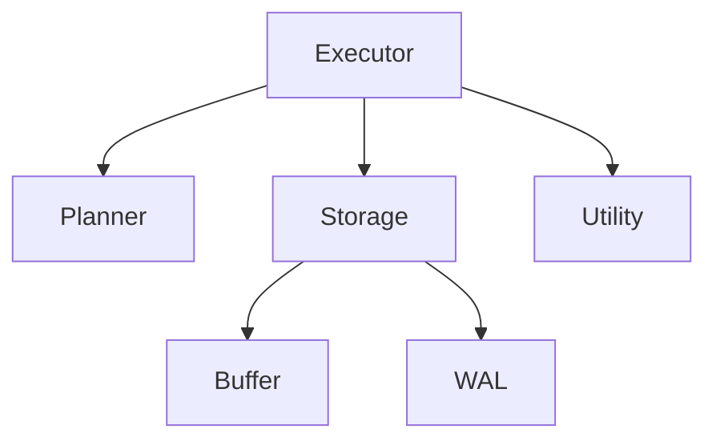

**Use when:** module hierarchy or curated function hierarchy matters.

**Do not call this a call graph unless the arrows are specifically “calls”.** A structure chart may be architectural or organizational.

---

### 3.3 Flowchart

**Question:** How does one operation execute?

Traditional/manual:

```text
Start
  |
Lookup
  |
Found?
 /    \
Y      N
|      |
Use   Allocate
 \     /
  Result
```

Mermaid:

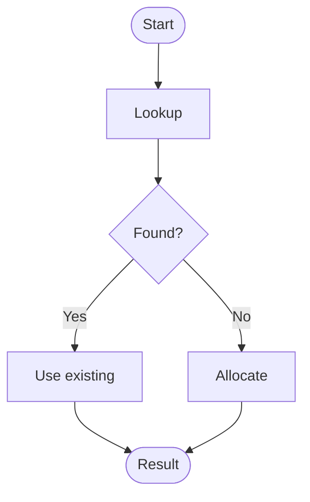

**Traditional advantages:** precise routing and manual placement for complex branch-heavy algorithms.

**Traditional disadvantages:** very expensive to maintain for changing code.

**Mermaid advantages:** concise, diffable, and naturally embedded beside the source explanation.

**Mermaid disadvantages:** dense graphs can become visually tangled; semantics may collapse into generic nodes/edges.

**Agent rule:** Use Flowchart when the reader's core question is “what happens next?” rather than “what objects exist?”.

---

### 3.4 Nassi–Shneiderman / Structured Flow

**Question:** What is the structured control construct?

Traditional/manual:

```text
+----------------------------------+
| if (found)                      |
+----------------+-----------------+
| use existing   | allocate        |
|                | new buffer      |
+----------------+-----------------+
```

Mermaid does not provide a canonical Nassi–Shneiderman notation. Approximate it with a flowchart:

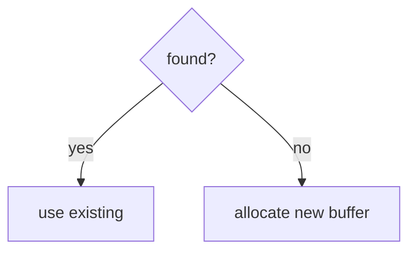

**Agent rule:** If the historical NS semantics themselves matter, use a dedicated drawing or documentation tool. If the goal is ordinary source comprehension, use Mermaid flowchart and do not label it “Nassi–Shneiderman”.

---

### 3.5 HIPO

**Question:** What is the module hierarchy, and what are its input/process/output boundaries?

Traditional/manual:

```text
System
 |
 +-- BufferLookup
       Input: BufferTag
       Process: hash + lookup
       Output: BufferDesc
```

Mermaid approximation plus table:

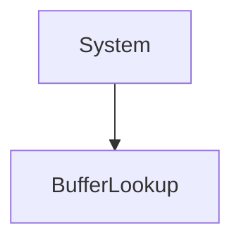

| Module | Input | Process | Output |
|---|---|---|---|
| `BufferLookup` | `BufferTag` | hash + lookup | `BufferDesc` |

**Agent rule:** HIPO is mainly useful when reading legacy structured-design documentation or when IPO itself is the learning target. Do not force HIPO into every source note.

---

### 3.6 Data Flow Diagram

**Question:** How does information move between processes/stores?

Traditional/manual:

```text
Client --> Parser --> Executor --> Buffer Pool --> Disk
                         |
                         v
                       Tuple
```

Mermaid approximation:

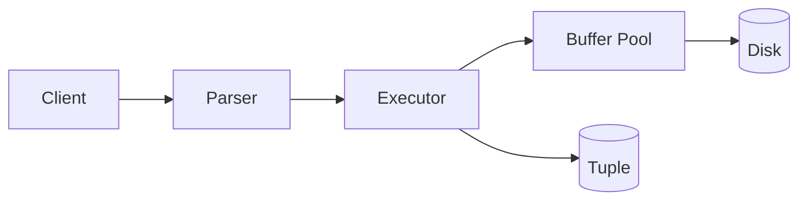

**Agent rule:** use for conceptual data movement. If exact compiler dataflow or variable-level propagation is required, use a static-analysis/dataflow representation instead.

---

### 3.7 State Diagram

**Question:** What states exist and what causes transitions?

Traditional/manual:

```text
FREE --allocate--> VALID --modify--> DIRTY --flush--> CLEAN
  ^                                             |
  +-------------------release------------------+
```

Mermaid:

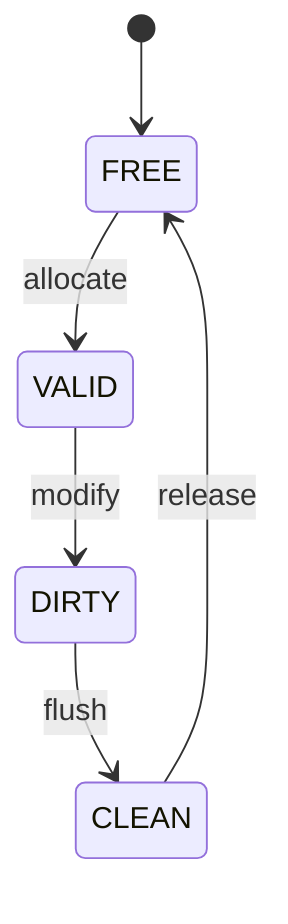

**Traditional advantages:** formal state notation, custom guards/actions, excellent for large state models.

**Mermaid advantages:** compact, readable in source control, natural in Markdown.

**Agent rule:** only use a state diagram when transitions are backed by actual state predicates, flag combinations, or transition code. An enum list alone is insufficient.

---

### 3.8 Sequence Diagram

**Question:** How do multiple actors/objects interact over time?

Traditional/manual:

```text
Backend       LockManager       WaitQueue
   |               |                |
   | acquire       |                |
   |-------------->|                |
   |               | conflict       |
   |               |--------------->|
   |               |                | enqueue
   |               |<---------------|
   |<--------------|                |
   | wait          |                |
```

Mermaid:

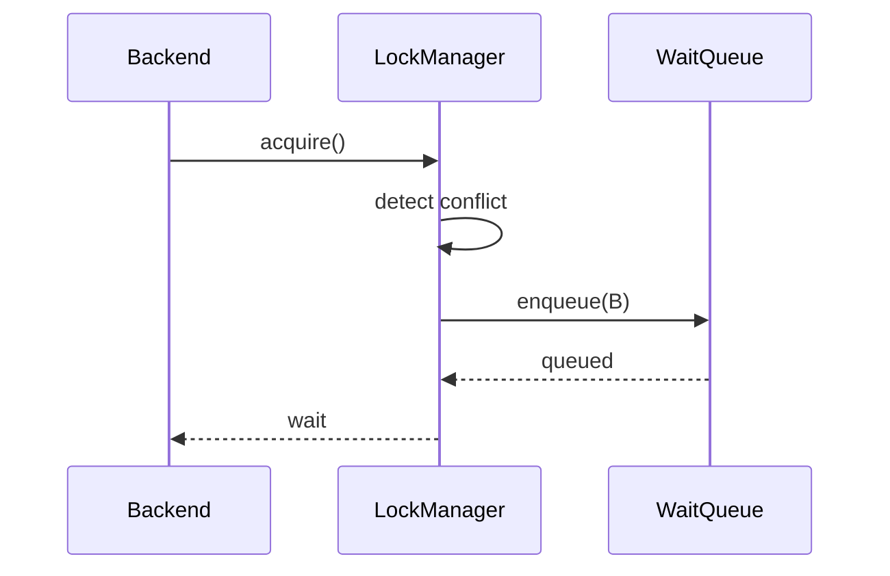

**Agent rule:** choose sequence when ordering between actors is central. Do not replace a pure object topology diagram with a sequence diagram.

---

### 3.9 Activity / Parallel Flow

**Question:** What does a workflow do, including parallel branches?

Traditional/manual:

```text
Request
  |
  +--> Read metadata ----+
  |                      |
  +--> Read page --------+--> Join --> Execute
```

Mermaid approximation:

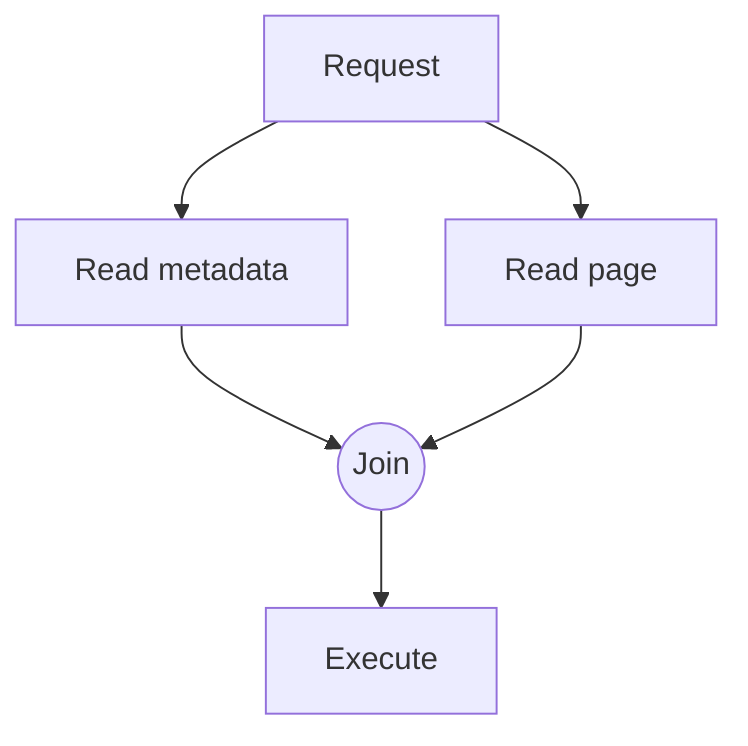

**Agent rule:** use only when parallelism is semantically real. A pair of arrows does not prove concurrent execution.

---

### 3.10 Petri Net

**Question:** How do concurrent token/resource conditions interact?

Traditional/formal:

```text
[Free buffer] --allocate--> (Buffer in use)
      ^                           |
      |--------release------------|
```

A true Petri Net would distinguish places, transitions, and tokens explicitly.

Mermaid adaptation:

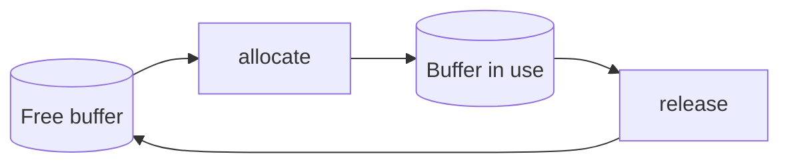

**Important:** this is a teaching approximation, not a canonical Petri Net.

**Agent rule:** use formal Petri Net tooling when token semantics, reachability, deadlock analysis, or synchronization correctness is the actual question. Do not fake Petri Net semantics with a generic flowchart.

---

### 3.11 Call Graph

**Question:** Who calls whom?

Traditional/static-analysis output:

```text
LockAcquire
  +-- LockAcquireExtended
       +-- SetupLockInTable
       +-- GrantLock
```

Mermaid for a deliberately small bounded path:

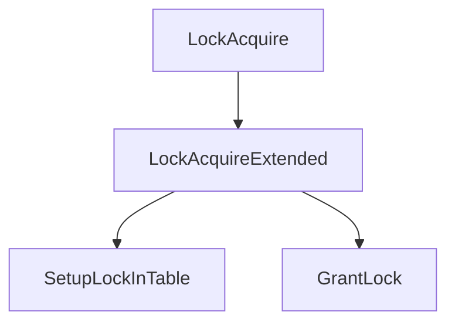

**Traditional/tool advantages:** scales better when generated from compiler/index data and can show thousands of nodes.

**Mermaid disadvantages:** manual curation becomes misleading at scale and does not replace a static call-graph tool.

**Agent rule:** For source navigation, prefer a small curated call path. For exhaustive analysis, use a call-graph/static-analysis tool.

---

### 3.12 Control-Flow Graph (CFG)

**Question:** What execution paths are possible inside one function?

Traditional/compiler:

```text
Entry -> A -> B -> Exit
          \
           -> C -/
```

Mermaid approximation:

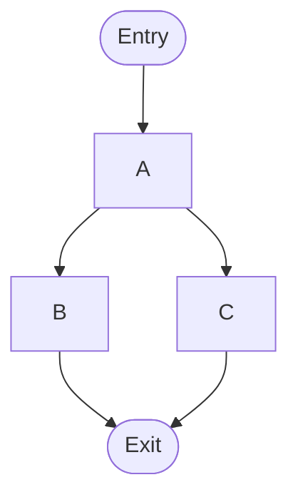

**Agent rule:** use a real CFG when basic blocks, dominance, SSA, compiler optimization, or exact path analysis matters. Use Mermaid only for a human-level explanation of a small function.

---

### 3.13 Data-flow Graph

**Question:** How does a value move through transformations?

Traditional/static-analysis:

```text
BufferTag -> hashvalue -> partition -> bucket -> BufferDesc
```

Mermaid:

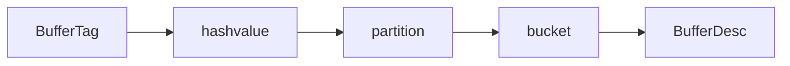

**Agent rule:** distinguish “data path” from “dataflow analysis”. For conceptual source notes use this Mermaid form; for variable-level compiler analysis, use a generated dataflow graph.

---

### 3.14 Dependency Graph

**Question:** Which modules/files/types depend on which others?

Traditional/tool:

```text
executor -> storage -> buffer
executor -> catalog
```

Mermaid:

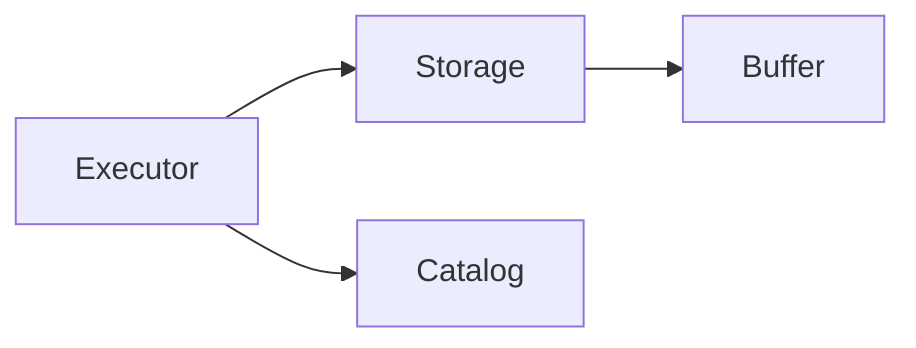

**Agent rule:** Mermaid is good for a curated dependency slice, not for a whole-repository dependency graph with hundreds/thousands of nodes.

---

### 3.15 Component / Architecture Diagram

**Question:** What subsystem boundary and dependency direction matter here?

Traditional/manual:

```text
+-----------+       +-----------+
| Executor  | ----> | Storage   |
+-----------+       +-----------+
                           |
                           v
                      +---------+
                      | Buffer  |
                      +---------+
```

Mermaid flowchart:

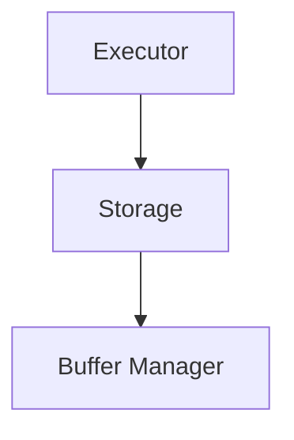

Current Mermaid also has an `architecture-beta` diagram syntax for service/resource-style architecture views. It is most useful for architecture documentation rather than low-level struct graphs.

**Agent rule:** use architecture views at module/subsystem granularity. Do not mix function-level implementation nodes into the architecture diagram.

---

### 3.16 Deployment Diagram

**Question:** Where do processes/components run?

Traditional/manual:

```text
+------------------- Host -------------------+
|                                             |
|   CPU0       CPU1       DB Process          |
|                         |                   |
+-------------------------|-------------------+
                          |
                       Network
```

Mermaid approximation:

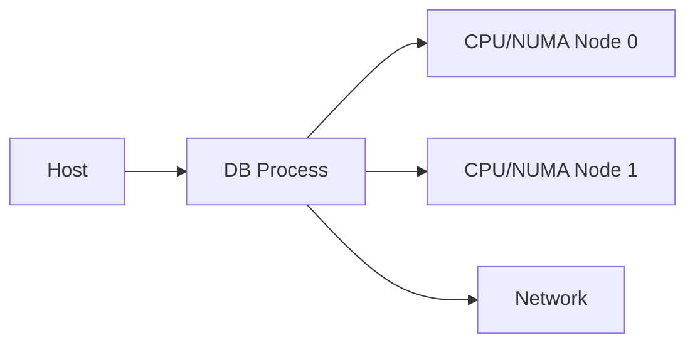

**Agent rule:** if exact UML deployment semantics are required, prefer a UML-capable tool. For source-reading notes, a simplified architecture/deployment map is enough.

---

### 3.17 Memory Layout Diagram

**Question:** What does the object physically look like in memory?

Traditional/custom:

```text
BufferDesc
+----------------------+
| tag                  | offset 0
+----------------------+
| state                | offset 16
+----------------------+
| content_lock         | offset 24
+----------------------+
```

Mermaid approximation:

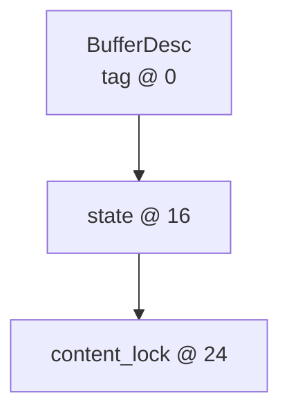

**Traditional advantages:** exact offsets, byte widths, cache-line boundaries, annotations.

**Mermaid disadvantages:** poor physical-layout semantics and weak control of exact dimensions.

**Agent rule:** use a custom/table/SVG-like representation when alignment, cache lines, padding, or ABI layout is the actual question.

---

### 3.18 Ownership Graph

**Question:** Who owns, borrows, retains, releases, or references the object?

Traditional/custom:

```text
MemoryContext --owns--> Object
Caller -------borrows-> Object
RefHolder ----retains-> Object
```

Mermaid:

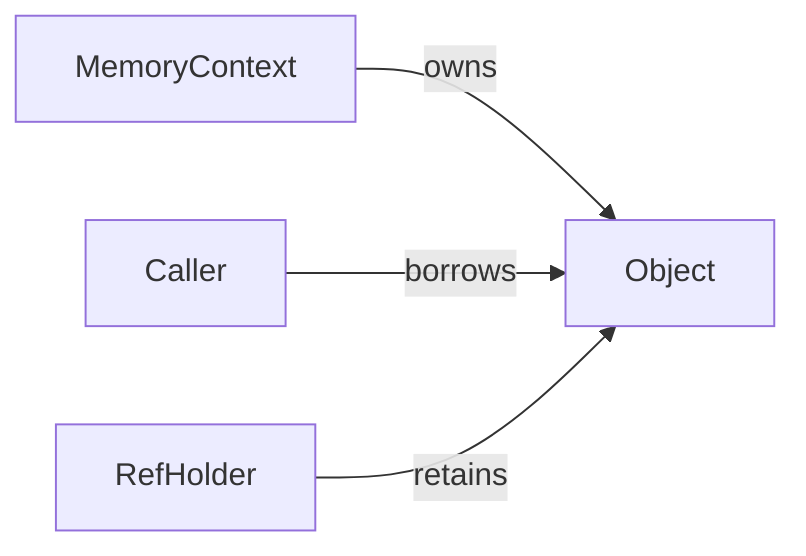

**Agent rule:** only draw `owns` when supported by allocation/free, RAII, refcount, explicit ownership transfer, or equivalent evidence. A raw pointer alone means `points-to` or `references`, not `owns`.

---

### 3.19 Synchronization / Concurrency Graph

**Question:** Who accesses shared state, what protects it, and who waits for whom?

Traditional/custom:

```text
Thread A ----access----> SharedState <----access---- Thread B
                              ^
                              |
                           protected by
                              |
                            Lock X
```

Mermaid:

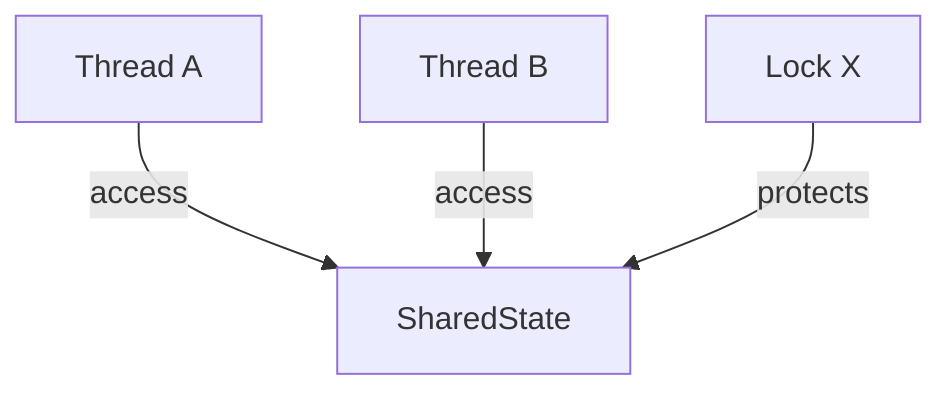

For temporal waiting, prefer a sequence diagram:

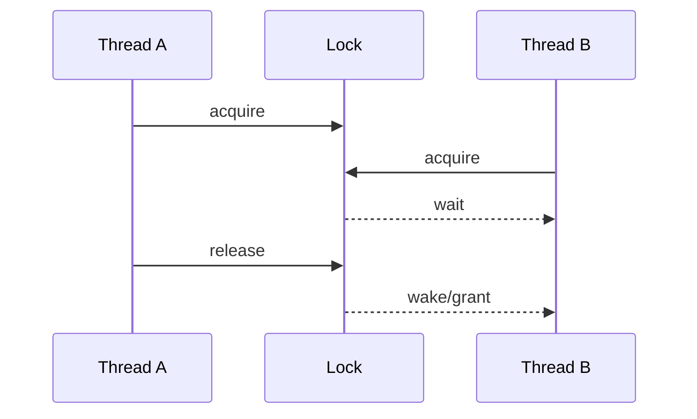

**Agent rule:** use the protection graph for “who protects what”; use sequence for “what happens over time”.

---

### 3.20 Resource / Cache / Index Map

**Question:** How is a large set of resources found, allocated, reused, or evicted?

Traditional/custom:

```text
BufferTag -> Hash -> Partition -> Bucket -> BufferDesc
                                      |
                                   pin/free
```

Mermaid:

```mermaid
flowchart LR
    Tag[BufferTag] --> Hash[Hash]
    Hash --> Part[Partition]
    Part --> Bucket[Bucket]
    Bucket --> Desc[BufferDesc]
    Desc -->|pin/unpin| State[Buffer state]
```

**Agent rule:** this is more useful than a generic struct graph when the data structure's management policy is itself the topic.

---

### 3.21 Failure / Recovery Diagram

**Question:** What happens after failure, and how is correctness restored?

Traditional/manual:

```text
Allocate A -> Allocate B -> B fails -> cleanup A -> return error
```

Mermaid:

```mermaid
flowchart TD
    A[Allocate A] --> B[Allocate B]
    B --> C{Success?}
    C -->|Yes| Done([Continue])
    C -->|No| Cleanup[Cleanup A]
    Cleanup --> Error([Return error])
```

**Agent rule:** emphasize partial state, cleanup, rollback, retry, or recovery—not merely “error returned”.

---

### 3.22 Timeline

**Question:** What happened when, usually across versions/events rather than one execution path?

Traditional/manual:

```text
v1 ---- v2 -------- v3
 |       |           |
A       B           C
```

Mermaid:

```mermaid
timeline
    title Feature evolution
    v1 : Initial implementation
    v2 : Added fast path
    v3 : Changed lock strategy
```

**Agent rule:** use only when chronology itself is the question. Do not substitute a timeline for runtime execution flow. Timeline syntax can be version-sensitive; validate in the target Mermaid environment.

---

### 3.23 Mind Map

**Question:** What concepts branch from a topic?

Traditional/manual:

```text
                 Buffer Manager
                 /      |       \
             Lookup   State   Replacement
               |        |          |
             Hash     Pin      Victim
```

Mermaid:

```mermaid
mindmap
  root((Buffer Manager))
    Lookup
      Hash
    State
      Pin
    Replacement
      Victim
```

**Agent rule:** use for onboarding or chapter overview only. Mind maps are poor substitutes for precise source semantics. Mermaid documents mindmaps as an experimental syntax, so version-check before use.

---

## 4. When traditional drawing should win

Use a visual/manual or specialized formal tool when one or more of these are true:

1. Exact notation semantics matter.
2. The diagram must encode physical geometry, ABI layout, byte offsets, cache lines, or deployment topology precisely.
3. The graph is generated from static analysis and too large for hand-curated Mermaid.
4. A formal method such as Petri Net, UML deployment, NS diagram, or legacy HIPO/JSP semantics is itself part of the deliverable.
5. Fine-grained layout is critical to avoid ambiguity.
6. The diagram will be maintained by people who do not work comfortably with text-based diagram syntax.

---

## 5. When Mermaid should win

Use Mermaid by default for source-reading notes when:

1. The diagram is small and conceptually curated.
2. The source names should remain visible and grep-friendly.
3. The note is stored in Markdown/Git.
4. The diagram will evolve with source understanding.
5. The semantics fit flowchart, sequence, class, state, ER, or architecture syntax.
6. The goal is explanation/navigation rather than formal model verification.

---

## 6. When not to draw at all

Use prose/table/code instead when:

```text
facts are few
+ relations are trivial
+ no temporal/state/concurrency complexity exists
```

Typical examples:

- a struct with 3–5 self-explanatory fields;
- a function with a single straight-line path;
- a list of constants;
- a simple API contract;
- a single invariant.

The agent must not generate a diagram merely to make a note look sophisticated.

---

## 7. Agent decision tree

```text
Start
  |
  +-- Is the main question about entities/relationships?
  |       +-- yes -> Entity/ER/Class/Management view
  |
  +-- Is the main question about execution order/branches?
  |       +-- yes -> Flowchart / Activity / bounded CFG
  |
  +-- Is the main question about state transitions?
  |       +-- yes -> State diagram
  |
  +-- Is the main question about object lifetime/ownership?
  |       +-- yes -> Lifecycle + Ownership view
  |
  +-- Is the main question about actor interaction over time?
  |       +-- yes -> Sequence diagram
  |
  +-- Is the main question about data movement/transformation?
  |       +-- yes -> Data Path / DFD-style flow
  |
  +-- Is the main question about resource lookup/reuse/eviction?
  |       +-- yes -> Resource/Management graph
  |
  +-- Is the main question about shared state/protection/waiting?
  |       +-- yes -> Synchronization graph + optional Sequence
  |
  +-- Is the main question about module boundaries?
  |       +-- yes -> Architecture/Component view
  |
  +-- Is the main question about failure/recovery?
  |       +-- yes -> Recovery/Failure flow
  |
  +-- Is the main question about exact memory geometry or formal semantics?
  |       +-- yes -> specialized/traditional visual tool
  |
  +-- otherwise -> prose/table/code; no diagram
```

---

## 8. Combination rules

A chapter can contain a maximum of one **primary** diagram family and usually zero to two secondary diagrams.

Good combinations:

```text
Object model
  + Lifecycle
```

```text
Concurrency graph
  + Sequence
```

```text
Resource map
  + Lookup flow
```

```text
Architecture
  + Data path
```

Bad combinations:

```text
Call graph + Flowchart + Sequence + CFG
```
when all four are merely showing the same short function path.

The agent must identify the unique information contributed by each view. If a second diagram does not add information that cannot be obtained from the first, remove it.

---

## 9. Mermaid-specific constraints

1. Preserve real source names as node labels.
2. Prefer semantic edge labels when the relation matters.
3. Keep the core diagram around 5–12 meaningful nodes; split larger views by question.
4. Do not rely on auto-layout to communicate semantics that are not explicit in labels/edges.
5. Do not encode ownership, protection, or concurrency merely through shape/color; make the relation explicit.
6. Keep Mermaid version compatibility in mind.
7. Validate the Mermaid syntax in the target renderer before shipping when the environment supports rendering.
8. Never claim a Mermaid approximation is a canonical UML/ER/NS/Petri Net diagram unless the notation is actually being used with that semantic model.

---

## 10. Quality checklist

Before accepting a diagram, ask:

- What single question does this diagram answer?
- Is its semantic method explicit?
- Does every important edge have a justified meaning?
- Are nodes at one reasonably consistent abstraction level?
- Does the diagram contain only the nodes needed for the question?
- Could prose/table explain this more clearly?
- Is Mermaid sufficient, or is a specialized/formal visual tool required?
- Can a reader map important labels back to source symbols?
- Is any conclusion encoded visually that the source evidence does not support?

EOF

cat > "$ROOT/references/representation/representation-policy.md" <<'EOF'
# Representation Policy

## 1. Principle

Representation is selected from the **question + pattern + evidence**, not from the syntax encountered in the source.

```text
Source Knowledge
    ↓
Core Question
    ↓
Dominant Pattern
    ↓
Representation Family
    ↓
Concrete diagram / table / prose / code
```

A representation must add information. Do not draw a diagram just because the document contains structs, pointers, locks, or branches.

## 2. Representation families

### Structural family

Best for:

```text
Who/what is connected?
Who contains/references/manages whom?
```

Typical forms:

- Entity Relationship / ER
- Class Diagram
- Structure Chart
- Management / Ownership graph
- Dependency graph

### Control family

Best for:

```text
What happens next?
Where do branches and loops go?
```

Typical forms:

- Flowchart
- Activity diagram
- bounded CFG
- Nassi–Shneiderman-style structured flow

### State / lifecycle family

Best for:

```text
What state is the object in?
How does it enter/leave states?
How does the object live from creation to destruction?
```

Typical forms:

- State diagram
- Lifecycle diagram
- State table

### Interaction family

Best for:

```text
Which actors interact, and in what order?
```

Typical forms:

- Sequence diagram
- synchronization sequence

### Data family

Best for:

```text
Where does data come from?
How is it transformed or handed off?
```

Typical forms:

- DFD-style view
- Data path
- data-flow graph

### Resource family

Best for:

```text
How are resources located, allocated, reused, evicted, reclaimed?
```

Typical forms:

- management map
- resource graph
- cache/index map

### Architecture family

Best for:

```text
Where is this subsystem?
Where are the boundaries and dependencies?
```

Typical forms:

- Component view
- Layer view
- architecture diagram
- deployment view

### Failure family

Best for:

```text
What fails and how does the system return to a valid state?
```

Typical forms:

- recovery flow
- failure path
- rollback map

### Implementation-geometry family

Best for:

```text
What is the exact memory/layout/physical structure?
```

Typical forms:

- memory layout diagram
- cache-line map
- byte/offset table
- custom vector/SVG diagram

## 3. Traditional vs Mermaid policy

### Mermaid is preferred when

- the diagram is small and curated;
- source names are important navigation anchors;
- the note lives in Markdown/Git;
- easy textual review/diff matters;
- the semantics fit Mermaid's native diagram types.

### Traditional/specialized tooling is preferred when

- exact visual geometry is itself semantic;
- the graph is too large for a curated note;
- static-analysis output must be exhaustive;
- formal notation semantics matter;
- specialized UML/Petri/CFG/ABI/layout notation is required.

Mermaid should be treated as a **rendering option**, not as the semantic model.

## 4. Primary/secondary rule

The representation plan should contain:

```yaml
primary:
  family:
  type:
  question:
secondary:
  - family:
    type:
    question:
```

Use one primary view and usually 0–2 secondary views.

## 5. No-diagram rule

Prefer prose/table/code when:

- there are only a few facts;
- there is no non-trivial topology;
- there is no temporal relation;
- there is no meaningful state transition;
- a diagram would merely repeat the paragraph.

## 6. Evidence rule

Every semantic edge that implies more than direct syntax must be traceable.

Examples:

```text
A -> B
```
may mean `points-to`, `references`, `calls`, `owns`, `manages`, `produces`, or `protects`.

The agent must select the exact predicate supported by evidence.

## 7. Historical notation rule

When a source-reading note uses a simplified Mermaid representation of a historical method, name the semantic goal accurately:

> “DFD-style data path”

rather than:

> “canonical DFD”

Likewise:

> “CFG-like teaching view”

rather than:

> “formal CFG”.

This prevents visual resemblance from being mistaken for semantic equivalence.

EOF

cat > "$ROOT/references/patterns/pattern-catalog.md" <<'EOF'
# Pattern Catalog

Patterns describe the **dominant comprehension question**. They do not prescribe a specific diagram language.

## Structural / Topology

Question: Which entities exist and how are they connected?

Strong signals:

- struct/class definitions
- pointer/reference fields
- embedded structures
- containers
- manager/object relationships

Best representations:

- Entity Relationship / Class / Structure Chart
- Management/Ownership graph when responsibility is central

Avoid:

- calling a generic relation graph a Flowchart

## Lifecycle / Ownership

Question: How is an object created, acquired, transferred, released, and destroyed?

Strong signals:

- allocation/free
- constructor/destructor
- palloc/pfree
- retain/release
- refcount
- pin/unpin
- register/unregister

Best representations:

- Lifecycle view
- Ownership graph
- state diagram as secondary

## Flow / Pipeline

Question: How does one operation execute?

Strong signals:

- branch conditions
- main/fallback path
- loops/retries
- cleanup path
- important call chain

Best representations:

- Flowchart
- Activity-style flow
- bounded CFG for deep implementation work

## State Machine

Question: What states exist, how are they represented, and what triggers transitions?

Strong signals:

- state/status field
- flags
- enum + switch
- composite predicates
- state-specific behavior

Best representations:

- State diagram
- state table

## Concurrency / Synchronization

Question: Who shares state, who protects it, who waits, and who wakes?

Strong signals:

- mutex/rwlock/spinlock/LWLock
- atomic/CAS/barrier
- wait queue
- shared/global state
- lock ordering

Best representations:

- protection graph
- sequence diagram
- bounded wait-for/resource graph

## Data Path / Transformation

Question: How does data move and change representation?

Strong signals:

- copy/move/reference
- serialization
- conversion/materialization
- producer/consumer
- buffer handoff

Best representations:

- Data Path
- DFD-style flow
- dataflow graph for deep implementation work

## Resource / Cache / Index

Question: How are many resources found, allocated, reused, evicted, or reclaimed?

Strong signals:

- hash/index
- bucket
- freelist
- cache
- victim/evict
- pool
- lookup/allocate/reclaim

Best representations:

- Resource/Management map
- index map
- lifecycle/state as secondary

## Recovery / Error / Consistency

Question: What happens when the normal path fails, and how is correctness restored?

Strong signals:

- goto cleanup
- rollback
- retry
- recovery/replay
- partial initialization
- transactional undo

Best representations:

- failure/recovery flow
- state diagram if partial states matter

## Architecture / Subsystem Boundary

Question: Where is this module in the system, and what is its interface/dependency boundary?

Strong signals:

- public headers
- module APIs
- callbacks
- registration
- subsystem init/shutdown
- dependency direction

Best representations:

- architecture/component view
- layer view
- dependency graph

## Selection heuristic

1. Identify the Core Question.
2. Identify the dominant knowledge density.
3. Pick one Dominant Pattern.
4. Add only secondary patterns that explain information not covered by the primary view.
5. Select a representation family.
6. Select Mermaid or specialized/manual rendering based on the representation-policy rules.

Do not classify from a keyword alone.

Examples:

```text
struct + pointers + manager
→ likely Structural

struct + malloc/free + refcount
→ Lifecycle/Ownership may dominate

if/switch/loop around one operation
→ Flow

enum + many transition writers + state-specific branches
→ State

lock + shared field + wait queue
→ Concurrency

hash + bucket + victim + reclaim
→ Resource
```

EOF

cat > "$ROOT/README.md" <<'EOF'
# Source Code Reading Skill

Portable Agent Skill for large C/C++ source-code understanding.

## Unified six-stage execution

```text
1. Scope & Explore
2. Knowledge Model
3. Pattern Recognition
4. Traceability
5. Representation & Document
6. Validation & Orchestration
```

## What this skill does

```text
Source
  ↓
Scope & Explore
  ↓
Knowledge Model
  ↓
Pattern Recognition
  ↓
Claim / Evidence / Trace
  ↓
Representation Plan
  ↓
Document
  ↓
Validation
```

The skill is designed around the idea that a source-reading note is a **projection of a verified knowledge graph**, not a linear summary of files.

## Diagram selection

The skill now includes a historical diagram catalog with:

- examples for classic and source-oriented diagram families;
- traditional/manual vs Mermaid trade-offs;
- rules for choosing Mermaid vs specialized/formal drawing;
- rules for when not to draw anything;
- a decision tree that an Agent can execute.

See:

- `references/diagrams/diagram-catalog.md`
- `references/representation/representation-policy.md`
- `references/patterns/pattern-catalog.md`

## Modes

- **Explore** — investigate source and return findings.
- **Model** — build/update the knowledge model.
- **Document** — generate a reading note from the model.
- **Review** — check existing notes against source evidence.

EOF

# Update SKILL.md with the diagram selection section and link it from stage 5.
python3 - <<'PY'
from pathlib import Path
p = Path('/mnt/data/source-code-reading-skill/SKILL.md')
s = p.read_text()
needle = '## Diagram policy\n'
insert = '''## Diagram and representation selection\n\nUse the diagram catalog before selecting a visual form. The catalog maps historical diagramming methods and modern source-reading views to the questions they answer, and explains when Mermaid is sufficient versus when a specialized/manual diagram is preferable.\n\nSee `references/diagrams/diagram-catalog.md` for concrete examples and decision rules.\n\n### Required selection sequence\n\n```text\nCore Question\n   ↓\nDominant Pattern\n   ↓\nRepresentation Family\n   ↓\nConcrete Diagram Type\n   ↓\nMermaid vs specialized/manual\n```\n\nNever jump directly from `struct`, `if`, `lock`, or `enum` to a diagram type.\n\n### Representation families\n\n- **Structural** — entity/relationship, class, structure, management, ownership, dependency.\n- **Control** — flowchart, activity, bounded CFG, structured flow.\n- **State/Lifecycle** — state diagram, lifecycle, state table.\n- **Interaction** — sequence and synchronization views.\n- **Data** — DFD-style path, data path, dataflow.\n- **Resource** — cache/index/resource-management maps.\n- **Architecture** — component/layer/deployment views.\n- **Failure** — recovery/rollback/error paths.\n- **Implementation geometry** — memory layout, cache-line, byte/offset views.\n\n### Mermaid default\n\nPrefer Mermaid when the diagram is a small, curated explanatory view stored with Markdown/Git and its semantics fit Mermaid's diagram types. Prefer specialized/manual tooling when formal notation, exact geometry, exhaustive static-analysis output, or physical layout is the actual requirement. Mermaid is a rendering option, not the semantic model.\n\n### Diagram-or-no-diagram gate\n\nBefore drawing, ask:\n\n1. What single question does this visual answer?\n2. Does it encode information that prose/table would make harder to see?\n3. Is the graph small enough to remain readable?\n4. Are the edge semantics supported by source evidence?\n5. Is Mermaid sufficiently expressive, or is a specialized tool required?\n\nIf the answers do not justify a diagram, use prose/table/code instead.\n\n'''
if needle in s and '## Diagram and representation selection' not in s:
    s = s.replace(needle, insert + needle)
p.write_text(s)
PY

# Add diagram references section near end if not present.
cat >> "$ROOT/SKILL.md" <<'EOF'

## Diagram reference map

The canonical diagram decision rules for this skill live in:

```text
references/diagrams/diagram-catalog.md
references/representation/representation-policy.md
```

When generating a new diagram-heavy note, consult the catalog first rather than inventing a new diagram type.
EOF

# Create a sample representation decision file covering the examples.
cat > "$ROOT/examples/representation-selection.yaml" <<'EOF'
version: 0.1
examples:
  - subject: TupleTableSlot
    question: "核心对象如何组织，以及 tuple/value storage 如何挂在 Slot 上？"
    dominant_pattern: Structural
    secondary_patterns: [Lifecycle, DataPath]
    representation:
      primary: EntityRelationship
      secondary: [Lifecycle, DataPath]
      renderer: Mermaid
    traditional_when: "关系图需要大量手工布局、精确符号或非常复杂的注释时。"
    evidence_targets: [TupleTableSlot, tts_tuple, tts_values, ExecStoreHeapTuple, ExecClearTuple]

  - subject: BufferLookup
    question: "BufferTag 如何定位到 BufferDesc？"
    dominant_pattern: Resource
    secondary_patterns: [Structural, Concurrency]
    representation:
      primary: ResourceManagementMap
      secondary: [EntityRelationship, Concurrency]
      renderer: Mermaid
    traditional_when: "需要展示非常大的真实 hash/table 结构或精确内存/布局时。"
    evidence_targets: [BufferTag, BufTable, BufferDesc, BufTableHashCode, BufMappingPartitionLock]

  - subject: LockAcquire
    question: "lock request 如何判断冲突并进入 granted 或 waiting？"
    dominant_pattern: Concurrency
    secondary_patterns: [Flow, State, Structural]
    representation:
      primary: SynchronizationGraph
      secondary: [Sequence, Flow, State]
      renderer: Mermaid
    traditional_when: "需要正式并发模型、复杂等待图或可达性/死锁分析时。"
    evidence_targets: [LockAcquire, SetupLockInTable, GrantLock, WaitOnLock]

  - subject: BufferDesc
    question: "BufferDesc 在内存中如何布局？"
    dominant_pattern: Structural
    secondary_patterns: []
    representation:
      primary: MemoryLayout
      secondary: []
      renderer: SpecializedOrManual
    traditional_when: "默认；如果 ABI/offset/cache-line 是问题，普通 Mermaid 不足以表达。"
    evidence_targets: [BufferDesc, state, tag, content_lock]
EOF

# Validate basic structure and YAML.
python3 - <<'PY'
from pathlib import Path
import yaml, re
root=Path('/mnt/data/source-code-reading-skill')
required=[
 'SKILL.md','README.md',
 'references/diagrams/diagram-catalog.md',
 'references/representation/representation-policy.md',
 'references/patterns/pattern-catalog.md',
 'examples/representation-selection.yaml'
]
for f in required:
    p=root/f
    assert p.exists(), f
    assert p.stat().st_size > 0, f
yaml.safe_load((root/'examples/representation-selection.yaml').read_text())
text=(root/'SKILL.md').read_text()
for x in ['Scope & Explore','Knowledge Model','Pattern Recognition','Traceability','Representation & Document','Validation & Orchestration','diagram-catalog.md']:
    assert x in text, x
print('validation: OK')
print('files:', sum(1 for _ in root.rglob('*') if _.is_file()))
PY

# Rebuild zip
rm -f /mnt/data/source-code-reading-skill-v0.2.zip
(cd /mnt/data && zip -qr source-code-reading-skill-v0.2.zip source-code-reading-skill)
ls -lh /mnt/data/source-code-reading-skill-v0.2.zip
```

> ⚠️ 工具返回被 ChatGPT 标记为 redacted：`The output of this plugin was redacted.`


### 🤖 ChatGPT

我发现现有目录和之前导出的 ZIP 内容并不完全一致：目录里只剩少量文件。为了避免给你一个“看似完整、实际缺文件”的 Skill，我会以已有 ZIP 的完整版本为基线重新构建 v0.2，再把图法体系合进去。


### 🛠 工具调用 · `container.exec`

```bash
bash -lc set -e
rm -rf /mnt/data/source-code-reading-skill-v02
mkdir -p /mnt/data/source-code-reading-skill-v02
unzip -q /mnt/data/source-code-reading-skill-v0.1.zip -d /mnt/data/source-code-reading-skill-v02
ROOT=/mnt/data/source-code-reading-skill-v02/source-code-reading-skill
# Ensure new dirs
mkdir -p "$ROOT/references/diagrams"
# show stage section boundaries for targeted edits
sed -n '1,240p' "$ROOT/SKILL.md" | tail -n 30
printf '\n--- line count inventory before ---\n'
find "$ROOT" -type f | sort | xargs -r wc -l
```

> ⚠️ 工具返回被 ChatGPT 标记为 redacted：`The output of this plugin was redacted.`


### 🛠 工具调用 · `container.exec`

```bash
bash -lc grep -n '^##\|^### Stage\|^# ' /mnt/data/source-code-reading-skill-v02/source-code-reading-skill/SKILL.md | sed -n '1,120p'; echo '--- representation current ---'; cat /mnt/data/source-code-reading-skill-v02/source-code-reading-skill/references/representation/representation-policy.md
```

> ⚠️ 工具返回被 ChatGPT 标记为 redacted：`The output of this plugin was redacted.`


### 🛠 工具调用 · `container.exec`

```bash
bash -lc set -e
ROOT=/mnt/data/source-code-reading-skill-v02/source-code-reading-skill
cat > "$ROOT/SKILL.md" <<'EOF'
---
name: source-code-reading
version: 0.2.0
description: >-
  A general-purpose skill for understanding large C/C++ codebases by
  transforming source code into a traceable knowledge model, identifying the
  dominant comprehension pattern, selecting an appropriate representation
  method (including historical diagram families and Mermaid/manual tools),
  generating navigable source-reading notes, and validating the result.
---

# Source Code Reading Skill

## Purpose

Turn large C/C++ source trees into **verifiable, navigable knowledge**, not merely summaries.

The skill follows one unified six-stage execution model:

```text
1. Scope & Explore
        ↓
2. Knowledge Model
        ↓
3. Pattern Recognition
        ↓
4. Traceability
        ↓
5. Representation & Document
        ↓
6. Validation & Orchestration
```

The final document must help a reader:

1. build a mental model;
2. verify important claims against source;
3. continue reading the source independently.

## Core philosophy

The skill is a **source-understanding pipeline**, not a Markdown generator:

```text
Source
  ↓
Source Context
  ↓
Knowledge Model
  ↓
Pattern Profile
  ↓
Claim / Evidence / Trace
  ↓
Representation Plan
  ↓
Document
  ↓
Validation
  ↓
Back to Source
```

The durable internal asset is the **knowledge graph + trace map**. Markdown and diagrams are projections of that model.

## Non-goals

Do not:

- summarize files linearly unless requested;
- treat a call graph as an execution flow automatically;
- infer ownership from a pointer merely because a pointer exists;
- infer design intent from a function name alone;
- invent state machines from enums without transitions;
- generate diagrams merely because diagrams are available;
- use Mermaid as a semantic substitute for a formal notation it does not actually implement;
- hide uncertainty behind confident prose;
- expand into unrelated modules just to appear comprehensive.

## Operating rules

### Rule 1 — Never jump directly from source to document

The agent must conceptually pass through all six stages even if some intermediate artifacts are kept internal.

### Rule 2 — Scope before depth

Define the current question and boundary before expanding the source context.

### Rule 3 — Explore by unknowns

Every exploration step should answer a concrete unresolved question.

### Rule 4 — Build a model before choosing a diagram

A `struct`, `if`, `lock`, `enum`, or pointer is evidence, not a diagram instruction.

### Rule 5 — One dominant pattern

Select exactly one dominant comprehension pattern and zero or more secondary patterns.

### Rule 6 — Claims require evidence

Every substantial semantic claim should have source evidence or be explicitly marked `UNVERIFIED`.

### Rule 7 — Separate epistemic status

Use:

- `FACT` — directly supported by source;
- `INFERENCE` — derived from multiple facts;
- `INTERPRETATION` — likely rationale/design explanation.

### Rule 8 — Preserve source identity

Prefer:

```text
repository + revision/commit/tag + path + symbol + field/code region
```

over line numbers alone.

### Rule 9 — Stop tracing when the claim is proven

Do not trace the entire call tree. Stop when the claim is sufficiently supported or the boundary is reached.

### Rule 10 — Representation follows the question

The agent must select a representation family before selecting a concrete diagram syntax.

```text
Core Question
    ↓
Dominant Pattern
    ↓
Representation Family
    ↓
Concrete Diagram Type
    ↓
Mermaid vs specialized/manual
```

### Rule 11 — Mermaid is a renderer, not the model

A Mermaid diagram can express a curated source-reading view. It does not automatically become canonical UML, ER, Petri Net, CFG, HIPO, JSP, or another formal notation merely by resembling it.

### Rule 12 — Graph, prose, and code must divide the work

```text
Graph → structure/path/change/interaction
Prose → semantics/conditions/consequences
Code → source evidence/navigation
```

### Rule 13 — Preserve source names

Use exact names such as `BufferDesc`, `BufferAlloc()`, `ExecStoreHeapTuple()` whenever useful so the document remains grep-friendly.

### Rule 14 — Validate before finalizing

Run structural, semantic, traceability, representation, and reader/navigation checks.

---

# Six-stage execution

## Stage 1 — Scope & Explore

### Objective

Answer:

```text
What exactly am I trying to understand?
Which source is relevant?
Where should I stop?
```

### Scope

Define:

```text
subject
core_questions[]
reader/depth
included_modules[]
excluded_modules[]
```

### Explore

Build the initial source search space:

```text
Target symbol
  ↓
Definition
  ↓
Direct references
  ↓
Related fields/structs
  ↓
Relevant callers/callees
  ↓
State/lifecycle/synchronization clues
  ↓
Cross-module only when needed
```

Typical operations:

```text
find symbol
find definition
find references
find callers/callees
find field readers/writers
find allocation/free
find lock acquire/release
find atomic access
find state checks/transitions
find registration/unregistration
```

### Context expansion rule

Use the smallest context that resolves the current unknown:

```text
L0 Target
→ L1 Definition
→ L2 Direct references
→ L3 Related structures
→ L4 Relevant control flow
→ L5 Runtime/synchronization
→ L6 Cross-module
```

### Output

`SourceContext`.

See `references/tracing/exploration-policy.md`.

---

## Stage 2 — Knowledge Model

### Objective

Convert source observations into structured knowledge.

Core types:

```text
Entity
Relation
Flow
State
Lifecycle
Concurrency
Constraint
Claim
Evidence
Trace
```

### Entity categories

```text
Source Entity:
  file / function / struct / class / field / enum / macro / variable

Runtime Entity:
  process / thread / coroutine / task / buffer / page / lock / request

Resource Entity:
  memory / CPU / file / buffer / queue / shared memory / connection

Subsystem Entity:
  Buffer Manager / Lock Manager / WAL / Executor / Storage
```

### Relation categories

```text
Structural:
  contains / embeds / points-to / references / inherits

Management:
  owns / manages / allocates / tracks / indexes / caches

Dependency:
  calls / uses / depends-on / invokes / modifies

Runtime:
  produces / consumes / associated-with / dispatches

Concurrency:
  protects / waits-for / synchronized-by / owns-lock / updates-atomically
```

### Behavior categories

```text
Flow
State
Lifecycle
```

### Constraint categories

```text
Precondition
Postcondition
Invariant
OwnershipRule
OrderingRule
ConcurrencyRule
ErrorRule
```

### Claim model

```yaml
claim:
  statement:
  type: FACT | INFERENCE | INTERPRETATION
  confidence: HIGH | MEDIUM | LOW
  evidence: []
  trace: []
  scope:
```

### Evidence model

```yaml
evidence:
  id:
  kind: definition | access | mutation | control_flow | call |
        lifecycle | synchronization | comment | design_doc
  source:
    repository:
    revision:
    path:
    symbol:
    field:
    code_region:
    line_range:
  demonstrates:
```

### Important distinction

Do not collapse:

```text
pointer/reference
```
into:

```text
ownership
```

Do not collapse:

```text
enum
```
into:

```text
state machine
```

Do not collapse:

```text
call graph
```
into:

```text
execution flow
```

Output: `KnowledgeModel`.

See `references/knowledge-model.md`.

---

## Stage 3 — Pattern Recognition

### Objective

Answer:

> What is the primary comprehension problem?

Supported patterns:

```text
Structural / Topology
Lifecycle / Ownership
Flow / Pipeline
State Machine
Concurrency / Synchronization
Data Path / Transformation
Resource / Cache / Index
Recovery / Error / Consistency
Architecture / Subsystem Boundary
```

### Pattern profile

```yaml
pattern_profile:
  core_question:
  dominant:
    name:
    reason:
  secondary:
    - name:
      reason:
```

### Recognition rule

Do not classify from keywords alone.

Instead evaluate:

```text
What does the reader need to know to understand this code?
What knowledge type is densest?
What relation/time/state/concurrency dimension is dominant?
```

Examples:

```text
struct + pointers + manager
→ Structural may dominate

malloc/free + refcount + retain/release
→ Lifecycle may dominate

branch-heavy one-operation path
→ Flow may dominate

enum + transition writers + state-specific behavior
→ State may dominate

shared fields + locks + wait queues
→ Concurrency may dominate

hash + bucket + victim + reuse/eviction
→ Resource may dominate
```

Output: `PatternProfile`.

See `references/patterns/pattern-catalog.md`.

---

## Stage 4 — Traceability

### Objective

Make every important semantic claim auditable:

```text
Claim
  ↓
Evidence
  ↓
Source Anchor
  ↓
Trace (when needed)
```

### Trace directions

```text
Definition
Usage / Readers
Mutation / Writers
Call
Data
Lifecycle
Synchronization
```

### Trace depth

```text
D1 Local
D2 Structural
D3 System
```

Use the minimum depth needed to prove the claim.

### Trace expansion loop

```text
Claim
 ↓
Can current source prove it?
 ├─ yes → stop
 └─ no  → inspect relevant field/callee/caller/manager/lock
              ↓
           retry proof
```

### Trace failure

If evidence is insufficient:

```text
UNVERIFIED
```

Do not fill the gap with a plausible story.

### Design-intent rule

For “why” questions use:

```text
FACT
  ↓
Observed constraint
  ↓
Consequence
  ↓
Possible interpretation
```

Do not turn a possible motivation into a fact without supporting evidence.

See:

- `references/tracing/trace-policy.md`
- `references/tracing/claim-verification.md`

Output: `TraceMap`.

---

## Stage 5 — Representation & Document

### Objective

Project the verified knowledge model into the smallest set of useful human-facing views.

### Required selection sequence

```text
Core Question
   ↓
Dominant Pattern
   ↓
Representation Family
   ↓
Concrete Diagram Type
   ↓
Traditional/manual vs Mermaid vs specialized tool
```

### Representation families

```text
Structural
  → Entity/ER/Class/Structure/Management/Ownership/Dependency

Control
  → Flowchart/Activity/structured flow/bounded CFG

State/Lifecycle
  → State diagram/Lifecycle/State table

Interaction
  → Sequence/Synchronization

Data
  → DFD-style/Data Path/Dataflow

Resource
  → Resource/Cache/Index/Management map

Architecture
  → Component/Layer/Architecture/Deployment

Failure
  → Recovery/Rollback/Error flow

Implementation geometry
  → Memory layout/Cache-line/Offset/ABI view
```

### Primary/secondary rule

Use:

```text
1 primary view
+ usually 0–2 secondary views
```

Each secondary view must add information not already provided by the primary view.

### Diagram/no-diagram gate

Before drawing ask:

1. What single question does this visual answer?
2. Does it expose structure, path, state, time, data, or concurrency better than prose/table?
3. Is the graph small enough to remain readable?
4. Are the important edge semantics source-supported?
5. Does Mermaid express the semantics adequately?

If not, use prose/table/code or a specialized visual tool.

### Mermaid vs traditional/manual

Prefer **Mermaid** when:

- the view is small and curated;
- source names are important navigation anchors;
- the note lives in Markdown/Git;
- textual diff/review matters;
- the semantics fit Mermaid's supported diagram types.

Prefer **traditional/manual/specialized tooling** when:

- exact geometry is itself semantic;
- the graph is exhaustive or very large;
- static-analysis output is required;
- formal notation semantics matter;
- physical memory/ABI/deployment geometry must be precise;
- a formal model such as Petri Net is the deliverable.

See `references/diagrams/diagram-catalog.md` for the full catalog, examples, and selection rules.

### Document skeleton

Adapt to the dominant pattern; do not generate empty boilerplate.

```text
# Title

> Core Question

## 一句话模型

## 1. 核心对象

## 2. 核心行为

## 3. 关键状态 / 生命周期

## 4. 并发与约束

## 5. 关键实现

## 6. 源码导读

## 7. 关键结论

## 8. 下一步阅读
```

### Layering

Prefer three depths:

```text
L1 Mental Model
L2 Core Implementation
L3 Deep Dive
```

A reader should be able to stop at L1 or L2 without needing L3.

### Graph/prose/code division

```text
Graph = relation/path/transition/interaction
Prose = meaning/condition/consequence
Code = evidence and navigation
```

Avoid repeating the exact same content three times.

### Source snippets

Use short snippets to show one important:

```text
definition
key branch
state mutation
synchronization boundary
ownership transfer
cleanup/error path
```

The snippet must have a semantic explanation after it.

### Source navigation

Substantial chapters should identify:

```text
Current concept
  ↓
Current symbol
  ↓
Next symbol
  ↓
Why this is the next hop
```

Output: `Document` plus internal `RepresentationPlan`.

See:

- `references/representation/representation-policy.md`
- `references/diagrams/diagram-catalog.md`
- `references/document-policy.md`

---

## Stage 6 — Validation & Orchestration

### Objective

Verify both the document and the process, and decide whether to re-enter an earlier stage.

### Validation order

```text
V1 Structural
V2 Semantic
V3 Traceability
V4 Representation
V5 Reader / Navigation
```

### V1 Structural

Check:

```text
Core Question exists
Mental Model exists
Primary View exists if a view is justified
Source Navigation exists for substantial notes
Key Conclusions exist
```

### V2 Semantic

Check:

```text
relations are real
ownership is evidenced
state transitions are real
locks are mapped to protected state
copy/reference semantics are correct
parallelism is evidenced rather than guessed
```

### V3 Traceability

Every important claim must resolve:

```text
Claim → Evidence → Source
```

Otherwise mark `UNVERIFIED` or remove the claim.

### V4 Representation

Check:

```text
Primary view matches dominant pattern
No unnecessary diagrams
No diagram wall
No graph/prose duplication
No Call Graph = Flow mistake
No State = Lifecycle mistake
No generic pointer = Ownership mistake
```

### V5 Reader / Navigation

Ask:

```text
Does a first-time reader know what this is?
Do they know the core entities and relations?
Do they understand the primary behavior?
Do they know key states/lifecycle/concurrency constraints?
Can they find the source?
Do they know the next symbol to read?
```

### Re-entry policy

```text
Missing source/evidence
    → Stage 1 or Stage 4

Wrong semantic model
    → Stage 2

Wrong pattern
    → Stage 3

Poor representation/document
    → Stage 5

Only validation/coordination issue
    → remain in Stage 6
```

Use a bounded revision loop; normally 2–3 iterations are enough.

### Orchestration rule

The orchestrator controls the six stages but does not require six separate agents.

Recommended implementation:

```text
One orchestrator
+
modular rule files
+
shared intermediate model
```

---

# Internal intermediate model

A minimal internal model may be represented as:

```yaml
source_context:
  repository:
  revision:
  subject:
  core_questions: []
  included_modules: []
  excluded_modules: []
  symbols: []

knowledge:
  entities: []
  relations: []
  flows: []
  states: []
  lifecycles: []
  concurrency: []
  constraints: []
  claims: []
  evidence: []
  traces: []

pattern_profile:
  core_question:
  dominant:
    name:
    reason:
  secondary: []

representation:
  primary:
    family:
    type:
    question:
    renderer: mermaid | manual | specialized | prose | table
  secondary: []
  source_anchors: []
  snippets: []
  exclusions: []
```

This is an internal contract, not a requirement to expose YAML to the user.

---

# Diagram selection quick reference

Use this compact mapping first:

| Core question | Preferred family | Typical representation |
|---|---|---|
| Who/what is connected? | Structural | Entity/ER/Class/Management |
| Who owns/manages what? | Lifecycle/Resource | Ownership/Management |
| What happens next? | Control | Flowchart/Activity |
| What state is it in? | State | State diagram |
| Who interacts with whom over time? | Interaction | Sequence |
| How does data move/change? | Data | Data Path/DFD-style |
| How are resources found/reused/evicted? | Resource | Resource/Index/Cache map |
| What protects/waits/updates shared state? | Concurrency | Synchronization + Sequence |
| Where is the subsystem boundary? | Architecture | Component/Layer/Architecture |
| What happens on failure? | Failure | Recovery flow |
| What is the exact object layout? | Implementation geometry | Memory/offset/cache-line diagram |
| None of the above | — | Prose/table/code |

For historical methods, formal semantics, and Mermaid/manual trade-offs, read `references/diagrams/diagram-catalog.md`.

---

# Source-reading modes

## Explore

Investigate source and return structured findings. Do not generate polished prose unless requested.

## Model

Build or update the knowledge model.

## Document

Generate a reading note from an existing/new model.

## Review

Audit an existing note against source evidence, especially diagrams, claims, source anchors, and stale symbols.

---

# Incremental knowledge

When prior knowledge exists:

```text
Existing Knowledge Graph
        +
New Source Exploration
        ↓
Merge
        ↓
Update
        ↓
Validate
```

Prefer stable entity identities such as:

```text
<repository>::<qualified symbol>
```

Examples:

```text
postgresql::BufferDesc
postgresql::BufferAlloc()
```

Avoid creating duplicate entities for the same source symbol.

Maintain `open_questions` and `conflicts` when useful:

```yaml
open_questions:
  - question:
    importance:
    related_symbols: []
    status: open | investigating | resolved

conflicts:
  - description:
    evidence_a: []
    evidence_b: []
    status: unresolved | resolved
```

---

# Completion criteria

A substantial source-reading note is complete only when:

```text
[ ] Scope is explicit
[ ] Core question is clear
[ ] Knowledge model is internally coherent
[ ] Dominant pattern is explicit
[ ] Important claims have evidence
[ ] Diagram choice is justified or diagram use is intentionally rejected
[ ] Diagram semantics are source-supported
[ ] Source anchors are usable
[ ] Key implementation points are shown with short snippets when helpful
[ ] Reader can continue from the note into the source
[ ] Validation passes
```

The final product is a **knowledge projection that points back to source**, not a replacement for source code.
EOF

cat > "$ROOT/references/diagrams/diagram-catalog.md" <<'EOF'
# Diagram Catalog for C/C++ Source Reading

## 1. Purpose

This catalog translates historical software-engineering diagramming traditions into a decision aid for a source-reading agent.

The distinction is:

```text
Semantic method
    ↓
Representation family
    ↓
Concrete renderer
```

“Traditional/manual” means a visual editor or specialized notation/tool such as Visio, draw.io, PowerPoint, a UML editor, a static-analysis visualizer, a whiteboard, or a custom vector/SVG diagram. Mermaid is a text-based renderer. The two are not automatically semantically equivalent.

## 2. Master selection table

| Method | Main question | Good C/C++ use | Traditional/manual strengths | Mermaid strengths | Mermaid weaknesses | Default |
|---|---|---|---|---|---|---|
| Entity / ER | What entities exist and how do they relate? | structs/classes/runtime objects | Precise custom notation and layout | Versionable, grep-friendly labels | Less exact semantics and layout control | Mermaid for small curated views |
| Structure Chart | How is module/function hierarchy organized? | subsystem or curated call hierarchy | Mature hierarchy notation | Easy small hierarchy | Not a canonical structure-chart language | Mermaid for docs; specialized tool for large graphs |
| Flowchart | How does control proceed? | operation flow, branches, retries | Excellent manual routing/annotation | Native, compact, diffable | Dense graphs can tangle | Mermaid |
| Nassi–Shneiderman | What is the structured control construct? | small structured algorithms | Formal structured-program semantics | Can approximate via flowchart | No canonical NS syntax | Specialized/manual if NS semantics matter |
| HIPO | What are hierarchy and input/process/output? | legacy structured design docs | Strong historical method | Can combine flowchart + table | No direct HIPO semantics | Legacy/formal only |
| DFD | How does information move among processes/stores? | DB/network/storage data path | Formal data/process/store notation | Good conceptual data path | No dedicated canonical DFD notation | Mermaid flow/data-path |
| JSP/JSD | How does data/entity structure influence process structure? | legacy record/data-centric systems | Formal method when required | Poor fit | No native JSP/JSD | Use only when method itself matters |
| State Diagram | What states exist and how do transitions occur? | state fields, flags, protocol states | Formal and expressive | Native state syntax | Version/rendering details can vary | Mermaid |
| Sequence Diagram | How do actors interact over time? | calls, waits, callbacks, RPC | Precise temporal layout | Native and concise | Very long traces become tall | Mermaid |
| Activity Diagram | What is the workflow, including branches/parallelism? | executor/control workflows | Formal UML semantics | Flowchart often sufficient | Not a perfect UML activity replacement | Mermaid flowchart unless formal UML required |
| Petri Net | How do concurrency/resource tokens synchronize? | queues, resource sharing, formal concurrency | Strong semantics and analysis | Can only be approximated with generic graphs | Approximation can mislead | Specialized/formal tool |
| Call Graph | Who calls whom? | source navigation | Static-analysis tools scale well | Good for small curated paths | Not exhaustive at repository scale | Static-analysis tool for large graphs |
| CFG | What control paths are possible inside a function? | compiler/perf/debug work | Exact block/edge semantics | Fine for teaching small paths | Not a real CFG engine | CFG tool for exact analysis |
| Data-flow Graph | How does a value propagate? | compiler/dataflow/storage pipeline | Exact analysis possible | Good conceptual data path | Not exact variable-level analysis | Mermaid for teaching; tool for analysis |
| Dependency Graph | What depends on what? | module/file/type dependencies | Generated tools scale well | Good small curated dependency slice | Large graph becomes unreadable | Tool for scale; Mermaid for curated view |
| Component / Architecture | What are subsystem boundaries/dependencies? | DB/storage/network architecture | Strong governance/documentation semantics | Architecture/flow views are easy to maintain | Fine-grained custom layout limited | Mermaid for reading notes |
| Deployment | Where do processes run? | host/CPU/NUMA/network | Precise formal deployment geometry | Can approximate simple views | No canonical UML deployment renderer | Specialized/manual when exact |
| Memory Layout | What is the physical object layout? | offsets, padding, cache lines, ABI | Exact geometry | Simple box/path illustration only | Weak physical-layout control | Specialized/manual/table |
| Ownership Graph | Who owns/borrows/releases? | RAII, refcount, malloc/free | Arbitrary semantic arrows/layout | Good for small source maps | No built-in ownership type system | Mermaid for small maps |
| Synchronization Graph | Who protects/waits/updates shared state? | locks, atomics, wait queues | Custom precision | Flowchart + sequence work well | No dedicated synchronization notation | Mermaid + source evidence |
| Resource/Cache Map | How are resources located/reused/evicted? | buffers, caches, indexes, pools | Great custom maps | Easy bounded conceptual map | Large runtime structures overwhelm it | Mermaid for curated map |
| Failure/Recovery | What happens after failure? | rollback, cleanup, retry, recovery | Flexible | Native flowchart support | Complex recovery state may need more views | Mermaid |
| Timeline | What changed when? | project/version/history context | Easy custom chronology | Text-defined chronology | Not a runtime flow model | Table/prose first |
| Mind Map | What concepts branch from a topic? | onboarding only | Intuitive free-form layout | Native text syntax | Weak semantic precision | Sparingly |

## 3. Detailed examples

### 3.1 Entity / Relationship Map

**Question:** Who are the core entities and how are they connected?

Traditional/manual:

```text
+-------------------+       contains        +----------------+
| TupleTableSlot    |---------------------->| values[]       |
+-------------------+                        +----------------+
          |
          | references
          v
+-------------------+
| HeapTuple         |
+-------------------+
```

Mermaid:

```mermaid
flowchart LR
    Slot[TupleTableSlot]
    Values[values[]]
    Tuple[HeapTuple]
    Slot -->|contains| Values
    Slot -->|references| Tuple
```

Traditional/manual is better for arbitrary notation, precise edge styling, or complex layout. Mermaid is better for Git/Markdown maintenance and source-name navigation. Mermaid is weaker when edge semantics require many visual conventions.

**Use when:** the main question is “who/what is connected to whom?”.

**Do not use when:** the main question is execution order.

---

### 3.2 Structure Chart

**Question:** How is program/module hierarchy organized?

Traditional/manual:

```text
                   Executor
                      |
          +-----------+-----------+
          |           |           |
       Planner      Storage      Utility
                       |
                 +-----+-----+
                 |           |
              Buffer        WAL
```

Mermaid:

```mermaid
flowchart TB
    Executor --> Planner
    Executor --> Storage
    Executor --> Utility
    Storage --> Buffer
    Storage --> WAL
```

**Use when:** hierarchy/organization matters.

**Do not call it a call graph unless the edge semantics are actually “calls”.**

---

### 3.3 Flowchart

**Question:** How does one operation execute?

Traditional/manual:

```text
Start
  |
Lookup
  |
Found?
 /    \
Y      N
|      |
Use   Allocate
 \     /
  Result
```

Mermaid:

```mermaid
flowchart TD
    Start([Start]) --> Lookup[Lookup]
    Lookup --> Found{Found?}
    Found -->|Yes| Use[Use existing]
    Found -->|No| Alloc[Allocate]
    Use --> Result([Result])
    Alloc --> Result
```

Mermaid is excellent when flow is small and frequently revised. Manual diagrams win when routing, annotations, and geometry are the central semantic content.

**Use when:** the core question is “what happens next?”.

---

### 3.4 Nassi–Shneiderman / Structured Flow

Traditional/manual structured notation:

```text
+----------------------------------+
| if (found)                      |
+----------------+-----------------+
| use existing   | allocate        |
|                | new buffer      |
+----------------+-----------------+
```

Mermaid approximation:

```mermaid
flowchart TD
    Found{found?}
    Found -->|yes| Use[use existing]
    Found -->|no| Alloc[allocate new buffer]
```

**Important:** the Mermaid view is a flowchart approximation, not canonical Nassi–Shneiderman notation.

**Use formal/manual NS** only when NS semantics are part of the deliverable or legacy documentation being preserved. Otherwise use a normal Mermaid flowchart.

---

### 3.5 HIPO

Traditional/manual:

```text
System
 |
 +-- BufferLookup
       Input: BufferTag
       Process: hash + lookup
       Output: BufferDesc
```

Mermaid + table approximation:

```mermaid
flowchart TB
    System --> BufferLookup[BufferLookup]
```

| Module | Input | Process | Output |
|---|---|---|---|
| `BufferLookup` | `BufferTag` | hash + lookup | `BufferDesc` |

**Use:** mainly for legacy structured-design reading or when IPO itself is the topic.

---

### 3.6 Data Flow Diagram

Traditional/manual:

```text
Client --> Parser --> Executor --> Buffer Pool --> Disk
                         |
                         v
                       Tuple
```

Mermaid approximation:

```mermaid
flowchart LR
    Client[Client] --> Parser[Parser]
    Parser --> Executor[Executor]
    Executor --> Buffer[Buffer Pool]
    Buffer --> Disk[(Disk)]
    Executor --> Tuple[(Tuple)]
```

**Use:** conceptual data movement among processes/stores/components.

**Do not call a variable-level compiler dataflow graph a DFD.**

---

### 3.7 State Diagram

Traditional:

```text
FREE --allocate--> VALID --modify--> DIRTY --flush--> CLEAN
  ^                                             |
  +-------------------release------------------+
```

Mermaid:

```mermaid
stateDiagram-v2
    [*] --> FREE
    FREE --> VALID: allocate
    VALID --> DIRTY: modify
    DIRTY --> CLEAN: flush
    CLEAN --> FREE: release
```

**Use when:** state predicates and transitions are actually supported by source.

**Do not use when:** you only found an enum and have not traced transitions.

---

### 3.8 Sequence Diagram

Traditional:

```text
Backend       LockManager       WaitQueue
   |               |                |
   | acquire       |                |
   |-------------->|                |
   |               | conflict       |
   |               |--------------->|
   |               |                | enqueue
   |               |<---------------|
   |<--------------|                |
   | wait          |                |
```

Mermaid:

```mermaid
sequenceDiagram
    participant B as Backend
    participant L as LockManager
    participant Q as WaitQueue
    B->>L: acquire()
    L->>L: detect conflict
    L->>Q: enqueue(B)
    Q-->>L: queued
    L-->>B: wait
```

**Use when:** time/order between several actors is central.

**Prefer Flow** when the same actors are not important and only the path is.

---

### 3.9 Activity / Parallel Flow

Traditional:

```text
Request
  |
  +--> Read metadata ----+
  |                      |
  +--> Read page --------+--> Join --> Execute
```

Mermaid approximation:

```mermaid
flowchart TB
    Request[Request] --> Meta[Read metadata]
    Request --> Page[Read page]
    Meta --> Join((Join))
    Page --> Join
    Join --> Execute[Execute]
```

**Important:** multiple arrows do not prove parallel execution. Source evidence must establish concurrency or independent scheduling.

---

### 3.10 Petri Net

Formal/manual semantics distinguish places, transitions, and tokens. A real Petri Net might model:

```text
[Free buffer] --allocate--> (Buffer in use)
       ^                          |
       |---------release----------|
```

Mermaid approximation:

```mermaid
flowchart LR
    Free[(Free buffer)] --> Allocate[allocate]
    Allocate --> InUse[(Buffer in use)]
    InUse --> Release[release]
    Release --> Free
```

**This Mermaid version is a teaching approximation, not a canonical Petri Net.**

**Use specialized/formal Petri Net tooling** when token semantics, reachability, deadlock, or synchronization correctness is the actual subject.

---

### 3.11 Call Graph

Static-analysis style:

```text
LockAcquire
  +-- LockAcquireExtended
       +-- SetupLockInTable
       +-- GrantLock
```

Mermaid for a small curated path:

```mermaid
flowchart TD
    A[LockAcquire] --> B[LockAcquireExtended]
    B --> C[SetupLockInTable]
    B --> D[GrantLock]
```

**Use a static-analysis-generated graph** when exhaustiveness matters. Mermaid is for a small teaching/navigation slice.

---

### 3.12 Control-Flow Graph

Traditional/compiler:

```text
Entry -> A -> B -> Exit
          \
           -> C -/
```

Mermaid teaching approximation:

```mermaid
flowchart TD
    Entry([Entry]) --> A[A]
    A --> B[B]
    A --> C[C]
    B --> Exit([Exit])
    C --> Exit
```

**Use a real CFG tool** when basic blocks, dominance, compiler optimization, or exact path analysis matters.

---

### 3.13 Data-flow Graph

Traditional/static-analysis:

```text
BufferTag -> hashvalue -> partition -> bucket -> BufferDesc
```

Mermaid conceptual view:

```mermaid
flowchart LR
    Tag[BufferTag] --> Hash[hashvalue]
    Hash --> Part[partition]
    Part --> Bucket[bucket]
    Bucket --> Desc[BufferDesc]
```

Use Mermaid for conceptual source-reading. Use analysis tooling for exact variable/value propagation.

---

### 3.14 Dependency Graph

Traditional/tool-generated:

```text
executor -> storage -> buffer
executor -> catalog
```

Mermaid curated slice:

```mermaid
flowchart LR
    Executor --> Storage
    Storage --> Buffer
    Executor --> Catalog
```

**Use tool-generated graphs for repository-scale dependencies.** Mermaid is appropriate for the small dependency slice needed for one chapter.

---

### 3.15 Component / Architecture

Traditional/manual:

```text
+-----------+       +-----------+
| Executor  | ----> | Storage   |
+-----------+       +-----------+
                           |
                           v
                      +---------+
                      | Buffer  |
                      +---------+
```

Mermaid:

```mermaid
flowchart TB
    Executor[Executor] --> Storage[Storage]
    Storage --> Buffer[Buffer Manager]
```

Recent Mermaid versions also document an `architecture-beta` syntax for architecture views. Verify the target Mermaid version before using version-specific syntax.

**Use when:** subsystem boundary/layering matters.

**Do not mix:** function-level implementation nodes into an architecture diagram unless the specific boundary is the question.

---

### 3.16 Deployment

Traditional/manual:

```text
+------------------- Host -------------------+
|                                             |
|   CPU0       CPU1       DB Process          |
|                         |                   |
+-------------------------|-------------------+
                          |
                       Network
```

Mermaid approximation:

```mermaid
flowchart LR
    Host[Host] --> DB[DB Process]
    DB --> CPU0[CPU/NUMA Node 0]
    DB --> CPU1[CPU/NUMA Node 1]
    DB --> Net[Network]
```

Use a specialized/manual representation when deployment geometry or topology is itself semantically important.

---

### 3.17 Memory Layout

Traditional/custom:

```text
BufferDesc
+----------------------+
| tag                  | offset 0
+----------------------+
| state                | offset 16
+----------------------+
| content_lock         | offset 24
+----------------------+
```

Mermaid approximation:

```mermaid
flowchart TB
    A["BufferDesc\ntag @ 0"] --> B["state @ 16"] --> C["content_lock @ 24"]
```

**Traditional/custom wins** for exact offsets, width, padding, cache-line boundaries, and ABI layout. Mermaid is only a simplified teaching representation.

---

### 3.18 Ownership Graph

Traditional/custom:

```text
MemoryContext --owns--> Object
Caller -------borrows-> Object
RefHolder ----retains-> Object
```

Mermaid:

```mermaid
flowchart LR
    MC[MemoryContext] -->|owns| O[Object]
    Caller[Caller] -->|borrows| O
    Holder[RefHolder] -->|retains| O
```

**Critical rule:** raw pointers do not prove ownership. Ownership needs evidence such as allocation/free, RAII, explicit ownership transfer, refcount, or equivalent lifecycle semantics.

---

### 3.19 Synchronization / Concurrency Graph

Traditional/custom:

```text
Thread A ----access----> SharedState <----access---- Thread B
                              ^
                              |
                           protected by
                              |
                            Lock X
```

Mermaid:

```mermaid
flowchart TB
    A[Thread A] -->|access| S[SharedState]
    B[Thread B] -->|access| S
    L[Lock X] -->|protects| S
```

For ordering/waiting, use a sequence view:

```mermaid
sequenceDiagram
    participant A as Thread A
    participant L as Lock
    participant B as Thread B
    A->>L: acquire
    B->>L: acquire
    L-->>B: wait
    A->>L: release
    L-->>B: wake/grant
```

Use the first view for “who protects what”; use the second for “what happens over time”.

---

### 3.20 Resource / Cache / Index Map

Traditional/custom:

```text
BufferTag -> Hash -> Partition -> Bucket -> BufferDesc
                                      |
                                   pin/free
```

Mermaid:

```mermaid
flowchart LR
    Tag[BufferTag] --> Hash[Hash]
    Hash --> Part[Partition]
    Part --> Bucket[Bucket]
    Bucket --> Desc[BufferDesc]
    Desc -->|pin/unpin| State[Buffer state]
```

Use when the central question is how many resources are located, allocated, reused, evicted, or reclaimed.

---

### 3.21 Failure / Recovery

Traditional/manual:

```text
Allocate A -> Allocate B -> B fails -> cleanup A -> return error
```

Mermaid:

```mermaid
flowchart TD
    A[Allocate A] --> B[Allocate B]
    B --> C{Success?}
    C -->|Yes| Done([Continue])
    C -->|No| Cleanup[Cleanup A]
    Cleanup --> Error([Return error])
```

Focus on partial state and restoration, not merely “an error is returned”.

---

### 3.22 Timeline

Traditional/manual:

```text
v1 ---- v2 -------- v3
 |       |           |
A       B           C
```

Mermaid:

```mermaid
timeline
    title Feature evolution
    v1 : Initial implementation
    v2 : Added fast path
    v3 : Changed lock strategy
```

Use only when chronology/history is the question. Do not use a timeline for runtime execution flow.

---

### 3.23 Mind Map

Traditional/manual:

```text
                 Buffer Manager
                 /      |       \
             Lookup   State   Replacement
               |        |          |
             Hash     Pin      Victim
```

Mermaid:

```mermaid
mindmap
  root((Buffer Manager))
    Lookup
      Hash
    State
      Pin
    Replacement
      Victim
```

Use for onboarding/overview only. It is a weak choice for source-semantics and should not replace relationship, flow, or state diagrams.

## 4. When traditional/manual/specialized should win

Choose a specialized or manual representation when one or more are true:

1. Formal notation semantics are part of the deliverable.
2. Exact geometry is semantic (memory offsets, cache lines, ABI, physical deployment topology).
3. The graph is exhaustive/huge and should be generated from analysis tools.
4. Static analysis rather than human-curated explanation is the main goal.
5. Custom visual encoding is needed to prevent ambiguity.
6. Token/reachability/deadlock semantics or other formal properties need analysis.

## 5. When Mermaid should win

Choose Mermaid when:

1. the view is small and curated;
2. the note is maintained in Markdown/Git;
3. source names should double as navigation anchors;
4. easy textual diff is valuable;
5. the semantic method maps naturally to Mermaid's supported types.

## 6. When no diagram should win

Use prose/table/code when:

```text
facts are few
+ topology is trivial
+ no meaningful state/time/data/concurrency relation exists
```

A diagram that merely restates a two-sentence paragraph is unnecessary.

## 7. Agent decision tree

```text
Start
  |
  +-- Entities/relationships?
  |      -> Structural family
  |
  +-- Execution order/branches?
  |      -> Control family
  |
  +-- State transitions?
  |      -> State family
  |
  +-- Object lifetime/ownership?
  |      -> Lifecycle/Ownership family
  |
  +-- Actors interacting over time?
  |      -> Interaction family
  |
  +-- Data movement/transformation?
  |      -> Data family
  |
  +-- Resource lookup/reuse/eviction?
  |      -> Resource family
  |
  +-- Shared state/protection/waiting?
  |      -> Concurrency family
  |
  +-- Module boundary/dependency?
  |      -> Architecture family
  |
  +-- Failure/recovery?
  |      -> Failure family
  |
  +-- Exact physical layout/formal semantics?
  |      -> specialized/manual tool
  |
  +-- none?
         -> prose/table/code
```

Then choose:

```text
small + curated + Markdown/Git
    → Mermaid

large + exhaustive/static analysis
    → analysis tool

formal/physical/exact notation
    → specialized/manual
```

## 8. Diagram quality checklist

Before accepting any diagram:

- What one question does it answer?
- Is the semantic method explicit?
- Are edge predicates source-supported?
- Are nodes at a consistent abstraction level?
- Is the node count small enough to read?
- Does it add information beyond prose/table?
- Can important labels be mapped directly to source symbols?
- Is Mermaid expressive enough?
- Would a specialized/manual method be more faithful?
- Is any visual conclusion stronger than the source evidence?

EOF

# Update representation policy to point at diagram families and examples.
cat > "$ROOT/references/representation/representation-policy.md" <<'EOF'
# Representation Policy

## 1. Core rule

Representation selection is driven by:

```text
Core Question
  ↓
Dominant Pattern
  ↓
Representation Family
  ↓
Concrete Diagram Type
  ↓
Renderer
```

The renderer is not the semantic model. Mermaid, draw.io, Visio, a UML editor, or a static-analysis tool are presentation choices.

## 2. Pattern → family defaults

| Pattern | Default representation family | Typical primary view |
|---|---|---|
| Structural | Structural | Entity/ER/Class/Management |
| Lifecycle | State/Lifecycle | Lifecycle / Ownership |
| Flow | Control | Flowchart |
| State | State/Lifecycle | State diagram |
| Concurrency | Interaction/Concurrency | Synchronization + Sequence |
| Data Path | Data | Data Path / DFD-style |
| Resource | Resource | Resource/Management/Index |
| Recovery | Failure | Recovery flow |
| Architecture | Architecture | Component/Layer |

## 3. Historical representation map

```text
Structural:
  ER / Class / Structure Chart / Ownership / Dependency

Control:
  Flowchart / NS / Activity / CFG

State:
  State Diagram / State Table / Petri Net (advanced)

Interaction:
  Sequence / Synchronization

Data:
  DFD / Data Path / Dataflow

Architecture:
  Component / Layer / Deployment / C4-style

Resource:
  Cache / Index / Management map

Implementation geometry:
  Memory Layout / Offset / Cache-line map
```

See `references/diagrams/diagram-catalog.md` for detailed examples and Mermaid/manual trade-offs.

## 4. Traditional/manual vs Mermaid

### Mermaid default

Use Mermaid when the diagram is:

- small and curated;
- maintained with Markdown/Git;
- primarily explanatory/navigation-oriented;
- expressible with Mermaid's actual semantics.

Benefits:

- text-based and diffable;
- easy to review with source notes;
- easy to keep source names visible;
- low maintenance cost for small graphs.

Costs:

- auto-layout can be imperfect;
- fine visual control is limited;
- not every historical notation has native Mermaid semantics;
- complex graphs become hard to read.

### Traditional/manual/specialized default

Use it when:

- exact geometry matters;
- formal semantics matter;
- the graph is exhaustive/huge;
- analysis-tool output is required;
- custom notation is needed.

Benefits:

- precise visual control;
- specialized formal semantics;
- better for large generated analysis views.

Costs:

- harder to version/diff as source;
- manual maintenance can drift from code;
- heavier authoring workflow.

## 5. Diagram-or-no-diagram gate

Before generating a diagram, answer:

```text
1. What one question does the diagram answer?
2. Why is a diagram better than prose/table?
3. Which semantic family is correct?
4. Is Mermaid faithful enough?
5. If not, which specialized/manual representation is appropriate?
```

If there is no strong answer, do not draw.

## 6. One primary view

Use exactly one primary visual view when a visual is justified, plus normally 0–2 secondary views.

Each secondary view must provide unique information.

Bad:

```text
Call Graph + Flowchart + Sequence + CFG
```

for one short function if they all show the same path.

Good:

```text
Concurrency graph
+
Sequence diagram
```

when one answers “who protects what?” and the other answers “what happens over time?”.

## 7. Grain control

Target roughly 5–12 meaningful nodes in a core conceptual diagram. Split large graphs by question or abstraction level rather than creating a graph wall.

## 8. Semantic edge rule

Never use an unlabeled arrow when the exact relationship matters.

Prefer:

```text
contains
references
points-to
owns
manages
indexes
calls
produces
consumes
protects
waits-for
```

The predicate must be backed by source evidence.

## 9. Source-name rule

Use source names as node labels:

```text
BufferDesc
BufferAlloc()
TupleTableSlot
```

Add a short semantic gloss only when useful:

```text
BufferDesc
(shared buffer metadata)
```

## 10. Formal-notation caveat

When a Mermaid diagram approximates a historical/formal method, name it honestly:

```text
DFD-style data path
CFG-like teaching view
State diagram
Management graph
```

Do not call a generic flowchart a canonical Petri Net, NS diagram, or UML deployment diagram.

EOF

# Add historical references note in README.
cat > "$ROOT/README.md" <<'EOF'
# Source Code Reading Skill v0.2

Portable Agent Skill for large C/C++ source-code understanding.

## Unified six-stage execution

```text
1. Scope & Explore
2. Knowledge Model
3. Pattern Recognition
4. Traceability
5. Representation & Document
6. Validation & Orchestration
```

## Core idea

This is not a source-to-Markdown summarizer. It builds a traceable knowledge model first, then selects a comprehension pattern and representation.

```text
Source
  ↓
Knowledge Model
  ↓
Pattern
  ↓
Claim / Evidence / Trace
  ↓
Representation
  ↓
Document
  ↓
Validation
```

## Diagram system

The skill includes a dedicated catalog that teaches an Agent:

- historical diagram families and what questions they answer;
- a concrete small example for each major method;
- traditional/manual vs Mermaid strengths and weaknesses;
- when Mermaid is sufficient;
- when a specialized/manual/static-analysis tool should win;
- when no diagram is the correct answer;
- how to distinguish similar-looking methods such as Flow vs Call Graph, State vs Lifecycle, DFD vs Dataflow, and conceptual graphs vs formal models.

Start with:

- `references/diagrams/diagram-catalog.md`
- `references/representation/representation-policy.md`
- `references/patterns/pattern-catalog.md`

## Modes

- **Explore** — source investigation.
- **Model** — build/update the knowledge model.
- **Document** — generate a reading note.
- **Review** — audit an existing note against source evidence.

## Intended first validation targets

The skill is especially suitable for C/C++ systems code such as:

```text
PostgreSQL Buffer Manager
PostgreSQL Lock Manager
TupleTableSlot
Relation / RelationData
Memory Context
```

The first validation goal should be semantic correctness and source traceability, not visual polish.
EOF

# Add a source-method selection example and review a few existing files for stale stages.
cat > "$ROOT/examples/diagram-selection-examples.yaml" <<'EOF'
version: 0.2
examples:
  - subject: TupleTableSlot
    question: "核心对象如何组织，以及 tuple/value storage 如何挂在 Slot 上？"
    dominant_pattern: Structural
    secondary_patterns: [Lifecycle, DataPath]
    primary_representation:
      family: Structural
      method: Entity Relationship / Management View
      renderer: Mermaid
    secondary_representation:
      - family: State/Lifecycle
        method: Lifecycle View
        renderer: Mermaid
      - family: Data
        method: Data Path
        renderer: Mermaid
    why_not_traditional: "关系规模小、文档与 Markdown/Git 共存，维护和 diff 更重要。"

  - subject: BufferLookup
    question: "BufferTag 如何定位到 BufferDesc？"
    dominant_pattern: Resource
    secondary_patterns: [Structural, Concurrency]
    primary_representation:
      family: Resource
      method: Resource/Index Map
      renderer: Mermaid
    secondary_representation:
      - family: Structural
        method: Entity Relationship
        renderer: Mermaid
      - family: Concurrency
        method: Synchronization Graph
        renderer: Mermaid
    traditional_when: "需要展示实际大型 hash/bucket 结构、精确内存布局或静态分析全图。"

  - subject: LockAcquire
    question: "lock request 如何判断冲突并进入 granted 或 waiting？"
    dominant_pattern: Concurrency
    secondary_patterns: [Flow, State, Structural]
    primary_representation:
      family: Interaction/Concurrency
      method: Synchronization Graph
      renderer: Mermaid
    secondary_representation:
      - family: Interaction
        method: Sequence Diagram
        renderer: Mermaid
      - family: Control
        method: Flowchart
        renderer: Mermaid
      - family: State/Lifecycle
        method: State Diagram
        renderer: Mermaid
    traditional_when: "需要正式等待图、Petri Net、死锁/可达性分析等形式化语义。"

  - subject: BufferDesc
    question: "BufferDesc 在内存中如何布局？"
    dominant_pattern: Structural
    secondary_patterns: []
    primary_representation:
      family: Implementation geometry
      method: Memory Layout
      renderer: Specialized
    reason: "精确 offset/padding/cache-line/ABI 是语义的一部分，普通 Mermaid 不适合承载这些几何约束。"
EOF

# Validate all yaml and the six stage names.
python3 - <<'PY'
from pathlib import Path
import yaml
root=Path('/mnt/data/source-code-reading-skill-v02/source-code-reading-skill')
for p in root.rglob('*.yaml'):
    yaml.safe_load(p.read_text())
text=(root/'SKILL.md').read_text()
required=[
 'Scope & Explore','Knowledge Model','Pattern Recognition','Traceability',
 'Representation & Document','Validation & Orchestration',
 'references/diagrams/diagram-catalog.md'
]
for r in required:
    assert r in text, r
cat=(root/'references/diagrams/diagram-catalog.md').read_text()
for term in ['Flowchart','State Diagram','Sequence Diagram','Call Graph','CFG','Data-flow Graph','Memory Layout','Ownership Graph','Petri Net','Mermaid']:
    assert term in cat, term
print('yaml validation: OK')
print('skill validation: OK')
print('file count:', len([p for p in root.rglob('*') if p.is_file()]))
print('total lines:', sum(1 for p in root.rglob('*') if p.is_file() for _ in p.open(errors='ignore')))
PY

# Build final zip
rm -f /mnt/data/source-code-reading-skill-v0.2.zip
(cd /mnt/data/source-code-reading-skill-v02 && zip -qr /mnt/data/source-code-reading-skill-v0.2.zip source-code-reading-skill)
# Copy final expanded directory to a stable path
rm -rf /mnt/data/source-code-reading-skill-final
cp -a "$ROOT" /mnt/data/source-code-reading-skill-final
ls -lh /mnt/data/source-code-reading-skill-v0.2.zip
find /mnt/data/source-code-reading-skill-final -type f | sort
```

> ⚠️ 工具返回被 ChatGPT 标记为 redacted：`The output of this plugin was redacted.`


### 🤖 ChatGPT

可以，已经把你刚才要求的内容正式并入 Skill，并重新整理成了 **v0.2 全量版**。

这次不是只增加一张“图法说明”，而是把它接入了 Skill 的真实决策链：

```text
Core Question
   ↓
Dominant Pattern
   ↓
Representation Family
   ↓
具体图法
   ↓
Mermaid / 传统手工 / 专业工具
   ↓
是否真的需要画图
```

新增的核心文件是：

`references/diagrams/diagram-catalog.md`

里面已经覆盖我们刚才讨论的主要方法，包括：

```text
Entity / ER
Structure Chart
Flowchart
Nassi–Shneiderman
HIPO
DFD
JSP/JSD
State Diagram
Sequence Diagram
Activity
Petri Net
Call Graph
CFG
Data-flow Graph
Dependency Graph
Component / Architecture
Deployment
Memory Layout
Ownership Graph
Synchronization Graph
Resource / Cache Map
Failure / Recovery
Timeline
Mind Map
```

而且每种都给了：

```text
传统/手工画法示例
Mermaid 示例
两者优缺点
适合解决什么问题
什么时候不该使用
Agent 选择规则
```

同时我把这些规则接回了 `SKILL.md` 和 `representation-policy.md`，所以以后 Agent 不应该再“看到 struct 就画结构图”，而是先做语义选择。Mermaid 的具体支持范围也按当前官方文档做了校正；例如 flowchart、sequence、class、state、ER 等都有官方语法，architecture 也有专门语法，而 C4 目前仍被官方标为 experimental。citeturn982487search5turn982487search0turn982487search6

### 完整 Skill

[下载 Source Code Reading Skill v0.2](sandbox:/mnt/data/source-code-reading-skill-v0.2.zip)

[查看 SKILL.md](sandbox:/mnt/data/source-code-reading-skill-final/SKILL.md)

这一版目前有 **17 个实际文件、约 3000 行规范/模板/示例**，是在之前 v0.1 完整包基础上增量完善的。

下一步我建议就不要继续“设计理论”了，直接拿 **PostgreSQL TupleTableSlot** 跑这个 v0.2 Skill，做第一次真实验收。这样我们可以很快发现：现在这些图法和知识模型，哪些真的适合 C 源码，哪些其实还需要再抽象一层。
