# Diagram Catalog for C/C++ Source Reading

## 1. Purpose

This catalog translates historical software-engineering diagramming traditions into a decision aid for a source-reading agent.

The distinction is:

```text
Semantic method
    ↓
Representation family
    ↓
Concrete renderer
```

“Traditional/manual” means a visual editor or specialized notation/tool such as Visio, draw.io, PowerPoint, a UML editor, a static-analysis visualizer, a whiteboard, or a custom vector/SVG diagram. Mermaid is a text-based renderer. The two are not automatically semantically equivalent.

## 2. Master selection table

| Method | Main question | Good C/C++ use | Traditional/manual strengths | Mermaid strengths | Mermaid weaknesses | Default |
|---|---|---|---|---|---|---|
| Entity / ER | What entities exist and how do they relate? | structs/classes/runtime objects | Precise custom notation and layout | Versionable, grep-friendly labels | Less exact semantics and layout control | Mermaid for small curated views |
| Structure Chart | How is module/function hierarchy organized? | subsystem or curated call hierarchy | Mature hierarchy notation | Easy small hierarchy | Not a canonical structure-chart language | Mermaid for docs; specialized tool for large graphs |
| Flowchart | How does control proceed? | operation flow, branches, retries | Excellent manual routing/annotation | Native, compact, diffable | Dense graphs can tangle | Mermaid |
| Nassi–Shneiderman | What is the structured control construct? | small structured algorithms | Formal structured-program semantics | Can approximate via flowchart | No canonical NS syntax | Specialized/manual if NS semantics matter |
| HIPO | What are hierarchy and input/process/output? | legacy structured design docs | Strong historical method | Can combine flowchart + table | No direct HIPO semantics | Legacy/formal only |
| DFD | How does information move among processes/stores? | DB/network/storage data path | Formal data/process/store notation | Good conceptual data path | No dedicated canonical DFD notation | Mermaid flow/data-path |
| JSP/JSD | How does data/entity structure influence process structure? | legacy record/data-centric systems | Formal method when required | Poor fit | No native JSP/JSD | Use only when method itself matters |
| State Diagram | What states exist and how do transitions occur? | state fields, flags, protocol states | Formal and expressive | Native state syntax | Version/rendering details can vary | Mermaid |
| Sequence Diagram | How do actors interact over time? | calls, waits, callbacks, RPC | Precise temporal layout | Native and concise | Very long traces become tall | Mermaid |
| Activity Diagram | What is the workflow, including branches/parallelism? | executor/control workflows | Formal UML semantics | Flowchart often sufficient | Not a perfect UML activity replacement | Mermaid flowchart unless formal UML required |
| Petri Net | How do concurrency/resource tokens synchronize? | queues, resource sharing, formal concurrency | Strong semantics and analysis | Can only be approximated with generic graphs | Approximation can mislead | Specialized/formal tool |
| Call Graph | Who calls whom? | source navigation | Static-analysis tools scale well | Good for small curated paths | Not exhaustive at repository scale | Static-analysis tool for large graphs |
| CFG | What control paths are possible inside a function? | compiler/perf/debug work | Exact block/edge semantics | Fine for teaching small paths | Not a real CFG engine | CFG tool for exact analysis |
| Data-flow Graph | How does a value propagate? | compiler/dataflow/storage pipeline | Exact analysis possible | Good conceptual data path | Not exact variable-level analysis | Mermaid for teaching; tool for analysis |
| Dependency Graph | What depends on what? | module/file/type dependencies | Generated tools scale well | Good small curated dependency slice | Large graph becomes unreadable | Tool for scale; Mermaid for curated view |
| Component / Architecture | What are subsystem boundaries/dependencies? | DB/storage/network architecture | Strong governance/documentation semantics | Architecture/flow views are easy to maintain | Fine-grained custom layout limited | Mermaid for reading notes |
| Deployment | Where do processes run? | host/CPU/NUMA/network | Precise formal deployment geometry | Can approximate simple views | No canonical UML deployment renderer | Specialized/manual when exact |
| Memory Layout | What is the physical object layout? | offsets, padding, cache lines, ABI | Exact geometry | Simple box/path illustration only | Weak physical-layout control | Specialized/manual/table |
| Ownership Graph | Who owns/borrows/releases? | RAII, refcount, malloc/free | Arbitrary semantic arrows/layout | Good for small source maps | No built-in ownership type system | Mermaid for small maps |
| Synchronization Graph | Who protects/waits/updates shared state? | locks, atomics, wait queues | Custom precision | Flowchart + sequence work well | No dedicated synchronization notation | Mermaid + source evidence |
| Resource/Cache Map | How are resources located/reused/evicted? | buffers, caches, indexes, pools | Great custom maps | Easy bounded conceptual map | Large runtime structures overwhelm it | Mermaid for curated map |
| Failure/Recovery | What happens after failure? | rollback, cleanup, retry, recovery | Flexible | Native flowchart support | Complex recovery state may need more views | Mermaid |
| Timeline | What changed when? | project/version/history context | Easy custom chronology | Text-defined chronology | Not a runtime flow model | Table/prose first |
| Mind Map | What concepts branch from a topic? | onboarding only | Intuitive free-form layout | Native text syntax | Weak semantic precision | Sparingly |

## 3. Detailed examples

### 3.1 Entity / Relationship Map

**Question:** Who are the core entities and how are they connected?

Traditional/manual:

```text
+-------------------+       contains        +----------------+
| TupleTableSlot    |---------------------->| values[]       |
+-------------------+                        +----------------+
          |
          | references
          v
+-------------------+
| HeapTuple         |
+-------------------+
```

Mermaid:

```mermaid
flowchart LR
    Slot[TupleTableSlot]
    Values[values[]]
    Tuple[HeapTuple]
    Slot -->|contains| Values
    Slot -->|references| Tuple
```

Traditional/manual is better for arbitrary notation, precise edge styling, or complex layout. Mermaid is better for Git/Markdown maintenance and source-name navigation. Mermaid is weaker when edge semantics require many visual conventions.

**Use when:** the main question is “who/what is connected to whom?”.

**Do not use when:** the main question is execution order.

---

### 3.2 Structure Chart

**Question:** How is program/module hierarchy organized?

Traditional/manual:

```text
                   Executor
                      |
          +-----------+-----------+
          |           |           |
       Planner      Storage      Utility
                       |
                 +-----+-----+
                 |           |
              Buffer        WAL
```

Mermaid:

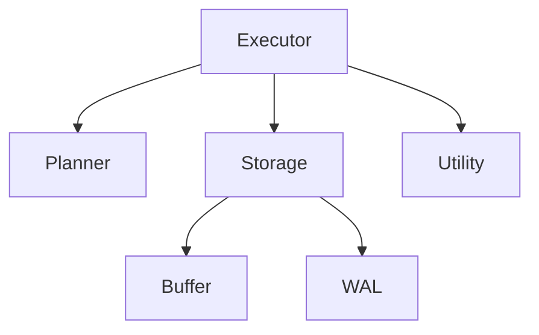

**Use when:** hierarchy/organization matters.

**Do not call it a call graph unless the edge semantics are actually “calls”.**

---

### 3.3 Flowchart

**Question:** How does one operation execute?

Traditional/manual:

```text
Start
  |
Lookup
  |
Found?
 /    \
Y      N
|      |
Use   Allocate
 \     /
  Result
```

Mermaid:

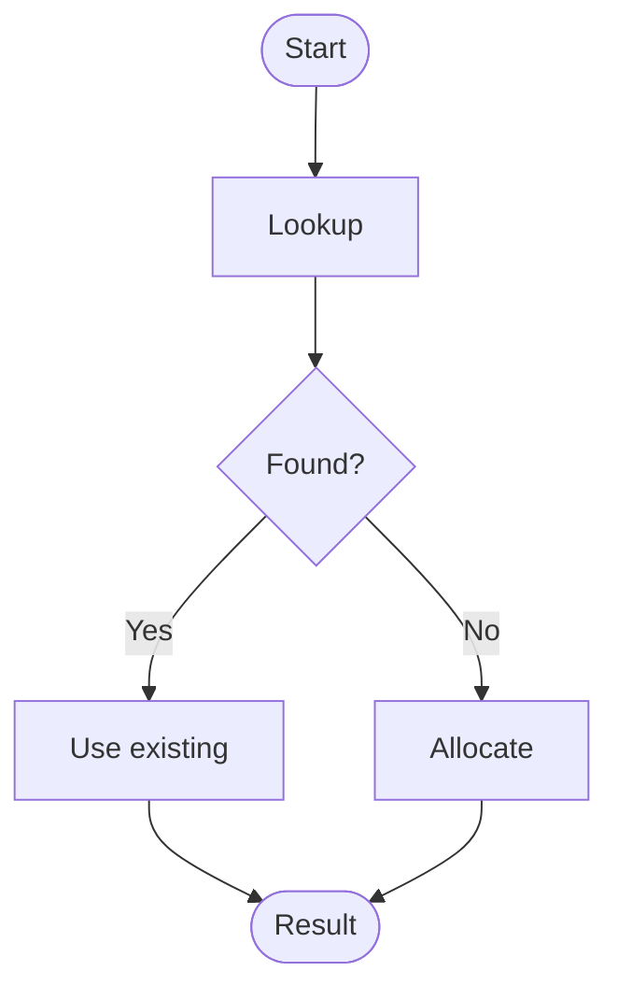

Mermaid is excellent when flow is small and frequently revised. Manual diagrams win when routing, annotations, and geometry are the central semantic content.

**Use when:** the core question is “what happens next?”.

---

### 3.4 Nassi–Shneiderman / Structured Flow

Traditional/manual structured notation:

```text
+----------------------------------+
| if (found)                      |
+----------------+-----------------+
| use existing   | allocate        |
|                | new buffer      |
+----------------+-----------------+
```

Mermaid approximation:

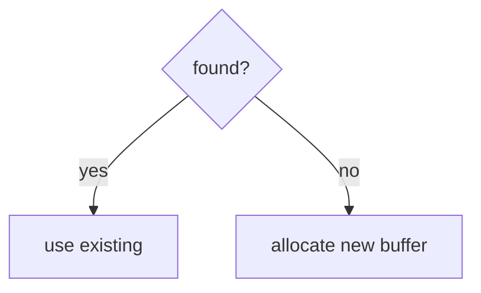

**Important:** the Mermaid view is a flowchart approximation, not canonical Nassi–Shneiderman notation.

**Use formal/manual NS** only when NS semantics are part of the deliverable or legacy documentation being preserved. Otherwise use a normal Mermaid flowchart.

---

### 3.5 HIPO

Traditional/manual:

```text
System
 |
 +-- BufferLookup
       Input: BufferTag
       Process: hash + lookup
       Output: BufferDesc
```

Mermaid + table approximation:

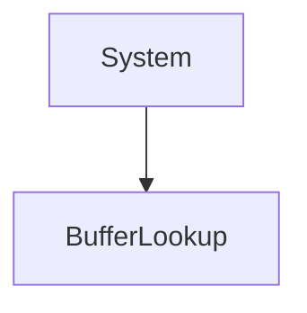

| Module | Input | Process | Output |
|---|---|---|---|
| `BufferLookup` | `BufferTag` | hash + lookup | `BufferDesc` |

**Use:** mainly for legacy structured-design reading or when IPO itself is the topic.

---

### 3.6 Data Flow Diagram

Traditional/manual:

```text
Client --> Parser --> Executor --> Buffer Pool --> Disk
                         |
                         v
                       Tuple
```

Mermaid approximation:

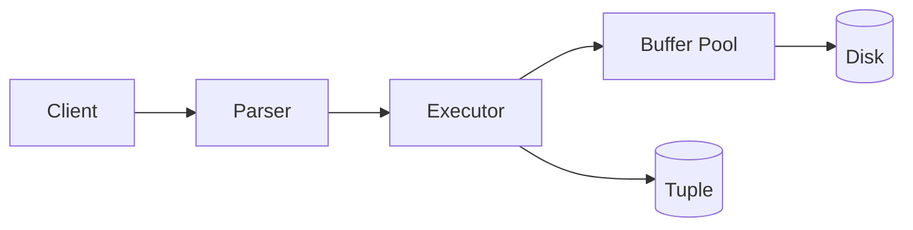

**Use:** conceptual data movement among processes/stores/components.

**Do not call a variable-level compiler dataflow graph a DFD.**

---

### 3.7 State Diagram

Traditional:

```text
FREE --allocate--> VALID --modify--> DIRTY --flush--> CLEAN
  ^                                             |
  +-------------------release------------------+
```

Mermaid:

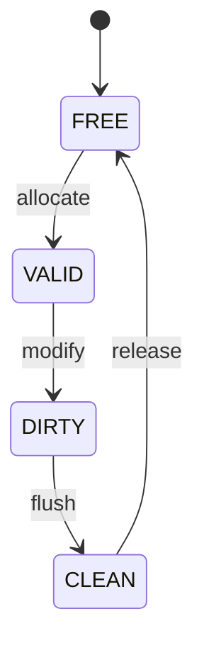

**Use when:** state predicates and transitions are actually supported by source.

**Do not use when:** you only found an enum and have not traced transitions.

---

### 3.8 Sequence Diagram

Traditional:

```text
Backend       LockManager       WaitQueue
   |               |                |
   | acquire       |                |
   |-------------->|                |
   |               | conflict       |
   |               |--------------->|
   |               |                | enqueue
   |               |<---------------|
   |<--------------|                |
   | wait          |                |
```

Mermaid:

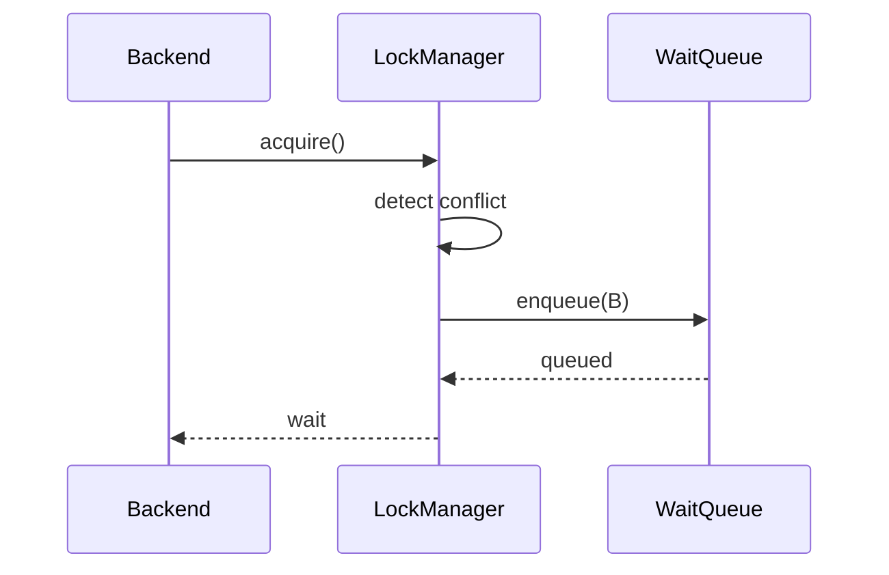

**Use when:** time/order between several actors is central.

**Prefer Flow** when the same actors are not important and only the path is.

---

### 3.9 Activity / Parallel Flow

Traditional:

```text
Request
  |
  +--> Read metadata ----+
  |                      |
  +--> Read page --------+--> Join --> Execute
```

Mermaid approximation:

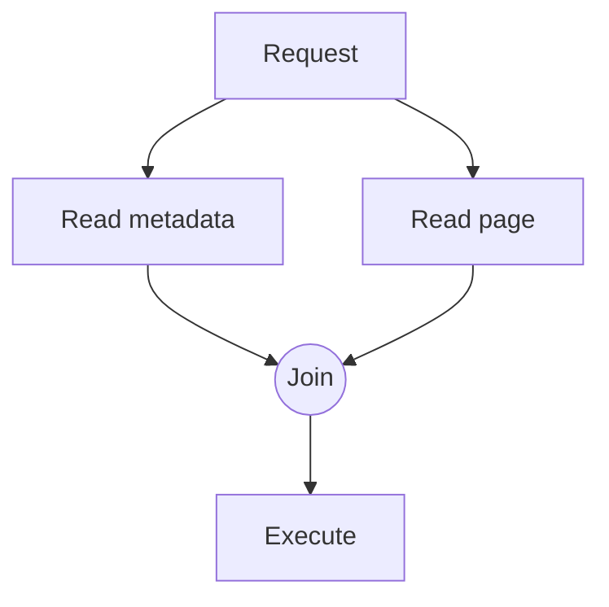

**Important:** multiple arrows do not prove parallel execution. Source evidence must establish concurrency or independent scheduling.

---

### 3.10 Petri Net

Formal/manual semantics distinguish places, transitions, and tokens. A real Petri Net might model:

```text
[Free buffer] --allocate--> (Buffer in use)
       ^                          |
       |---------release----------|
```

Mermaid approximation:

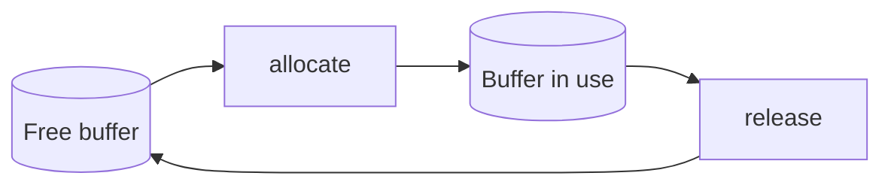

**This Mermaid version is a teaching approximation, not a canonical Petri Net.**

**Use specialized/formal Petri Net tooling** when token semantics, reachability, deadlock, or synchronization correctness is the actual subject.

---

### 3.11 Call Graph

Static-analysis style:

```text
LockAcquire
  +-- LockAcquireExtended
       +-- SetupLockInTable
       +-- GrantLock
```

Mermaid for a small curated path:

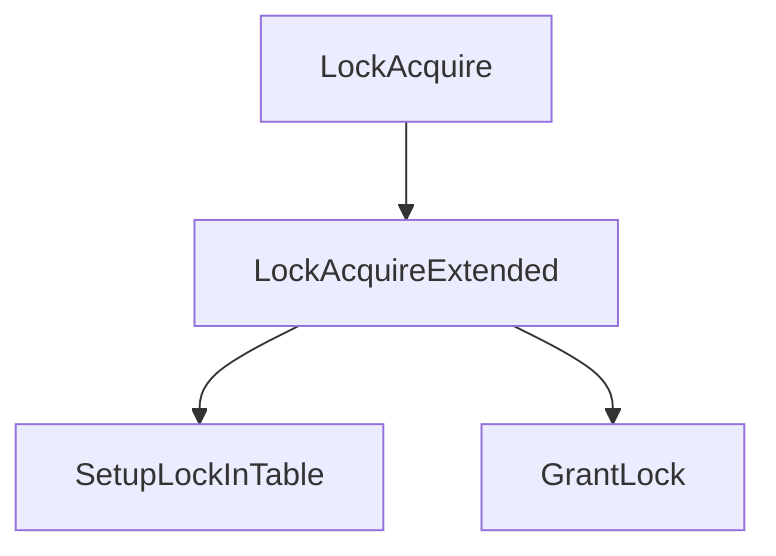

**Use a static-analysis-generated graph** when exhaustiveness matters. Mermaid is for a small teaching/navigation slice.

---

### 3.12 Control-Flow Graph

Traditional/compiler:

```text
Entry -> A -> B -> Exit
          \
           -> C -/
```

Mermaid teaching approximation:

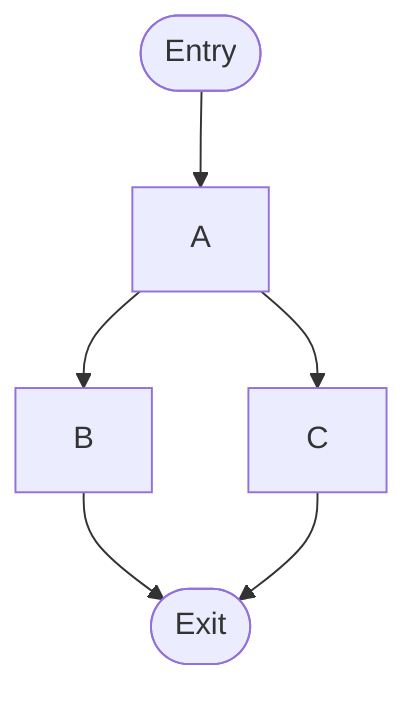

**Use a real CFG tool** when basic blocks, dominance, compiler optimization, or exact path analysis matters.

---

### 3.13 Data-flow Graph

Traditional/static-analysis:

```text
BufferTag -> hashvalue -> partition -> bucket -> BufferDesc
```

Mermaid conceptual view:

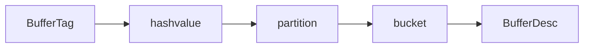

Use Mermaid for conceptual source-reading. Use analysis tooling for exact variable/value propagation.

---

### 3.14 Dependency Graph

Traditional/tool-generated:

```text
executor -> storage -> buffer
executor -> catalog
```

Mermaid curated slice:

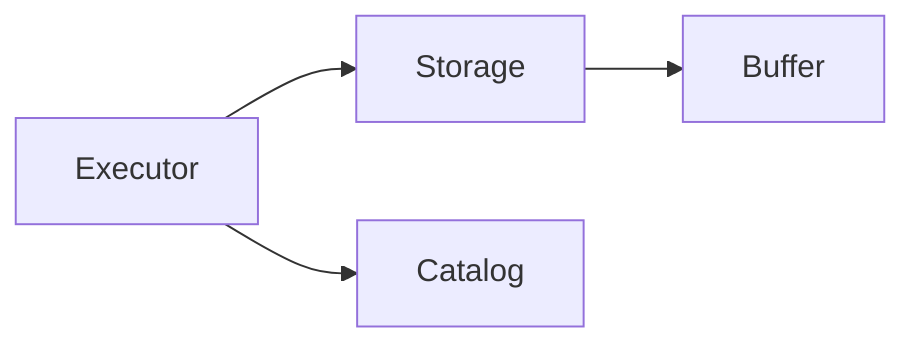

**Use tool-generated graphs for repository-scale dependencies.** Mermaid is appropriate for the small dependency slice needed for one chapter.

---

### 3.15 Component / Architecture

Traditional/manual:

```text
+-----------+       +-----------+
| Executor  | ----> | Storage   |
+-----------+       +-----------+
                           |
                           v
                      +---------+
                      | Buffer  |
                      +---------+
```

Mermaid:

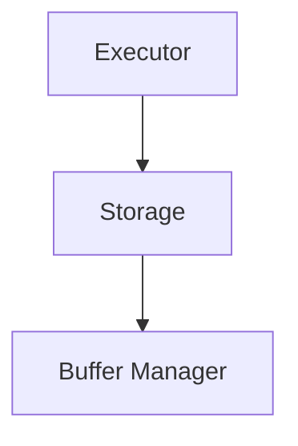

Recent Mermaid versions also document an `architecture-beta` syntax for architecture views. Verify the target Mermaid version before using version-specific syntax.

**Use when:** subsystem boundary/layering matters.

**Do not mix:** function-level implementation nodes into an architecture diagram unless the specific boundary is the question.

---

### 3.16 Deployment

Traditional/manual:

```text
+------------------- Host -------------------+
|                                             |
|   CPU0       CPU1       DB Process          |
|                         |                   |
+-------------------------|-------------------+
                          |
                       Network
```

Mermaid approximation:

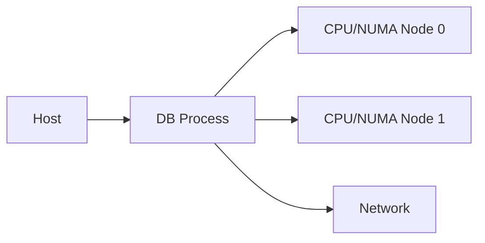

Use a specialized/manual representation when deployment geometry or topology is itself semantically important.

---

### 3.17 Memory Layout

Traditional/custom:

```text
BufferDesc
+----------------------+
| tag                  | offset 0
+----------------------+
| state                | offset 16
+----------------------+
| content_lock         | offset 24
+----------------------+
```

Mermaid approximation:

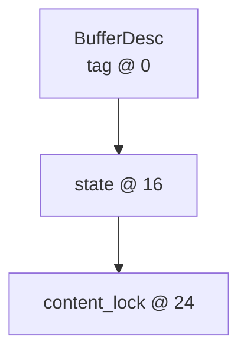

**Traditional/custom wins** for exact offsets, width, padding, cache-line boundaries, and ABI layout. Mermaid is only a simplified teaching representation.

---

### 3.18 Ownership Graph

Traditional/custom:

```text
MemoryContext --owns--> Object
Caller -------borrows-> Object
RefHolder ----retains-> Object
```

Mermaid:

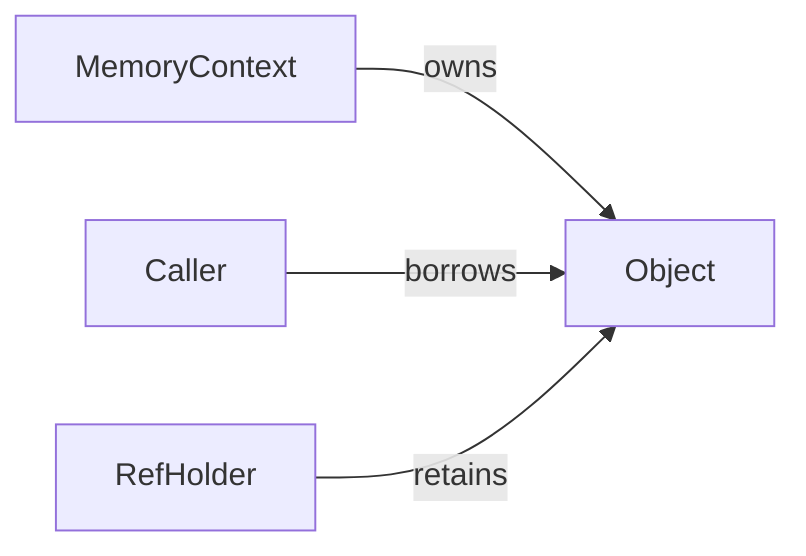

**Critical rule:** raw pointers do not prove ownership. Ownership needs evidence such as allocation/free, RAII, explicit ownership transfer, refcount, or equivalent lifecycle semantics.

---

### 3.19 Synchronization / Concurrency Graph

Traditional/custom:

```text
Thread A ----access----> SharedState <----access---- Thread B
                              ^
                              |
                           protected by
                              |
                            Lock X
```

Mermaid:

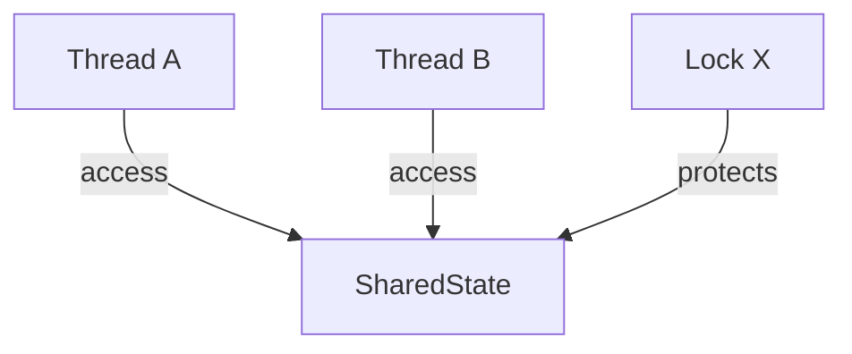

For ordering/waiting, use a sequence view:

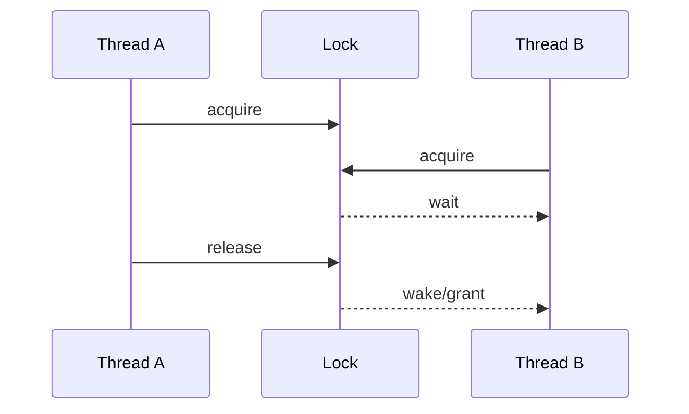

Use the first view for “who protects what”; use the second for “what happens over time”.

---

### 3.20 Resource / Cache / Index Map

Traditional/custom:

```text
BufferTag -> Hash -> Partition -> Bucket -> BufferDesc
                                      |
                                   pin/free
```

Mermaid:

```mermaid
flowchart LR
    Tag[BufferTag] --> Hash[Hash]
    Hash --> Part[Partition]
    Part --> Bucket[Bucket]
    Bucket --> Desc[BufferDesc]
    Desc -->|pin/unpin| State[Buffer state]
```

Use when the central question is how many resources are located, allocated, reused, evicted, or reclaimed.

---

### 3.21 Failure / Recovery

Traditional/manual:

```text
Allocate A -> Allocate B -> B fails -> cleanup A -> return error
```

Mermaid:

```mermaid
flowchart TD
    A[Allocate A] --> B[Allocate B]
    B --> C{Success?}
    C -->|Yes| Done([Continue])
    C -->|No| Cleanup[Cleanup A]
    Cleanup --> Error([Return error])
```

Focus on partial state and restoration, not merely “an error is returned”.

---

### 3.22 Timeline

Traditional/manual:

```text
v1 ---- v2 -------- v3
 |       |           |
A       B           C
```

Mermaid:

```mermaid
timeline
    title Feature evolution
    v1 : Initial implementation
    v2 : Added fast path
    v3 : Changed lock strategy
```

Use only when chronology/history is the question. Do not use a timeline for runtime execution flow.

---

### 3.23 Mind Map

Traditional/manual:

```text
                 Buffer Manager
                 /      |       \
             Lookup   State   Replacement
               |        |          |
             Hash     Pin      Victim
```

Mermaid:

```mermaid
mindmap
  root((Buffer Manager))
    Lookup
      Hash
    State
      Pin
    Replacement
      Victim
```

Use for onboarding/overview only. It is a weak choice for source-semantics and should not replace relationship, flow, or state diagrams.

## 4. When traditional/manual/specialized should win

Choose a specialized or manual representation when one or more are true:

1. Formal notation semantics are part of the deliverable.
2. Exact geometry is semantic (memory offsets, cache lines, ABI, physical deployment topology).
3. The graph is exhaustive/huge and should be generated from analysis tools.
4. Static analysis rather than human-curated explanation is the main goal.
5. Custom visual encoding is needed to prevent ambiguity.
6. Token/reachability/deadlock semantics or other formal properties need analysis.

## 5. When Mermaid should win

Choose Mermaid when:

1. the view is small and curated;
2. the note is maintained in Markdown/Git;
3. source names should double as navigation anchors;
4. easy textual diff is valuable;
5. the semantic method maps naturally to Mermaid's supported types.

## 6. When no diagram should win

Use prose/table/code when:

```text
facts are few
+ topology is trivial
+ no meaningful state/time/data/concurrency relation exists
```

A diagram that merely restates a two-sentence paragraph is unnecessary.

## 7. Agent decision tree

```text
Start
  |
  +-- Entities/relationships?
  |      -> Structural family
  |
  +-- Execution order/branches?
  |      -> Control family
  |
  +-- State transitions?
  |      -> State family
  |
  +-- Object lifetime/ownership?
  |      -> Lifecycle/Ownership family
  |
  +-- Actors interacting over time?
  |      -> Interaction family
  |
  +-- Data movement/transformation?
  |      -> Data family
  |
  +-- Resource lookup/reuse/eviction?
  |      -> Resource family
  |
  +-- Shared state/protection/waiting?
  |      -> Concurrency family
  |
  +-- Module boundary/dependency?
  |      -> Architecture family
  |
  +-- Failure/recovery?
  |      -> Failure family
  |
  +-- Exact physical layout/formal semantics?
  |      -> specialized/manual tool
  |
  +-- none?
         -> prose/table/code
```

Then choose:

```text
small + curated + Markdown/Git
    → Mermaid

large + exhaustive/static analysis
    → analysis tool

formal/physical/exact notation
    → specialized/manual
```

## 8. Diagram quality checklist

Before accepting any diagram:

- What one question does it answer?
- Is the semantic method explicit?
- Are edge predicates source-supported?
- Are nodes at a consistent abstraction level?
- Is the node count small enough to read?
- Does it add information beyond prose/table?
- Can important labels be mapped directly to source symbols?
- Is Mermaid expressive enough?
- Would a specialized/manual method be more faithful?
- Is any visual conclusion stronger than the source evidence?

