# Diagram Catalog for Source Reading

This catalog exists so an Agent can select a diagram method from semantics rather than from visual habit.

## 1. Entity / ER-style Relationship Map

**Question:** What are the core entities and how are they related?

Traditional/manual concept:

```text
┌───────────────┐       points_to       ┌──────────────┐
│ TupleTableSlot│ ───────────────────→ │ HeapTuple    │
└───────────────┘                      └──────────────┘
```

Mermaid:

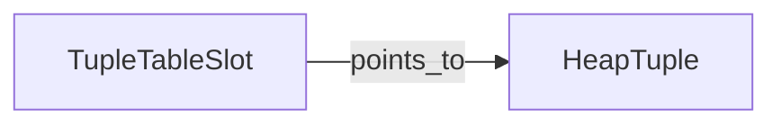

Traditional/manual strengths:
- best for carefully curated semantic grouping;
- easy to emphasize ownership/management labels;
- good for publication and large conceptual layouts.

Mermaid strengths:
- versionable in Git;
- quick to revise;
- natural in Markdown.

Use when the question is “who is connected to whom?”. Do not use when the core question is execution order.

## 2. Structure Chart

**Question:** What is the module hierarchy and calling organization?

Traditional:

```text
             Main
          /    |    \
         A     B     C
              / \
             D   E
```

Mermaid:

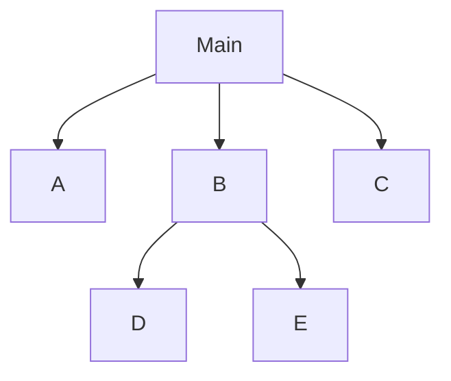

Traditional strengths:
- clear hierarchical composition;
- can encode coupling conventions in formal variants.

Mermaid strengths:
- fast and maintainable.

Use when module decomposition/calling hierarchy is central. Do not call this an execution flow without additional evidence.

## 3. Flowchart / Control Flow

**Question:** How does an operation proceed?

Traditional:

```text
Start
  ↓
Lookup
  ↓
Found?
 ┌──┴──┐
Yes    No
 ↓      ↓
Use   Allocate
 └──┬───┘
    ↓
  Return
```

Mermaid:

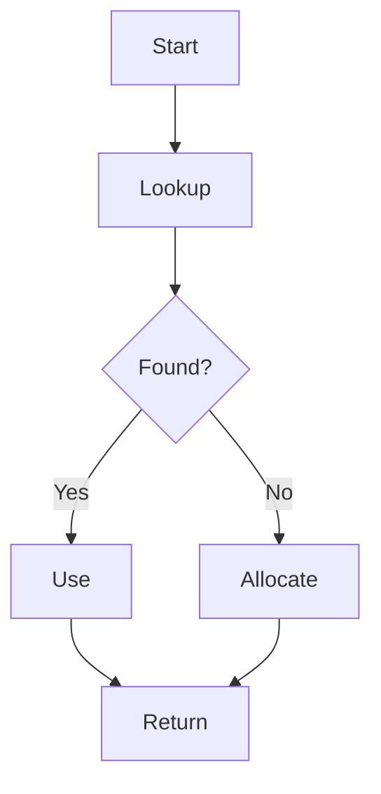

Use when branches and execution stages explain the problem. If exact compiler-level CFG is required, use a static-analysis representation instead.

## 4. Nassi–Shneiderman / Structogram

**Question:** What is the structured control composition?

Traditional:

```text
┌───────────────────────┐
│ condition             │
├──────────┬────────────┤
│ path A   │ path B     │
└──────────┴────────────┘
```

Mermaid approximation: use a flowchart or subgraphs; do not pretend it is a formal NS diagram.

Use when sequence/selection/iteration structure is the learning target. Better for explaining structured code than arbitrary cross-jumps.

## 5. HIPO

**Question:** What is the hierarchy, and what is each unit's input/process/output?

Traditional:

```text
System
 ├── A
 │    Input → Process → Output
 └── B
      Input → Process → Output
```

Mermaid:

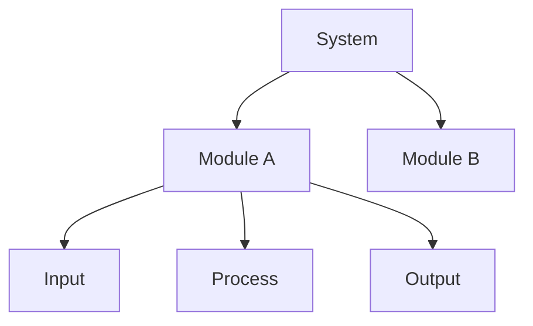

Use mainly for legacy/system-function documentation where hierarchy + IPO is the concern.

## 6. DFD / Data Flow Diagram

**Question:** How does information move through processes and stores?

Traditional:

```text
Client ──request──→ Process ──record──→ Storage
```

Mermaid approximation:

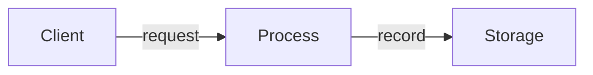

Use when conceptual data movement matters. For variable-level source analysis, prefer a dataflow/CodeQL/Clang result.

## 7. State Diagram

**Question:** How does an object change state?

Traditional:

```text
FREE --allocate--> ACTIVE --modify--> DIRTY
DIRTY --flush--> CLEAN --release--> FREE
```

Mermaid:

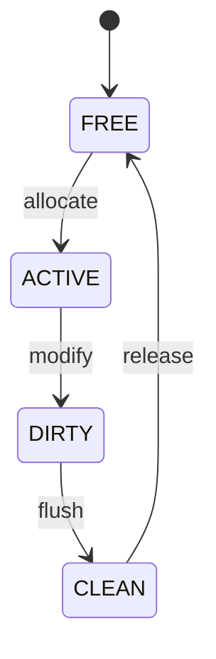

Use when transitions and guards are the key semantics.

## 8. Lifecycle Diagram

**Question:** What is the object's lifetime from creation to destruction?

Traditional:

```text
create → initialize → publish → use → release → destroy
```

Mermaid can use a flowchart or state diagram, but label it as Lifecycle View, not necessarily State Machine.

Use for ownership/resource validity questions.

## 9. Sequence Diagram

**Question:** How do several actors interact over time?

Traditional:

```text
Client       LockMgr        WaitQueue
  │             │               │
  │ acquire     │               │
  ├────────────→│               │
  │             │ conflict      │
  │             ├──────────────→│
  │             │               │
  │←────────────┤               │
```

Mermaid:

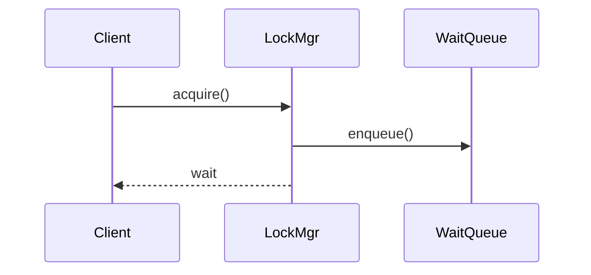

Use when roles and temporal interaction matter. If there is only one linear function path, a flowchart is usually simpler.

## 10. Activity Diagram

**Question:** What activities and parallel branches form a behavior?

Traditional: UML activity notation.

Mermaid approximation:

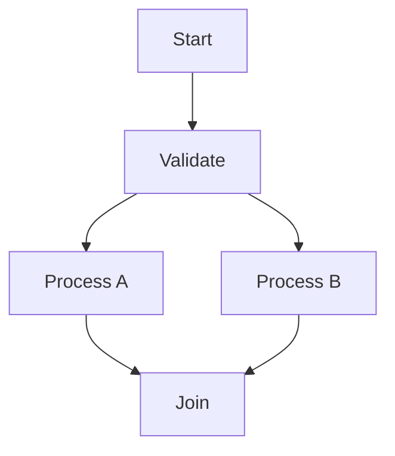

Use for behavior with parallel/guarded activities. For exact formal UML semantics, use a UML-capable tool.

## 11. Petri Net

**Question:** How do concurrent tokens/resources move through synchronization points?

Conceptual:

```text
● → [acquire] → ● → [wait] → ●
```

Mermaid is not a substitute for a formal Petri Net renderer. Use a specialized/manual tool when token semantics, reachability, deadlock, or formal concurrency properties matter.

## 12. Call Graph

**Question:** Who may call whom?

Mermaid:

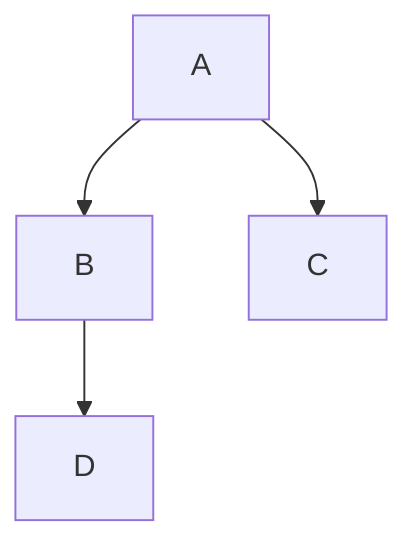

Use for navigation and dependency discovery. Do not automatically present it as runtime order.

For large machine-derived call graphs, Doxygen, clang tooling, or other analyzers are better sources; a curated Mermaid view should be a distilled projection.

## 13. Control-flow Graph (CFG)

**Question:** What are the possible basic-block control paths?

Conceptual:

```text
Entry → A → Branch ─→ B → Exit
              └──────→ C ───┘
```

Use a compiler/static-analysis backend when exactness matters. Mermaid is suitable only for a simplified explanatory projection.

## 14. Data-flow Graph

**Question:** How does a value or memory state propagate?

Conceptual:

```text
input → decode → transform → store → output
```

For source-accurate variable/value propagation, prefer Clang Dataflow or CodeQL over hand-authored Mermaid.

## 15. Dependency Graph

**Question:** What depends on what?

Traditional:

```text
A → B → C
A → D
```

Mermaid:

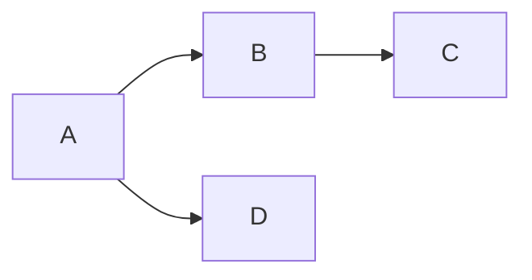

Use for modules, headers, libraries, packages, or components. Avoid calling dependency a runtime call.

## 16. Component / Architecture View

**Question:** Where is a subsystem/module in the larger system?

Mermaid example:

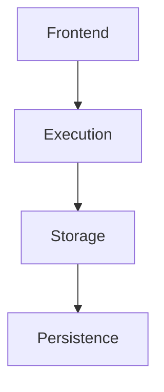

For large formal architecture documentation, C4/Structurizr or UML may be more appropriate.

## 17. Deployment View

**Question:** Which runtime process/service is deployed where?

Traditional:

```text
[Client] → [DB Server] → [Storage]
```

Mermaid can approximate this with flowcharts, but deployment semantics should be preserved when topology matters.

## 18. Memory Layout View

**Question:** What is the actual in-memory geometry?

Traditional/manual:

```text
+0    tag
+16   state
+24   lock
+40   padding
```

Mermaid is a poor choice when exact offsets, alignment, cache lines, or ABI geometry are semantically important. Prefer a table, generated layout output, or a custom diagram.

## 19. Ownership Graph

**Question:** Who owns, borrows, retains, or releases an object?

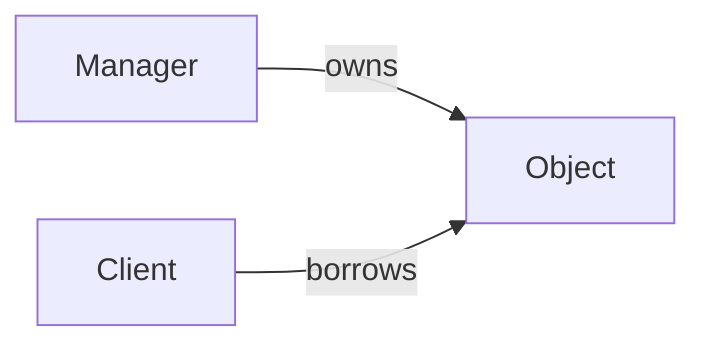

Use only when lifetime evidence supports the ownership relation. Raw pointer presence alone is insufficient.

## 20. Synchronization Graph

**Question:** Who shares what, and what protects it?

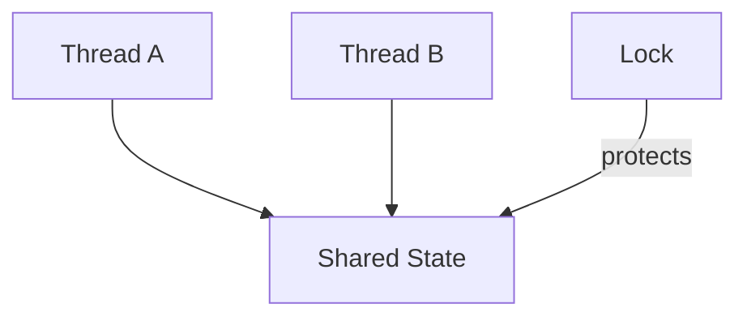

Use when protected state is known. Add Sequence when timing of acquire/wait/wake matters.

## 21. Resource / Cache Map

**Question:** How is a scarce/shared resource indexed, allocated, reused, and reclaimed?

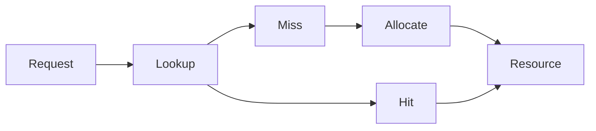

Use for buffer pools, caches, free lists, object pools, connection pools, registries.

## 22. Failure / Recovery View

**Question:** What happens after an error and how is consistency preserved?

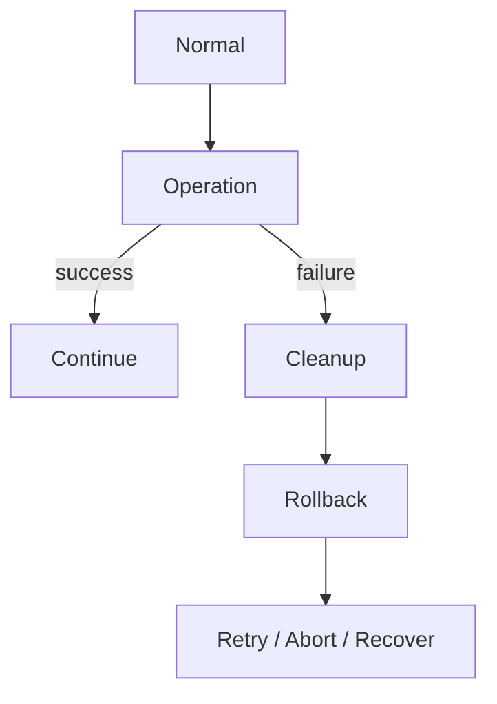

Use when partial state and cleanup semantics matter.

## 23. Decision matrix for the Agent

```text
“Who/what is connected?”
  → Entity/Relationship

“Who manages/owns what?”
  → Management/Ownership

“How does the operation run?”
  → Flow / Activity

“Who calls whom?”
  → Call Graph

“What states exist and change?”
  → State Diagram

“How long does this object live?”
  → Lifecycle

“How do actors interact over time?”
  → Sequence

“How does data move?”
  → Data Path / DFD / Dataflow

“How is shared state synchronized?”
  → Synchronization / Sequence

“How is a scarce resource managed?”
  → Resource / Cache Map

“How does the subsystem fit the system?”
  → Architecture / Component

“How does memory actually look?”
  → Memory Layout

“How does failure recover?”
  → Failure / Recovery
```

## Traditional vs Mermaid summary

| Goal | Traditional/manual | Mermaid | Recommendation |
|---|---|---|---|
| quick conceptual graph | very flexible | excellent | Mermaid |
| Markdown/Git maintenance | poor | excellent | Mermaid |
| exact geometric layout | excellent | limited | manual/specialized |
| formal UML semantics | excellent with UML tool | partial/not universal | UML tool |
| huge graph layout | manual effort | can become dense | Graphviz/specialized |
| exact CFG/dataflow | not ideal manually | not authoritative | analysis backend |
| memory offsets/cache lines | excellent | poor | table/custom |
| publication-quality architecture | excellent | adequate for simple views | specialized/manual when needed |

The key rule is not “Mermaid first”. The key rule is **semantic method first, renderer second**.
