# 源码阅读图表目录

本目录用于让 Agent 根据语义而不是视觉习惯选择图表方法。

## 1. Entity / ER-style Relationship Map

**问题：** 核心实体是什么，它们如何关联？

传统/手工表达：

```text
┌───────────────┐       points_to       ┌──────────────┐
│ TupleTableSlot│ ───────────────────→ │ HeapTuple    │
└───────────────┘                      └──────────────┘
```

Mermaid:

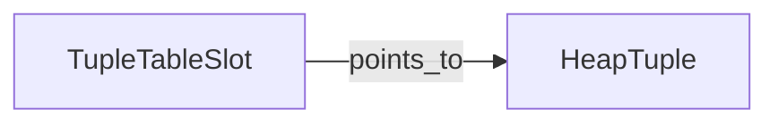

传统/手工方式的优势：
- 适合经过仔细整理的语义分组；
- 容易突出 ownership/管理关系标签；
- 适合出版级排版和大型概念布局。

Mermaid 的优势：
- 可在 Git 中进行版本控制；
- 修改快速；
- 与 Markdown 配合自然。

当问题是“谁与谁相连？”时使用。当核心问题是执行顺序时不要使用。

## 2. Structure Chart（结构图）

**问题：** 模块层次结构和调用组织是什么？

传统表达：

```text
             Main
          /    |    \
         A     B     C
              / \
             D   E
```

Mermaid:

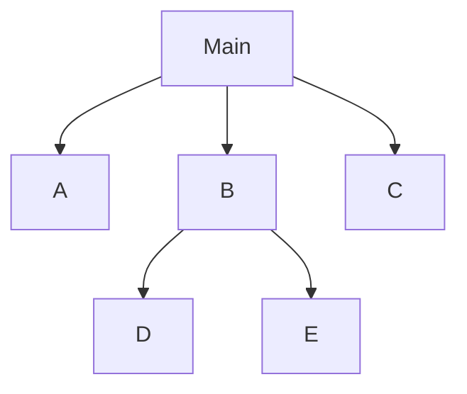

传统方式的优势：
- 层次化组合关系清晰；
- 在形式化变体中可以编码耦合约定。

Mermaid 的优势：
- 编写快速且易维护。

当模块分解/调用层次是核心问题时使用。没有额外证据时，不要把它称为执行流。

## 3. Flowchart / Control Flow（流程图 / 控制流）

**问题：** 一个操作是如何推进的？

传统表达：

```text
Start
  ↓
Lookup
  ↓
Found?
 ┌──┴──┐
Yes    No
 ↓      ↓
Use   Allocate
 └──┬───┘
    ↓
  Return
```

Mermaid:

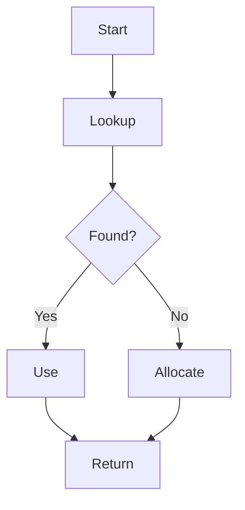

当分支和执行阶段能够解释问题时使用。如果需要精确的编译器级 CFG，应改用静态分析表达。

## 4. Nassi–Shneiderman / Structogram（结构化流程图）

**问题：** 结构化控制组合是什么？

传统表达：

```text
┌───────────────────────┐
│ condition             │
├──────────┬────────────┤
│ path A   │ path B     │
└──────────┴────────────┘
```

Mermaid 近似表达：使用 flowchart 或 subgraph；不要假装它是正式的 NS 图。

当顺序/选择/迭代结构是学习目标时使用。它更适合解释结构化代码，而不是任意跨跳转。

## 5. HIPO

**问题：** 层次结构是什么，以及每个单元的输入/处理/输出是什么？

传统表达：

```text
System
 ├── A
 │    Input → Process → Output
 └── B
      Input → Process → Output
```

Mermaid:

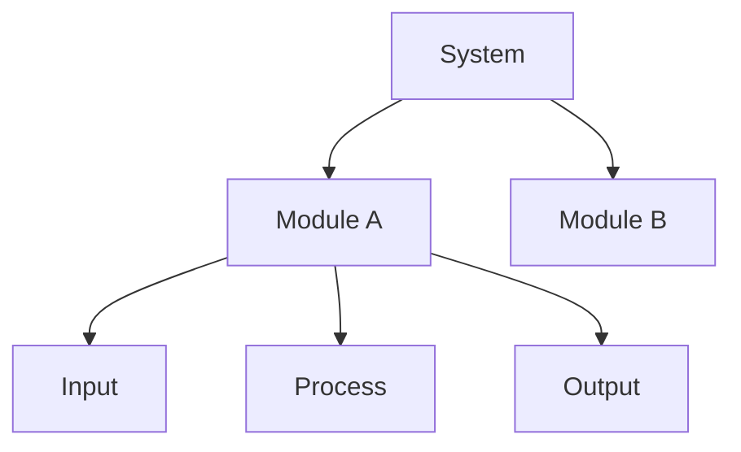

主要用于遗留系统/系统功能文档中，以层次 + IPO 为核心关注点的场景。

## 6. DFD / Data Flow Diagram（数据流图）

**问题：** 信息如何在处理过程和数据存储之间流动？

传统表达：

```text
Client ──request──→ Process ──record──→ Storage
```

Mermaid approximation:


当概念层面的数据移动很重要时使用。对于变量级源码分析，优先使用 dataflow/CodeQL/Clang 的结果。

## 7. State Diagram（状态图）

**问题：** 对象如何改变状态？

传统表达：

```text
FREE --allocate--> ACTIVE --modify--> DIRTY
DIRTY --flush--> CLEAN --release--> FREE
```

Mermaid:

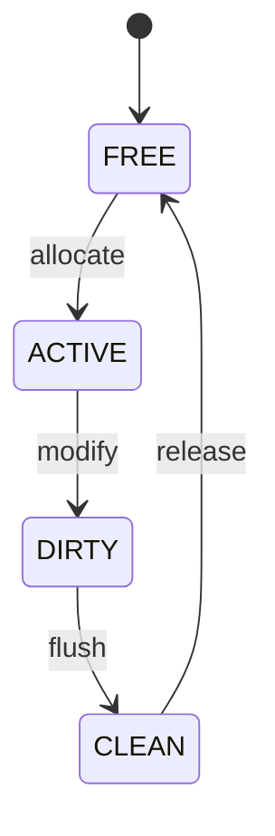

当迁移和守卫条件是关键语义时使用。

## 8. Lifecycle Diagram（生命周期图）

**问题：** 对象从创建到销毁的生命周期是什么？

传统表达：

```text
create → initialize → publish → use → release → destroy
```

Mermaid 可以使用 flowchart 或 state diagram，但应标记为 Lifecycle View，而不应不加区分地称为 State Machine。

用于 ownership/资源有效性问题。

## 9. Sequence Diagram（时序图）

**问题：** 多个参与者如何随时间发生交互？

传统表达：

```text
Client       LockMgr        WaitQueue
  │             │               │
  │ acquire     │               │
  ├────────────→│               │
  │             │ conflict      │
  │             ├──────────────→│
  │             │               │
  │←────────────┤               │
```

Mermaid:

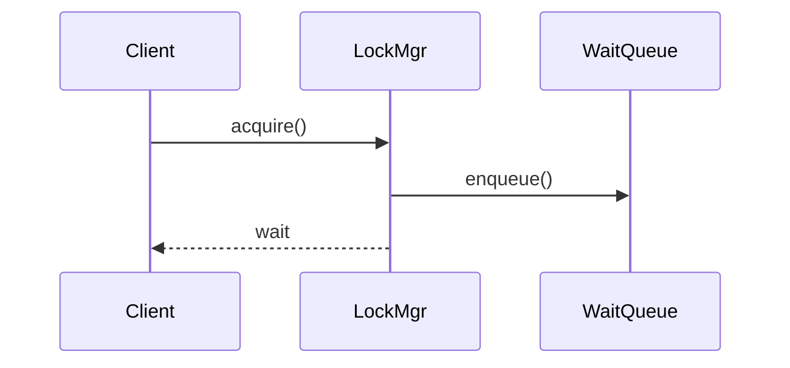

当角色和时间交互很重要时使用。如果只有一条线性的函数路径，通常使用 flowchart 更简单。

## 10. Activity Diagram（活动图）

**问题：** 哪些活动和并行分支构成一个行为？

传统表达：UML activity notation。

Mermaid approximation:

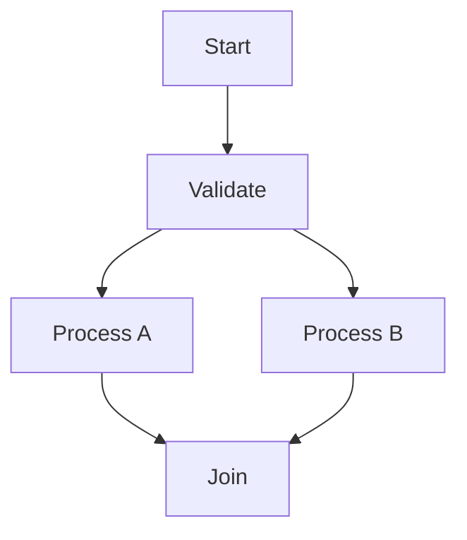

用于包含并行/带守卫活动的行为。需要精确的正式 UML 语义时，应使用支持 UML 的专业工具。

## 11. Petri Net（Petri 网）

**问题：** 并发 token/资源如何经过同步点移动？

Conceptual:

```text
● → [acquire] → ● → [wait] → ●
```

Mermaid 不能替代正式的 Petri Net Renderer。当 token 语义、可达性、死锁或形式化并发性质很重要时，应使用专业/手工工具。

## 12. Call Graph（调用图）

**问题：** 谁可能调用谁？

Mermaid:

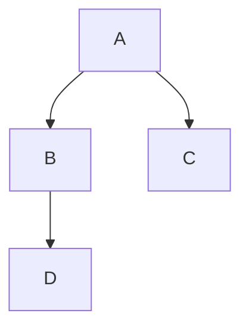

用于导航和发现依赖。不要自动把它表示为运行时顺序。

对于大型机器生成的调用图，Doxygen、clang tooling 或其他分析器是更好的来源；经过整理的 Mermaid 视图应该只是精炼后的投影。

## 13. Control-flow Graph（CFG，控制流图）

**问题：** 基本块可能有哪些控制路径？

Conceptual:

```text
Entry → A → Branch ─→ B → Exit
              └──────→ C ───┘
```

需要精确性时使用编译器/静态分析后端。Mermaid 只适合简化的解释性投影。

## 14. Data-flow Graph（数据流图）

**问题：** 一个值或内存状态如何传播？

Conceptual:

```text
input → decode → transform → store → output
```

对于源码精确的变量/值传播，优先使用 Clang Dataflow 或 CodeQL，而不是手工编写的 Mermaid。

## 15. Dependency Graph（依赖图）

**问题：** 什么依赖什么？

传统表达：

```text
A → B → C
A → D
```

Mermaid:

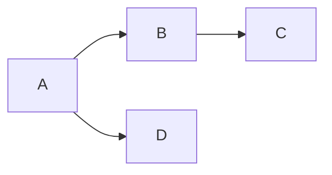

用于模块、头文件、库、包或组件。不要把 dependency 称为运行时 call。

## 16. Component / Architecture View（组件 / 架构视图）

**问题：** 一个子系统/模块在更大的系统中位于哪里？

Mermaid example:

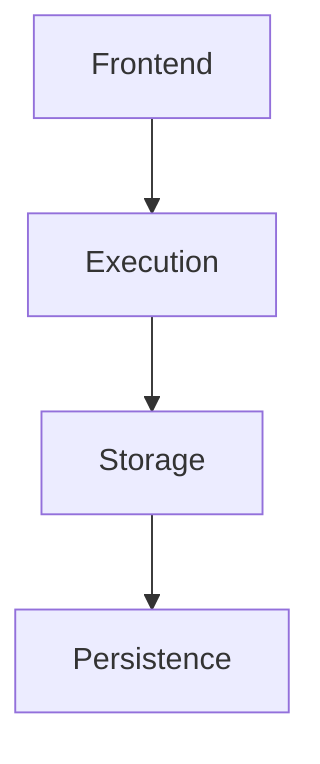

对于大型正式架构文档，C4/Structurizr 或 UML 可能更合适。

## 17. Deployment View（部署视图）

**问题：** 哪个运行时进程/服务被部署在哪里？

传统表达：

```text
[Client] → [DB Server] → [Storage]
```

Mermaid 可以用 flowchart 对其进行近似表达，但当拓扑很重要时必须保留部署语义。

## 18. Memory Layout View（内存布局视图）

**问题：** 内存中的实际几何布局是什么？

传统/手工表达：

```text
+0    tag
+16   state
+24   lock
+40   padding
```

当精确 offset、alignment、cache line 或 ABI 几何关系属于关键语义时，Mermaid 不是好的选择。优先使用表格、生成的布局输出或自定义图。

## 19. Ownership Graph（所有权图）

**问题：** 谁拥有、借用、保留或释放一个对象？

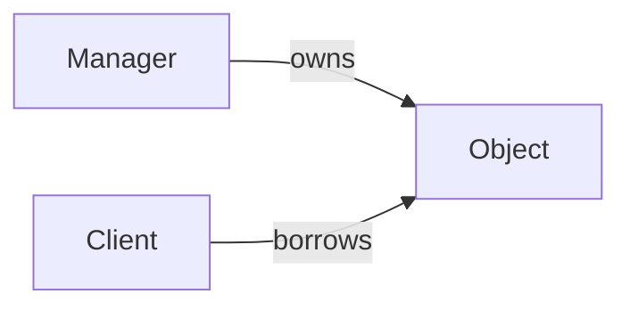

只有当生命周期证据支持 ownership 关系时才使用。仅仅存在裸指针是不够的。

## 20. Synchronization Graph（同步图）

**问题：** 谁共享什么，以及什么保护它？

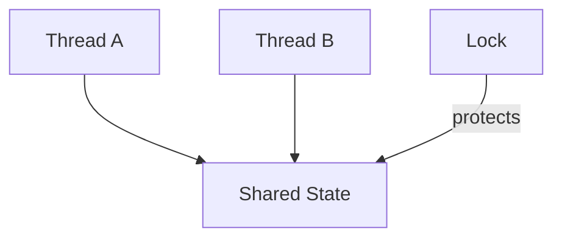

当被保护状态已经明确时使用。当 acquire/wait/wake 的时序很重要时，加入 Sequence。

## 21. Resource / Cache Map（资源 / 缓存图）

**问题：** 稀缺/共享资源如何被索引、分配、复用和回收？

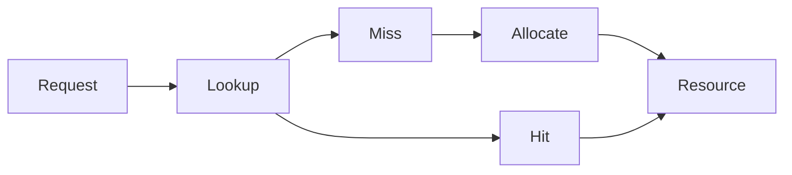

用于 buffer pool、cache、free list、object pool、connection pool、registry 等场景。

## 22. Failure / Recovery View（失败 / 恢复视图）

**问题：** 出错后会发生什么，以及如何保持一致性？

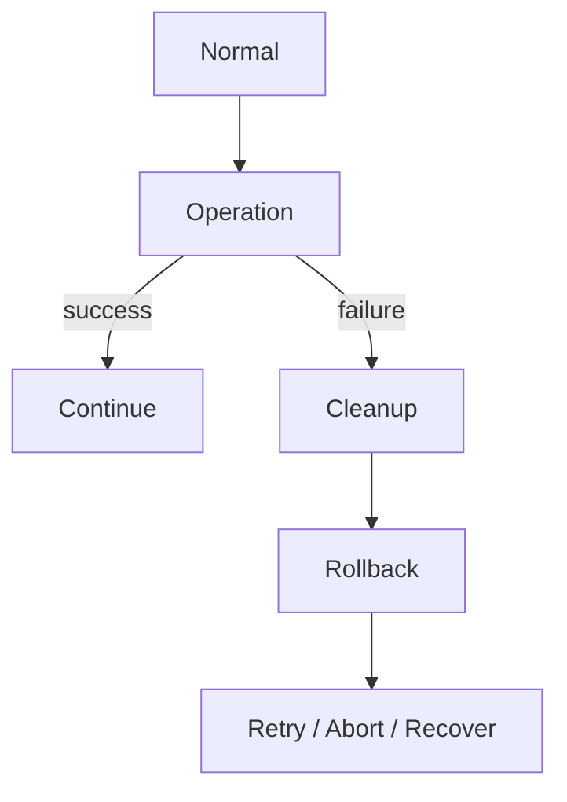

当部分状态和清理语义很重要时使用。

## 23. Agent 决策矩阵

```text
“谁/什么彼此连接？”
  → Entity/Relationship

“谁管理/拥有什么？”
  → Management/Ownership

“操作如何运行？”
  → Flow / Activity

“谁调用谁？”
  → Call Graph

“存在哪些状态，它们如何变化？”
  → State Diagram

“这个对象的生命周期有多长？”
  → Lifecycle

“参与者如何随时间交互？”
  → Sequence

“数据如何移动？”
  → Data Path / DFD / Dataflow

“共享状态如何同步？”
  → Synchronization / Sequence

“稀缺资源如何管理？”
  → Resource / Cache Map

“子系统如何融入整个系统？”
  → Architecture / Component

“内存中的实际布局是什么样？”
  → Memory Layout

“失败后如何恢复？”
  → Failure / Recovery
```

## 传统方式 vs Mermaid 总结

| 目标 | 传统/手工方式 | Mermaid | 推荐 |
|---|---|---|---|
| 快速概念图 | 非常灵活 | 优秀 | Mermaid |
| Markdown/Git 维护 | 较差 | 优秀 | Mermaid |
| 精确几何布局 | 优秀 | 有限 | 手工/专业工具 |
| 正式 UML 语义 | 使用 UML 工具时优秀 | 部分支持/并非通用 | UML 工具 |
| 超大图布局 | 手工成本高 | 可能变得拥挤 | Graphviz/专业工具 |
| 精确 CFG/dataflow | 不适合手工 | 非权威 | 分析后端 |
| 内存 offset/cache line | 优秀 | 较差 | 表格/自定义图 |
| 出版级架构图 | 优秀 | 简单视图足够 | 必要时使用专业/手工方法 |

关键规则不是“Mermaid 优先”。真正的规则是：**先确定语义方法，再选择 Renderer。**
